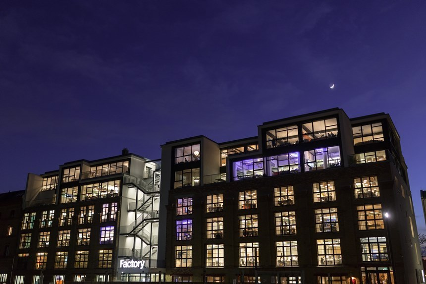
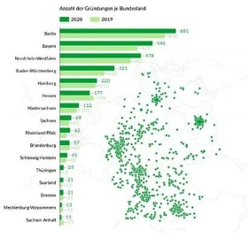
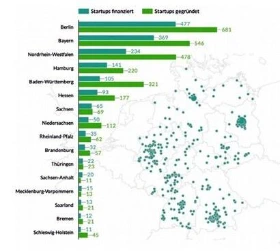
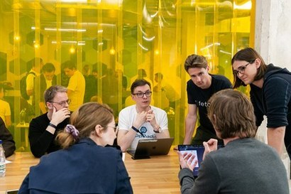
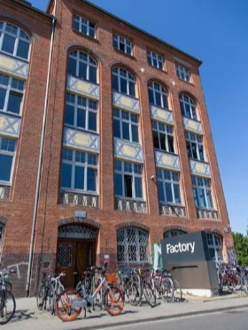

+++
title = "Berlin: From Symbol of Division to Startup Mecca"
date = "2022-03-02T12:32:00+09:00"
description = "How affordable living and support policies turned Berlin into a startup hub… The role of Factory Berlin in building the ecosystem"
tags = ["Startup", "Entrepreneurship", "Europe", "Berlin", "Factory Berlin"]
categories = ["Column"]
author = "Eunseo Yi"
image = "cover.jpg"
canonicalUrl = "https://brunch.co.kr/@123factory/4"
+++

> **How affordable living and support policies turned Berlin into a startup hub… The role of Factory Berlin in building the ecosystem**

When I first moved to Berlin for my studies 10 years ago, the shock of seeing such a "disorganized" city as the capital of Germany lasted for quite a while. Berlin's U-Bahn Line 1, which served as the setting for the musical "Line 1," first opened in 1902, and it felt like the facilities and atmosphere hadn't improved much since then. The subway stairs and elevators often smelled of a familiar(?) odor found in poorly maintained restrooms. I soon realized the source of that smell was "Gil-maek" (drinking beer while walking on the street), and I eventually nodded in understanding.

"Right, this is the land of beer!" I realized late. Given the sheer amount of beer consumed compared to the scarce number of public restrooms, it was an inevitable result. At that time, I was attending school near Görlitzer Bahnhof, located in the middle of Line 1. Every day, I commuted while smelling the unique scent of burning plants among people smoking—to me, that was the smell, the image, and the vibe of Berlin.

*Berlin has grown into a city focusing on fostering startups. 'Factory Berlin' played an important role here. Photo = Factory Berlin website*

However, like many places before it, Berlin was eventually labeled a "hip place" and underwent gentrification. While the change wasn't as rapid as Seoul's Hongdae or Yeonnam-dong, transformation did come to Berlin. The areas where the Berlin Wall once stood had been vacant for a long time. These were the first spots where new buildings began to rise. Modern apartments were built in areas popular with young people, and the unique small shops that once defined neighborhoods were replaced by franchise cafes and stores. Simultaneously, Berlin shed its "poor" image and began highlighting its strengths in the industrial sector, emerging as a major hub for startups. Compared to cities like Munich, Stuttgart, Frankfurt, and Düsseldorf—each with its own specialized industry like automotive, finance, or pharmaceuticals—Berlin was merely a center of politics and a city with a history of unification. <b>Since established industries had little reason to relocate there, startups related to new industries, the Fourth Industrial Revolution, and digitalization began to gather one by one.</b>

<b>The low cost of living, international atmosphere, and the Berlin Senate's proactive support policies also played a significant role.</b> Berlin's startup industry grew steadily, and by 2020, approximately 681 startups had been established in the city.

*Figure 1. Growth in the number of startups in Berlin*

Berlin has become the city with the highest number of startups in all of Germany. According to the startup research institution *Startup Detector*, 477 out of the 681 startups in Berlin receive financial support from the government or professional investment firms. This abundance of support opportunities has become a primary reason why many startups choose to begin their journey in Berlin.

*Figure 2. Share of startup funding by German city*

<b>Factory Berlin played a crucial role in making Berlin a city where art and startups intersect.</b> Opened in 2014, Factory Berlin is a startup accelerating institution and co-working space created by renovating a former brewery on Bernauer Strasse, where the Berlin Wall once stood. In its early days, global companies like Google, Twitter, and Uber nested there, and it drew significant attention when innovation teams from established German giants like Siemens, Audi, and Deutsche Bank moved in. This is where N26, Europe's largest digital bank, was born, and where famous startups like HelloFresh, which expanded into the US market with its meal-kit business, spent their formative years.

*Factory Berlin*

In fact, artists also reside here. Factory Berlin runs an artist-in-residence program every year, supporting artists and facilitating collaborations between them and entrepreneurs. Furthermore, the community is carefully curated to maintain a balance of large corporations, SMEs, and startups, as well as solo entrepreneurs and freelancers, all seeking innovation in various forms.

*Inside Factory Berlin*

Thus, Berlin has added a "young and innovative" startup image to its existing reputation as a city of art, making it an attractive destination for founders worldwide. Factory Berlin has also continued to thrive, opening a second campus at the edge of Görlitzer Park in 2017, and a third campus, Factory Hammerbrooklyn, in Hamburg in the summer of 2021.

Berlin is a city with high demand for shared offices, with ten WeWork locations alone. However, Factory Berlin's CEO Nico Gramenz highlights a clear distinction: "If you're just looking for an office to work in, you've come to the wrong place." While anyone can join WeWork by registering and paying a monthly fee, <b>joining Factory Berlin requires submitting a self-introduction with a brief business plan. Members are selected based on their potential to contribute to the ecosystem and grow through networking.</b>

The Berlin of the 2010s—where wearing clothes that looked as if you hadn't put in any effort and wandering the streets with a beer bottle toward a club was the peak of "hip"—has changed significantly.

Looking at the people at Factory, I feel this shift even more. Nowadays, Berliners who start their own projects—no matter how far-fetched they might seem—gather people and sit in front of their computers all night are the ones redefining what it means to be "hip."

In fact, some Korean visitors who came to see Factory Berlin because of its fame once remarked, "Everyone looks exhausted, as if they stayed up all night. It’s not as hip as I thought; it feels more like a study village for the bar exam."

I remained an observer outside Factory for a while before joining in early 2020 by submitting a business idea to connect Korea and Germany. Through this series, I plan to share interesting stories from Factory Berlin and the broader German startup scene. My goal is to meet people who are passionately contemplating their next big move, share their trial-and-error experiences, and look into various government support policies to reveal "another possibility" to entrepreneurs and business leaders in Korea.

**Eunseo Yi**
eunseo.yi@123factory.de

*This article was edited and adapted from the "European Startup Chronicles" series in BizHankook.*
