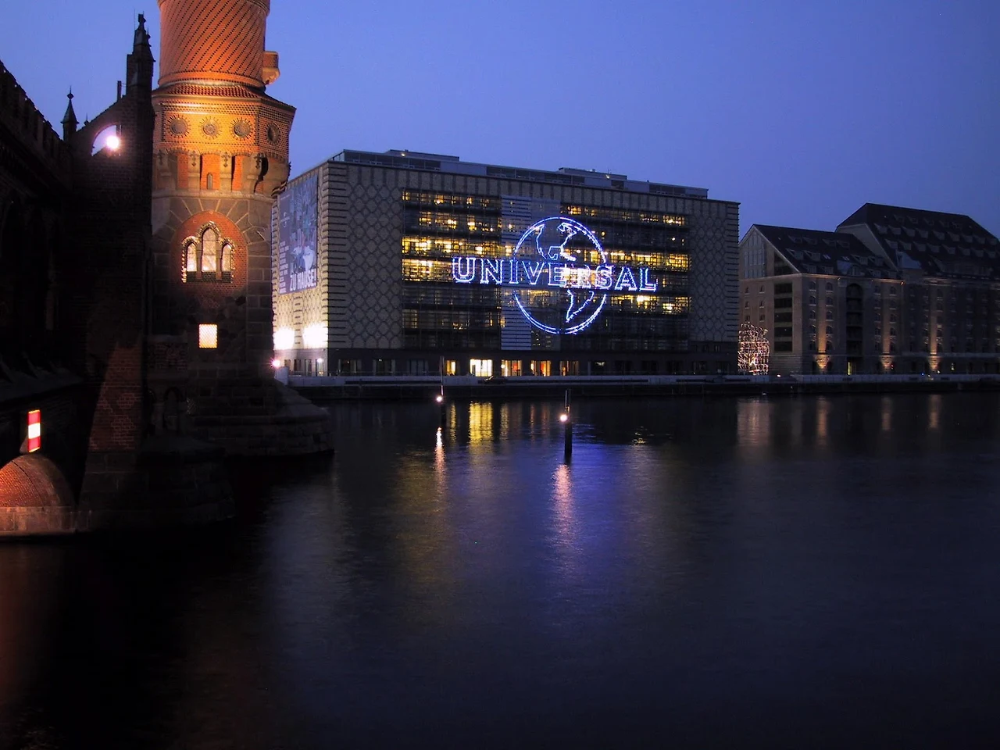
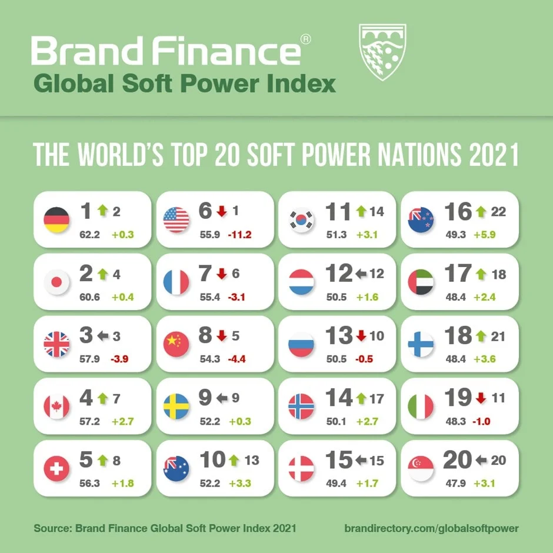
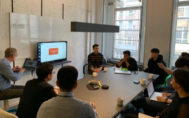
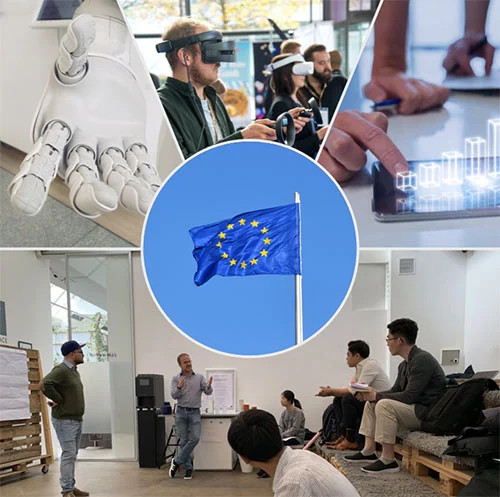
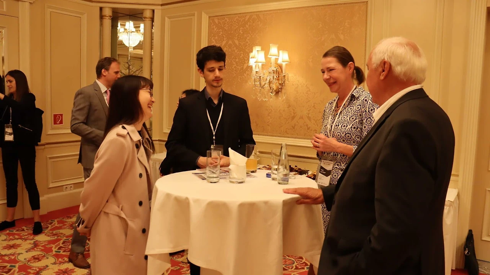

+++
title = "[유럽스타트업열전] 베를린에 부는 한국 열풍 - K스타트업"
date = "2022-04-12T10:00:00+09:00"
description = "K팝, K푸드, 이제는 K스타트업"
tags = ["베를린", "한국", "스타트업", "K스타트업", "KIC유럽", "enpact", "노타", "유럽"]
categories = ["Column"]
author = "이은서"
image = "cover.webp"
canonicalUrl = "https://brunch.co.kr/@123factory/25"
+++

## <b>베를린에 부는 한국 열풍 - K스타트업</b>

*커버 사진 출처=KIC-Europe 공식 페이스북 홈페이지*

## 베를린과 한국이 만나면 어떤 일이 벌어질까?

<b>베를린 산하 스타트업 지원 공공기관 enpact, 한국의 스타트업에 주목하기 시작, 2022년부터 베를린에서 일 벌이기 쉬워진다.</b>

‘베를린’과 ‘한국’이라는 단어가 만나면 어떤 일이 벌어질까? 베를린은 명실상부 유럽 스타트업 허브로 1년에 500개의 스타트업이 생겨나고, 8만 개의 스타트업 일자리가 만들어지는 역동적인 생태계다. 2020년 베를린 스타트업에 투자된 벤처 캐피털의 규모는 31억 유로(약 4조 2000억 원)에 달한다. 베를린시 경제부는 스타트업 정책을 전면에 내세우고 지원에 박차를 가하고 있다. 전통 산업 기반이 약했던 베를린 경제를 <b>스타트업이 선두에서 이끌어 나가는</b> 모양새이다.

이에 기존의 대기업, 글로벌 기업들도 하나둘 베를린으로 모여들기 시작했다. 세계 최대 제약회사 노바티스는 독일법인을 베를린에 설립했다. 노바티스 독일법인장 토마스 랑 박사는 베를린 경제부와의 인터뷰에서 "헬스케어 산업에서 의회, 기관, 서비스 공급자 등 주요 결정권자들이 베를린에 있고, 무엇보다 베를린은 디지털 선두주자로 제약회사로서도 주목할 만한 스타트업이 많은 도시"라고 밝혔다.

미디어&창의 산업에도 베를린은 중요한 곳이다. 세계 최대 레이블인 유니버설뮤직 독일법인은 베를린 슈프레강 인근 건물 가운데 가장 존재감이 큰 곳 중 하나다. 독일 최대 미디어그룹 악셀 스프링거는 2017년 함부르크에서 베를린으로 본사를 이전하면서 <b>베를린을 ‘새로운 지적 허브’</b>로 명명했다.

*베를린 슈프레 강 가의 유니버설 뮤직 빌딩. 사진=universal music germany facebook*

## 유럽에서 ‘한국’이라는 브랜드 가치

유럽에서 ‘한국’이라는 브랜드를 다는 것은 무엇을 의미할까? 라디오에서 BTS, 블랙핑크의 음악이 들리는 것은 일상적인 일이 되었다. 웬만한 유명 의류 브랜드에서는 한글 컬래버레이션 티셔츠를 심심찮게 찾아볼 수 있다. 대도시에서는 한국 음식점이 붐처럼 생겨나고, 일반 슈퍼마켓에서도 김, 라면, 고추장 등이 한국 발음 그대로 표기되어 팔리고 있다. 한국 빵가루는 특히 인기다. 독일에는 독일식 빵가루가 있는데도 한국 빵가루가 더 대우를 받는다. "바삭한 튀김음식을 이만큼 잘 구현해내는 제품은 없다"는 것이 한국 빵가루 애호가 독일 친구의 증언이다. ‘휴대폰은 삼성’, ‘가전은 LG’ 라는 말이 당연할 정도이고, 넷플릭스에서 한국 드라마 한번 안 본 사람을 오히려 찾기 힘들 정도다. <u>기술과 문화를 좀 안다 하는 사람 사이에서는 한국은 가장 ‘핫’한 나라가 되었다.</u>

이는 자료를 통해서도 증명된다. 브랜드 파이낸스가 조사한 글로벌 소프트 파워 인덱스 2021에서 ‘한국’은 지난해에 비해 14계단이나 상승해 11위에 올랐다. 특히 코로나19 대응력과 새로운 미래 성장 잠재력(Future Growth Potential)에서 매우 높은 평가를 받았다.

*브랜드 파이낸스 글로벌 소프트 파워 지수 2021. 한국은 지난해보다 14위 상승해 11위가 되었다. 사진=brandfinance.com*

특히 교육과 과학 부문, 국제 관계 부문에서 대중의 인식이 높아진 것이 높은 순위를 기록한 근거가 되었다. <u>소프트 파워 지수</u>는 국제무대의 다양한 행위자인 국가, 기업, 지역사회, 대중의 선호와 행동에 영향을 미치는 국가의 능력을 의미한다. 다시 말해 <b>한국은 이전보다 많이 ‘끌리는 나라’</b>가 된 것이다.

그러므로 <b>스타트업으로서 ‘한국’이라는 브랜드를 장착할 때에는 국가 이미지의 긍정적인 부분을 최대한 활용해야 한다. 디지털·기술 강국이자 문화의 선두주자로서 한국 기업은 유럽 무대에서 타국의 기업보다 플러스 요소를 안고 시작할 수 있다.</b>

## 유럽과 한국 스타트업의 연결을 돕는 KIC 유럽

<b>베를린에는 한국과 유럽의 스타트업 생태계를 잇는 역할을 하는 KIC 유럽</b>이 있다. KIC 유럽(Korea Innovation Center Europe)은 <u>과학기술·ICT 기반 한국 스타트업의 글로벌 사업화를 위한 네트워킹, 멘토링, 인큐베이팅, 투자 유치 등을 돕는다</u>. 2013년 브뤼셀에서 설립했으나 2016년 창업과 기술사업화에 초점을 맞추어 유럽 스타트업의 허브 베를린으로 이전했다. KIC 유럽은 KIC 실리콘밸리, KIC 워싱턴, KIC 중국 등과 함께 과학기술정보통신부 산하 기관으로 전 세계 IT 지원센터와 과학기술협력센터들과 연결되어 있다. 한국 스타트업을 유럽 시장에서 ‘끌리게’ 만드는 방법을 고민하는 곳이라고 할 수 있다.

*KIC 유럽의 K-Innovation Hub-Lab. 사진=kiceurope.eu*

KIC 유럽은 스타트업을 위한 멘토링 네트워크를 운영하고 있다. 멘토링은 독일, 영국, 프랑스, 벨기에, 오스트리아, 스페인, 네덜란드 등 EU 내 분야별 전문가 25명으로 운영된다. 또 지역별 전문가 네트워크를 통해 유럽 국가별·언어권별 정보 접근성을 확대해 지역별 수요를 체계적으로 파악하고 있다. 현재 15명 정도의 지역별 전문가 네트워크가 구성되어 있다. <u>KIC 유럽은 사무공간, 법인 설립, 현지 사업화 지원 등을 통해 초기 진출 기업의 실질적인 어려움을 함께 해결해 나가는 파트너로서 중요한 역할</u>을 하고 있다.

지난 25일 베를린에서는 흥미로운 행사가 열렸다. 한국의 스타트업들이 다양한 지원을 받고 뿌리내릴 수 있도록 베를린시 스타트업 지원 공공기관인 enpact와 KIC 유럽이 MOU를 체결한 것. MOU 체결은 상징적인 행사임과 동시에 실질적으로 한국 스타트업이 유럽에 진출할 때 대화 파트너가 하나 더 생겼다는 의미도 갖고 있다.

*KIC 유럽(Korea Innovation Center Europe)은 한국 스타트업의 유럽 진출을 위해 여러 방법을 통해 지원한다. 사진=kiceurope.eu*

<b>enpact</b>는 베를린시 산하 기관으로 신흥국과 개발도상국에서 기업가 정신(Entrepreneurship) 촉진을 목표로 2013년에 설립됐다. <u>주로 중동, 아프리카, 아시아, 라틴 아메리카의 젊은 스타트업과 스타트업 생태계 자체를 지원한다.</u> 스타트업 창업자를 직접 지원하는 프로그램, 전 세계 도시의 스타트업 데이터&연구를 바탕으로 스타트업 생태계 모니터링, 스타트업 액셀러레이팅 기관 지원이 주요한 역할이다. 네트워크가 활성화되도록 각 도시에 스타트업을 위한 코워킹 스페이스도 운영한다. 현재는 이집트, 인도네시아, 가나, 케냐, 멕시코의 스타트업들과 액셀러레이팅 프로그램을 진행하고 있다. 그 밖에 전 세계 30개 이상 국가에서 2500개 이상 스타트업, 600명 이상의 멘토 및 전문가, 150개 이상의 액셀러레이팅과 협력하는 네트워크를 구축했다. enpact로 인해 창출된 일자리만 1만여 개가 넘는다.

<b>KIC 유럽과 enpact는 이번 MOU 체결을 통해 2022년도 국내 스타트업 유럽 진출 지원을 위한 KIC 유럽-enpact 공동 프로그램을 추진한다.</b> 이를 통해 베를린 스타트업 생태계를 공유하고 유럽 시장 진출 지원과 네트워킹을 할 수 있는 기회를 얻게 된다. 또 KIC 유럽과 enpact 프로그램 참여기업을 양국에 소개하고, 양국 간의 네트워크를 강화한다.

현장에서는 베를린시 산하 기관 enpact와의 연결을 기뻐하는 분위기와 함께 이를 통해 아프리카, 중동, 라틴아메리카까지 글로벌 네트워크로 확장되기를 기대하는 분위기가 역력했다. 이어 참여한 베를린 스타트업 관계자들과 한국 스타트업들이 서로 인사를 나누고 사업을 소개하는 네트워킹 행사가 진행됐다.

*KIC 유럽과 enpact의 MOU 체결식에서 다양한 네트워크를 하고 있는 한국 스타트업 Nota AI. 사진=kiceurope 제공*

MOU 체결식 후 KIC 유럽은 현재 유럽에 진출한 스타트업을 대상으로 탄소규제 대응 방안과 EU 공공프로그램 참여 방안 등에 대한 혁신 아카데미를 진행했다. EU에서는 탄소 배출권거래제와 탄소 국경세 도입 발표로 기업들에게는 관련 규제에 실질적인 대응 방안이 필요한 상황이다. 이에 스타트업에서도 대응 방안을 마련할 수 있도록 EU 탄소 정책에 관한 소개와 솔루션을 논의하는 자리를 가졌다.

마지막으로 스타트업의 눈이 가장 초롱초롱 빛났던 <b>‘EU 내 공공펀드 프로그램 현황과 지원 방법’</b>에 관한 세션이 이어졌다. EU에서는 국적과 무관하게 EU에 법인이 있는 모든 기업과 연구소가 지원할 수 있는 다양한 공공펀드가 있다. 특히 7년 단위로 장기 지원하는 호라이즌 유럽(Horizon Europe)은 총 955억 유로가 투입되는 대규모 프로그램이다. 이번에는 유럽혁신위원회(Europe Innovation Council)가 설립되어 신시장을 창출할 돌파형 혁신 지원과 스케일업 지원 부문 예산의 70%가 중소기업을 지원하는 데에 쓰이기 때문에 스타트업을 위한 지원사업이라고 해도 무방하다.

황종운 KIC 유럽 센터장은 "한국과는 달리 1년 전에 미리 공고가 나오기 때문에 준비 시간도 충분하고, 지원 후 정산 및 보고 등의 절차가 매우 간단하기 때문에 스타트업들이 도전해볼 만한 과제"라고 강조하며 "KIC 유럽은 앞으로 공간, 재정, 운영의 측면에서 유럽 진출 스타트업을 지속적으로 돕는 데 앞장서겠다"고 포부를 밝혔다.

온디바이스 AI 스타트업 노타(nota), 포토리얼리즘 기반 VR/XR 플랫폼 이머시브캐스트(immersivecast), 태양광 에너지 IT 기업 해줌(haezoom), 데이터 기반 아시안푸드 밀키트 스타트업 이지쿡아시아(easycook Asia) 등이 한국 스타트업으로서 이번 행사에 참여해 중요한 역할을 해주었다. 베를린과 한국이 낼 시너지, 이 스타트업들의 성장을 지속적으로 눈여겨보자.

*본 글은 <비즈한국>의 [유럽스타트업열전]을 편집 및 각색하였습니다.*
