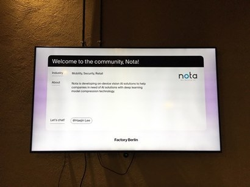
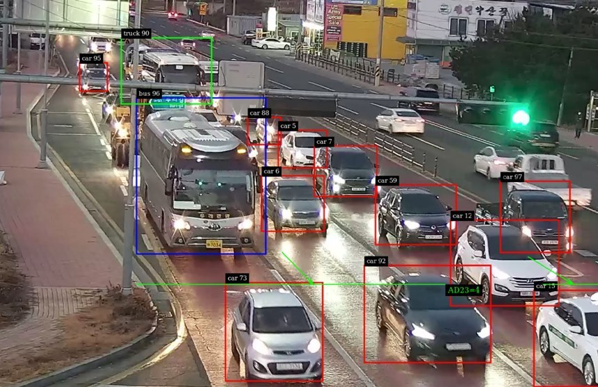
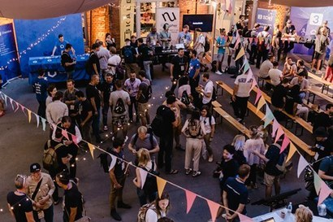

+++
title = "Berlin's Korean AI Startup 'Nota'"
date = "2022-03-02T13:00:00+09:00"
description = "Starting as a KAIST in-house venture and discussing an AI-powered intelligent traffic control system with the City of Hamburg"
tags = ["AI", "Startup", "Berlin", "Nota", "Factory Berlin"]
categories = ["Column"]
author = "Eunseo Yi"
image = "cover.png"
canonicalUrl = "https://brunch.co.kr/@123factory/5"
+++

> **Starting as a KAIST in-house venture and discussing an AI-powered intelligent traffic control system with the City of Hamburg**

*The Korean AI startup 'Nota' has established a European legal entity in Berlin. Nota introduction posted at the entrance of Factory Berlin. Photo = Provided by Eunseo Yi*

COVID-19 hit just as Nota moved into Factory Berlin, the mecca of Berlin startups. Expected internal networking events were canceled or moved online, and the Factory courtyard, which never slept, went dark. The ball pit, a favorite in Factory's relaxation space, was closed for hygiene reasons, and a "barrier" called a mask appeared between people who used to greet each other over tea. Most of all, the city lost its vitality as the number of daily visitors was restricted.

In the meantime, Factory conducted various experiments to revive its unique function of networking. Factory Berlin's internal community channel, Slack, became more active than ever. Various communication channels suitable for the situation, such as #-discuss-corona_rescue, were opened to exchange information on support for founders during the pandemic, and the community sought ways to coexist. Factory management also introduced various programs such as individual online 1:1 meetings, mentor-mentee connections, VR product experiences for startups, and virtual exhibitions combining art and technology.

### Nota Enters Berlin

I participated in as many online events as possible at Factory to build my network one by one. I contacted people in my areas of interest individually via Slack messages to get to know them. Then, I noticed a company called "newcomers Nota AI" had joined Factory. Seeing that their headquarters was listed as Daejeon, I realized it was the Korean startup "Nota" that had recently entered Berlin, and I reached out to them.

### Nota Secures AI Model Lightweighting Technology

Nota is a company that started as a KAIST in-house venture in 2015 under the philosophy of "making life more convenient and abundant with artificial intelligence." After the match between AlphaGo and Lee Sedol, AI became a major trend. Among them, Nota is an AI deep-tech startup that provides on-device AI solutions based on deep learning model lightweighting technology.

In simple terms, existing AI-based services and products are mostly based on servers or the cloud due to the complex and large amount of computation within the AI. Therefore, it is difficult to run on individual devices such as smartphones and small IoT devices, operating costs increase, and privacy issues may arise as data passes through the cloud. <b>Nota has secured original technology for AI model lightweighting, allowing AI to run even in low-power and low-specification conditions without performance degradation.</b>

In 2020, it succeeded in attracting Series A investment from Samsung Venture Investment, LG CNS, Stonebridge Ventures, and LB Investment, reaching a cumulative investment of about 10 billion won. It drew attention for being the first to attract strategic investment from both Samsung and LG groups simultaneously in Korea. Since then, it has established legal entities in the US as well as Berlin to expand its business overseas. How and why did Nota come to Berlin?

*Nota developed the lightweighting platform 'NetsPresso' and used it to conduct an intelligent traffic control system (ITS) pilot project with Pyeongtaek City, Gyeonggi-do. Photo: Nota Homepage*

### Nota Goes Beyond Korea and into the World

Myungsu Chae, CEO of Nota, believed from the beginning that Nota's technology would be competitive enough in the global market. In 2019, they participated in BMW Open Innovation and received favorable reviews from global companies. Therefore, Chae's plan was to aggressively enter overseas markets and continuously build collaborative references with global companies.

"We started as a Korean startup, but the moment we clarified our identity as a startup doing 'Edge AI' rather than just a Korean startup, expanding overseas was a natural step. We particularly noted the European market. Europe has a high demand for personal information protection, and since this is regulated and encouraged by laws and policies, we judged it a good market to target with Nota's on-device AI solutions."

Chae shared his concerns during the initial stages of entering Berlin. Nota established its overseas expansion base in Berlin through KIC Europe, an organization under the National Research Foundation of Korea located in Berlin, and its accelerating and local entry support programs. Later, he deliberated between Amsterdam and Berlin for the legal entity but chose Berlin because of Germany's national power and various AI-related support. Since then, they have been operating in "Hubraum," a startup support space of Deutsche Telekom, Germany's largest telecommunications company.

Manager Hyejin Lee, who is in charge of the practical operations of the German entity, actively suggested moving Nota into Factory Berlin. "First of all, it's the most important place in the Berlin startup scene, and the fact that large companies like Siemens, McKinsey, and Porsche are residents was one of the biggest advantages." After moving in, she was impressed by how Factory Berlin's management arranged meetings for Nota and how matching managers actively supported networking when specific industries or companies were mentioned.

*Due to COVID-19, offline meetings at Factory Berlin disappeared, and meeting with companies became difficult, making the role of intermediaries like Factory Berlin even more important. Photo: Factory Berlin Facebook*

### Lightweighting Platform 'NetsPresso'

Nota initially focused on vision-based AI in mobility, security monitoring, and retail before launching the <b>lightweighting platform 'NetsPresso'</b>. Through this, they operated a successful intelligent traffic control system (ITS) case with Pyeongtaek City and are now in discussions with various local governments, including the City of Hamburg, which is leading in this field in Germany, and other municipalities with smart city plans for ITS. Thanks to these active efforts, Nota was listed on the German federal government's AI startup map less than a year after its establishment in Germany and is active in the German AI field as a member of the Digital Hub Mobility in Munich and the Digital Hub in Karlsruhe.

CEO Myungsu Chae said that as many offline channels closed due to COVID-19, it has become somewhat difficult to demonstrate and discuss technology as closely as before. Previously, he went on business trips every two months to meet companies and demonstrate technology in person, but recently, as they have been conducting meetings only online, it has become even more challenging for relatively conservative German companies to develop business, making the role of intermediaries like Factory Berlin even larger.

It is no longer unfamiliar to see Nota as a Korean startup making the most of various support policies while establishing a firm identity as an "AI technology startup" in Berlin. This is because the sentiment of being filled with national pride after seeing a "Samsung" billboard or a "Hyundai" car while traveling in Europe in the past has now reached a level where one can nod and think, "Of course, we are ahead in technology!"

I look forward to seeing Nota as a Factorian and a Berliner.

---

Eunseo Yi eunseo.yi@123factory.de

*This article was edited and adapted from the "European Startup Chronicles" series in BizHankook.*
