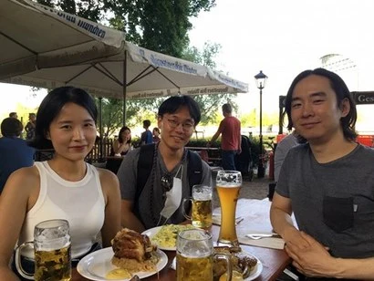
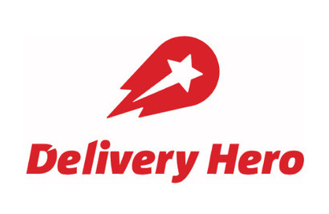
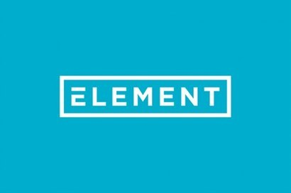

+++
title = "[유럽스타트업열전] 베를린의 한국인 개발자 3인과 만남①"
date = "2022-03-24T09:56:07+09:00"
description = "엘레멘트·딜리버리히어로·택스픽스 등 핀테크 분야 개발자"
tags = ["핀테크", "딜리버리히어로", "빅데이터", "스타트업", "독일", "유럽", "개발자"]
categories = ["Column"]
author = "이은서"
image = "cover.webp"
canonicalUrl = "https://brunch.co.kr/@123factory/15"
+++

## 베를린의 한국인 개발자 3인을 만나다①

*커버 사진 출처 = fotolia.com*

## 엘레멘트·딜리버리히어로·택스픽스 등 핀테크 분야 개발자에게 듣는 베를린 생활

베를린 스타트업 업계를 들여다보고 있자면, 흥미로운 점이 눈에 띈다. 어느 정도 알려진 스타트업에는 꼭 한국인 직원이 있다는 점이다.

독일의 일반 중소기업이나 대기업에는 주로 독일어권에서 학업을 했거나 해당 분야에 전문적인 기술을 보유하고 있거나 독일어를 완벽하게 구사하는 사람들에게 기회가 있다. 그런데 독일어는 언어 자체가 상당히 장벽이 높고, 비즈니스 문화도 한국과 사뭇 달라 평범한 한국인이 일반적인 포지션에서 독일 기업에 취업하기란 쉽지 않다. 하지만 스타트업은 다르다. 베를린은 워낙 글로벌한 분위기인 데다 개발자 수요는 많지만 공급이 원활하지 않기 때문에 세계 각지의 개발자들이 베를린으로 모여든다. 또 시에서 스타트업을 장려해 비자를 발급하는 데에도 큰 무리가 없다.

글로벌 비즈니스 세계의 최대 SNS인 링크드인을 통해서 관심 있는 스타트업을 팔로 하다 보면, 그곳에 근무하는 직원들도 한눈에 확인해볼 수 있다. 그리고 원한다면 그들과 네트워킹도 가능하다. 비슷한 분야의 사람들에게 연락해서 정보를 얻을 수 있고, 운이 좋다면 간단하게 줌 미팅 기회도 얻는다.

링크드인에서 특히 흥미로운 점은 스타트업의 채용공고를 통해 그들의 성장 속도와 방향을 실시간으로 가늠해볼 수 있다는 점이다. 스타트업이 얼마나 사람을 뽑는지, 어떤 분야의 사람을 뽑고 있는지를 들여다보면, 그들의 투자 현황과 사업 방향성을 어느 정도는 이해하게 된다. 그리고 유럽 스타트업계에서 한국인들이 어떻게 활약하고 있는지도 알 수 있다.

베를린 스타트업 중 핀테크 관련 분야에서 일하는 한국인 개발자도 링크드인을 통해서 알게 되었다. 처음에는 개인적으로 서로의 포스팅을 읽고 알아가다가, 직업인으로서 그들과의 공통분모를 발견하게 되었다. 베를린의 록다운이 끝남과 동시에 야외의 비어가르텐에서 이들을 만나 인터뷰했다. 유럽 인슈어테크의 강자 엘레멘트(Element Insurance AG)에서 시니어 데이터 엔지니어로 일하는 안광택, 한국 배달의민족을 인수한 딜리버리 히어로(Delivery Hero SE)의 결제 부문 엔지니어 오준석, 세금 연말정산 모바일 앱 택스픽스(Taxfix GmbH)의 주니어 개발자 이수진, 세 사람이 그 주인공이다.

*베를린 스타트업에서 개발자로 일하는 이수진 택스픽스 개발자, 안광택 엘레멘트 시니어 데이터 엔지니어, 오준석 딜리버리 히어로 엔지니어(왼쪽부터) 사진=이은서 제공*

### <b>-베를린 스타트업, 그 중에서도 가장 유망한 핀테크 업무를 하고 있다. 각자 소개와 회사에서 어떤 업무를 하고 있는지 소개해달라.</b>

> 한국 배달의민족을 인수한 <a href="https://www.deliveryhero.com/" target="_blank">딜리버리 히어로(Delivery Hero SE)</a>의 결제 부문 엔지니어 오준석

<b>오준석(오):</b> 베를린 딜리버리 히어로 <u>결제 부문에서 개발자</u>로 일하고 있다. 회사는 핀테크 분야가 아니고 배달 앱을 만드는 곳이지만, 나는 그곳에서 핀테크 부서 내에 결제 프로세싱 부문을 담당해 개발을 하고 있다. <u>딜리버리 히어로는 로켓 인터넷이라는 스타트업 인큐베이터이자 벤처 캐피털 출신의 회사</u>이다. 로켓 인터넷 출신의 유명한 스타트업이 많은데, 유럽 최대의 패션 온라인 쇼핑몰인 잘란도(Zalando), 밀키트 회사로 미국에까지 진출한 헬로프레시(HelloFresh) 등이 대표적이고, 독일뿐만 아니라 전 세계 스타트업을 키우는 곳으로 유명하다. 로켓 인터넷은 스타트업을 인큐베이팅 하고 성장시키는 데 굉장한 노하우가 있다. 그래서 여전히 딜리버리 히어로와도 교류가 많은 것으로 알고 있다. 딜리버리 히어로는 스타트업이라고 하기에는 규모가 매우 커졌지만 여전히 스타트업처럼 굴러가는 면이 있다. 예를 들어 프로젝트 진행속도가 매우 빠르고 비즈니스 확장을 매우 공격적으로 하는 것 등이 그렇다.

핀테크 부문은 내가 처음 입사할 무렵인 2019년 말에 결제 영역을 키우고 있었다. 내가 입사하기 1년 반 전에 생긴 신규 조직이었는데, 그때는 팀원이 20명 정도였던 걸로 기억한다. 지금은 개발자, 기획, 프로젝트 매니저 등까지 모두 하면 100명이 넘는 큰 조직이 되었다. 여기서 내가 하는 일은 결제 트랜젝션을 처리하는 일이다. 딜리버리 히어로는 전 세계에 브랜드를 가지고 있는데, 독일뿐만 아니라 유럽, 아시아권까지 전 세계의 트랜젝션을 베를린 본사에서 개발한 솔루션으로 처리한다. 그래서 직원이 많기도 하다. 물론 전 세계의 모든 결제를 헤드쿼터에서 처리하는 건 아니지만, 점점 더 많은 지역의 결제 시스템을 본사의 솔루션으로 대체할 계획이다. 핀테크 부서가 성장하고 있다는 것은 그만큼 이 업무가 중요하다는 것이고, 딜리버리 히어로의 성장과도 직접적으로 연관되는 곳이기도 해서 전반적으로 회사의 상황을 이해하기 좋다.

핀테크 부서의 결제 프로세싱 부문에도 쿠폰, 월렛, 이머니 등 다양한 분야가 있는데 <b>나는 PSP(한국에서는 PG) 분야를 담당한다. 결제 대행 서비스를 할 때, 통신을 통해 결제하게끔 프로세스를 만드는 모듈 작업을 한다.   </b>

*딜리버리 히어로는 유럽, 아시아권까지 전 세계의 트랜젝션을 베를린 본사에서 개발한 솔루션으로 처리한다. 사진=deliveryhero.com*

> 유럽 인슈어테크의 강자 <a href="https://www.element.in/de" target="_blank">엘레멘트(Element Insurance AG)</a>에서 시니어 데이터 엔지니어로 일하는 안광택

<b>안광택(안):</b> <u>보험업과 기술이 융합된 인슈어테크 회사 엘레멘트에서 데이터 엔지니어로 일하고 있다.</u> 엘레멘트는 스타트업이기는 하지만 독일의 금융감독원 격인 바핀(BaFin)이라는 기관에서 직접 보험회사 라이선스를 취득해 보험사도 한다. 직접 보험 상품을 만들고, 보험회사가 아닌 기업을 위한 맞춤형 보험 상품을 개발해 제공하는 화이트 레이블링 서비스를 한다. B2B와 B2C를 모두 하는데, 지금까지는 B2B를 위주로 사업을 진행했다.

예를 들면 폭스바겐에 맞춤형 보험상품을 만들어주는 식이다. 그러면 폭스바겐이 자동차를 판매할 때 보험 상품까지 원스톱으로 판매하기 때문에 고객이 굉장히 편리하다. 자동차 회사뿐만 아니라 보험이 필요한 각 분야의 회사들과 제휴를 맺고 영업을 한다. 앞으로 비즈니스 모델에도 다양한 확장과 변화를 계획하고 있다. 스타트업이다 보니 여러 가지 변수도 많고 투자에 예민하게 반응하는 편인데, 설립된 지 4년 된 최근에 1600만 유로를 투자받는 등 지금까지 총 6600만 유로 정도 투자를 받아 순항하고 있고, 앞으로 비즈니스 스케일이 커질 것으로 예상한다.

<u>나는 데이터 엔지니어로 일을 한다.</u> 회사에서는 경영에 필요한 다양한 데이터를 수집하는 것이 굉장히 중요한데, 나는 데이터 파이프라인을 만들고, 데이터를 분석하고, 데이터 분석할 수 있는 모듈을 만든다. <b>궁극적으로는 회사가 비즈니스에 필요한 의사결정을 데이터 기반으로 할 수 있게 지원하는 일이다.</b> 이것은 회사의 미래를 예측하고, 데이터를 바탕으로 세일즈와 마케팅 전략을 짜는 데에 영향을 준다. 우리가 지표를 제공하면 프로덕트, 마케팅, 세일즈 팀에서 전략을 수정한다. 또 바핀에도 정기적으로 보고하고 법적인 규제에 관한 대응도 해야 하는데, 관련 보고서를 만드는 것을 지원한다.

초기에는 스타트업이고 데이터가 많이 없어서 분석 자체가 의미가 없었는데, 요즘에는 데이터가 쌓이고 제휴 회사와 다양한 데이터를 주고받기 때문에 할 일이 많아졌다. 구글, 넷플릭스처럼 개인화하는 정도까지는 아니지만, 어느 정도는 고객군을 클러스터링 할 수 있는 수준까지 왔다. 그리고 마케팅과 세일즈에 도움이 되는 프로덕트 디자인을 할 수 있을 정도의 수준까지 왔다.

*보험사이자 인슈어테크 스타트업인 엘레멘트. 사진=element.in*

> 세금 연말정산 모바일 앱 <a href="https://taxfix.de/" target="_blank">택스픽스(Taxfix GmbH)</a>의 주니어 개발자 이수진

<b>이수진(이):</b> <u>연말정산 어플리케이션을 개발하는 택스픽스(Taxfix)라는 회사</u>에서 일하고 있다. 2016년에 창업했고, 나는 2020년 초부터 일하기 시작했다. 3년 전까지만 해도 전 직원이 약 30명이었는데, 지금은 280명 정도로 급성장했다. 작년에만 100명 넘게 채용했다. 현재 시리즈 C 투자까지 받았고 프랑스, 이탈리아까지 서비스 지역을 확장했다. 그 밖의 시장에도 진출하기 위해 준비 중이라고 알고 있다. 최근 C 레벨의 임원진도 새롭게 영입하고 팀 재조정도 거치면서 안정화되는 단계이다. 좀 특이한 점은 우리 회사 창업자가 두 명이고 모두 스위스 사람인데, 다 한국에서 오래 산 경력이 있다. 한국에서 스타트업 관련 밋업에 참여했을 때 이들을 만난 적이 있다. 두 창업자는 먼저 smallPDF를 창업했고, 이후 2016년에 택스픽스를 창업했다.

<u>택스픽스는 ‘질의-응답’의 콘셉트로 챗봇 형식의 프로토타입에서 시작되었다.</u> 질문 답변으로 사용자가 택스 폼을 입력할 수 있고 예상 세금 환급 금액을 확인할 수 있다. 현재 택스 엔진을 중심으로 엔지니어의 도움 없이 세무사가 세금 로직을 짜고 앱으로 배포할 수 있는 자동화 시스템을 만드는 데 주력하고 있다. 또 택스 ML이라는 일종의 프로그래밍 언어를 만들어 세무사가 프로그래밍 지식이 없어도 <u>나라와 주별로 각국 세금법에 따른 세금 계산과 로직을 구현할 수 있도록 플랫폼을 개발하고 있다. </u>

나는 택스 엑스퍼트 플랫폼 팀에 소속되어 세금 전문가를 위한 플랫폼인 워크벤치를 개발하고 있다. 궁극적으로 <b>엔지니어의 도움 없이 세금 전문가가 작성한 로직이 자동으로 반영되고 최종 앱으로 배포되는 것이 목표</b>이다. 그래서 세금 전문가와 엔지니어가 긴밀하게 협력하고 있다.

독일 시장은 꽤 잘되고 있는데, 신규 시장에 진출할 때 항상 도전이 있는 편이다. 그리고 보험, 은행 등과의 파트너십도 같이 고민하다 보니 앞으로 회사의 비즈니스가 어디로 어떻게 성장할지 기대된다.

*연말정산 앱을 개발하는 스타트업 택스픽스. 사진=taxfix.de*

### <b>-보험, 결제, 세무 등 분야가 다 다르지만 각 산업 분야가 기술 개발로 인해 급속한 변화를 겪는다는 공통점이 있다. 이 변화를 어떻게 보는가.</b>

<b>안:</b> 미국에 레모네이드라는 인슈어테크 스타트업이 있다. 온라인으로 쉽게 보험에 가입하고 쉽게 보험금을 청구하도록 서비스를 제공하는데, 처음엔 유수의 보험회사들이 레모네이드가 수익을 내는 것에 부정적이었다. 하지만 지금은 대부분의 보험회사가 레모네이드를 롤모델로 보고, <b>비대면 보험 가입과 클레임 분야에 AI를 활용하고 디지털화하는 것을 주목한다.</b> 이제 보험 가입이 정말 쉬워졌다. 모바일로 가입하고, 쇼핑하듯 2~3개의 상품을 비교해보고, 페이팔로 결제하면 끝난다. 특히 독일은 보험 대국이라 산업 전반에 아주 큰 영향이 있을 것이다. 거꾸로 말하자면 우리와 같은 인슈어테크 회사의 성장 가능성이 매우 높다는 말이다.

<b>이: </b>코로나19 이후 우리 회사는 실제로 실적이 올라갔다. 어떻게 보면 수혜를 입은 것이다. 고객으로서는 세무사에게 비싼 돈 주고 맡기는 것보다 훨씬 더 만족스러운 서비스를 경험하기 때문에 지속적으로 성장할 것이다. <b>그래도 도전은 늘 있다. 국가별로 사람들 특성이 너무 다르기 때문에 기술이 정교해지는 만큼 커스터마이징도 섬세해야 한다.</b> 예를 들면 독일 사람들은 세무사에게 일을 맡기더라도 서류를 철저하게 정리하고 분석해서 준다. 그래서 스스로 입력해나가면서 문제를 해결하는 우리 앱과 잘 맞는다. 반면 이탈리아 사람들은 파일 통째로 세무사에게 던져주면 알아서 처리해주기를 원한다. 앱을 깔고 스스로 입력하는 것을 귀찮아한다. 프랑스는 한국의 홈택스 같은 정부 프로그램이 있어서 별도 앱의 필요성이 적다. 이처럼 국가별로 타깃 고객군이 달라진다. 이 부분에서 로컬 매니저 역할이 중요하다.

<b>오:</b> 한국에서는 ‘월급날’이라는 사이트를 이용했다. 월급 명세서만 올리면 다 알아서 처리되었는데, 독일의 Steuergo와 같은 연말정산 프로그램은 올려야 할 게 너무 많다 보니 여전히 불편하다는 생각이 많이 든다. 한국이 여러모로 기술적으로 빠르다 보니까 독일에 살면서 불편한 점이 참 많다. <b>독일에 선진 한국 기술을 전파한다는 마음으로 일하고 있다.  </b>

※ <a href="../berlin-korean-developers-2/">[유럽스타트업열전] 베를린의 한국인 개발자 3인을 만나다②</a>로 이어집니다.

<b>이은서</b> eunseo.yi@123factory.de

*본 글은 \<비즈한국\>의 [유럽스타트업열전]을 편집 및 각색하였습니다.*
