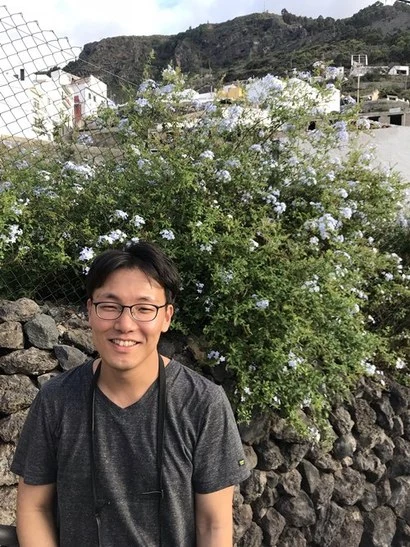
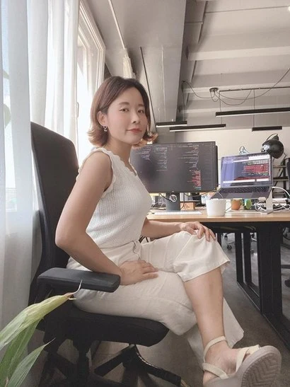
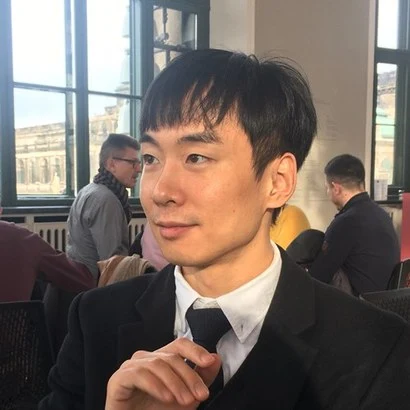

+++
title = "[Europäische Startup-Chroniken] Treffen mit drei koreanischen Entwicklern in Berlin ②"
date = "2022-03-24T09:58:05+09:00"
description = "Über den Weg nach Berlin und die in Europa erlebte Startup- und Entwicklerkultur."
tags = ["Entwickler", "Auslandsarbeit", "Programmierer", "Startup", "Deutschland", "Europa"]
categories = ["Column"]
author = "Eunseo Yi"
image = "cover.webp"
+++

## Treffen mit drei koreanischen Entwicklern in Berlin ②

*Cover-Fotoquelle = fotolia.com*

## Über den Weg nach Berlin und die in Europa erlebte Startup- und Entwicklerkultur

Wie ist es, als koreanischer Entwickler in Europa zu arbeiten? Wir haben drei koreanische Entwickler getroffen, die im Berliner Fintech-Sektor aktiv sind, um ihre Geschichten zu hören. Die Protagonisten sind Gwangtaek An, Senior Data Engineer beim führenden europäischen Insurtech-Unternehmen Element Insurance AG, Junseok Oh, Payment Engineer bei Delivery Hero SE (das das koreanische Unternehmen Baedal Minjok übernommen hat), und Sujin Lee, Junior Developer bei der Steuererklärungs-App Taxfix GmbH.

※ Fortsetzung aus <a href="../berlin-korean-developers-1/">[Europäische Startup-Chroniken] Treffen mit drei koreanischen Entwicklern in Berlin ①</a>.

*Wie ist es, als Entwickler in Europa zu arbeiten? Wir haben drei koreanische Entwickler getroffen, die im Berliner Fintech-Sektor aktiv sind, um ihre Geschichten zu hören. Foto = fotolia.com*

Wie ist es, als Entwickler in Europa zu arbeiten? Wir haben drei koreanische Entwickler getroffen, die im Berliner Fintech-Sektor aktiv sind, um ihre Geschichten zu hören.

### <b>- In gewisser Weise fühlt es sich wie ein Kampf gegen das bürokratische europäische Verwaltungssystem an. Die „schnelle Kultur“, die Sie bereits in Korea erlebt haben, hilft wahrscheinlich dabei, Innovationen in einem Startup voranzutreiben.</b>

<b>Gwangtaek An (An):</b> Als Entwickler in Berlin gab es eine wirklich schockierende Nachricht. Im Jahr 2019 war das Computersystem des Berliner Landgerichts mit einem Trojaner infiziert, sodass der Betrieb vorübergehend mit Schreibmaschinen und Faxgeräten abgewickelt werden musste. Dies geschah, weil das Gericht damals noch das Betriebssystem „Windows 95“ nutzte. Trotz der Warnungen von Experten, dass Updates dringend erforderlich seien und das System anfällig für Viren sei, wurden diese ignoriert, bis es zur Katastrophe kam. Dieser Vorfall bleibt ein symbolisches Ereignis für die konservative Natur der deutschen Bürokratie. <u>Positiv gesehen hat mir das gezeigt, wie viel Arbeit es hier für Softwareentwickler zu tun gibt.</u>

<b>Junseok Oh (Oh):</b> Ich habe mal eine Nachricht gelesen, dass eine Regionalbank in Japan bis 2020 Floppy Disks benutzt hat. Im Vergleich dazu verändert sich Korea unglaublich schnell. Ich glaube, dass es für uns genauso viele Dinge zu tun geben wird.

### <b>- Hatten Sie Vorkenntnisse über das Geschäftsfeld Ihres Unternehmens? Wie gut muss ein Entwickler die Branche verstehen?</b>

<b>An:</b> Ich habe beim Spieleentwickler Neowiz gearbeitet, bin dann zu Nexon gewechselt, bevor ich nach Berlin kam. Später wechselte ich zu Rakuten Deutschland, einem japanischen E-Commerce-Unternehmen. In gewisser Weise habe ich mich bei jedem Jobwechsel einer neuen Branche gestellt. Als ich bei Element anfing, hatte ich kaum Vorkenntnisse über Versicherungen. In der Probezeit habe ich fleißig gelernt. Da sich die grundlegenden Aufgaben eines Entwicklers von Unternehmen to Unternehmen jedoch kaum unterscheiden, hatte ich keine größeren Schwierigkeiten. <u>Um jedoch Datenanalysen durchzuführen und Pipelines aufzubauen, muss man das Geschäft und die Produktentwicklung verstehen. Deshalb habe ich mich intensiv mit Versicherungen beschäftigt. Normalerweise</u> hat jedes einzelne Produkt einen komplexen Algorithmus. Um diesen umzusetzen, ist ein Verständnis der Branche unerlässlich. Anfangs gab es viele manuelle Abläufe, aber in letzter Zeit arbeiten wir viel daran, diese auf datengestützte Systeme umzustellen.

*Gwangtaek An, Senior Data Engineer beim Berliner Insurtech-Startup Element. Foto = Gwangtaek An*

### <b>- Gibt es vom Unternehmen angebotene Weiterbildungsmöglichkeiten?</b>

<b>An:</b> <u>Es gibt einen Lehrplan. Es gibt einen Bildungsprozess und jedes Team hat seine eigenen Sitzungen.</u> Wenn man möchte, kann man seinen Manager oder seine Teammitglieder bitten, sich für versicherungsbezogene Workshops anzumelden. Rakuten, mein vorheriger Arbeitsplatz, hatte ebenfalls Schulungsprogramme, die die Möglichkeit boten, Schulungen oder Mentoring zu erhalten, wenn man an einer bestimmten Position interessiert war. Im Fall von Rakuten Deutschland hatte das Unternehmen Büros in Bamberg und Berlin, sodass die Mitarbeiter remote arbeiten und sich weiterbilden konnten, während sie zwischen den beiden Büros reisten. Wenn man eine bestimmte Schulung erhalten möchte oder jemanden benötigt, der ein Projekt leitet, kann man sich an die Personalabteilung oder seinen direkten Manager wenden und sagen: „Ich möchte ein Projekt mit dieser Person machen, ich brauche eine Führungskraft“, und man erhält die Möglichkeit zu lernen.

<b>Sujin Lee (Lee):</b> Auch wir haben Unterstützung dafür. Da es sich um einen globalen Arbeitsplatz handelt und Kommunikation entscheidend ist, werden grundsätzlich Englischkurse unterstützt. Ich nehme seit meinem Einstieg einmal pro Woche an einem vom Unternehmen gesponserten Kurs für „Business English“ teil.

### <b>- Wie sind die anderen beiden von Ihnen nach Berlin gekommen?</b>

<b>Oh:</b> Ich habe bei Kakao in Korea gearbeitet. Ich war für Aufgaben im Bereich der Websuche zuständig. Es gab keinen Druck bezüglich der Zeitplanung und der Verteilung der Arbeitsbelastung, und die Work-Life-Balance war gut. Allerdings hatte ich das Gefühl, dass die in meiner Abteilung verwendete Technologie veraltet war. Außerdem hatte meine Arbeitsleistung keinen nennenswerten Einfluss auf die Qualität des Dienstes. Ich wurde unruhig und <u>begann mich zu fragen, welche Vision ich als Entwickler verfolge.</u> Insbesondere als ich etwas über Softwareentwicklungsphilosophien und Extreme Programming lernte, wurde mir klar, dass Europa ein besseres Umfeld für deren Umsetzung bieten würde als Asien. Das führte zu einer langen Überlegung, und ich begann zu recherchieren. Da ich mein Englisch nicht für fließend hielt, schloss ich englischsprachige Länder aus. So blieben Singapur und Berlin als Kandidaten übrig. Ich entschied mich für Europa und kam nach Berlin. Dass Visa leicht erteilt werden, war ebenfalls ein großer Faktor. Der Prozess der Jobsuche verlief reibungslos. Es dauerte etwa sechs Monate ab meiner Ankunft in Berlin, bis ich eine Stelle fand. Jetzt mache ich Überstunden, was ich in Korea nicht getan habe.

<b>Lee:</b> Ich war ursprünglich keine Entwicklerin. Ich habe etwa drei Jahre lang in der Produktplanung gearbeitet, aber da ich dort keine Zukunft sah, wechselte ich in die Entwicklung. In Korea hielten sich jedoch selbst nach bestandenen technischen Vorstellungsgesprächen Vorurteile wie „sie war ursprünglich keine Entwicklerin“. Das machte die Jobsuche im Ausland viel einfacher. Bevor ich nach Berlin kam, arbeitete ich im Datenvisualisierungsteam eines staatlichen Medienunternehmens in Singapur. Die Arbeit war interessant. Da es sich jedoch um ein staatliches Medienunternehmen handelte, war es konservativ. Da Singapur sehr klein ist, gab es auch zu wenig Nachrichten. Obwohl ich bleiben wollte, weil ich glaubte, dass Südostasien die Zukunft sei, spürte ich gewisse Grenzen und dachte über einen Jobwechsel nach. Ungefähr zu dieser Zeit empfahl mich ein koreanischer Bekannter bei Taxfix, also stellte ich mich vor und kam hierher.

Rückblickend war es sowohl in Singapur als auch in Berlin einfach, einen job zu finden. Und ich glaube immer noch, dass die Hürde für einen Job im Ausland bei gleichem Niveau viel niedriger ist als in Korea. Das liegt daran, dass man nicht so sehr auf den Hintergrund einer Person achtet. Man schaut nur auf die Fähigkeiten. In unserem Unternehmen gibt es Entwickler, die früher DJs, Barkeeper und Taxifahrer waren. Der Junior-Entwickler in unserem Team ist in den Vierzigern und hat früher Taxi gefahren. Diese Person begann sich während des Fahrens für die Entwicklung zu interessieren, hörte während der Arbeit Entwicklungsvorträge über Audio und lernte nach der Arbeit zu Hause im Selbststudium. Dann stellte ihm ein Fahrgast, der den Audiovortrag gehört hatte, ein Entwickler-Meetup in Berlin vor. Auf diesem Meetup erfuhr er von unserem Unternehmen und bewarb sich. Ich habe viele Menschen gesehen, die ihre Karriere auf diese Weise verändert haben. Und er ist tatsächlich sehr gut in der Entwicklung.

*Sujin Lee, Entwicklerin beim Berliner Steuererklärungs-App-Startup Taxfix. Foto = Sujin Lee*

### <b>- Das ist eine wirklich faszinierende Geschichte. Gibt es einen Grund, warum Menschen aus anderen Bereichen so gut entwickeln können?</b>

<b>Lee:</b> Da ich selbst nicht aus der Entwicklung komme, interessiert es mich sehr, wie sich andere so gut entwickeln können. Als ich genauer hinsah, wurde mir klar, dass die Aufgaben, die das Unternehmen uns überträgt, anders sind. Als ich kurz als Junior in Korea gearbeitet habe, kann ich mich nur an Routineaufgaben erinnern. Ich habe zu viel Zeit mit sehr einfachen Aufgaben wie dem Organisieren von Besprechungsnotizen und Koordinaten verbracht. Mir wurde nie eine Aufgabe übertragen, bei der ich selbst Erkenntnisse gewinnen und den Prozess eigenständig überdenken musste. Selbst wenn ich meine eigenen Ideen einbrachte, kamen die Entscheidungen von oben. <u>Hier jedoch werden wirklich wichtige Aufgaben selbst an Junioren delegiert.</u> Selbst bei Hausaufgaben stellen sie qualitativ hochwertige Daten zur Verfügung und werfen Probleme auf, mit denen das Unternehmen tatsächlich zu kämpfen hat. Und sie lassen einen ausnahmslos präsentieren. Ich habe seit meinem Einstieg so viele Präsentationen gehalten. Es ist eine Umgebung, in der es schwer ist, sich nicht zu verbessern. Wenn ich eine Funktion entwickle, muss ich sie End-to-End betreuen. Das hat zwar seine Vorteile, ist aber auch sehr anstrengend. In Korea gibt es das Konzept eines Mentors, der einen von Anfang bis Ende anleitet und anleitet, aber hier ist es so frei, dass ich mich oft frage, was ich tun soll. Dennoch denke ich, dass das Berliner System mehr Vorteile hat. Wenn man es ein paar Mal macht, verbessern sich die Fähigkeiten rasant. <u>Ich habe das Gefühl, dass ich gemeinsam mit den Entwicklern um mich herum wachse und erfolgreich bin.</u>

### <b>- Ich beneide diese Kultur. In gewisser Weise scheint es eine einzigartige „Entwicklerkultur“ zu sein.</b>

<b>Oh:</b> Wegen dieser Einzigartigkeit scheinen viele Menschen den Begriff „Entwicklerkultur“ als separates Konzept zu verwenden. Während „Kultur“ vage klingt, geht es im Allgemeinen um die Einstellung des Einzelnen zur Arbeit und darum, wie eine Organisation Aufgaben ausführt. <u>Das Wichtigste, was ich nach meiner Ankunft hier gespürt habe, sind Transparenz und Flachheit.</u> Natürlich gibt es eine große Mauer zwischen dem Management und der Arbeitsebene. Auf der Arbeitsebene werden jedoch fast alle Informationen geteilt. In Korea argumentierten einige, dass man selbst innerhalb desselben Unternehmens den Quellcode nicht einsehen dürfe, wenn man einer anderen Abteilung angehört. Auch die flache Kommunikation ist beeindruckend. Kurz nach meinem Einstieg sah ich, wie ein benachbarter Ingenieur direkt mit einem Manager einer anderen Abteilung sprach, den er nicht kannte, weil er eine Frage hatte. In Korea hätte man Zeit investieren müssen, um die Barrieren von Abteilungen und Rängen zu überwinden. Da man alles teilen und mit jedem sprechen kann, ist die Kommunikation sehr klar.

*Junseok Oh, Software Engineer bei Delivery Hero. Foto = Junseok Oh*

<b>An:</b> Im Fall von Rakuten wird das <u>Teilen von Informationen und der Austausch untereinander als äußerst wichtig erachtet.</u> <u>Es ist die wichtigste vom CEO angestrebte Unternehmensphilosophie.</u> Auf diese Weise wurde der Schulungsprozess des Unternehmens aufgebaut. Ich weiß, dass nicht alle deutschen Unternehmen eine solche Kultur haben. Wenn ich Bekannten zuhöre, gibt es Orte ohne Schulung oder Mentoring.

<b>Lee:</b> Das stimmt, und <u>weil es ein Startup ist, versuchen wir verschiedene Wege, um gemeinsam zu wachsen.</u> Wir probieren in unserem Unternehmen viele verschiedene Arbeitsweisen aus, und ich habe eine Methode kennengelernt, die bei SoundCloud verwendet wird. <u>Beispielsweise verbringt ein Entwickler 70 % mit seinen Hauptaufgaben und 30 % mit dem Ausprobieren anderer Aufgaben.</u> Selbst wenn ich Front-End mache, verbringe ich, wenn ich mich für Daten interessiere, 30 % meiner Aufgaben mit der Teilnahme an der Daten-Community. Indem man die Arbeit dort beobachtet und studiert, baut man berufliche Kompetenzen auf. Da ich nur an Admin-Tools gearbeitet habe, wusste ich nicht, wie Service-Tools funktionieren. Also ging ich zum Service-App-Team, übernahm Aufgaben und lernte, wie Code läuft und wie Dienste funktionieren. Dies half mir, ganzheitlich zu lernen, und steigerte mein Verständnis für das Unternehmen und das Geschäft erheblich. Ich habe Fälle gesehen, in denen dies zu einem Karriereweg wurde, der zu Wechseln in andere Rollen führte. Dieses Projekt scheiterte jedoch schließlich. Da alle mit ihren Hauptaufgaben zu beschäftigt waren, verloren sie die Muße, Zeit und Energie für andere Aufgaben aufzuwenden. Stattdessen betreiben wir jetzt eine Learning Community. Arbeit ist Arbeit und Lernen ist Lernen, getrennt voneinander behandelt.

※ Fortsetzung in <a href="../berlin-korean-developers-3/">[Europäische Startup-Chroniken] Treffen mit drei koreanischen Entwicklern in Berlin ③</a>.

<b>Eunseo Yi</b> eunseo.yi@123factory.de

*Dieser Artikel wurde aus der Serie „Europäische Startup-Chroniken“ in BizHankook übersetzt und angepasst.*
