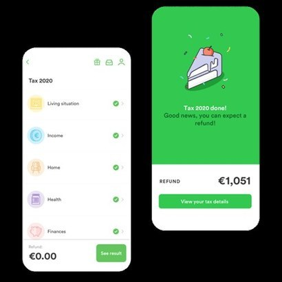
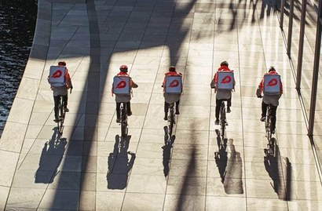
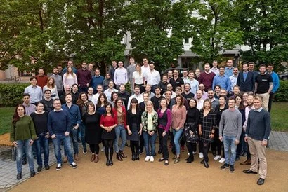
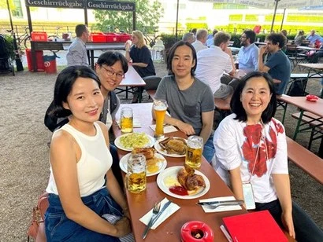

+++
title = "[유럽스타트업열전] 베를린의 한국인 개발자 3인 ③"
date = "2022-03-24T09:58:35+09:00"
description = "해외 취업과 개발자의 일, 그리고 앞으로의 비전"
tags = ["개발자", "취업", "스타트업", "독일", "유럽"]
categories = ["Column"]
author = "이은서"
image = "cover.webp"
canonicalUrl = "https://brunch.co.kr/@123factory/17"
+++

## 베를린의 한국인 개발자 3인을 만나다③

*커버 사진 출처 = fotolia.com*

## 해외 취업과 개발자의 일, 그리고 앞으로의 비전

유럽에서 한국인 개발자로 일하는 것은 어떨까. 독일 베를린의 핀테크 분야에서 활약 중인 한국인 개발자 3인을 만나 이야기를 들었다. 유럽 인슈어테크의 강자 엘레멘트(Element Insurance AG)에서 시니어 데이터 엔지니어로 일하는 안광택, 한국 배달의민족을 인수한 딜리버리 히어로(Delivery Hero SE)의 결제 부문 엔지니어 오준석, 세금 연말정산 모바일 앱 택스픽스(Taxfix GmbH)의 주니어 개발자 이수진, 세 사람이 그 주인공이다.

※ <a href="../berlin-korean-developers-2/">[유럽스타트업열전] 베를린의 한국인 개발자 3인을 만나다②</a>에서 이어집니다.

*사진=fotolia.com*

> 베를린의 스타트업은 독일회사가 아니다. 대부분 회사들이 글로벌한 분위기라서 어느 문화권의 사람이 많은가에 따라 분위기가 좌우된다. 또 개발자는 나이나 경력이 아니라 실력이 우선한다.

> #유럽의 채용과 조직 문화

### <b>-모두 수월하게 해외 취업을 했고 안정적으로 베를린에서 개발자로 일하고 있는데, 지원했다 떨어진 회사도 있었나.</b>

<b>오준석(오):</b> 많다. 여행 플랫폼 카약(Kayak)에 떨어졌다. 코로나가 오는 바람에 딜리버리 히어로 오길 잘했다 생각하지만…. 결제 서비스를 제공하는 클라나(Klarna)도 떨어졌다. 클라나는 정말 채용 과정이 대단했다. 9단계까지 있다. 거의 구글 수준이다. 클라나는 업계에서 채용이 힘들기로 유명하다. 업무도 매우 많은 편이라고 들었다. 그만큼 급여나 복지혜택도 많다고 들었다. 휴가도 많고. 가치관에 따라 어떤 사람에게는 더 맞는 회사일 수 있다.

낙방했지만 기억에 좋게 남아 있는 회사가 있다. 가로등에 전기차 충전기를 설치해서 그리드 만드는 회사였다. 불합격 소식을 알리면서 내가 제출한 과제에 대한 피드백을 아주 촘촘하게 해줬다. 교수님한테 첨삭 받는 기분이었다. 굉장히 좋은 경험이었다. <u>지원하고 불합격하는 과정에서도 배울 것이 많았다. </u>

<b>이수진(이):</b> 나도 비슷한 경험이 있다. 베를린의 유명 스타트업에 지원했는데 낙방했다. 그쪽에서 과제를 줬는데 하루 정도 걸릴 거라고 말한 것을 나는 일주일을 꼬박 준비해서 제출했다. 실제로 서비스 개발에서 필요한 부분을 구현하고, 현재 팀에서 직면한 문제를 해결하는 과제를 줬다. 안타깝게도 합격하지는 못했는데, 피드백을 정말 자세히 해주었다. <u>내가 왜 그렇게 과제를 해결했는지 궁금하다고 묻더라. 그쪽과 맞지 않았기에 떨어졌겠지만, 이 과정을 통해서 정말 많이 배웠다. </u>한국에서 경험해보지 못한 일이다.

<b>안광택(안):</b> 나도 4개 정도의 회사에서 낙방한 경험이 있다. 하나는 웨이페어(wayfair)라는 미국계 가구회사인데, 유럽에는 베를린에 지사가 있다. 거기도 채용 과정이 7단계까지 있다. 나는 6단계까지 갔는데, 채용 프로세스가 그렇게 효율적이라는 생각이 들지 않았다. 베를린 지사 사람들과 면접한 뒤 미국 본사 사람들과 면접을 하는데, 똑같은 질문을 하더라. 기술 면접이 아주 어렵지는 않았다. 그런데 마지막에 연봉 협상 과정에서 회사 문화나 스타일 등이 안 맞는 부분이 있었다. 팀 문화나 야근 등에 대해서 집요하게 질문을 했는데, 그쪽에서 별로 마음에 들지 않았었나보다. 미국 회사다 보니 야근이 당연한 거 아니냐는 분위기였다. 필요하면 미국 시간에 맞춰서 회의도 해야 하고 그것이 당연하다는 분위기였다.

또 다른 곳은 자동차 부품을 판매하는 독일 플랫폼이었는데, 이곳에서는 독일어가 복병이었다. 면접 과정에서 계속 영어로 하다가 마지막에 독일어로 지원동기를 얘기하라고 했는데, 독일어를 잘 못 했을 때였다. 자기소개를 겨우 했고, 떨어졌다. 두 군데 정도 더 있었는데, 잘 기억은 안 난다.

### <b>-개발자는 주로 영어로 직무를 수행하나.</b>

<b>이:</b> 우리 회사에는 엔지니어 100명 중 1명만 독일 사람이다.

<b>안:</b> 우리 팀도 독일 사람이 없다. 그래서 보통 영어로 한다.

<b>오:</b> 마찬가지인데, 워낙 세계적인 곳에 지사가 있고 하니까 공용어가 영어라고 할 수 있다.

### <b>-놀랍다. 이유가 뭘까. 독일 사람들이 개발을 못 하나.</b>

<b>이:</b> 나도 궁금해서 물어봤는데, 독일 개발자들은 미국, 영국으로 많이 간다고 들었다. 특히 독일은 전통적으로 제조업 중심 국가이고 금융 등 다른 산업 분야가 강하니까 IT 쪽은 수요가 많이 없다고 한다. 최근에는 많이 바뀌고 있다고 들었는데, 아직은 부족하다.

<b>오:</b> 여기도 한국처럼 소프트웨어 엔지니어들에게 아메리칸 드림이 있다. 잘하면 실리콘밸리에 가야 한다고 생각한다.

<b>안:</b> 우리 회사에서도 개발자로 인턴십하다가 미국 마이크로소프트에서 인턴십을 하고 온 친구가 있는데, 매우 특별한 경험이었다고 하더라.

*베를린의 세무 연말 정산 앱 서비스 스타트업 택스픽스의 프로덕트. 사진=taxfix.de*

### <b>-독일은 워라밸이 중요하고, 미국은 한국보다 더 일하고 야근도 많고 해고도 쉬운 환경이라고 들었다. 어떤가. </b>

<b>이:</b> 우리 회사에서는 온콜(당직 업무) 정책을 정할 때 몇 시간을 토론했다. 독일 법에 맞는지, 수당을 어떻게 책정해야 하는지, 모든 개발자들이 다 참여해서 토론했다. 그 정도로 워라밸을 굉장히 중요하게 생각하는 문화다.

<b>안:</b> 회사마다 다른 것 같다. <u>베를린은 회사가 대부분 글로벌한 분위기라서 어느 문화권의 사람이 많은가에 따라 분위기가 좌우된다.</u> 예를 들어 브라질, 포르투갈 친구들은 한국과 비슷하다. 야근도 많이 하고, 밤 10시 이후에 왓츠앱 메시지로 개발 관련 질문도 한다. 근데 상사에게 업무지시가 오지는 않는다. 주로 주니어들이 개발 관련 질문을 하는데, 그런 경우는 도와주고 싶어서 나도 답을 해준다. 이런 것을 보면 독일식 회사문화는 아닌 것 같다.

<b>오:</b> 그런 면이 확실히 있다. 독일 사람이 많은 회사는 워라밸이 지켜지는 경우가 많고, 여러 나라에서 온 사람들이 많은 회사는 매니징 방식도 좀 다른 것 같다. 우리는 동료들끼리 여긴 ‘독일식 독일회사가 아니다’라고 말한다. 일이 많다. 하지만 대부분 이미 계획한 일이 밀렸을 경우에 야근하게 된다. 또는 회사에 치명적일 수 있는 경우에 한한다. 예를 들어 우리 팀이 제공하는 서비스가 민감하다 보니까 빨리 처리 안 하면 손실이 어마어마하게 생기는 경우가 있다. 하지만 정말 가끔이다. 주말이나 밤에 일하는 것은 처음에 계획한 일정이 밀려서이고, 밀리는 이유도 대체로 다른 급한 일 처리하느라고 그런 경우가 많다.

내 경우는 온콜 업무는 못 하겠다고 회사에 말했다. 그런 얘기를 자연스럽게 할 수 있는 분위기다. 온콜 담당자는 서비스에 장애가 생기면 새벽에 깨야 한다. 카드사 게이트웨이와 통신해서 결제해야 하는데 서비스가 먹통이 되는 경우도 있다. 그러면 엔지니어가 자다 일어나서 대처 작업을 해야 한다.

### <b>-그런 경우에 별도의 성과급이 있나.</b>

<b>오:</b> 온콜 업무는 원하는 사람만 돌아가면서 한다. 수당도 있다. 그 업무를 하는 동안은 장애가 발생하지 않아도 대기 수당이 쌓이고, 실제 장애가 생겨서 새벽에 깨서 작업하게 되면 작업수당이 나온다. 내가 직접 하지는 않았고, 야근하는 날 동료가 온콜 업무 하는 걸 보게 돼서 도와준 적은 있다. 온콜 업무를 하면 어디 나가지도 못하고 컴퓨터만 봐야 한다. 1주일 간격으로 돌아가는데, 집에 가만히 노트북 켜고 있어야 한다. 그래서 가족이 싫어하는 경우도 많다. 부부가 한 침대에서 자고 있는데, 알람이 시끄럽게 울리면 다 깨니까. 배우자가 싫어한다는 이유로 온콜 업무를 안 맡는 경우도 많이 봤다.

물론 장점도 있다. 모두가 자고 있을 때 혼자 작업을 해야 하기 때문에 내가 맡은 부분이 아닌 데서 장애가 나도 처리하기 위해 많은 걸 알아야 한다. 그걸 보람으로 여기는 사람들이 있다. 온콜 업무를 해내려면 기술과 능력이 뛰어나야 한다. 온콜을 하는 사람들은 그렇게 되어 간다. 그래서 회사 내에서도 말할 수 있는 게 많아진다. 자기 팀 일이 아니어도 잘 알게 된다. 마치 매니저처럼 능력이 생긴다. 같은 팀에 갓 서른 된 친구가 있는데, 워낙 머리도 좋고 일도 잘하지만 온콜을 하면서 다양한 일을 하고 많은 사람하고 소통을 하다 보니, 회사가 어떻게 돌아가는지 많은 것들을 알게 되면서 벌써 시니어 엔지니어가 되었다. 그 나이에 굉장히 빠른 것이다.

*베를린 배달 앱 스타트업 딜리버리 히어로. 사진=deliveryhero.com*

### <b>-개발자 그룹에서 나이는 별로 중요하지 않은가. 그렇다면 무엇이 중요한가. 경력?</b>

<b>안:</b> 경력이 중요하다. 나이는 입사할 때도 중요하지 않고, 입사 후에도 중요하지 않다. 간혹 정말 친해지면 개인적으로 물어볼 때는 있다. 근데 동료끼리 나이는 거의 잘 모른다.

<b>오:</b> 실제로 경력도 면접 시에만 중요하지, 회사에 들어가고 나서는 중요하지 않다. 실제 일을 하게 되면 능력이 바로바로 눈에 보이니까.

### <b>-한국 회사에서는 개발자로 일하는 데 나이가 중요한가. </b>

<b>이:</b> 많이 중요하다.

<b>오:</b> 한국에 있을 때 팀원 필요해서 공고를 띄웠는데, 40대가 한 명 지원했다. 능력도 괜찮은 거 같고 우리가 원하는 것과 포트폴리오도 맞았는데, 많은 사람이 나이가 많아서 같이 일하기 힘들지 않을까 하고 피드백을 했다. 그렇게 해서 반려했다.

<b>안:</b> 여기는 채용과정에서도 개발자 나이를 거의 안 본다고 해도 무방하다.

### <b>-그렇다면 스타트업 개발자로서 취업에서 중요한 부분은 뭘까. </b>

<b>오:</b> 나이는 중요하지 않다. <u>엔지니어로 일한다는 방향성이 확실하고, 학습 의지가 있고, 투자할 시간을 확보하면, 커리어 발전이 정말 빠르다.</u> 이 부분이 한국과 다르다. 한국에 있을 때는 일을 하며 배운다는 인식이나 경력에 대해 막연한 믿음을 가졌다. 하지만 이 분야는 노력해서 배운 만큼 능력이 향상된다. 기술 트렌드도 워낙 빠르다 보니, 한 가지 일을 오래한 베테랑보다 신기술을 잘 익히는 루키가 더 우수할 수 있다. 그런 점을 몰랐던 게 아니고 한국에서도 경력이 짧아도 뛰어난 사람들을 만났었지만, 이곳에 오고 나서야 비로소 확신할 수 있게 되었다. <u>명확한 비전을 갖고 꾸준히 배우는 것이 중요하다. </u>

<b>이:</b> 특히 문화적인 부분을 많이 보는 것 같다. 회사의 문화와 그 사람의 스타일이 잘 맞는지 안 맞는지를 중요하게 생각한다. <u>베를린 회사들은 다양성을 중요하게 생각한다.</u> 일반적인 사람을 지칭할 때 he/him으로 쓰던 인칭 대명사를 이제는 (성별 구분 없이) they/them으로 쓰는 분위기다. 우리 회사는 자체적으로 다양성 책자를 만들어 배포하고, 젠더리스 화장실도 마련했다. 다국적 다문화를 가진 회사인 만큼 다양성을 포용하고 인정하는 문화가 중요할 수밖에 없다.

*베를린 인슈어테크 스타트업 엘레멘트 구성원들. 왼쪽 세 번째 줄에 안광택 시니어 데이터 엔지니어도 찾아볼 수 있다. 사진=element.in*

> #개발자로서의 목표와 ‘베를린 이후’

### <b>-베를린 스타트업에서 일하면서 개발자로서 어떻게 성장하고 싶은가. 베를린이 최종 종착지인가. </b>

<b>오:</b> 베를린에 오려고 한 가장 큰 이유가 영어였다. 왜냐하면 세상의 너무 많은 지식이 영어로 쓰이거나 말해지고 있다는 것을 인식한 뒤 더 큰 것을 보기 위해서는 영어로 일하는 곳으로 가야겠다고 생각했다. 그 중간 지점으로 여기를 택했다. 아직 영어가 모국어처럼 편하지는 않지만, 일단은 한국어와 한국이라는 테두리를 넘어섰다는 데에 많은 가치를 부여하고 싶다. <u>5년 후쯤에는 개발 관련 전문가 집단에서 소통할 수 있는 언어 능력, 개인적 능력, 소프트웨어 엔지니어로서의 능력을 개발</u>하고 싶다.

<b>안:</b> 두 가지 목표가 있다. 하나는 엔지니어 쪽의 구루가 되는 것이다. 처음에 소프트웨어 엔지니어링을 하다가 데이터 엔지니어링을 거쳐서 지금은 데이터 사이언티스트로 일을 많이 한다. 적어도 <u>데이터 쪽에서는 구루 같은 엔지니어</u>가 되고 싶다. 다른 하나는 <u>스타트업을 창업</u>하는 것이다. 아직 구체화된 것은 아니지만 주변에 생각이 비슷한 사람들과 함께 고민하고 공부하는 중이다.

<b>이:</b> <u>커리어를 잘 쌓는 것에 집중하고 싶다.</u> 나는 한국보다는 해외가 더 잘 맞는 것 같다. 오픈 소스를 많이 경험해보고 싶기 때문에 베를린이 이점이 많다. 그리고 유럽에 오면 여성 엔지니어가 많을 줄 알았는데, 한국보다 더 없는 것 같다. 차별은 전혀 못 느끼지만, 여성 엔지니어가 없다보니 어느 정도 사명감도 크다. 그래서 5년 정도는 커리어를 쌓는 것에 집중하고, 나중에는 여성 엔지니어로서 시니어, 매니저, 테크리드까지 하고 싶은 욕심도 있다. 우리 회사의 CTO는 개발하는 것을 너무 좋아해서 얼마 전 CTO 자리에서 내려와 우리와 같은 코더가 되었다. 전 직원에게 ‘내가 좋아하는 것에 집중하기 위해 내려온다’고 멋진 이메일을 보냈다. 이런 자유로움 속에서 좋아하는 일에 집중하고 싶다.

<b>안:</b> 자바 언어를 만든 제임스 고슬링이 생각난다. 그는 60대임에도 아직 아마존에서 수석 엔지니어로 일한다. 좋아하는 일을 평생 하기 위한 자기만의 노하우가 있는 분이다. 일종의 긱 기질을 갖고 있는데, 많은 개발자들이 그런 점을 동경한다. 무엇인가를 그냥 사랑하는 것과 같다.

*왼쪽부터 이수진, 안광택, 오준석 개발자와 필자. 열정 가득한 이들이 그려갈 미래가 기대된다. 사진=이은서 제공*

스타트업이 붐이 일면서 개발자 직군도 그만큼 많은 주목을 받게 되었다. 한국이나 독일이나 비슷하다. 이미 베를린에서 안정적으로 자리를 잡고 활동하는 세 명의 개발자들은 이력과 배경이 다름에도 공통점이 있다. <u>모두 자기 일에 격렬히 몰입하고 있다는 점이다.</u> 해외 취업이나 스타트업에서 일하는 것에 어렴풋한 환상과 동경을 품고 떠나온 것이 아니라, <u>일에 대한 구체적인 희망과 섬세한 열정을 안고 있다</u>. 그리고 <b>자신의 길을 찾기 위해 날카롭게 고민하고 있다. 글로벌 환경에서도 이들이 빛을 발할 수 있는 것은 이런 엄격한 시간의 축적 덕분일 것이다. 각각을 하나의 스타트업이라고 부를 수 있을 정도로 열정 가득한 이들이 그려갈 미래의 시간이 기대된다.</b>

<b>이은서</b> eunseo.yi@123factory.de

*본 글은 \<비즈한국\>의 [유럽스타트업열전]을 편집 및 각색하였습니다.*
