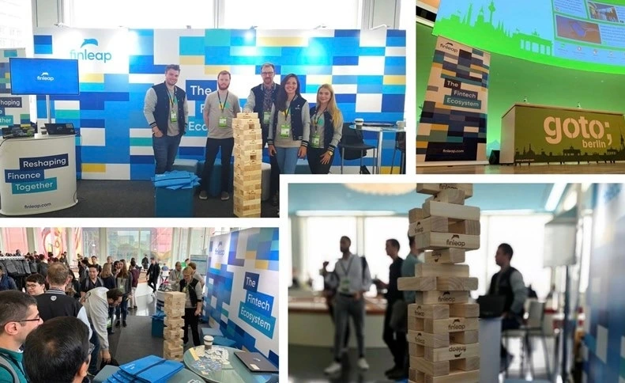
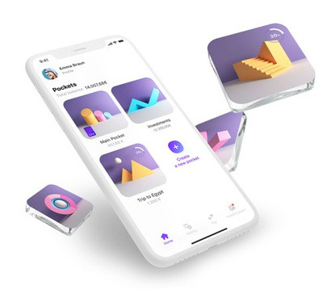

+++
title = "[European Startup Chronicles] Berlins Startup-Ökosystem ①"
date = "2022-03-21T10:00:00+09:00"
description = "Nationale Hub-Agentur und Accelerator „Finleap“ im Zentrum von Berlins Fintech"
tags = ["Startup", "Berlin", "Fintech", "IoT", "Digital Hub"]
categories = ["Kolumne"]
author = "Eunseo Yi"
image = "cover.png"
+++

## Hauptsitz der Nationalen Hub-Agentur… Accelerator „Finleap“ spielt eine zentrale Rolle in Berlins Fintech-Szene

Berlin beherbergt derzeit 5.052 Startups, 1.052 Investoren, 80 Acceleratoren und 485 etablierte Unternehmen. Als Hub-Stadt für IoT (Internet of Things) und Fintech in Deutschland und als aktivstes Startup-Ökosystem in Europa entwickelt es sich zu einer globalen Hauptstadt der Innovation. Während London, das jahrelang die europäische Startup-Szene anführte, durch den Brexit an Dynamik verloren hat, hat Berlin eine dominierende Stellung eingenommen.

![[European Startup Chronicles] Berlins Startup-Ökosystem ①](image1.jpg)
*Digital Hubs in Deutschland führen KMUs effizient an den Einsatz von KI- und Digitalisierungstechnologien heran. Es gibt 12 Digital Hubs in ganz Deutschland. Foto: de:hub Homepage*

## Berlins wichtigste Startup-Branchen: Fintech, KI und Big Data

Mit der Entstehung von Digitalunternehmen und Startups stieg die Attraktivität Deutschlands als digitale Industrienation. Intern wuchs jedoch die Kritik am langsamen Tempo der Digitalisierung. Als Reaktion darauf erkannte das Bundesministerium für Wirtschaft und Energie die Notwendigkeit nationaler Unterstützung und gründete 2017 in 12 Regionen spezialisierte <b>Digital Hubs (de:hub)</b>, die sich jeweils auf unterschiedliche Branchen konzentrieren.

Die Digital Hubs in Deutschland konzentrieren sich nicht wie das Silicon Valley auf einen einzigen Bereich. Stattdessen fördern sie spezialisierte Industrien nach Regionen und führen KMUs – die traditionell die deutsche Wirtschaft tragen – an den effizienten Einsatz von KI- und Digitalisierungstechnologien heran. Dies unterstützt die Entstehung organischer Partnerschaften zwischen Großkonzernen, KMUs und Startups.

Die <b>Nationale Hub-Agentur, die diese bundesweiten Digital Hubs überwacht und koordiniert, befindet sich in Berlin. Gleichzeitig wurde Berlin als Fintech- und IoT-Hub ausgewiesen und entwickelte sich zum Zentrum der deutschen Startups.</b>

*Accelerator „Finleap“ im Herzen der Berliner Fintech-Szene. Foto: Finleap Facebook*

Im Herzen der Berliner Fintech-Szene steht <b>Finleap</b>, ein auf Fintech spezialisierter Accelerator und Risikokapitalgeber (VC). Finleap erhielt bedeutende Investitionen von der japanischen SBI Group, und seine Portfoliounternehmen wurden maßgeblich durch chinesisches Kapital unterstützt. Finleap betreibt H:32, einen großen Co-Working-Space für Startups, und ist bekannt für Investitionen in B2B-orientierte Finanz-Startups. Unternehmen wie die Solarisbank, die White-Label-Dienstleistungen über Banklizenzen für Nicht-Finanzinstitute anbietet, Penta, ein digitaler Bankdienst für Geschäftskonten, sowie die Insurtech-Startups Clark und Element florieren mit Investitionen von Finleap.

Das Berliner IoT-Hub-Netzwerk konzentriert sich um die Code University of Applied Sciences innerhalb der Factory Berlin, Next Big Thing AG (ein spezialisiertes Venture-Studio), Motion Lab (ein Hardware-Innovations-Hub), BuildingMinds (ein Startup der Schindler-Gruppe und Microsoft-Partner), Team Neusta (bietet IoT-Softwarelösungen), die HTW Berlin (Hochschule für Technik und Wirtschaft) und Berlin Partner (eine Agentur der Berliner Senatsverwaltung für Wirtschaft).

## Einhörner (Unicorns) in Berlin

Als Einhorn-Unternehmen bezeichnet man ein privat geführtes Startup mit einer Bewertung von über 1 Milliarde US-Dollar, das in den letzten 10 Jahren gegründet wurde. Zu den Einhörnern aus Berlin gehören Auto 1 (eine Online-Gebrauchtwagen-Handelsplattform), <b>N26</b> (ein digitaler Bankdienst), <b>Delivery Hero</b> (bekannt für die Übernahme des koreanischen Unternehmens „Woowa Brothers“), <b>Omio</b> (eine Reise- und Transportinformationsplattform), <b>HelloFresh</b> (ein Kochboxen-Dienst), <b>Sumup</b> (ein kontaktloser Kartenzahlungsdienst), <b>Zalando</b> (ein Online-Modegeschäft), <b>WeFox</b> (ein Insurtech-Startup) und <b>GetYourGuide</b> (ein Reise-Startup).

## Vielversprechende Startups in Berlin

Das auf Startups ausgerichtete Medium eu-startups.com veröffentlichte eine Liste mit <b>bemerkenswerten deutschen Startups, die man 2021 im Auge behalten sollte</b>. Viele davon haben ihren Sitz in Berlin.

Erstens bietet <b>Vivid (vivid money GmbH)</b> digitale Bankdienstleistungen an. Im Vergleich zum Einhorn N26 ist es zwar ein Spätstarter, zieht aber mit seinen besonderen Dienstleistungen große Aufmerksamkeit auf sich. Basierend auf dem Erfolg der russischen Tinkoff Bank, der weltweit größten Online-Bank, traten sie in den europäischen Markt ein. Ein Hauptmerkmal ist die vereinfachte Verwaltung von Bankkonten, Aktien und Kryptowährungen in einer einzigen App, bei der Nutzer bis zu 25 % Cashback auf Zahlungen erhalten können, um dieses wieder anzulegen.

*Die Vivid-App ermöglicht die gleichzeitige Verwaltung von Bankkonten, Aktien und Kryptowährungen mit bis zu 25 % Cashback. Foto: Vivid Homepage*

<b>Gorillas</b> wurde 2020 gegründet und erregte Aufsehen, als es in weniger als einem Jahr Investitionen in Höhe von 245 Millionen Euro erhielt. Dieses Startup, das oft mit Coupang verglichen wird, startete mit der Idee, Lebensmittel wie frisches Obst und Milchprodukte innerhalb von 10 Minuten nach der Bestellung zu liefern. Mittlerweile ist es in 11 deutschen Städten, darunter Berlin, sowie in 6 niederländischen Städten (inklusive Amsterdam), London und Paris aktiv und stößt auf positive Resonanz.

Weitere bemerkenswerte Startups sind Sharpist (bietet Remote-Coaching-Lösungen für Teams), Bryter (unterstützt Fachleute wie Anwälte und Steuerberater beim Erstellen digitaler Anwendungen), Choco (eine Bestellplattform, die Lebensmittellieferanten und Restaurants verbindet) und Back (ein Programm, das verschiedene Betriebsabläufe wie HR, IT und Finanzen unterstützt).

<b>Wenn man die Geschäftsmodelle dieser Einhörner und der vielversprechenden Startups, die ihnen dicht auf den Fersen sind, beobachtet, kann man die Dynamik der Stadt förmlich spüren.</b> Von Dienstleistungen des täglichen Lebens bis hin zu technologiebasierten Startups und B2B-Ideen für Großkonzerne scheint die Innovationskraft grenzenlos zu sein. Nächste Woche werde ich über das Berliner Startup-Investoren-Ökosystem berichten, das sie unterstützt.

---

Eunseo Yi eunseo.yi@123factory.de

*Dieser Artikel wurde aus der Serie „European Startup Chronicles“ in Biz Korea editiert und angepasst.*
