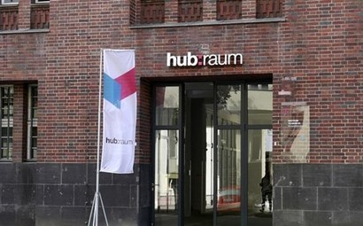
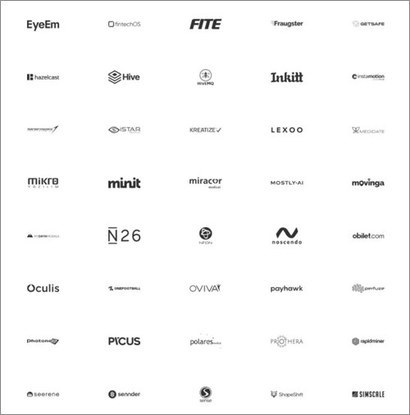

+++
title = "Berlin Startup Ecosystem ②"
date = "2022-03-22T10:00:00+09:00"
description = "Coworking spaces, coaching, mentoring programs, and investment—all accessible in Berlin"
tags = ["Startup", "Berlin", "Investment", "Germany", "VC"]
categories = ["Column"]
author = "Eunseo Yi"
image = "cover.jpg"
+++

## Coworking spaces, coaching, mentoring programs, and investment—all accessible in Berlin
*Cover photo source = Hubraum website*

Beyond affordable living costs, an international atmosphere, and strong government support, the reason Berlin has become a paradise for startups is its vibrant investment ecosystem. Here, we introduce the major institutions providing coworking spaces, coaching, and mentoring, as well as the investment opportunities that provide the capital essential for a startup's growth.

## Diverse Hubs Providing Coworking Space and Accelerating

In addition to the previously mentioned Factory Berlin and Finleap's H:32, where fintech startups gather, Berlin has a variety of spaces that serve as both coworking hubs and accelerators.

First, 'Hubraum', a tech-based startup incubator operated by Deutsche Telekom, Germany's largest telecommunications company, <u>connects early-stage startups in 5G, AI, and IoT with leading European telecom companies.</u> Only startups selected through a rigorous application process can move in. Those selected enjoy free coworking space and access to Deutsche Telekom's various programs and networking opportunities. South Korean startups Nota and ImmersiveCast have also gone through the Hubraum program. Hubraum opened in Berlin and Krakow, Poland, in 2012 to become a European startup hub.

*Hubraum Berlin Campus. Hubraum opened in Berlin and Krakow, Poland, in 2012 to become a European startup hub. Photo = Hubraum website*

Another interesting place is <b>'Silicon Allee'</b>. <u>What started in 2011 as a monthly meetup for startups has now grown into a 7,500㎡ startup campus in the Mitte district, the center of Berlin.</u> The transition from a meetup to a physical space has its history. Three founders with startup experience in Silicon Valley started the meetup to build a similar community in Berlin. They first started with an English blog sharing news about the startup ecosystem. Soon after, they participated in building Factory Berlin's space and designed their own space in 2017.

Silicon Allee is very friendly toward foreign founders. This is because it started as a group to help international founders who struggled to find information in German. The Berlin Founder Fund, started by Silicon Allee in 2019, provides 2,000 euros (approx. 2.7 million KRW) per month for two years to founders with great ideas, with no strings attached. Foreign founders can get help with visa support and even short-term apartment rentals through Silicon Allee. All these facilities and infrastructure are within the Silicon Allee space. Networking with the Berlin tech cluster is also an attractive element of Silicon Allee.

*Silicon Allee's penthouse, which can host various meetings. Foreign founders can get help with visa support and even short-term apartment rentals. Photo = Silicon Allee website*

World-famous companies are also participating in these startup hubs. Microsoft operates startup accelerating programs in six cities worldwide, including Berlin. Microsoft Accelerator Berlin started in 2013 as a four-month immersive program. It features mentoring, technical training, and opportunities for investor connections and collaboration with Microsoft.

## More than 50% of German Venture Capital is Concentrated in Berlin

In Germany, 58% of all venture capital (VC) investment is concentrated in Berlin. In 2020, the scale of VC investment in Berlin startups reached 3.1 billion euros (approx. 4.2 trillion KRW). Startups in the mobility sector received the most investment, followed by software, e-commerce, and healthcare.

One of the most active VCs in Berlin is <b>'Early Bird Venture Capital'</b>. With offices in Berlin, Munich, and Istanbul, it is one of the leading venture firms covering all of Europe, focusing on early-stage investments from seed to Series B. Currently, Early Bird manages assets worth 1 billion euros (approx. 1.3 trillion KRW) and conducted 34 investments over the past year despite the pandemic. Notable portfolio companies include the digital bank N26 and the task management app Wunderlist, which was acquired by Microsoft.

*The portfolio of 'Early Bird Venture Capital'. Notable companies include the digital bank N26 and the task management app Wunderlist, which was acquired by Microsoft. Photo = Early Bird website screenshot*

Next is <b>'Project A', which focuses on investments from the founding stage to Series A</b> for startups in Berlin and London. They primarily invest in startups with ideas for digital innovation, such as the mobile stock trading app Trade Republic and the electric scooter sharing company Voi.

'Rocket Internet', the major shareholder of Delivery Hero (which acquired Korea's Baedal Minjok), is also a renowned VC in Berlin. They focus on growing and investing in startups developing technology in the grocery, fashion, and daily necessities sectors. Besides Delivery Hero, they have invested in the meal kit company HelloFresh. It is a global VC investing in startups across five continents.

Berlin is a city of clubs, parties, and protests. Throughout the year, festivals, conferences, summits, and exhibitions across various fields are held without pause. It is a place where people gather frequently to discuss and socialize over beer and wine. While the heat seemed to cool due to the pandemic, it has now turned into a competition among startups aiming to showcase their presence in <b>'online, digital, and virtual' spaces.</b> Thanks to technical and cultural advancements, an environment has been created where one can sufficiently observe the activities of European startups from their own living room, transcending time and space.

This also means that ideas born in Seoul now have the opportunity to be introduced in Berlin in no time. Now that the constraints of time and space have been overcome, what other innovations will emerge? Observing the success of European startups, expectations for Korean startups also grow.

**Eunseo Yi**  
eunseo.yi@123factory.de

*This article is an edited and adapted version of the "European Startup Chronicles" series in BizHankook.*
