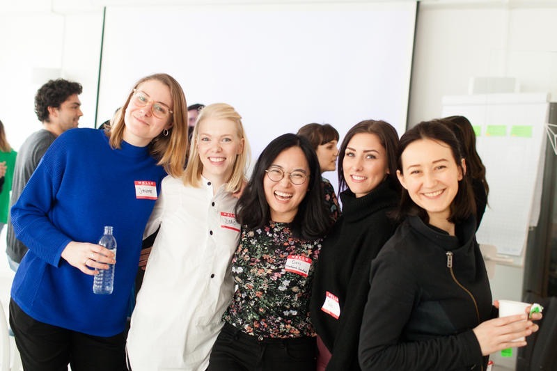
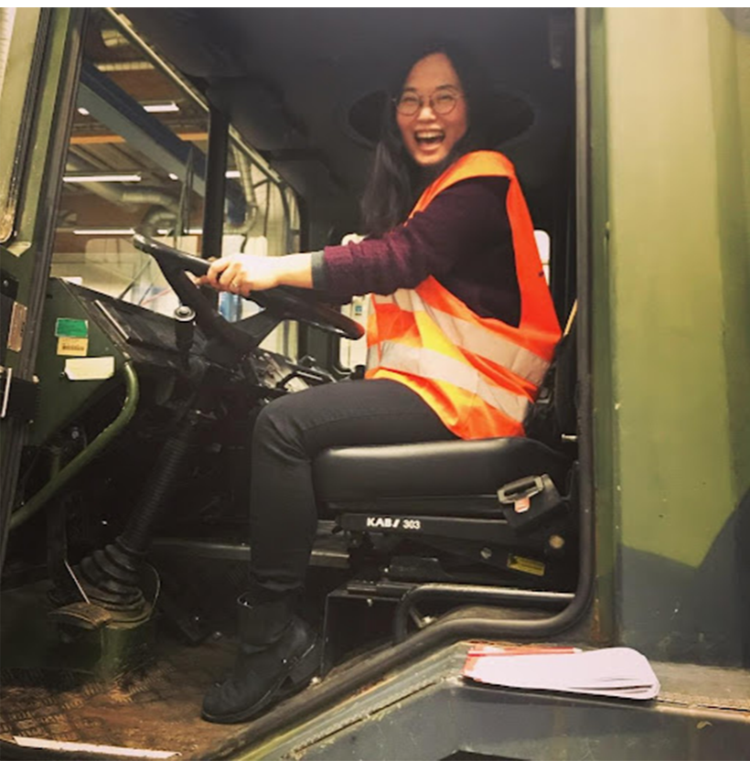
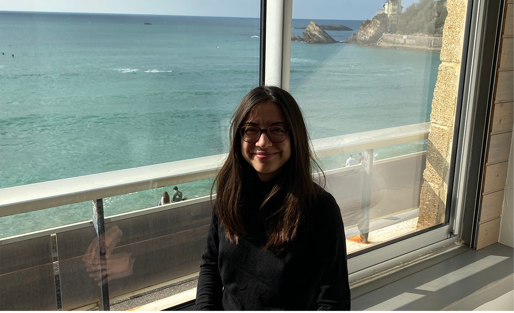
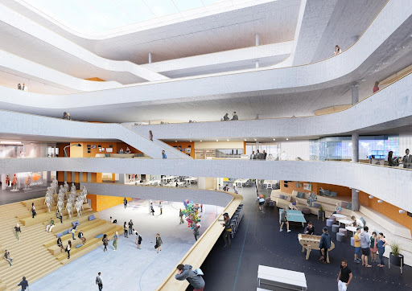
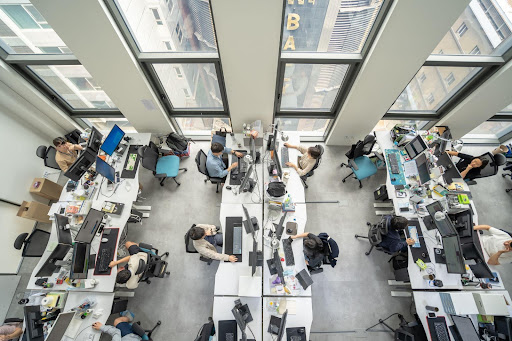
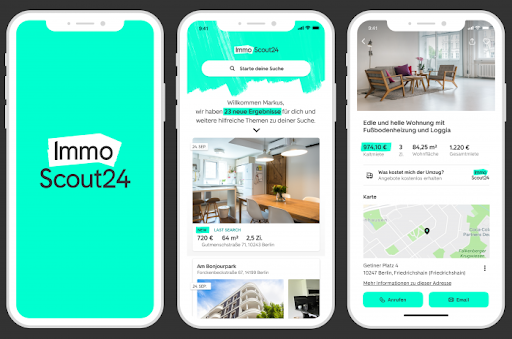
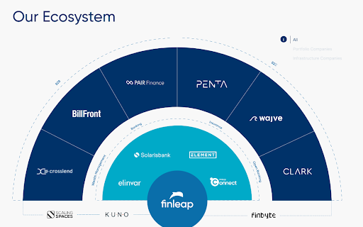

+++
title = "[Interview] Ich arbeite in der Berliner Tech-Szene. (1)"
date = "2022-09-24T08:52:48+09:00"
description = "Die UX-Designer und Manager Yang Hyo-na, An Se-ri und Clementin Jin-hee"
tags = ["Interview", "UX", "Berlin", "Startup", "Europa"]
categories = ["Interview"]
author = "123 Factory"
image = "cover.jpg"
+++

<b>Beim Blick in die Berliner Startup-Szene fällt etwas Interessantes auf. Der Punkt ist, dass jedes bekannte Startup immer Koreaner hat. </b>In Deutschland gibt es in kleinen und großen Unternehmen vergleichsweise mehr Möglichkeiten für Menschen, die in einem deutschsprachigen Land studiert haben, über entsprechende Fachkenntnisse verfügen oder perfekt Deutsch sprechen. Allerdings ist die Sprachbarriere im Deutschen selbst ziemlich hoch und die Geschäftskultur im deutschen Kulturraum unterscheidet sich deutlich von der Koreas, sodass es für normale Koreaner Hürden gibt, einen Job in normalen deutschen Unternehmen zu bekommen.

<b> Allerdings ist die Hürde für Startups relativ niedrig. </b>A Wie im vorherigen Artikel erläutert, ist Berlin eine sehr globale Stadt und die meisten Startups in Berlin zielen auf Europa und die Welt außerhalb Deutschlands ab, daher ist <b>Englisch oft die offizielle Sprache. </b> Darüber hinaus ist die Einstellung von Menschen mit unterschiedlichem Hintergrund ein notwendiger Bestandteil, um als Startup gute Ergebnisse zu erzielen, um Produkte für globale Benutzer zu entwickeln. <b>Einsbesondere bei Entwicklern ist die Tür zur Anstellung relativ weit, da die Qualifikation das wichtigste Einstellungskriterium ist.</b>

Wenn Sie einem Startup, für das Sie sich interessieren, über LinkedIn, dem größten SNS der globalen Geschäftswelt, folgen, können Sie sich auch auf einen Blick die dort arbeitenden Mitarbeiter ansehen. Und Sie können sich mit ihnen vernetzen, wenn Sie möchten. Sie können Informationen erhalten, indem Sie Personen aus ähnlichen Bereichen kontaktieren, und wenn Sie Glück haben, erhalten Sie möglicherweise sogar die Möglichkeit, ein einfaches Zoom-Meeting abzuhalten.

Das Besondere an LinkedIn ist, dass Sie die Geschwindigkeit und Richtung des Wachstums anhand von Stellenausschreibungen von wachsenden Startups in Echtzeit abschätzen können. Mit anderen Worten: Wenn man sich anschaut, wie viele Leute ein Startup einstellt und welchen Personenkreis es anstellt, kann man seinen Investitionsstatus und seine Geschäftsausrichtung bis zu einem gewissen Grad verstehen. Sie können auch sehen, wie Koreaner in der europäischen Startup-Branche aktiv sind.

Dieses Mal haben wir drei koreanische Frauen getroffen und interviewt, die in der deutschen Startup-Szene aktiv sind.

## <b>InterviewEinleitung</b>

<b>Yang Hyo-na</b>

> Er absolvierte die Abteilung für Spieledesign der Hongik-Universität in Korea, absolvierte ein Praktikum in der globalen Designabteilung von Naver, arbeitete als Marketingdesigner bei IBM und zog dann nach Kopenhagen, Dänemark, wo er den Interaction Design-Kurs am Copenhagen Institute of Interaction Design (CIID) abschloss.
>
> Nach seiner Tätigkeit als UX-Designer in Berlin arbeitete er bei der Designagentur Icon Mobile Group ([iconmobile group](https://www.icongroup.com/)) und dem Fintech-Company-Builder [핀립(Finleap)](https://finleap.com/) und arbeitet derzeit als leitender UX-Designer bei [이모스카웃(ImmoScout24)](https://www.immobilienscout24.de/), Deutschlands größter Immobilienplattform.
>
> *LinkedIn ([https://www.linkedin.com/in/hyeona/](https://www.linkedin.com/in/hyeona/))

<b>Clémontin Jinhee</b>

> Er wuchs als französisch-koreanischer Mischling auf, verbrachte seine Kindheit in Korea, schloss sein Studium an der Universität Sorbonne Nouvelle in Paris, Frankreich, ab und begann seine Karriere als UX-Forscher bei LG Electronics France in Paris.
>
> Danach habe ich zum ersten Mal einen Fuß nach Berlin gesetzt, als ich als UX-Designer bei der iconmobile-Gruppe in Berlin gearbeitet habe. Derzeit arbeite ich als Hauptproduktdesigner bei [잘란도](https://en.zalando.de/), Europas größtem Mode-E-Commerce-Unternehmen.
>
> *LinkedIn ([https://www.linkedin.com/in/clementinejinhee/](https://www.linkedin.com/in/clementinejinhee/))

<b>Anseri </b>

> Nach seinem Abschluss an der Abteilung für Industriedesign der Keimyung-Universität schloss er sein Masterstudium in Transportdesign am Umeå Institute of Design (UID) in Schweden ab, das dafür bekannt ist, viele erstklassige Designtalente hervorzubringen.
>
> Danach kam ich nach Berlin, um bei icon incar unter der iconmobile-Gruppe am UX/UI-Design für die Automobilindustrie zu arbeiten, und arbeitete später an verschiedenen automobilbezogenen Projekten, darunter einem Automobil-OEM-Strategieberatungsprojekt, im McKinsey Digital Lab in Berlin. Nachdem er über fünf Jahre als leitender UX-Designer bei Daimler Fleet Board Innovation und Daimler Trucks gearbeitet hatte, arbeitete er in der Innovationsabteilung eines großen deutschen Unternehmens und startete kürzlich eine neue Karriere als General Manager bei [노타(Nota AI)](https://nota.ai/en/index.php), einem in Korea ansässigen Berliner Startup.
>
> *LinkedIn ([https://www.linkedin.com/in/seri-saekyoung-an/](https://www.linkedin.com/in/seri-saekyoung-an/))

<b><u>I freue mich sehr, jemanden aus Korea kennenzulernen, der bei einem der führenden Unternehmen Berlins arbeitet. Ich bin gespannt, warum Sie nach Berlin gekommen sind, um dort zu arbeiten, und Ihren bisherigen Werdegang.</u></b>

<b>
</b>

<b>Yang Hyo-na (im Folgenden „Hyo“ genannt)</b>: Nach Abschluss meines Studiums in Korea kam ich als Praktikant zu Naver. Damals dachte ich darüber nach, im Ausland zu studieren, also rieten mir alle meine aktiven Senioren, „im Ausland zu studieren“. <b> In Korea stehen Designer oft unter großem Stress, was auf lange Sicht gesehen gut ist. </b>

Später, im Jahr 2008, als es noch kein UX/UI-Konzept gab, arbeitete ich für kurze Zeit bei IBM Korea. Zu dieser Zeit lernte ich durch IBM etwas über Allgegenwärtigkeit, Interaktion und Service-Design und interessierte mich natürlich dafür. <b> Ich wollte in einem verwandten Bereich im Ausland studieren, fand aber, dass die USA zu teuer waren, und wandte mich daher an Europa. </b>

*ImmoScout24, Deutschlands größte Immobilienplattform, bei der Yang Hyo-na als Lead UX Designer tätig ist.*

Wenn man sich an einer bekannten Designschule in Europa bewirbt, ist der nächste Schritt ein Online-Interview, aber ich wollte die Schule persönlich besuchen und sehen, wie es ist. Aber ich hatte zu diesem Zeitpunkt kein Geld, also kontaktierte ich direkt die Zulassungsstelle der Schule und bat um Hilfe, und ich konnte dort bleiben, wo die Schüler wohnten. Es war eine wertvolle Gelegenheit, eine Unterkunft und Informationen über die Schule zu erhalten.

Letztendlich habe ich mich für die Schule in Kopenhagen entschieden. Da es mitten in der Stadt lag, herrschte für Nordeuropa eine dynamische Atmosphäre, und mir gefiel die Tatsache, dass es in Dänemark viele Kooperationen mit berühmten Unternehmen wie LEGO.</b> gab

<b> Ein weiterer Vorteil war, dass es viele Menschen unterschiedlicher Rassen und mit unterschiedlichen Erfahrungen gab. </b> Ich habe als Team mit Freunden mit unterschiedlichen Erfahrungen gearbeitet, etwa Ingenieuren, Filmregisseuren und Forschern, und die Schule hat ein Umfeld geschaffen, in dem kreative Ergebnisse erzielt werden konnten.

Nach meinem Schulabschluss empfahlen mir meine dänischen Freunde Berlin. Damals war Berlin eine arme, aber sexy Stadt, eine Stadt, die von jungen Europäern geliebt und bewundert wurde, und ich kam mit so reinem Herzen nach Berlin. Als ich kam, erlebte ich einen großen Kulturschock. Nachdem ich im sauberen Kopenhagen gelebt hatte, sah ich Berlin, das relativ schmutzig war und viele Punks hatte.

<b>Anseri (im Folgenden „Se“ genannt)</b>: Nach Abschluss meines Bachelor-Studiums habe ich mich an Graduiertenschulen umgesehen, um mich eingehender mit Automobildesign zu befassen. Ich hatte auch eine vage Vorstellung davon, dass ich an einem geräumigeren und flexibleren Ort eine globale Denkweise entwickeln wollte. <b>AAls ich nach einer Schule suchte, an der ich ohne die Belastung durch Studiengebühren Automobile studieren konnte und die eine qualitativ hochwertige Ausbildung bot, beschränkte ich meine Optionen auf Deutschland oder Schweden. </b>

*Anseri während ihrer Zeit als leitende UX-Designerin bei Daimler Trucks ⓒ Anseri*

Letztendlich machte ich meinen Master an einer Universität in Umeå, einer kleinen Stadt im Norden Schwedens. Umeå ist eine Stadt mit einer wirklich kleinen Bevölkerung, aber an ihren Universitäten gibt es Studenten aus so vielen verschiedenen Ländern, dass man eine Weltkarte zeichnen könnte. Es sind Freunde, die sich wie ich wegen der Schule an diesem kleinen Ort versammelt haben. Dadurch halten meine Freunde immer zusammen und der Zusammenhalt zwischen Senioren und Junioren ist sehr gut. Ganz gleich, wo auf der Welt Sie hingehen, Sie werden Absolventen und Absolventen der Schule haben, und ganz gleich, für welches Unternehmen Sie arbeiten, aus Umeå zu kommen hat den Vorteil, die Kraft dieses Netzwerks spüren zu können.

Ich habe hier Automobildesign studiert, aber als ich zur Schule ging, wurde mir klar, dass das nichts für mich war. Doch auch wenn es nicht um das Autodesign selbst ging, wuchs mein Interesse am Designprozess und -ansatz sowie an den verschiedenen Dingen, die mit Design möglich sind. Deshalb belegte ich viele Kurse in der Abteilung für Interaktionsdesign und präsentierte nach meinem Abschluss meine Abschlussarbeit zu einem Thema, das Automobildesign und Interaktionsdesign miteinander verband.

Als ich mein Graduiertenstudium abschloss und über meinen beruflichen Weg nachdachte, traf ich einen Freund aus der Schule, der bereits berufstätig war, und erzählte ihm von meinen Bedenken. Er empfahl mich und sagte, dass sein Unternehmen Arbeiten mache, die genau an der Schnittstelle dieser beiden Punkte seien. Zum Glück erhielt ich gleich am nächsten Tag eine Interviewanfrage, also vereinbarte ich einen Termin und verließ das erste Interview gleich mit einem Handschlag des Interviewers. So habe ich meinen ersten Job in Berlin begonnen.

<b>Jinhee Clemontin (im Folgenden „Cl“ genannt)</b>: Mein Vater ist Franzose und meine Mutter Koreanerin, ich bin also seit meiner Jugend zwischen zwei Kulturen aufgewachsen. Ich bin in Seoul geboren und habe meine Kindheit in Korea verbracht, daher denke ich, dass ich die koreanische Kultur gut verstehe. Als ich in Seoul eine französische Schule besuchte, aß ich mittags französisches Essen mit Vorspeisen, Hauptgerichten und Desserts und abends Kimchi und warmen Reis, den meine Großmutter zu Hause zubereitet hatte. Wenn mich jemand fragt, ob ich Koreaner oder Franzose bin, antworte ich mit 100 % und 50 %.

*Clementin Jinhee, die bei Zalando arbeitet, einem Berliner Mode-E-Commerce-Unternehmen ⓒ Clementin Jinhee*

Ich habe in Paris studiert und nach meinem Abschluss etwa vier Jahre lang in der europäischen Forschungs- und Entwicklungsabteilung der Mobilfunkabteilung von LG Electronics in Paris gearbeitet. Da ich mich für Computer und IT interessierte, wollte ich natürlich einen Job mit Bezug zu Forschung und Entwicklung, und ich denke, dass fließende Koreanisch- und Französischkenntnisse mir einen Vorteil beim Einstieg in das Unternehmen verschafften. Im Jahr 2007, bevor Smartphones allgemein verfügbar wurden, begann ich als Koordinator zu arbeiten und arbeitete an der Verifizierung von Software für Mobiltelefone im Zeitalter der Feature-Phones.

Anschließend habe ich mithilfe von UX-Forschung Tests zur Benutzererfahrung von Mobiltelefonen durchgeführt und in der Praxis Erfahrungen in der UX-Forschung und dem mobilen Interaktionsdesign gesammelt. Damals war der Begriff UX noch sehr unbekannt und es gab noch nicht so viele verwandte Berufe wie heute. Ich dachte darüber nach, den Job zu wechseln, um meine Karriere in diesem Bereich voranzutreiben, aber ein Freund erzählte mir, dass eine Berliner Designagentur jemanden mit Erfahrung in mobilen Projekten suche, der kein Deutscher, aber mit internationalem Profil sei, also habe ich mich beworben. Es hat gut geklappt und das war der Beginn meines ersten Lebens in Berlin. <b>I konnte kein Deutsch, daher hätte ich nie gedacht, dass ich nach Deutschland kommen und arbeiten könnte.</b>

<b><u>In welchem ​​Unternehmen arbeiten Sie derzeit?</u></b>

<b>Club: </b>I arbeitet derzeit bei <b>ZAlando</b>, einem Mode-E-Commerce-Unternehmen. Zalando ist ein Startup, das 2008 als Online-Schuhverkäufer begann und sich mittlerweile zu einer Modeplattform entwickelt hat, auf der Sie über 2.000 Modemarken in über 18 europäischen Märkten einkaufen können. Vor Kurzem haben wir eine strategische Partnerschaft mit der Kosmetikplattform Sephora von Louis Vuitton Moët Hennessy unterzeichnet, die es Ihnen ermöglicht, hochwertige Schönheitsprodukte zu kaufen. Es ist eine Organisation, die weiter wächst.

*Im Hauptsitz des Berliner Mode-E-Commerce-Unternehmens Zalando © zalando*

Ich bin 2016 dem mobilen Produktentwicklungsteam von Zalando beigetreten und war für das UX-Design der wichtigsten mobilen App von Zalando verantwortlich. Während ich bei LG und Icon Mobile arbeitete, war „mobil“ weiterhin ein wichtiges Schlüsselwort in meiner Karriere. Wenn man die UX der Zalando-App im Jahr 2015 mit der aktuellen App vergleicht, gibt es viele Verbesserungen. Es war eine meiner persönlich stolzen Karriereerfahrungen, da es sich um eine Leistung handelte, die ich gemeinsam mit meinen Teammitgliedern, bestehend aus Produktmanagern, Ingenieuren und Designern, während des Projekts erreicht habe. Basierend auf dem neuen Design haben wir Spaß an der Arbeit und führen gleichzeitig zu weiteren UX-Verbesserungen und Geschäftswachstum.

<b> Se: </b>Ich bin <b> </b>Derzeit arbeite ich als General Manager bei <b> </b>, einem Startup in Berlin. Nota ist ein KI-Startup mit Hauptsitz in Korea und Niederlassungen in Europa. Nota hat die Beta-Version seiner repräsentativen Plattform „NetsPresso“ auf Basis der KI-Optimierungsquellentechnologie auf den Markt gebracht und verfügt darauf basierend über eine Reihe optimierter KI-Lösungen wie intelligente Transportsysteme, gesichtserkennungsbasierte Zugangsauthentifizierung und Fahrerüberwachung mit geringem Stromverbrauch in Fahrzeugen. Im vergangenen Jahr sind wir mit der Gründung einer Gesellschaft in Berlin in den europäischen Markt eingestiegen.

*Nota, ein KI-Startup in Berlin ©Nota*

Bisher habe ich als UX-Designer, Designer digitaler Produkte, Benutzerforscher und strategischer Designer gearbeitet, aber durch Nota nehme ich eine neue Herausforderung an, indem ich zum ersten Mal die Rolle der Leitung des europäischen Konzerns übernehme, anstatt selbst Designer zu sein.

<b>Hyo: </b>I arbeitet als Lead UX Designer bei ImmoScout24, einer deutschen Online-Immobilienplattform. Ich unterstütze derzeit ein Team von etwa 13 Designern. Ich arbeite also nicht nur als Designer, sondern übernehme auch viel Managementarbeit.

*App von Immo Scout 24, Deutschlands größter Online-Immobilienplattform ©Immo Scout 24*

<b><u>Es scheint, dass die Arbeit als Designer und die Verwaltung von Arbeiten sehr unterschiedlich sind. Welche Unterschiede gibt es in Ihrer Arbeit? Jeder leitet jetzt ein Team oder ein Unternehmen, und ich denke, er leistet im Grunde mehr als das, was ein Designer tut.</u></b>

<b>Se: </b>Zuallererst <b>Eines der Führungsprinzipien von Nota ist „Customer Centric“. </b> Ich glaube, dass wir uns nur weiterentwickeln können, wenn wir erkennen, dass die Standards, die das Unternehmen für wichtig hält, bei unseren Kunden liegen und kundenzentriert denken. Ich konnte starten, weil die Denkweise und Werte, die ich als UX-Designer hatte, gut zur Geschäftspolitik von Nota passten.

<b>Es wird oft gesagt, dass die Rolle des Designs darin besteht, </b><b>„Probleme zu lösen“.</b> Wenn Sie sich beispielsweise ein Teammitglied eines Unternehmens als Benutzer vorstellen, kann das Lösen von Problemen, die sich aus der Umgebung, dem Arbeitsprozess usw. ergeben, mit denen er oder sie konfrontiert ist, auch als Design angesehen werden. Ich denke, dass es sich nicht viel von der Arbeit unterscheidet, die ich zuvor gemacht habe. Auch der Designmanager passte hervorragend zu mir. Meine Aufgabe bestand darin, ein Umfeld zu schaffen, in dem ich zum Wachstum anderer beitragen und sie befähigen konnte, ihre Fähigkeiten zu maximieren. Ich denke, das Gebiet hat sich etwas erweitert.

Eine andere Sache, die ich bisher oft gemacht habe, ist <b> „Punkte verbinden“ </b>. Seine Aufgabe besteht darin, Abteilungen mit Abteilungen zu verbinden und andere Aufgaben zu verbinden. Wenn Zusammenarbeit und Kommunikation nicht gut funktionieren, liegt ein Richtungskonflikt vor, der letztlich zu Unbehagen beim Kunden führt.

Deshalb müssen wir den Kunden stets in den Mittelpunkt stellen und gut gestalten, damit er sich nicht belästigt fühlt. Dies ist jedoch in Organisationen mit geringer Designreife kein einfacher Prozess. Dies liegt daran, dass der Entscheidungsträger nicht der Designer ist.

<b>I stellte sich vor, wie es wäre, wenn der Entscheidungsträger im Unternehmen ein Designer wäre. </b><b>Wenn Sie sich Geschäftserfolgsfälle ansehen, handelt es sich um Fälle, in denen Unternehmen mit hoher Designreife benutzerzentrierte Produkte und Dienstleistungen entwickelt und bereitgestellt haben. Während ich diese Rolle als Designleiter gespielt habe, möchte ich bei Nota die Herausforderung annehmen, die europäische Niederlassung erfolgreich mit Fokus auf Kunden und Mitarbeiter zu führen. </b>

<b>Cle: Ich denke, die Aufgabe eines Designers besteht darin, Erlebnisse zu entwerfen. </b> Letztendlich sind es die Menschen, die das Produkt nutzen, und die Aufgabe des Designers besteht darin, den Menschen eine gute Erfahrung mit dem Produkt zu ermöglichen. Selbst wenn ein Produkt von einem technologiebasierten Unternehmen entwickelt wird, sind es letztendlich Menschen, die es nutzen. Ich denke, die Mission des Designers besteht darin, Probleme zu definieren und zu lösen und eine gute UX zu liefern.

Um dies zu erreichen, ist es sehr wichtig, dass detaillierte Fachleute wie Produktdesigner, Benutzerforscher, Branding-Designer, UX-Autoren, Produktmanager und Ingenieure, die eine Kombination aus UX/UI sind, zusammenkommen und eng zusammenarbeiten. Zu den Aufgaben eines Chefdesigners gehört es, aktiv dafür zu sorgen, dass eine solche Zusammenarbeit gut verläuft. Es ist auch meine tägliche Arbeit.

Und als Direktor wurde ich oft damit beauftragt, Leute bei Projekten zu leiten, die die langfristige Ausrichtung des Unternehmens für die nächsten zwei bis drei Jahre festlegten. Es handelt sich um ein strategisches Visionsprojekt, bei dem nicht nur UX, sondern auch die Richtung der Geschäftsentwicklung berücksichtigt wird. Der Hauptdesigner mag eine etwas ungewohnte Position einnehmen, aber es handelt sich um eine Rolle, die als nächsthöhere Position gegenüber dem leitenden Designer angesehen werden kann und einen erheblichen Einfluss auf das gesamte (ganzheitliche) Erlebnis und die Vision des Produkts haben kann.

<b>Hyo:</b> <b>Ich mache derzeit mehr Teammanagementarbeit als Designarbeit selbst.</b>Ich denke, es wäre leicht zu erklären, dass es meine Aufgabe ist, eine Umgebung zu schaffen, in der Designer ihre Arbeit bequem und gut erledigen können. Meine Hauptaufgabe besteht also darin, den Führungskräften aktuelle Probleme vorzustellen.

Am Anfang war es für mich als Designer am wichtigsten, die strategische Vision des Projekts aufzuzeigen und zu visualisieren. Die Aufgabe bestand darin, die Richtung zu ermitteln, die das Produkt in zwei Jahren einschlagen würde, Probleme durch einen Design-Thinking-Prozess zu identifizieren und einen Prototypen für eine Lösung zu erstellen, um die Vision darzustellen.

Das habe ich am meisten bei meinem ersten Job beim Fintech-Company-Builder „Finleap“ gelernt. Finlip ist ein Company-Builder, der Startups dabei hilft, Unternehmen zu gründen und Investitionen zu erhalten. Dadurch konnte ich wertvolle Erfahrungen sammeln, indem ich als Designer an den Projekten vieler Startups mitwirkte, die über Finlip liefen.

Während meiner Finlip-Zeit habe ich alles genutzt, was ich an der Designschule gelernt habe. Forschungsdesigner, Geschäftsentwickler, Betriebsleiter, Rechtsexperten usw. schließen sich dem Produktteam an und erhalten eine Aufgabe. Die Idee besteht darin, nach Unternehmen zu suchen, die in einem bestimmten Bereich voraussichtlich erfolgreich sein werden.

*Von Finleap mitgegründete deutsche Fintech-Startups © finleap*

Die Projekte, an denen ich damals gearbeitet habe, waren die frühen Arbeiten für die Startups „Clark“ und „Element“, die heute Versicherungs-Einhörner sind. Ich wusste nichts über Versicherungen, aber während ich dieses Projekt übernahm, suchte ich nach Problemen mit der aktuellen Versicherung und erstellte auf der Grundlage dieser Probleme einen Geschäftsplan.

Meine damalige Erfahrung als Ausländer in Berlin war sehr hilfreich und ich sah den Mangel an ausländerfreundlichen Versicherungen in Deutschland als Geschäftsmöglichkeit. Ich war also für ein Projekt verantwortlich, das darauf abzielte, eine Art Startup zu entwerfen. Ich habe Benutzerrecherchen durchgeführt, auf dieser Grundlage ein Pitching bei Investoren durchgeführt und verschiedene Prozesse erlebt.

Anschließend arbeitete ich am Rebranding bei Emo Scout 24 und leistete viel Arbeit, um den Prozess der Produkterstellung zu strukturieren. Obwohl meine Berufsbezeichnung Designerin ist, denke ich, dass es einfacher wäre, sich das so vorzustellen, als würde ich tatsächlich daran arbeiten, Strategien zu entwickeln, um sicherzustellen, dass Produkte herauskommen und sich gut verkaufen.

<b><u>Alle drei Personen haben unterschiedliche Geschichten. Obwohl sie alle derzeit in Berlin leben, kamen einige von ihnen hierher, nachdem sie für ausländische Unternehmen in Korea gearbeitet hatten, einige kamen aus Frankreich, um bei großen koreanischen Unternehmen zu arbeiten, und einige begannen für ihr erstes Unternehmen in Berlin zu arbeiten. Wie unterscheiden sich koreanische und europäische Unternehmen in Bezug auf das Arbeitsumfeld?</u></b>

<b><u>
</u></b>
<b>cl: Das Gute an Startups und Unternehmen in der europäischen Tech-Szene ist, dass sie diskriminierende Faktoren wie Rasse, Bildung, Alter oder Geschlecht so weit wie möglich aus dem Einstellungsprozess eliminieren. Dies dient dazu, geeignete Talente zu gewinnen, die ohne Voreingenommenheit während des Einstellungsauswahlprozesses zur Kultur und Position der Organisation passen.

<b>Das zweite ist, dass wir uns konsequent um eine faire Vergütung der Arbeitsleistung bemühen.</b> Bei Zalando gibt es ein Leistungsvergütungssystem, das die Ergebnisse der geleisteten Arbeit bewertet. Einmal im Jahr erhalte ich Feedback von Teammitgliedern, die eng mit mir zusammengearbeitet haben, und die zusammengefassten Inhalte gehen an den Vorstand, um möglichst objektiv zu bewerten und zu entscheiden, ob ich eine Gehaltserhöhung oder eine Beförderung benötige. Über die Gehaltsverhandlung muss man sich keine allzu großen Gedanken machen, und darüber entscheiden auch nicht die subjektiven Gedanken meines Chefs. Ich verstehe, dass immer mehr Technologieunternehmen auf dieses faire System für das Talentmanagement umsteigen.

<b>Hyo:</b> Es gab viele schwierige Zeiten in Korea. Ich habe kurze Zeit in einer Designagentur gearbeitet und die Erfahrung gemacht, plötzlich mit einem ungeplanten Projekt beauftragt zu werden und sogar über Nacht eine Präsentation ohne Designprozess erstellen zu lassen, nur um das Projekt dann abzubrechen, als der Geschäftsführer kam, es sich ansah und „Nein“ sagte.

Senioren, die im Designbereich tätig waren, hatten im Vergleich zu der Zeit, die sie schon im Unternehmen arbeiteten, nicht das Gefühl, mit einer Vision zu arbeiten. Ich erinnere mich auch daran, dass viele Leute darüber sprachen, wie schwierig es bei der Arbeit sei und ob wir ein Hähnchenrestaurant eröffnen sollten, wenn wir aufgeben würden. Im Vergleich dazu gab es damals bei IBM viele Unterschiede, vielleicht weil es ein ausländisches Unternehmen war. <b>Zuallererst herrschte eine Kultur des frühen Verlassens der Arbeit und die Kommunikationsstruktur war sehr ausgeglichen. Beruflich gab es viel zu lernen und obwohl ich noch keine Erfahrung hatte und jung war, hatte ich die Möglichkeit, vielfältige Aufgaben kennenzulernen. </b>

<b>Außerdem ist die Arbeit der Manager im Vergleich zu koreanischen Unternehmen sehr unterschiedlich. </b>In Korea ist es meist der Chef oder Manager, der von oben Anweisungen gibt, in Deutschland hingegen übernimmt der Manager meist die Rolle des Unterstützers und Unterstützers der Teammitglieder. Beispielsweise hält ein Manager alle ein bis zwei Wochen ein 1:1-Meeting mit allen Teammitgliedern ab, bei dem der Teamleiter die Teammitglieder normalerweise fragt, welche Probleme sie haben und ob er ihnen helfen kann. Es ist die Aufgabe des Managers, dies als Hausaufgabe zu betrachten und den Teammitgliedern zu helfen. Deshalb gelten Manager, die die Probleme der Teammitglieder lösen, als gute Manager.

Dank Finlip hatte ich jedoch die Gelegenheit, die Illusion zu durchbrechen, dass „nicht alle europäischen Unternehmen eine Work-Life-Balance haben“. Während der vier Jahre, in denen ich bei Finlip gearbeitet habe, habe ich sieben bis acht Unternehmen gegründet. Ich habe wie verrückt gearbeitet. Wir mussten die Projektergebnisse innerhalb eines Monats liefern und das MVP musste innerhalb weiterer drei Monate herauskommen. Wenn die Ergebnisse nicht gut waren, mussten wir das Projekt sofort abschließen, einen Pivot-Prozess durchlaufen und ein neues Produkt entwickeln. Die Arbeit hat mir Spaß gemacht, aber ich habe wirklich hart gearbeitet.

Nachdem ich jedoch eine Familie gegründet und Kinder bekommen hatte, verspürte ich das Bedürfnis, zu einem Unternehmen zu wechseln, das stabiler war und es mir ermöglichte, ein Familienleben aufrechtzuerhalten. Nachdem ich einige Recherchen durchgeführt hatte, wechselte ich schließlich mit einer besseren Work-Life-Balance zu meinem jetzigen Unternehmen.

<b><u>A Wie Sie sagten, denke ich, dass „die Work-Life-Balance in europäischen Unternehmen perfekt gewährleistet sein wird“ eine Illusion sein könnte, die viele Koreaner hegen. Würden Sie in diesem Zusammenhang von einem anderen europäischen Unternehmen träumen?</u></b>

<b>Hyo: Auch in Deutschland gibt es das Problem der Berufsunterbrechung von Frauen. </b>Die Leute denken vage: „Europa wird gleichberechtigter“, doch viele deutsche Frauen erleben Karriereunterbrechungen aufgrund der Kindererziehung oder Geburt. <b>Allerdings gibt es solidere Sozialsysteme und Gesetze als in Korea.</b><b></b><b> </b>Es gibt ein Sozialversicherungssystem, das es Ihnen ermöglicht, nach der Geburt 12 Monate lang mit staatlichen Zuschüssen auszuruhen. Darüber hinaus müssen Sie nicht 40 Stunden pro Woche arbeiten, sondern können je nach Situation auch nur 20 bis 30 Stunden arbeiten. Es gibt auch gesetzliche Regelungen, die es verbieten, Mitarbeiter zu entlassen, die nach der Entbindung zurückkehren.

Allerdings sind Menschen, die weniger arbeiten, Menschen, die viel arbeiten, zwangsläufig an Erfahrung und Leistung unterlegen. Es ist natürlich, dass sich Ihre Karriere verzögert, wenn Ihr Einfluss in einem Unternehmen abnimmt. Wenn ein Kind krank ist, muss man sich von der Arbeit freinehmen, und dann gibt es einige Dinge, die natürlich ausgeschlossen sind. Strukturell ist es zwar so, dass es eine Atmosphäre gibt, in der Kinder sich ausruhen können, wenn sie krank sind und niemand etwas darüber sagt, aber wenn man sich nicht völlig in die Arbeit vertieft, wird die Stimme irgendwann still.

<b> Se:</b> Es ist wirklich viel besser als Korea, aber trotzdem haben berufstätige Mütter überall mit Schwierigkeiten zu kämpfen. Hier gibt es in der ersten Zeit nach der Geburt eines Kindes Schwierigkeiten. <b>Also habe ich mich gefragt, wie ich als „berufstätige Mutter“ zwei Fliegen mit einer Klappe (Kinderbetreuung und Arbeit) schlagen könnte, aber mit der Zeit stellte sich heraus, dass es drei Fliegen mit einer Klappe waren (Kinderbetreuung, Arbeit und Karriere).</b> <b>Arbeit und Karriere sind völlig unterschiedlich.</b> <b>In Europa gibt es für berufstätige Mütter möglicherweise keine Karriereunterbrechung. Weil es soziale Sicherheit bietet. Aber es wird zwangsläufig Brüche in Ihrer Karriere geben. </b>

Wie wir allgemein wissen, scheinen europäische Länder mit gutem Wohlergehen über die Sorgen einer Berufsunterbrechung berufstätiger Mütter hinaus auch über gleiche berufliche Aufstiegschancen besorgt zu sein. Obwohl das Problem der Berufsunterbrechung aufgrund des robusten Sozialsystems einigermaßen gelöst werden konnte, gibt es immer noch Vorurteile gegenüber der gesellschaftlichen Stellung von Frauen, und als Mittel zur Lösung dieses Problems wird das Quotensystem eingeführt.

<b>Hyo:</b> Die neue CTO unseres Unternehmens ist eine Inderin, und das war eine der aufsehenerregendsten Neuigkeiten der letzten Zeit. Obwohl die Atmosphäre global ist, ist es immer noch selten, dass eine Ausländerin oder eine Frau eine Führungsrolle übernimmt. Mit anderen Worten: Die Realität in Europa ist, dass es immer noch Unterschiede aufgrund von Rasse und Geschlecht geben wird.

<b>Cl: </b>Aber der Unterschied besteht darin, dass wir uns klar darüber im Klaren sind, dass es sich um ein Problem handelt. Bei Zalando beispielsweise halten wir es für problematisch, dass 80 % unserer Führungskräfte Männer sind, und wir bemühen uns bewusst darum, mehr weibliche Führungskräfte auszuwählen.

<b>Se: </b>Manchmal sind nicht alle Kollegen aufgeschlossen. Obwohl Berlin eine Weltstadt ist, stoßen deutsche Unternehmen manchmal auf sprachliche Schwierigkeiten. Heutzutage ist vielen Unternehmen klar, dass Vielfalt und multikulturelle Teammitglieder zu deutlich mehr Kreativität und Leistung führen. Aber es fehlen noch viele Plätze.

<b> (Fortsetzung von Teil 2)</b>

* Dieser Artikel wurde zu <원티드>s [All About Overseas Employment „Europa“] beigetragen.

---

<b>Lee Eun-seo</b>

eunseo.yi@123factory.de<b>
</b>

<b>
</b>
