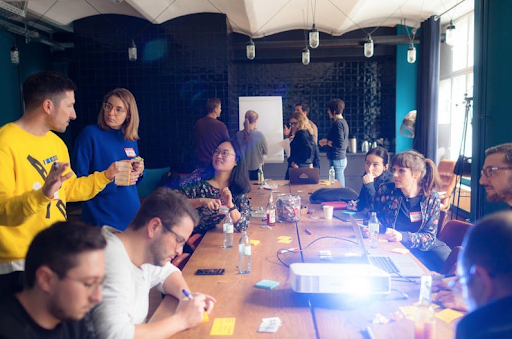
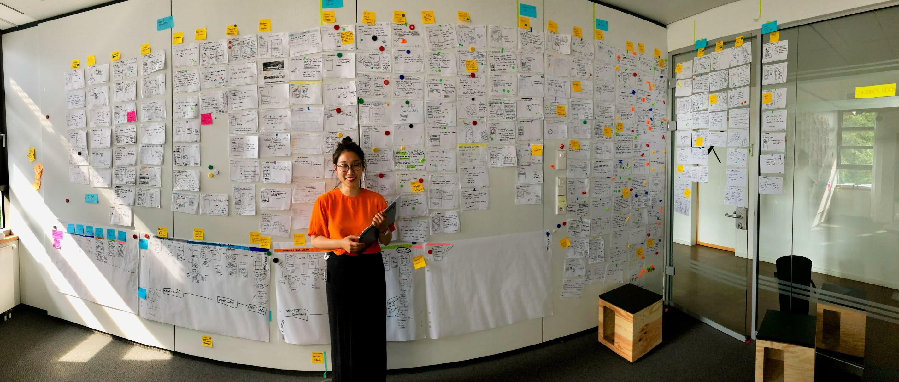
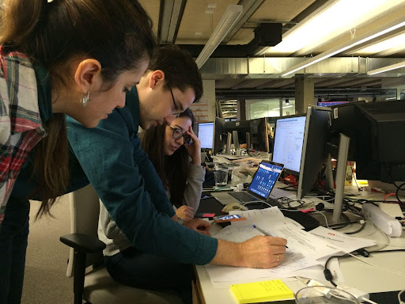
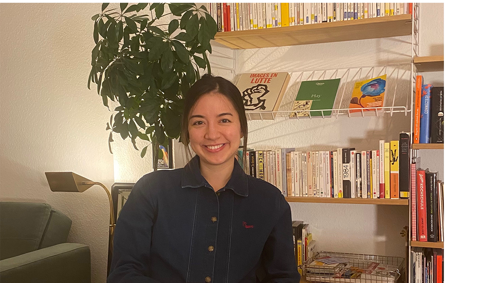

+++
title = "[Interview] Ich arbeite in der Berliner Tech-Szene. (2)"
date = "2022-09-24T14:02:17+09:00"
description = "Die UX-Designer und Manager Yang Hyo-na, An Se-ri und Clementin Jin-hee"
tags = ["Interview", "UX", "Berlin", "Startup", "Europa"]
categories = ["Interview"]
author = "123 Factory"
image = "cover.jpg"
+++

[<b>[Interview] Ich arbeite in der Berliner Tech-Szene. (1) Verknüpfung </b>](../berlin-tech-scene-interview-1/)

---

<b><u>Wir wissen, dass Teile der europäischen Unternehmenskultur illusorischer sind als wir denken, aber gibt es einen Grund, warum Sie dennoch eine Anstellung bei europäischen Unternehmen empfehlen?</u></b>

<b>Yang Hyo-na (im Folgenden „Hyo“ genannt): </b><b>Ich habe das Gefühl, dass das Unternehmenssystem mein Leben stabiler hält als in Korea. </b>Zum Beispiel verfügt unser Unternehmen über ein Diversity-Team, ein Nachhaltigkeitsteam und ein Elternunterstützungsteam. Ich habe das Gefühl, dass das Unternehmen mir hilft, eine gute Work-Life-Balance zu erreichen. Jedes Team verfügt über einen Slack-Kanal, sodass Sie jederzeit kommunizieren und Unterstützung bei Schwierigkeiten erhalten können.

<b>Anseri (im Folgenden „Se“ genannt): </b><b>Der Grund, warum ich auch nach der Geburt eines Kindes in jungen Jahren in Deutschland arbeiten konnte, liegt in der Leistungsfähigkeit dieses Systems. Ich war dankbar, dass es ein Umfeld war, in dem ich die Entwicklung meines Kindes und meiner Karriere miterleben konnte, ohne etwas zu verpassen.</b><b> </b>

Meine Frau und ich haben zusammen insgesamt 14 Monate Elternzeit genommen, genau die Hälfte. Bevor mein Kind in die Schule kam, haben mein Mann und ich einmal nur 30 Stunden am Stück gearbeitet. Dies war möglich, weil ich über ein System verfügte, das ein Umfeld schuf, in dem ich ohne Diskriminierung oder Bedenken arbeiten konnte, und weil ich einen Ehemann hatte, der mit seiner offenen Einstellung eine gute Balance fand. <b>Der Grund, warum ich eine Beschäftigung bei europäischen Unternehmen empfehle, ist, dass ich denke, dass es eine Gelegenheit ist, die Idee zu verwirklichen: „Die Welt ist weit und meine Bühne ist die Welt!“</b>

*Anseri hält ein Seminar mit Kollegen, während er als Designer bei Daimler Trucks arbeitet ⓒ Anseri*

<b><u>I Ich glaube, viele Menschen fragen sich, wie sie im Ausland einen Job bekommen können und wie der Einstellungsprozess abläuft. Ich fände es gut, wenn Sie uns einige nützliche Tipps für die Arbeitssuche in Europa geben könnten. </u></b>

<b>Hyo: </b><b>Als ich von Finlip zu Emo Scout 24 wechselte, war es das Wichtigste, ein Unternehmen mit einem guten Arbeitsumfeld zu finden und gleichzeitig ein Kind großzuziehen. Deshalb habe ich viele Leute um mich herum nach der Unternehmenskultur gefragt. </b>

Wenn ich niemanden kannte, kontaktierte ich ihn über einen Freund eines Freundes unter <b><u>LinkedIn </u></b>. Ich arbeite derzeit <b><u>25 Stunden pro Woche</u></b>. Finden Sie ein Unternehmen, das diese Anforderungen erfüllt, und fragen Sie auf LinkedIn die Personen, die in diesem Unternehmen arbeiten. „Wie ist die Atmosphäre in Ihrem Unternehmen?“ Ich halte es für sehr wichtig, sich aktiv über die Unternehmenskultur zu informieren, die zu einem passt.

<b>Clementin (im Folgenden „Cl“ genannt):</b> Designer werden normalerweise in einem 4-5-stufigen Prozess eingestellt. Beginnend mit dem ersten HR-Screening und Recruiter-Interview gibt es außerdem eine Dokumenten- und Portfolio-Fallstudie, einen Whiteboard-Designtest (eingehender Workshop) und ein Gespräch mit dem Team, um zu sehen, ob die Kultur gut passt. Der Prozess ist viel komplizierter geworden als zuvor.

<b>Der Tipp ist, dass Sie standardmäßig immer ein aktualisiertes Portfolio haben sollten.</b> Es ist besser, es auf eine Portfolio-Plattform wie Behance oder Dribbble hochzuladen, und für Fallstudien ist es wichtig, Keynote oder GoogleSlide zu verwenden, um es ständig mit einem Fokus auf aktuelle Projekte zu aktualisieren. Sie müssen sich anstrengen, Ihr einzigartiges Fachwissen, das sich mit der Erfahrung ansammelt, selbstbewusst zu zeigen und sich weiterhin weiterzuentwickeln.

<b> Se: </b> Beim Dokumenten-Screening prüfen wir, ob die Qualifikationen und Hard-Skills, nach denen das Unternehmen sucht, übereinstimmen, und beim HR-Screening prüfen wir, ob die grundlegenden Soft-Skills und die kulturelle Passung zum Unternehmen passen. Prüfen Sie hier, ob die Gehaltsvorstellung stimmt. Wenn dies nicht stimmt, ist es für beide Seiten zunächst einmal Zeitverschwendung.

Heutzutage heißen <b><u>tech-Personalvermittler </u></b> und Spezialisten in Spezialgebieten nehmen am Einstellungsprozess teil. Um Leute in wichtigen technischen Bereichen einzustellen, braucht man Leute, die in der Lage sind, die Technologie in diesem Bereich zu bewerten.

Und bei <b><u>Active Recruiting</u></b> findet der Personalmanager die Talente, die das Unternehmen benötigt, und unterbreitet direkt ein Scouting-Angebot. Im technischen Bereich prüfen wir in der Regel zunächst, ob die fachlichen Fähigkeiten passen, bewerten die Leistungsfähigkeit dieser Fähigkeiten und filtern dann einmal im HR.

<b>Einer der Tipps, die Sie über die Einstellungskultur in Europa wissen sollten, ist das Empfehlungssystem durch Netzwerke. </b>I glaubt, dass Europa eine Netzwerkgesellschaft ist. Es unterscheidet sich vom koreanischen Konzept der persönlichen Verbindungen und Fallschirme. Auch wenn es sich um eine Einführung oder Empfehlung eines ehemaligen Kollegen oder Bekannten handelt, kann es einflussreich sein. Deshalb sind Empfehlungen, Referenzen und Networking wichtig. Dies kann als das Wichtigste in allen Rekrutierungsprozessen angesehen werden. Vorstellungen und Bewertungen von Menschen, die tatsächlich mit dieser Person zusammengearbeitet haben, haben eine große Wirkung.

Mein erster Job und der Grund, warum ich bei Daimler arbeiten konnte, war eine Empfehlung eines Freundes. Ein Freund von mir fand heraus, dass ich mich sowohl für Automobildesign als auch für Interaktionsdesign interessiere und regelmäßig in diesen Bereichen gearbeitet habe, und teilte mir daher sofort per E-Mail diese Gelegenheit mit.

<b>Hyo:</b> Daher ist es normalerweise von grundlegender Bedeutung, in einen Lebenslauf Informationen über Schul- und Berufserfahrung zu schreiben. Die meisten Deutschen legen immer ein Empfehlungs- oder Referenzschreiben eines früheren Arbeitgebers bei.

<b> Se: </b><b>Deshalb gebe ich den Leuten, die hier arbeiten, diesen Tipp, sich keine Feinde zu machen, wenn sie ihren Job kündigen.</b><b></b><b> </b>Denn wenn diese Person in der Vergangenheit bei einem bestimmten Unternehmen gearbeitet hat, überprüfen wir bedingungslos den Ruf dieser Person durch Personen, die mit LinkedIn verbunden sind. „Wie ging es ihm?“ Dabei führt der Einstellungspartner vor dem Vorstellungsgespräch auch eine Vorrecherche durch. Sie müssen gute Beziehungen zu Ihren derzeitigen Kollegen aufbauen und denken, dass sie in Zukunft Ihre wichtigen Verbindungen sein werden.

<b><u>Wir alle drei haben Erfahrung in verschiedenen europäischen Unternehmen, darunter Startups und Großkonzerne. Was sind die Vor- und Nachteile der Arbeit in einem Startup?</u></b>

<b>Hyo: </b><b>Startups haben normalerweise keinen festgelegten Prozess, daher ist es ein großer Vorteil, meinen Prozess einfach anwenden zu können. </b>Der Nachteil besteht darin, dass wir gerade erst anfangen und es nicht viele Benutzer gibt, sodass es sehr schwierig ist, unsere Hypothese zu beweisen.

Mit anderen Worten: Tests sind notwendig, um ein gutes Produkt herzustellen, aber es ist für Startups sehr schwierig, Benutzer für die Tests zu finden. Da große Unternehmen also über einen großen Einblick verfügen, wird es zwangsläufig große Unterschiede in der Informationskraft bei der Formulierung von Strategien geben. In Startups ist es sehr mühsam, eine einzige Erkenntnis zu gewinnen, und manchmal bleibt einem nichts anderes übrig, als sich auf seine Intuition zu verlassen.

<b>Cl: </b> Zalando begann ursprünglich als Startup, das Sommersandalen auf einer Online-Seite verkaufte. Die Geschäftsidee wurde schnell weiterentwickelt, indem durch Tests überprüft wurde, ob Käufer online kamen, um Sandalen zu bestellen, und ob ein Bedarf für den Online-Einkauf bestand oder nicht, und indem Erkenntnisse gesammelt wurden.

<b>In dieser Hinsicht denke ich, dass der Vorteil eines Startups in seiner Fähigkeit zur Umsetzung liegt.</b> Das Team ist kleiner als das eines großen Unternehmens, sodass Produktentwicklung und -verbesserung schnell erreicht werden können. Außerdem denke ich, dass ich viel lerne, weil ich den Wachstumsprozess eines Startups Schritt für Schritt miterleben kann. Sie können den gesamten Prozess, wie ein Produkt entwickelt wird, wie es auf dem Markt bekannt ist, wie es Benutzer sichert und wie es skaliert, aus nächster Nähe verfolgen. Der Nachteil besteht jedoch darin, dass es sich um eine instabile Umgebung handelt, da es plötzlich auftauchen und wieder verschwinden kann.

<b>SE</b>: In meinem Fall bin ich zu Nota gekommen, nachdem ich sowohl die Vor- als auch die Nachteile eines Startups und eines großen Unternehmens abgewogen hatte. Erstens war die Tatsache, dass es sich um ein koreanisches Startup handelte, das versuchte, sein Geschäft auf den europäischen Markt auszuweiten, attraktiv, und obwohl es ein koreanisches Unternehmen war, herrschte eine junge und freie Unternehmensatmosphäre, die globalen Standards entsprach, und war dennoch dynamisch, was Koreas Stärke ausmacht. Während meiner Arbeit in einem großen deutschen Unternehmen habe ich diese Dynamik oft vermisst.

Und da die Technologie dieses Startups selbst erstklassig ist, war es für mich ein großer Vorteil, schnell Veränderungen und Wachstum erleben zu können. Das Potenzial dieses Startups gab mir den Geist der Herausforderung.

Basierend auf dem Integrationsprozess und den Erfahrungen, die ich bisher in der europäischen Gesellschaft gesammelt habe, war es eine Gelegenheit, den Traum zu verwirklichen, Nota erfolgreich auf dem europäischen Markt einzuführen und zu etablieren und es zu einem führenden Unternehmen der Branche auszubauen. Obwohl es sich im Vergleich zu großen Konzernen um ein kleines Unternehmen handelt, besteht der größte Vorteil eines Startups darin, dass man größere Träume haben kann als alle anderen.

<b><u>Nachdem ich den drei Leuten zugehört habe, denke ich, dass europäische Startups den Koreanern eine Chance geben können, sich neuen Herausforderungen zu stellen. Nun, es muss eine Arbeitskultur geben, die sich von der Koreas unterscheidet. Gibt es Tipps für „So sollten Sie in Europa arbeiten“?</u></b>

<b>Cl:</b> <b>Es ist wichtig zu wissen, wie man seine Gedanken aktiv zum Ausdruck bringt.</b> In Europa, insbesondere in Berlin, Deutschland, muss man mit Teammitgliedern aus verschiedenen Ländern und mit unterschiedlichem kulturellen Hintergrund zusammenarbeiten. Daher ist es wichtig, kulturelle Vielfalt zu verstehen und zu akzeptieren, und auch eine reibungslose Kommunikation innerhalb dieser Vielfalt ist unerlässlich. Und in der täglichen Produktentwicklung müssen Stakeholder mit unterschiedlichen Perspektiven zusammenkommen und zusammenarbeiten. Sie sollten Ihre Gedanken also nicht passiv mitteilen, sondern proaktiv sein, wenn Sie eingreifen müssen, und in der Lage sein, Einwände vorzubringen, wenn Sie ein Problem sehen.

<b>Hyo: </b><b>Ich stimme zu, dass Proaktivität wichtig ist. </b>Wenn Koreanern normalerweise eine Aufgabe gestellt wird, reagieren sie sofort positiv und sagen „Ja, ok“. Aber anstatt das zu tun, ist es besser, mehr Kernfragen zu stellen. Beispielsweise muss es „etwas geben, das Sie überrascht“. Sie sollten in der Lage sein, darüber zu sprechen, welche Probleme und Herausforderungen es mit dem geplanten Geschäft gibt.

*Hyona vor der Ideentafel, wo bei der Arbeit Meinungen ausgetauscht wurden. Kommunikation und Fragen sind bei der Arbeit sehr wichtig. ⓒ Hyona Yang*

<b>Cl: </b><b>Proaktivität ist nicht nur bei der Arbeit wichtig, sondern auch während des Einstellungsprozesses. </b> Während des Vorstellungsgesprächs werden Sie positiv bewertet, wenn Sie viele Fragen zur Unternehmenskultur oder Rolle stellen und Interesse zeigen, anstatt einfach zu sagen: „Alles ist in Ordnung, jeder kann es.“ Je höher Ihre Position, desto sicherer müssen Sie in der Lage sein, das, was Sie durch Ihre eigene Wettbewerbsfähigkeit zum Unternehmen beitragen können, zu verkaufen.

<b>Hyo:</b> <b>Bescheidenheit ist in Korea eine Tugend, aber nicht hier. Passivität ist das Schlimmste. </b>Die meisten Koreaner verfügen über ausgezeichnete Designfähigkeiten und sind schlau, aber sie reden nicht viel darüber, weil sie denken, sie sollten schüchtern oder bescheiden sein. In diesem Fall wäre es meiner Meinung nach eine gute Idee, immer ein kleines Gespräch zu schaffen, das das Eis brechen kann, und es zur Fortsetzung des Gesprächs zu nutzen. Dann fällt das Reden leichter und die Atmosphäre wird sanfter.

<b>Se:</b> Ich denke, es gibt zwei Schlussfolgerungen. <b>An erster Stelle steht die Sprache, an zweiter Stelle die Kultur. </b>Menschen, die zum ersten Mal in ein fremdes Land kommen, scheinen immer Schwierigkeiten zu haben, weil beides schwierig ist.

<b>Cl:</b>. Ich habe oft Fälle gesehen, in denen koreanische Designer, die ich kennengelernt habe, über sehr gute Fähigkeiten verfügen, aber die sprachlichen und ausländischen Arbeitskulturbarrieren nicht überwinden können, sodass sie am Ende nur die Designarbeit erledigen, die ihnen übertragen wird. <b> Nur weil Sie einen Job in Europa bekommen haben, müssen Sie sich nicht mit dieser Rolle zufrieden geben, aber Sie müssen sich ständig bemühen, Barrieren zu überwinden.</b> Wenn Sie diesen Willen nicht haben, tun Sie am Ende das, was andere Ihnen sagen, und es entsteht eine unglückliche Situation, in der die Möglichkeiten, bei wirkungsvoller Arbeit die Führung zu übernehmen, eingeschränkt sind.

<b>Se: </b> Als ich gerade dabei war, meine Abschlussarbeit zu schreiben, bevor ich mein Graduiertenstudium abschloss, sagte einmal ein schwedischer Designer, der uns unterstützte, etwas Ähnliches. Er hatte Erfahrung in der Arbeit mit Koreanern und <b>äußerte sein Bedauern darüber, dass die meisten Koreaner zwar Englisch sprechen, ihre Fähigkeiten jedoch nicht gut genug sind, um jemanden während einer Präsentation zu überzeugen.</b> Tatsächlich muss Design letztlich zu einem Pitch führen, der Storytelling und Überzeugungsarbeit beinhaltet.

<b>Cl: </b> Der Eintritt in ein Unternehmen und die Übernahme einer einflussreichen Rolle ist eine berufliche Herausforderung, mit der jeder mindestens einmal konfrontiert ist. Ich glaube, dass es ein wesentlicher Prozess für die Karriereentwicklung ist, seine Gedanken und Meinungen effektiv zu vermitteln und Menschen zu überzeugen. So werden Sie befördert und Ihr Gehalt steigt. Ich denke auch über meinen nächsten Beruf nach.

<b>Hyo: </b>Aber das gelang mir zunächst auch nicht. Nach 10 Jahren fühle ich mich viel wohler. <b>Also, zu Beginn möchte ich den Menschen, die nach Europa kommen, sagen, dass sie wirklich hart Englisch lernen sollen. </b>Auch wenn Sie einen Job bekommen, gibt es mehr Hindernisse als Sie denken. Wenn ich während der Arbeit kein Tiki-Taka sprechen kann, komme ich nach Hause und denke darüber nach. „Oh, das hätte ich dir damals erzählen sollen!“ Ich trete gegen die Decke. Also besuchte ich damals eine Englischakademie in Deutschland. Wenn Sie jedoch nicht mit den deutschen Einheimischen konkurrieren möchten, würde ich Ihnen raten, zunächst Englisch zu lernen.

<b><u>Bitte geben Sie Menschen, die tatsächlich darüber nachdenken, einen Job zu finden oder nach Europa zu ziehen, realistische Ratschläge.</u></b>

<b>Hyo: </b>I denke, dass das schlechte Wetter ein Nachteil ist, wenn man in Nordeuropa studiert und in Berlin lebt. Deshalb denke ich, dass es für Menschen, die empfindlich auf das Wetter reagieren, eine gute Idee wäre, sorgfältig darüber nachzudenken. Viele Menschen leiden aufgrund des Wetters unter Depressionen.

<b>Cl: </b>I stimme zu. Besonders schwierig ist es im Winter. Es mag trivial erscheinen, ist es aber nicht. Ab Oktober werden die Tage allmählich kürzer und im Dezember beginnt es bereits um 15 Uhr dunkel zu werden. Es ist schwieriger, als wegen des schlechten Wetters die Sonne nicht so oft sehen zu können. Wenn Sie nicht auf sich selbst achten, indem Sie Vitamin D einnehmen oder fleißig nahrhafte Lebensmittel zu sich nehmen, werden Sie schnell müde. Wenn Sie keinen Sport treiben oder keine anderen Hobbys haben, kann der Winter sehr deprimierend und einsam sein.

<b>Hyo: </b>Wenn Sie also eine Person sind, die oft einsam ist, wird es meiner Meinung nach etwas schwierig sein, im Ausland zu leben. Egal wie gut Ihr Arbeitsleben ist, die Dinge außerhalb Ihres Berufslebens können schwieriger sein, als Sie denken. Daher denke ich, dass Menschen geeignet sind, die sich nicht so schnell einsam fühlen, denen es nichts ausmacht, von ihren Familien getrennt zu sein, die die Fähigkeit haben, mit Menschen auszukommen, und die sich schnell anpassen. Deshalb möchte ich Menschen, die darüber nachdenken, einen Job im Ausland zu finden, ehrlich sagen: „Warum wollen Sie ernsthaft ins Ausland gehen?“ Denn es gibt mehr zu verlieren als das, was durch eine Arbeit im Ausland erreicht werden kann.

Wenn ich in die Vergangenheit zurückgekehrt wäre, hätte ich mir wahrscheinlich viel mehr Sorgen gemacht. Denn je länger ich hier lebe, desto mehr vermisse ich meine Familie. <b>Wenn die Familie in Ihrem Leben sehr wichtig ist, würde ich Ihnen nicht empfehlen, ins Ausland zu gehen und dort zu leben. Stattdessen möchte ich sagen: Wenn Ihnen Ihre Karriere und die Vereinbarkeit von Beruf und Privatleben wichtig sind, sollten Sie hierher kommen und Spaß haben. </b>

Aber ich glaube nicht, dass es nur eine vage Fantasie ist. Das liegt daran, dass es so viele Dinge gibt, die so schmerzhaft schwierig sind. Rassendiskriminierung ist zum Beispiel etwas, was man in Korea nicht erleben würde, aber hier geschieht sie implizit. Das Arbeitsleben in Korea ist schwierig, daher möchten Sie vielleicht ins Ausland gehen, aber nach Ihrem Coming-Out kann es noch schwieriger sein.

<b> Se:</b> Wenn Sie das wissen, wird es Ihnen als weitere Information hilfreich sein. <b> Da es mich frustriert hat, als Frau in der koreanischen Gesellschaft zu leben, bin ich eigentlich sehr zufrieden mit dem Leben in Deutschland. </b> Besonders wenn ich hier als Mutter lebe und ein Kind großziehe, verstehe ich, warum dieses Land ein fortgeschrittenes Land genannt wird, und ich habe Respekt davor. Das System für sozial Benachteiligte ist wirklich gut.

Daher denke ich, dass <b> </b> gut zu Menschen passt, die neugierig sind und keine Angst davor haben, Herausforderungen anzunehmen. Ich glaube, dass man sich problemlos einleben kann, wenn man bereit ist, neue Leute kennenzulernen und eine völlig andere Kultur zu akzeptieren.

<b>Cl:</b> Es gibt keine perfekte Gesellschaft. Jeder Mensch hat unterschiedliche Prioritäten im Leben und unterschiedliche Werte, daher kann es klug sein, diese Dinge zu berücksichtigen und sich Herausforderungen zu stellen. Oder manchmal, anstatt zu tief nachzudenken, folgen Sie einfach Ihrem Herzen, vertrauen Sie Ihrem Instinkt und Ihrer Intuition und sagen Sie „Mach es!“ Ich möchte Ihnen raten, es wegzuwerfen. Ich denke, egal welche Wahl Sie treffen, es gibt keine guten oder schlechten Entscheidungen, nur Erfahrung und Lernen.

*Clementin Jinhee mitten in einer Diskussion mit ihren Kollegen bei Zalando ⓒ Clementin Jinhee*

<b><u>I bin neugierig auf die Zukunftspläne und Träume derjenigen, die in Europa arbeiten und als Frauen selbstbewusst leben.</u></b>

<b>Hyo:</b> Der Grund, warum ich zum ersten Mal nach Finlip gegangen bin, war, dass ich etwas über Startups lernen wollte, und es gab auch einen Grund, warum ich selbst ein Startup gründen wollte. Aber bisher habe ich keinen konkreten Bereich oder ein bestimmtes Ziel gefunden, um zu sagen: „Was soll ich mit meinem Projekt machen?“ Da ich Verbindungen zu Korea und Deutschland habe und Erfahrung mit Produkten habe, ist es mein Traum, meine Stärken und Erfahrungen zu verbinden, um in 10 Jahren meine eigene Dienstleistung oder mein eigenes Produkt zu schaffen.

<b>Cl:</b> Ich möchte mehr produktbezogene Arbeit leisten und dabei mein einzigartiges Fachwissen in den Bereichen UX, Produktdesign und Forschung nutzen. Ich wollte schon immer unabhängig werden und freiberuflich arbeiten, anstatt für ein Unternehmen zu arbeiten. Deshalb habe ich vor, mich ab dem nächsten Jahr langsam vorzubereiten. Selbst nach dem 50. Lebensjahr fühlt es sich manchmal etwas frustrierend an, in einer Unternehmensstruktur zu sein. Wenn Sie es ausprobieren, werden Sie wissen, ob eine freiberufliche Tätigkeit das Richtige für Sie ist oder nicht. Ich frage mich, ob ich es jetzt oder wann versuchen sollte.

<b>Se:</b> Mein vorrangiges Ziel ist es, Nota zu einem globalen Unternehmen zu führen, und langfristig ist es mein Traum, zu einer großartigen globalen weiblichen Führungskraft heranzuwachsen.

***

Während des vierstündigen Interviews konnte ich von den drei Personen viele Informationen über die Beschäftigung und das Arbeitsleben in Europa erhalten. Insbesondere war es ein sehr grundlegender und zentraler Inhalt, dass kulturelle Unterschiede und Sprachbarrieren zwischen Korea und Deutschland einen wichtigeren Teil des Arbeitslebens darstellen als erwartet.

<b> Mit anderen Worten, es kommt nicht darauf an, erfolgreich einen Job zu bekommen, sondern vielmehr darüber nachzudenken, „welches Bild dieser Job in meinem gesamten Berufsleben haben wird“ und Ihre Karriere mit einer längeren Perspektive zu planen. </b> Wenn Sie als Ziel „erfolgreiche Anstellung im Ausland“ festlegen, möchten Sie nicht, dass Ihr Leben durch unerwartete Schwierigkeiten erschüttert wird, die nach einer erfolgreichen Anstellung auftreten können.

Das engstirnige Denken, das die Illusion einer „Beschäftigung im Ausland“ ausschließlich auf der Grundlage der Geschichten anderer Menschen erzeugt, dass Korea die „Hölle Joseon“ und Europa das „Paradies“ sei, ist letztlich nicht wahr. Für mich gibt es keinen Nutzen. Ganz gleich, in welchem ​​Umfeld Sie sich befinden: Wenn Sie egozentrisch und proaktiv bei der Lösung Ihrer eigenen Probleme sind, wird sich Ihre Karriere wunderbar entfalten, egal ob in Korea oder Europa.

***

## <b>InterviewEinleitung</b>

<b>Yang Hyo-na</b>

> Er absolvierte die Abteilung für Spieledesign der Hongik-Universität in Korea, absolvierte ein Praktikum in der globalen Designabteilung von Naver, arbeitete als Marketingdesigner bei IBM und zog dann nach Kopenhagen, Dänemark, wo er den Interaction Design-Kurs am Copenhagen Institute of Interaction Design (CIID) abschloss.
>
> Nach seiner Tätigkeit als UX-Designer in Berlin arbeitete er bei der Designagentur Icon Mobile Group ([iconmobile group](https://www.icongroup.com/)) und dem Fintech-Company-Builder [Finleap](https://finleap.com/) und arbeitet derzeit als leitender UX-Designer bei [ImmoScout24](https://www.immobilienscout24.de/), Deutschlands größter Immobilienplattform.
>
> *LinkedIn ([https://www.linkedin.com/in/hyeona/](https://www.linkedin.com/in/hyeona/))

<b>Clémontin Jinhee</b>

> Er wuchs als französisch-koreanischer Mischling auf, verbrachte seine Kindheit in Korea, schloss sein Studium an der Universität Sorbonne Nouvelle in Paris, Frankreich, ab und begann seine Karriere als UX-Forscher bei LG Electronics France in Paris.
>
> Danach habe ich zum ersten Mal einen Fuß nach Berlin gesetzt, als ich als UX-Designer bei der iconmobile-Gruppe in Berlin gearbeitet habe. Derzeit arbeite ich als Hauptproduktdesigner bei [Zalando](https://en.zalando.de/), Europas größtem Mode-E-Commerce-Unternehmen.
>
> *LinkedIn ([https://www.linkedin.com/in/clementinejinhee/](https://www.linkedin.com/in/clementinejinhee/))

<b>Anseri </b>

> Nach seinem Abschluss an der Abteilung für Industriedesign der Keimyung-Universität schloss er sein Masterstudium in Transportdesign am Umeå Institute of Design (UID) in Schweden ab, das dafür bekannt ist, viele erstklassige Designtalente hervorzubringen.
>
> Danach kam ich nach Berlin, um bei icon incar unter der iconmobile-Gruppe am UX/UI-Design für die Automobilindustrie zu arbeiten, und arbeitete später an verschiedenen automobilbezogenen Projekten, darunter einem Automobil-OEM-Strategieberatungsprojekt, im McKinsey Digital Lab in Berlin. Nachdem er über fünf Jahre als leitender UX-Designer bei Daimler Fleet Board Innovation und Daimler Trucks gearbeitet hatte, arbeitete er in der Innovationsabteilung eines großen deutschen Unternehmens und startete kürzlich eine neue Karriere als General Manager bei [Nota AI](https://nota.ai/en/index.php), einem in Korea ansässigen Berliner Startup.
>
> *LinkedIn ([https://www.linkedin.com/in/seri-saekyoung-an/](https://www.linkedin.com/in/seri-saekyoung-an/))

* Dieser Artikel wurde zu Wonteds [All About Overseas Employment „Europa“] beigetragen.

---

<b>Lee Eun-seo</b>

eunseo.yi@123factory.de
