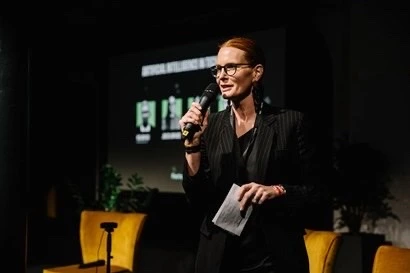
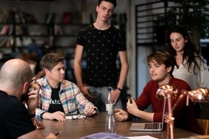
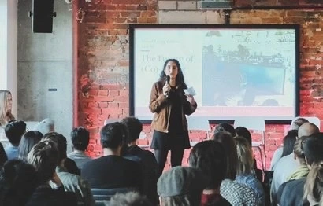

+++
title = "The Networking Experts Who Led Me to Factory Berlin"
date = "2022-03-03T10:00:00+09:00"
description = "Inspiration and the power of networks through Factory Berlin CRO Catherine Bischoff and founder Hana"
tags = ["Startup", "Berlin", "Networking", "Factory Berlin", "Community"]
categories = ["Column"]
author = "Eunseo Yi"
image = "cover.webp"
+++

## Inspiration and the power of networks through Factory Berlin CRO Catherine Bischoff and founder Hana
*Cover photo source = Factory Berlin website*

I moved into Factory Berlin in February 2020. I happened to visit in December 2019 and had the opportunity to hear an explanation from **Catherine Bischoff, Factory's CRO (Chief Relationship Officer)**, who welcomed our visiting team. Catherine had been running an incubating platform in the Canadian startup scene before moving to Berlin due to her connection with Nico Gramenz, the current CEO of Factory Berlin. Together, they now lead Factory.

*Factory Berlin CRO Catherine Bischoff. I applied to Factory Berlin with her as my role model. Photo: Factory Berlin*

## Meeting Catherine Bischoff

At the time, I was quite excited to meet a C-level executive from one of Europe's leading startup accelerators. The meeting was short but very intense. She kindly explained **Factory's comfortable environment, where people can occasionally bring their children or pets to work, and the support programs for female founders within Factory**, using her own situation as an example. I felt that Catherine's dynamism made Factory shine even more. After that, I decided to apply to Factory, thinking, "I want to work in the same space as Catherine. I want to grow as a similar woman."

At the time, I didn't have a specific business idea, but I was contemplating how to make the most of my identity as a Korean. So, my first goal was simply to become a member of a community and meet as many people as possible. Just as I was influenced by "one person" to enter Factory, I wanted to be "one person" who gives and receives influence among many people in this community. However, COVID-19 started right as I moved in.

## Networking Through Matchmaking

It was a bit desperate. All the various events I had dreamed of were canceled, and there were no opportunities to gather and network after events. Looking back, for someone like me who is quite shy during first meetings, the stress of open networking parties would have been significant, so in a way, it was a relief. Instead, Factory held two rounds of online matchmaking events, through which I was able to meet a variety of people.

*Factory Berlin provides various meetings such as 1:1 matching and group matchmaking. Since COVID-19, these have been replaced by online matchmaking. Photo: Factory Berlin*

In the first round, after conducting a survey about "my interests, my business plan, and the types of people I want to meet," I was matched 1:1 with a French female consultant who could mentor me. **For someone like me who wants to connect Korea and Germany**, she, who connects France and Germany, provided realistic advice and support for the possibilities of what I could do.

In the second round, instead of 1:1 matchmaking, we did group matchmaking with four people per group. In my group, I met Shauna, a Canadian software developer; Truls, a Norwegian co-founder of [shift](https://shiftfm.app), a music player and podcast app for exercise; and Hana, a French founder of an event and catering management company.

## Am I the Influencer??

We introduced ourselves in a group Slack chat and talked about what we were interested in, what we could provide, and what kind of meetings we wanted. At first, it felt like an awkward blind date, but interestingly, three out of the four people invited to this room were very interested in Korea, so I unintentionally became the "influencer" of the group. Most people in the tech or developer industry had a very good impression of Korea, seeing it as a "technology-advanced nation," and for those in the culture or event industry, BTS, Blackpink, and Korean food like Kimchi and Bibimbap were already the trendiest things. I soon exchanged private messages with Hana, who was most curious about each other, and met her offline.

## Meeting Another Influencer, Hana

Hana studied in Shanghai, Madrid, and Paris before moving to Berlin to work as a project manager at Uber and Airbnb, eventually founding her own company, [travelogue.co](http://travelogue.co). It's a company that comprehensively plans and manages spaces, food, and programs needed for team events, seminars, and company workshops. They plan programs of various lengths—hourly, daily, or weekly—and create different programs depending on the space, whether using workshop spaces within the company, special event spaces outside, or distant travel destinations. travelogue has a total of six employees, including Hana, a social media/content manager, an event manager, a sales manager, a partnership manager, and a photographer. Since travelogue doesn't prepare everything from space sourcing to catering on its own, **various partnerships are one of the most important elements of Hana's company.**

Because of this, when Hana first came to Berlin to start her business, she participated in at least two, and up to five, meetings a day to meet entrepreneurs and find good catering companies to partner with, and she attended various evening events in Berlin from Monday to Sunday without rest. While preparing for her startup, she counted that she met about 4,000 people in a year, through which she was able to establish partnerships with about 80 catering-related companies. Hana runs a Facebook group called *Berlin Experience Makers*, creating a community for people who plan various events in Berlin. In fact, while I was having tea with her at Factory Berlin, almost everyone who passed by greeted her.

## "Connecting with a Focus on People and Experience"

*Hana, whom I met through Factory Berlin's group matchmaking. She founded travelogue to plan events, seminars, workshops, etc. Photo: travelogue*

travelogue is a business directly related to events and the food industry, so it was hit hard by COVID-19. However, she said that since her focus is not just on "event planning" or "catering" as external things, but on **"what kind of experience to give people,"** she is currently contemplating how to utilize this in the pandemic situation. So, despite the restrictive circumstances, she said her job is still to meet people, especially those of various nationalities and fields, and hear their stories. I shared stories about Koreans in Berlin, their interests, and the Korean restaurant craze in Berlin, and continued my explanation as if I were giving a small "pitch" to Hana about **the keyword I want to focus on: "connection."**

Afterward, while continuing to lead travelogue, Hana opened a separate website suitable for the COVID-19 era. <b>That is, while travelogue focused on "employee experience," she started MINDT (mindt.io), which provides psychological counseling, advice on improving remote work environments, and advice on self-development routines with a group of experts for employees feeling isolated and lacking communication due to remote work during the pandemic. In other words, based on the idea that the growth and happiness of individual employees are directly linked to the company's growth, they provide team coaching to companies and developed a program tailored for the COVID era that can be conducted entirely remotely.</b>

MINDT has secured clients such as WeWork and Rasa, an IT company that builds AI chatbots, and its future growth is also expected. More than anything else, Hana's focus on her core themes of **"people" and "experience"** to continuously develop her business provided me with a big hint.

---

Eunseo Yi eunseo.yi@123factory.de

*This article was edited and adapted from the "European Startup Chronicles" series in BizHankook.*
