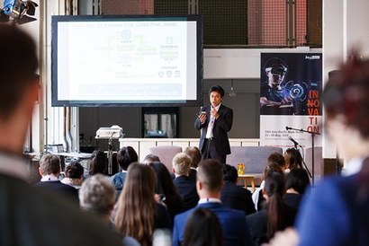
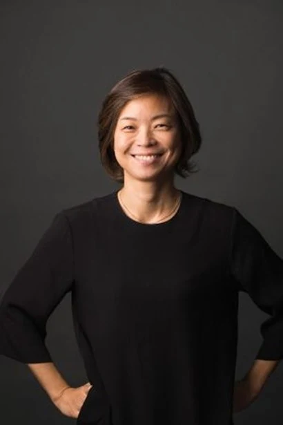

+++
title = "Female Entrepreneurs Connecting Germany and Asia ①"
date = "2022-03-23T10:00:00+09:00"
description = "Clara Min, CEO of Business PowerZone - Founding a Startup Consulting Company"
tags = ["Startup", "Germany", "Europe", "Entrepreneurship", "Consulting"]
categories = ["Column"]
author = "Eunseo Yi"
image = "cover.jpg"
canonicalUrl = "https://brunch.co.kr/@123factory/10"
+++

### Founding a startup consulting company to solve 'human relationship issues' experienced while working at leading global companies

In Berlin, there is a special event held every year. **It is the AsiaBerlin Summit.** It started in 1997 as the Asia-Pacific Weeks Berlin (APW), organized by the City of Berlin. Since then, it has grown significantly through partnerships with cities like Beijing, Jakarta, and Tokyo. Since 2013, it has focused more on the theme of "Startups and Smart Cities," concentrating on business between the City of Berlin and various Asian cities. Recently, it has emphasized connecting the startup ecosystems and investor groups of Asia and Berlin. To this end, various organizations, including the City of Berlin, the German Federal Ministry for Economic Affairs and Energy, various embassies, trade associations, NGOs, universities, and corporations, are collaborating closely.

While the AsiaBerlin Summit is held once a year, it also provides year-round events to visit and interact with startups from each country, as well as various online seminars and networking opportunities since the pandemic. The main participants of the AsiaBerlin Summit are startups and investment institutions from India, China, and Southeast Asia. Surprisingly, Japan's participation is small, and South Korea has almost no presence other than a few individual ambassadors. This is because the Korean startup ecosystem is not yet well-known in Europe. It is also because government agencies such as the Seoul Metropolitan Government, the Korean Embassy, and KOTRA have not actively branded Korea in relation to startups.

*At the 2019 AsiaBerlin Summit. Asia is a special presence in the Berlin startup ecosystem. Photo: asia.berlin*

Seeing various Korean startups and related individuals active throughout Germany, this situation is somewhat regrettable. In major German cities such as Berlin, Hamburg, Frankfurt, and Munich, there are already quite a few Korean startups actively operating. **In addition to startups, there are many people and companies that can play an important role as a 'bridge' in the startup ecosystem, and I recently met three important women connecting South Korea, China, and Japan with Germany. As the first encounter, I introduce Business PowerZone, led by CEO Clara Min.**

### First Korean Senior Director at Adidas Headquarters

<u>Business PowerZone is a startup that helps startups, a startup that consults global companies where 'cultural differences' are very important because talents from all over the world gather to work.</u> It is based in Nuremberg, Germany. The career of Clara Min, who leads Business PowerZone, is eye-catching. She worked at Adidas for 12 years, five of which she served as a Senior Director of Global Sales at the German headquarters. Before that, she built a solid career in product, sales, and strategic planning for domestic and international projects for about 25 years at leading global companies on three continents—including Adidas Korea, Germany's largest e-commerce company OTTO, fashion brand Stefanel, and American Gianni Versace.

**While working at global companies, one of the important topics for CEO Min was understanding the business methods of global business counterparts and learning how to communicate and collaborate.** In particular, setting a vision, establishing strategies, defining roadmaps, and leading "heavy lifting" projects successfully required a strategic and systematic approach, sharp business insight, and a delicate understanding of human relationships.

Business has aspects like a team sport, so you shouldn't give too much autonomy to the people you work with, but if a leader leads the team unilaterally, it can easily lower the morale of team members. Communicating with and persuading leaders of Adidas branches located around the world was CEO Min's main task at the time. To communicate smoothly with them and lead tasks, one of the major challenges was to break down the cultures and habits she had acquired as a Korean woman in Korea. **In particular, it was important to shake off words like 'kindness' and 'passivity' that define Asians, and negative words that define women, and sometimes to actively utilize them.**

*Clara Min, CEO of Business PowerZone in Nuremberg. Both the difficulties she faced as an Asian in a global European company and the pandemic were opportunities for her. Photo: powerzone.io*

This was not just a personal concern. She realized that it is a universal problem that many people encounter while working in a professional setting or leading a team at a startup or corporate headquarters.

When global companies with strong brands and products are active on the world stage, they encounter moments when they must devise business strategies for a new leap forward to maintain their number one position. **For startups that have grown rapidly compared to what they were prepared for, building organizational and systematic systems for continued success is as important as the speed of business development.** Also, communication due to differences in the business environment between the headquarters and overseas branches, whether in a startup or a large corporation, is a major problem.

However, if these differences are understood effectively, they can become important factors that create synergy. Recently, as most companies undergo digitalization, they feel the need for innovation that can be accepted not only by the head but also by the heart, breaking away from traditional methods. In such cases, collaborating between tradition and innovation and making it an organic ecosystem is an essential requirement for a company to succeed.

In fact, all these problems were things CEO Min personally experienced during her work. As a senior director leading the franchise and product business units of the global headquarters, she pondered every day and every hour to solve these. Through continuous study and participation in various workshops, she realized that all problems are human relationship problems and that solutions must be found within them. So, while working at the company, she separately completed an international coaching certification course. She applied what she learned to actual work and solved problems one by one. The process was very thrilling—so much so that she left a global corporation to start a consulting company that plays the role of a 'problem solver.'

### Helping Startups Become Competitive on the Global Stage

When she first thought about starting a business, it wasn't easy to decide. For several months, she carried a resignation letter and kept thinking about when would be the best timing. It wasn't because she hated the company or work was hard; she was receiving the industry's best treatment, so the 'moment of decision' was continuously delayed. However, <u>the difficulties she had experienced while working, the solutions she discovered in the process of solving them, and the inner conviction and belief she gained through them were unstoppable.</u>

In particular, while working at global companies for 25 years, she had a lot of concerns about where to place herself. She always paid attention to this issue while conducting large and small projects. This is not only a personal problem but also a problem faced by Korean startups and SMEs establishing branches in Europe.

Nowadays, there are many global companies in the US and Europe, regardless of whether they are startups, SMEs, or large corporations. In the actual global market, it is difficult to achieve long-term and large-scale success without genuine competitiveness. Since it is no longer an era where success is achieved only with good products or ideas, how companies present themselves on the global stage is very important. Especially for startups, how well they prepare to work organizationally and systematically in the future is the key to success. Corporate overseas business divisions are also shifting their strategies to invest in startups and adopt innovative mindsets and approaches like startups to keep up with this trend. However, in 'monolithic' Korea, it is not easy to have global experience.

The difference between branding as a 'Korean company' and not is bigger than you think. Since the explosive popularity of K-Pop, many things have been branded as 'K-○○.' However, CEO Min says that 'Westernizing' clumsily into a global company when not yet ready is not the only answer. Just like in personal life, she emphasizes that **'when setting a company's strategy, it is important to have a roadmap with strategically placed milestones in the short term, a clear vision in the long term, and an execution strategy that can move the company and the team as an organism.'**

Business PowerZone opened in Germany in August 2020 in the middle of the pandemic. Nevertheless, it has provided coaching and consulting for leading global companies and leaders such as Microsoft, Stabilo, VF Company, and Ableton. It also has partners in the US and Singapore and is seeking various business directions by traveling back and forth to Korea.

CEO Min's consulting method emphasizes developing the client's ability to solve their own problems. Rather than consistently providing technical knowledge and solutions as a third party, it is a 'new generation' consulting method that allows companies and teams to develop their own strength based on what she experienced directly in the field. Since it can utilize virtual spaces using various online tools as well as face-to-face methods, she plans to be a **player connecting Korea and Germany, and Asia and Europe.** Starting a business in the difficult COVID-19 environment provided an optimal opportunity to use such virtual environments freely. Both the difficulties she faced as an Asian in a global European company and the pandemic were, in hindsight, opportunities for her.

---

**Eunseo Yi**
eunseo.yi@123factory.de

*This article was edited and adapted from the "European Startup Chronicles" series in BizHankook.*
