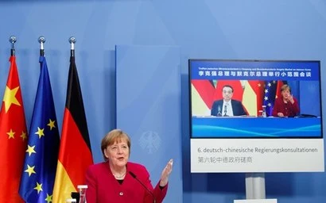
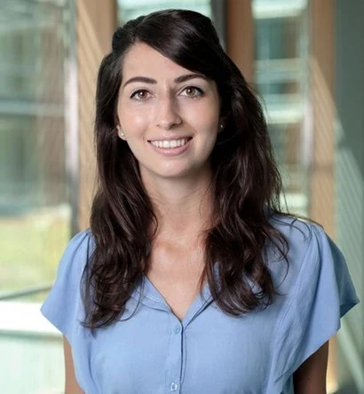
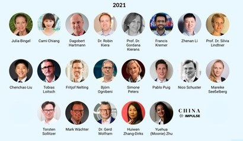

+++
title = "[유럽스타트업열전] 독일-아시아 잇는 여성 창업자 ②"
date = "2022-03-24T09:50:00+09:00"
description = "알렉산드라 슈테파노프 차이나 임펄스 대표 - 중국학 전공 후 디지털화에 주목해 1인 창업"
tags = ["스타트업", "독일", "유럽", "창업", "중국", "컨설팅"]
categories = ["Column"]
author = "이은서"
image = "cover.png"
canonicalUrl = "https://brunch.co.kr/@123factory/11"
+++

## 중국학 전공 후 디지털화에 주목해 1인 창업…관련 전문가 인터뷰 시리즈가 1차 비즈니스 모델
*커버 사진 출처 = 차이나 임펄스 홈페이지*

독일과 중국은 1972년에 수교했다. 이후 정치, 사회, 경제 여러 방면에서 관계가 발전했다. 특히 2020년 중국은 2120억 유로 이상의 무역량을 기록한 독일의 제1 무역 파트너가 되었다. 중국도 독일을 유럽의 핵심 파트너로 본다. 이렇게 긴밀한 관계임에도 중국은 독일에서 다양한 시각으로 평가되고 있다. 정치·사회 문제에 민감한 독일 사회에서는 신장 위구르족 등 소수 민족에 대한 박해, 홍콩 민주주의에 대한 탄압 등으로 중국을 비판적으로 보고, 견제하려는 움직임도 있다.

*2011년부터 독일-중국은 서로를 중요한 파트너로 보고, 협력을 강화하고 있다. 2년마다 열리는 ‘독일-중국 정부 협의’는 지난 4월에 6회를 맞이했다. 사진=독일 정부*

<b>이런 복잡다단한 독일과 중국을 잇는 여성을 만났다. <a href="https://www.china-impulse.de/tech-newsflash/" target="_blank">차이나 임펄스(China Impulse)</a>를 이끄는 알렉산드라 슈테파노프이다.</b>

## 중국, 디지털, 혁신이 사업 키워드

알렉산드라 슈테파노프를 만난 것은 비즈니스 SNS인 링크트인(Linkedin)을 통해서다. 한국과 독일을 연결하는 것에 관심이 있었기 때문에 SNS에 한국어로는 독일과 유럽에 관한 소식을, 독일어로는 한국과 아시아에 관한 소식을 올렸다. 그렇게 하다 보니 자연스럽게 비슷한 태그를 걸어 활동하는 사람들이 피드에 뜨기 시작했고, 나처럼 중국과 독일을 연결하는 알렉산드라를 알게 되었다. 서로의 비슷한 점에 놀라기도 하고 반갑기도 했던 우리는 줌을 통해 바로 만났다. 나는 베를린에, 알렉산드라는 프랑크푸르트에 있다.

알렉산드라는 하이델베르크, 톈진, 상하이에서 중국학 및 트랜스 문화 연구를 전공했다. 2009년 이후 정기적으로 중국을 방문해 다양한 활동을 펼치고 있다. 알렉산드라가 주목한 것은 ‘중국이 독일보다 디지털 트렌드 측면에서는 적어도 5년 이상 앞서 있다는 점’이었다. 그래서 자신의 커리어를 ‘중국, 디지털, 혁신’에 중점을 두어 쌓아나가기 위해 노력했다. 대학 졸업 후 Zizzle에서 중국어 학습 앱을 개발하는 것으로 사회생활을 시작했다. 중국-유럽 일자리 포털 사이트 개발 회사 Sinojobs에서 경력을 쌓았고, 2020년부터는 ‘독일 경제 디지털화 이니셔티브’에서 프로젝트 매니저로 활동하면서 동시에 자신의 브랜드 ‘차이나 임펄스’를 창업했다.

*차이나 임펄스 대표, 알렉산드라 슈테파노프, 사진=china-impulse.de*

## 전문가 인사이트와 네트워킹 제공하고 연결

<b>차이나 임펄스</b>는 2020년 5월 프랑크푸르트에서 ‘1인 스타트업’으로 문을 열었다. 10년이 넘는 동안 중국에 관해 공부하고 중국의 디지털 변화를 관찰하고 기록해왔던 역사가 ‘차이나 임펄스’를 통해 고스란히 재생산되고 있다. <b>차이너 임펄스는 독일에 있는 많은 사람과 기업이 중국을 더 잘 이해하도록 돕는다. 무엇보다 중국의 디지털 발전 속도에서 독일의 기업들이 영감을 받고, 노하우를 전수할 수 있도록 연결고리를 제공하는 플랫폼이다.</b>

<b>주요 콘텐츠로 ‘차이나 임펄스-중국의 복합적인 디지털 세계에 관한 전문가들의 인사이트(China Impulse-Der Experten-Einblick in Chinas komplexe Digitalwelt)’라는 인터뷰 시리즈</b>가 있다. 독일과 중국에 대한 분야별 전문가들을 초청해 인터뷰를 진행하고, 이를 구독자에게 제공하는 것이 1차 비즈니스 모델이다. 인터뷰는 비디오뿐만 아니라 오디오로 제공되기 때문에 구독자가 편한 방식으로 소비할 수 있다.

*차이나 임펄스의 2021년 전문가 인터뷰 시리즈에 참여한 전문가들. 사진=china-impulse.de*

중국은 인터넷 사용자가 9억 4000만 명이고, 특허 출원 건수도 2019년 미국을 추월해 세계 1위가 되었다. 중국 시장에서 통하면 전 세계 시장에서 통하는 것이고, 중국 시장에서의 성장은 세계 시장에서의 성장과 동일한 의미가 되었다. <b>그래서 중국의 혁신에 관한 콘텐츠를 독일에 제공하고, 이 콘텐츠를 생산하기 위해 중국 전문가들과 네트워크를 형성하고 이를 독일의 기업들에 다시 한번 연결하는 것이 차이나 임펄스의 2차 비즈니스 모델이다.</b>

전문가 인사이트 시리즈는 2020년 5월에 시작해 그해에만 총 24명의 전문가 인터뷰를 진행했다. 2021년에도 현재까지 총 21명의 전문가 인터뷰를 했다. 전문가들은 중국학자뿐만 아니라 디지털화, 경영, 컨설팅, PR 및 마케팅, 저널리즘 전문가들과 다양한 스타트업 창업자들도 있다. 중국과 독일의 비즈니스 미디어 & 컨설팅 기업인 HSC(HanseSinoContact & Consulting)의 후위엔 장-디억스 대표, 독일 주요 매체인 쥐드토이체 차이퉁, 한델스 블라트 등의 중국 특파원으로 활동한 저널리스트이자 베스트셀러 작가인 프랑크 지이렌 등이 대표적이다.

이렇게 다양한 네트워킹을 해내고, 그걸 인터뷰와 저술로 풀어내고, 이후 또 다른 비즈니스로 연결하는 것까지 어떻게 ‘1인 기업’으로서 혼자 다 해낼 수 있을까?

알렉산드라는 “창업자는 24시간 이 사업에 몰입해 있다. 만약 월급을 받는 직장인이었다면 힘들었을 것이다. 하지만 ‘내 브랜드를 키워나가는 일’이라는 생각이 지속성을 만들어냈다. <u>네트워킹은 계속되는 비즈니스 기회를 만들어낸다. 그렇기 때문에 깊이 있게 상대를 이해하고 긴밀한 파트너십을 갖는 것이 내 사업의 핵심</u>”이라고 설명했다.

대표적으로 차이나 임펄스는 <u>중국 이커머스 대행사 ZEEVAN</u>과 파트너십을 맺고 있다. ZEEVAN은 유럽의 중소기업들이 원활하게 중국의 온라인 마켓에 진출할 수 있도록 디지털 브랜드 마케팅에서 온라인 플랫폼 진출, 결제에 이르기까지의 서비스를 원스톱으로 제공하는데, 차이나 임펄스는 독일의 중소기업들을 ZEEVAN과 연결해준다.

<u>Roopu Cloud도 차이너 임펄스의 중요한 파트너다</u>. 중국 시장을 개척하고, 모든 과정을 디지털화하기 위해 필요한 것 중 하나는 클라우드 서비스다. 클라우드 서비스는 최적화된 비용으로 짧은 시간에 플랫폼을 선택하고 각종 규제 등에도 대응할 수 있도록 설계된 플랫폼을 제공한다. Roopu Cloud는 AWS 중국, Azure 중국 등 글로벌 기업의 파트너로서 중국 시장에 최적화된 서비스를 제공한다. 차이나 임펄스는 특별히 독일 기업을 Roopu Cloud와 연결해주는 역할을 하고 있다.

작년 5월 창업 이후 지금까지 거의 메일 구독자들에게 뉴스레터를 발송하고, 전문가 인터뷰 시리즈를 기획하면서 비즈ني스의 기회가 계속 늘어갔다고 한다. 코로나19로 오디오와 비디오 콘텐츠에 대한 수요가 높아지면서 이 시리즈에 대한 반응 역시 높아져, 알렉산드라는 요즘 잠시의 짬도 없을 정도로 바쁜 시간을 보내고 있다.

최근에는 독일의 과학 기술 기반 스타트업이 중국을 더 잘 이해하도록 만든 훔볼트 테크 브릿지의 워크숍·멘토링·피칭 복합 프로그램 ‘Bridge to China’에 비즈니스 멘토로 참여하게 됐다. 다양한 기업가들을 만나면서 실질적인 성과를 내기 위해 노력을 쏟아야 하는 시기를 맞았다. “차이나 임펄스를 어떻게 더욱 의미 있는 브랜드로 키울지”가 고민거리라는 알렉산드라의 도전은 앞으로 어떻게 확장될까. 두 나라를 연결하는 것이 하나의 스타트업이 될 수 있다는 큰 깨달음을 준 만남이었다.

---

<b>이은서</b>
eunseo.yi@123factory.de

*본 글은 <비즈한국>의 [유럽스타트업열전]을 편집 및 각색하였습니다.*
