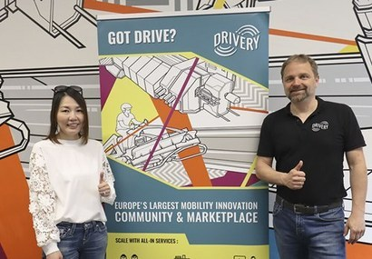
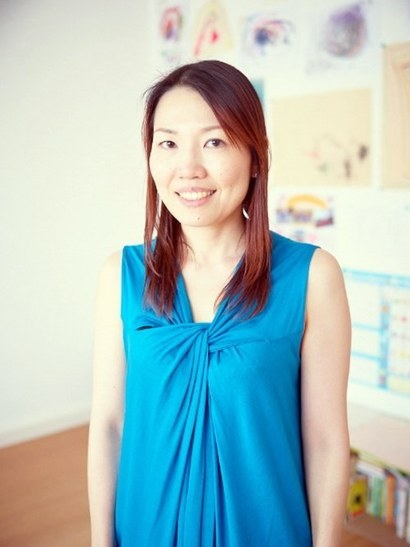
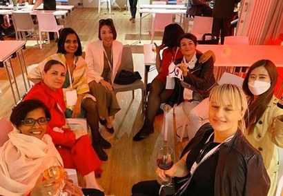

+++
title = "Female Entrepreneurs Connecting Germany and Asia ③"
date = "2022-03-24T09:53:00+09:00"
description = "Chika Yamamoto, CEO of Crossbie - Selecting Japanese and German Startups for Mentoring and Matching… Focusing on Connecting Communities Rather Than Connecting Individual Companies"
tags = ["Startup", "Germany", "Europe", "Entrepreneurship", "Japan", "Consulting"]
categories = ["Column"]
author = "Eunseo Yi"
image = "cover.png"
canonicalUrl = "https://brunch.co.kr/@123factory/12"
+++

## Selecting Japanese and German startups for mentoring and matching… focusing on connecting communities rather than connecting individual companies
*Cover photo source=Crossbie homepage*

Working in Germany, when I see Koreans active in similar fields, I cannot help but feel incredibly glad to meet them. I am curious about many things—what they do, whether they experience similar difficulties in this field, what vision they have for their work, ranging from trivial daily matters to long-term plans. This is not limited to Koreans. If it is an Asian who shares a similar appearance, the intimacy builds up in no time. Interestingly, when talking with Asian friends, I sometimes feel that the conversation flows much better. Even when speaking in English or German, we understand each other's words better than those who speak them as a native language. This is because our modes of expression and cognitive structures are similar. My encounter with Chika Yamamoto was exactly like that.

<u>In Berlin, there is an accelerator and co-working space specializing in mobility startups called <a href="https://www.thedrivery.com/de/" target="_blank">The Drivery</a>.</u> The Drivery has about 700 members, including 130 startups, global conglomerates like Siemens Mobility and Honda, and related researchers. It is one of the most important platforms for future mobility in Berlin. Tier, a shared kickboard startup in Berlin that has now become a 'unicorn,' also originated from The Drivery. I first met Chika at a mobility-related event co-hosted by Hyundai Cradle, an open innovation center that discovers new business models for Hyundai Motor Company, and The Drivery.

*Crossbie collaborates with The Drivery, an accelerator and co-working space in Berlin. Crossbie CEO Chika Yamamoto (left) and The Drivery CEO Tim Ruhoff. Photo=thedrivery.com*

## Connecting Communities to Communities Rather Than 1-on-1 Matching

<b>Chika is the CEO of '<a href="https://crossbie.com/" target="_blank">Crossbie</a>,' a business consulting firm based in Berlin.</b> The name Crossbie is derived from their motto, 'Cross Border Innovation.' As the name suggests, she mainly works on connecting Berlin and Japan, which Chika describes as "building an ecosystem." While running Crossbie, Chika also acts as an angel investor, product creator, business accelerator, and educator in the industry.

Chika graduated from Osaka University of Foreign Studies and worked at JWT, a global advertising agency in Tokyo, before moving to Helsinki to work as a product manager at Nokia. Afterward, she studied at the London Business School and accumulated her career by working in various companies in New York and Berlin. Chika said, "Working in a global environment, I thought most about 'who I am.'"

It sounds like a somewhat philosophical question, but it was more of a period of pondering, "As a Japanese person, what can I do best?" In doing so, going outside Japan actually allowed her to see Japan more clearly, which led to the founding of Crossbie. Experiencing the US and European markets, what Japan does well and what it does poorly became crystal clear. Based on this observation, Chika came to lead <b>startups wishing to enter the European market and connect German companies wishing to enter Japan.</b>

*Chika is the CEO of Crossbie, a business consulting firm based in Berlin, connecting Berlin and Japan. Photo=crossbie.com*

Having experienced both the US and Northern Europe, I asked Chika why she founded her business in Berlin. "I felt that as a woman, there were quite a few disadvantages in life. For example, in high school, I wanted to work as the student body president, but my teacher said, 'It might be a bit difficult because you are a female student.' From that point, I thought a lot about the need to create a different environment. So, since then, I have been very interested in shaping environments."

New York is a similar environment, but it was already open and well-known to everyone. Berlin was different. "It was the optimal condition because it had a startup environment that was not yet well-known in Japan, combined with a culture that embraced inclusivity and diversity," she said.

The first thing she did to connect Japan and Berlin was to find partners with good communities and ecosystems. Since Chika focuses on connecting communities to communities rather than simply matching companies one-on-one, it was crucial to get to know and build relationships with the entire Berlin ecosystem first. That was how she established partnerships with INAM (an applied materials innovation network in Berlin), InfraLab (a consortium of infrastructure providers for transport, heating, and water for Berlin's smart city projects), and The Drivery (a mobility community). Collaborating continuously with these partners, she is striving to create joint projects with various organizations in Japan, ranging from startups and corporations to local governments and research institutions.

<u>Crossbie designs startup acceleration programs jointly with its partner organizations.</u> It also generates revenue by planning and operating startup support programs for the Japanese government. Recently, with the establishment of The Drivery Japan, she collaborated with Berlin's The Drivery to design a two-way acceleration program for mobility startups from Germany and Japan.

This program selects three startups from Japan and three from Germany to receive mentoring and meet investors and business partners in both countries. "Since Berlin actively promotes policies to nurture startups, it will be a great opportunity for Japanese startups, and since Japan is the home of deep tech startups, it will serve as an opportunity for German startups to enter the market and learn about technological capabilities," she expects.

## Business as a Cultural Mediator

Working between Germany and Japan, Chika explains that creating business requires a lot of magic. Especially because they are geographically distant and have vast cultural differences, she stresses that her role as a 'cultural mediator' is of utmost importance. "For example, even when holding a meeting, the styles of Germany and Japan are different. While Germans set the agenda in advance and approach it systematically, Japanese people often say, 'Let's just meet first.' In such cases, communicating well in the middle so that there are no misunderstandings is also my crucial role."

Since most meetings are held remotely, helping build trust between both sides so that they do not feel a sense of distance in the first meeting is the part Chika pays the most attention to. Particularly because English is a significant barrier for Japanese people, providing linguistic comfort is also one of Chika's important roles.

<u>To achieve this, positioning Crossbie within the 'global ecosystem' is also vital.</u> Therefore, Chika actively participates in the Asia Berlin Summit held in Berlin every year. Starting with her first participation in the summit in 2018, she directly planned and hosted Japan-related events at the Asia Berlin Summit in 2019. Since 2020, she has been selected as an official ambassador for the Asia Berlin Summit, acting as a key player representing Japan in Berlin.

In particular, as Japanese startups are highly interested in entering the global market these days, this is a very critical period for Chika. Traditionally, Japanese companies have mostly entered the western region of Germany, centered around Düsseldorf. Shifting the center of gravity of this Japan-Germany relationship to Berlin is one of Chika's most important goals recently. To achieve this, she is pouring the most effort into the 'smart city' sector. While the west shows strength in traditional industrial fields, Berlin is growing its related industries as large-scale projects for building 'smart cities' are underway by conglomerates like Siemens along with the startup boom. Japan is also growing its urban AI solutions and startup ecosystems, centered around the four major cities of Tokyo, Yokohama, Osaka, and Nagoya.

*Chika active as a Japan Ambassador at the Asia Berlin Summit (middle of back row). Photo=asia.berlin*

Looking at Germany and Japan through the lens of community and dreaming of "making this into a single universe," Chika's dream is of an extraordinary scale. How will her universe shape up between Japan and Germany?

---

<b>Eunseo Yi</b>
eunseo.yi@123factory.de

*This article was edited and adapted from the "European Startup Chronicles" series in BizHankook.*
