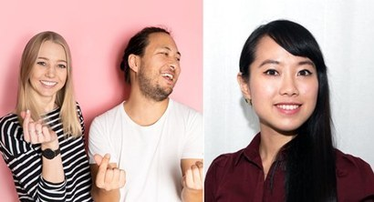
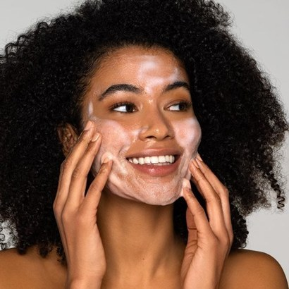
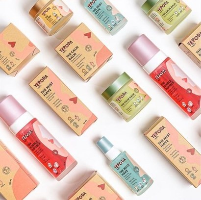

+++
title = "[European Startup Chronicles] German 'K-Beauty' Startup 'Yepoda'"
date = "2022-03-24T09:55:00+09:00"
description = "'Good cosmetics' valuing Korean skincare and sustainability…"
tags = ["Startup", "Germany", "Europe", "Entrepreneurship", "KBeauty", "Cosmetics", "Marketing"]
categories = ["Column"]
author = "Eunseo Yi"
image = "cover.jpeg"
+++

*Cover photo source=Yepoda homepage*

## German cosmetics startup 'Yepoda' competing with 'K-Beauty'… 'Good cosmetics' valuing Korean skincare and sustainability grows rapidly within a year via online and social media

About 4 to 5 years ago, Korean mask sheets and BB creams began appearing in German drugstores. Seeing Korean packaging introduced directly to the German market made it easy to realize the popularity of Korean cosmetics. Nowadays, it is hard not to spot the word ‘Korea’ in department stores, drugstores, and other shops where cosmetics can be purchased. Korean cosmetics or Korean-style skincare products have become that mainstream. This is thanks to the influence of Korean dramas and K-Pop, which have become easily accessible anywhere in the world through new media like Netflix, YouTube, and Instagram.

Indeed, things that once would have taken 3 to 4 years to spread now propagate in real time based on YouTube views. A case in point is the ‘Dalgona Coffee Challenge,’ which started in South Korea during the COVID-19 pandemic and took the world by storm, prompting German supermarkets to immediately hang advertising signs reading ‘Available for Dalgona’ in front of instant coffee sections. It was interesting that they used the Korean word directly without translation, and after several cafés launched ‘Dalgona Coffee’ on their menus, it became confusing whether this was Korea or Germany. Driven by media development, spatial and temporal limitations and gaps are being overcome.

Innovative and fun things spread even faster. Among them, Korean beauty-related products have recently played the most vital role. When mask sheets containing ingredients extracted from nature, such as green tea, snail mucin, rice, and ginseng, were first introduced, the reaction in Germany was that they were ‘traditional yet innovative.’ Basic skincare products infused with traditional Korean herbal ingredients were completely novel products unseen in Europe, and many people went wild for them.

According to 'Cosmetics Europe 2019,' Europe boasts the largest cosmetics market size. The European cosmetics market in 2018 amounted to a total of 78.6 billion euros, with Germany taking the first place in Europe at approximately 17.6%. In other words, if you can capture the German market, spreading across Europe is only a matter of time. A startup has jumped into this market under the banner of ‘K-Beauty.’ <b>I met Sander van Bladel, the founder and CEO of ‘<a href="https://yepoda.de/pages/about" target="_blank">Yepoda</a>,’ and Park Eun-young, the Marketing Lead.</b>

*‘Yepoda’ co-founder Veronika Strotmann, CEO Sander van Bladel, and Marketing Lead Park Eun-young (from left). Photo=yepoda.me*

## I Was Curious About the Secret of Korean Cosmetics My Friends Always Asked For

‘<a href="https://yepoda.de/" target="_blank">Yepoda</a>’ was established in Berlin in February 2020. Sander, the founder and CEO, was born and raised in the Netherlands. Thanks to his Korean mother, he visited Korea frequently, and since his Dutch father also traveled between Europe and Korea doing trade business, he was familiar with Korean culture and industry. As a university student, he had several occasions to visit Korea, and each time, Sander had a recurring experience.

“When I told my friends I was going to Korea, I was always asked to buy some Korean cosmetics. Because I knew nothing about cosmetics, I didn't think much of it at first, but since this was repeated, I became curious. What secret does Korean cosmetics hold?”

Sander studied economics and law at Erasmus University Rotterdam and came to Berlin upon joining the startup incubator ‘Rocket Internet.’ Afterward, while working at an e-commerce startup, he met Veronika Strotmann, and they joined forces to found ‘Yepoda.’ Soon, Park Eun-young, who worked at the same e-commerce company, joined as an early member for a strong start.

<b>When founding the cosmetics startup, the critical aspects were to be rooted in K-Beauty, and that the entire process from cosmetic production to sales be designed based on the value of sustainability.</b> These two were the main pillars. “Korea's beauty industry is far ahead of Germany's. The cost invested in cosmetics R&D in Korea is around 600 million euros annually, so I think it is only natural that innovative products emerge.”

Sander says that once he examined the structure and scale of the Korean cosmetics industry, it became instantly clear why K-Beauty had no choice but to succeed. And he thought the skincare routine Koreans have was culturally novel. Compared to the German skincare culture where applying Nivea cream (the undisputed number one in the German cosmetics industry) after washing the face was the end, <b>the Korean skincare routine, spanning ‘cleansing, washing, toning, essence, moisturizing, and nourishing,’ felt like a form of focus and meditation time for the skin and one's own body, performed in the morning and at night. “It felt like self-care time looking back at oneself from a holistic perspective rather than just for the skin, so I had a strong desire to introduce this ‘cultural’ element to Europe</b>.”

*Sander van Bladel says that the Korean skincare routine felt like a form of focus and meditation time for the skin and one's own body, which sparked a strong desire to introduce this 'cultural' element to Europe. Photo=@yepoda.me*

Thus, when he first resolved to establish a company in January 2019, the very first thing Sander did was product development. To collaborate with laboratories in Korea, he visited Korea several times, bustling about to find partners for a startup starting from ground zero. “This process was the most challenging time in the entire process of founding. <u>Since we focused on ‘sustainability’ as a startup</u>, we wanted to use glass rather than plastic for cosmetic containers and recycled paper for packaging. We also wanted to make the products using only natural ingredients, leaving out all chemical elements. The phrase I heard the most at this time was ‘You are crazy.’”

Nevertheless, Sander did not bend his principles. Producing glass containers carries a risk of breakage and adds weight, making shipping more demanding, but he believed that <u>sustainability is a vital factor in the value of a ‘startup’ rather than simply being a cosmetics sales company</u>. Hence, he rejected all proposals from partners to take the easy path. <b>Production free from animal testing, exclusion of ingredients harmful to both the skin and the planet like silicon, parabens, and microplastics, vegan formulations using no animal-derived ingredients in all products, and shipping conducted in a climate-neutral manner using the DHL GoGreen program</b> were strictly implemented.

Moreover, they established the principle of <b>giving back to society</b> by donating <b>1% of total sales to ‘1% for the Planet.’</b> Meeting with around 20 laboratories for product development, and visiting the manufacturer who agreed with Sander's ideas six times to negotiate production took a full year.

## Corona and Social Media, the Beginning and the Growth

<u>Although Yepoda is a German startup, it adopts K-Beauty as its primary motto.</u> In a way, they placed a bet on the value of ‘Korea.’ Won't this trend fade once the ‘K-Wave’ ends? Sander showed confidence. “There are many industries that have branded their countries, such as Swiss watches and German cars, <u>and if the product quality is excellent, that value persists</u>. I believe Korean cosmetics have also established themselves as a unique brand. Therefore, rather than simply riding a wave of fad, I think we have built a ‘unique’ brand image.”

In fact, while small cosmetics stores founded directly by Koreans are occasionally visible in Germany, their presence is not significant. South Korea's Missha is the only enterprise that has entered Germany with its own brand and owns local stores, but it has not yet expanded into major cities. Thus, Yepoda is truly unique as a company founded directly by a local, using K-Beauty itself as its banner.

*Yepoda uses no chemicals or animal ingredients, nor does it conduct animal testing. Sustainability is prioritized throughout the production and packaging processes. Photo=yepoda.me*

After a year of product development, Yepoda founded the company and launched its first products in April 2020. As was the case for many, the onset of COVID-19 was an obstacle that delayed the start. However, this obstacle also served as a stepping stone. When stores closed and lockdowns began, online shopping usage surged, making Yepoda incredibly busy. In the first 6 months after launching the first product, sales doubled every month. Even now, it is growing steadily at an average of 179% per month.

In Europe, not only traditional powerhouses like L'Oréal and Nivea, but also fashion brands like Esprit, Primark, and H&M have begun launching cosmetics lines. Considering pharmacy cosmetics that minimize or eliminate chemical additives, the European cosmetics market is truly colossal. In addition, startups with diverse business models such as personalized cosmetics and subscription-based cosmetics, including HelloBody, Junglück, and Bellavia, are also going strong.

The sheer status of cosmetics startups can be felt from the massive buzz generated last July when HelloBody—a beauty startup making 100 million euros in annual sales solely through influencer marketing—was acquired by Henkel, a German beauty care and home care giant. With competition in the cosmetics industry so fierce, major corporations are also moving diligently to learn the know-how of startups in order to target both ‘digitalization’ and the ‘younger generation’ simultaneously.

The cosmetics industry is often called the flower of marketing. How does Park Eun-young, Yepoda's Marketing Lead, view this? “In the past, there was a strong tendency to select products from famous companies, but now we live in a world where people get information on new products from those they subscribe to on YouTube and Instagram. <u>Consumers who once hesitated to purchase when unfamiliar, curious products were launched because they didn't know how to use them now obtain product information through social media or new media, and learn skincare methods and cosmetics usage suitable for their skin types.</u> <b>Thus, the trend is to prioritize influencer marketing above all else</b>.”

Hence, wouldn't it be safe to say that the growth of the newly born brand Yepoda and the trend of K-Beauty have only just begun in Europe?

---

<b>Eunseo Yi</b>
eunseo.yi@123factory.de

*This article was edited and adapted from the "European Startup Chronicles" series in BizHankook.*
