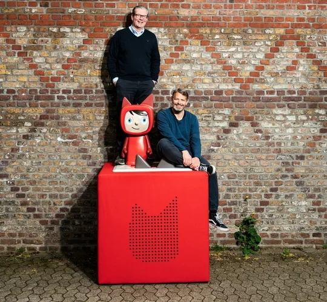
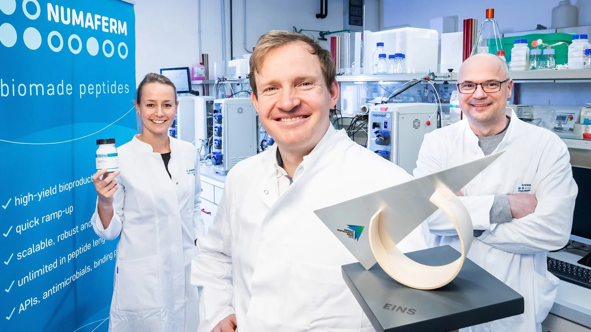
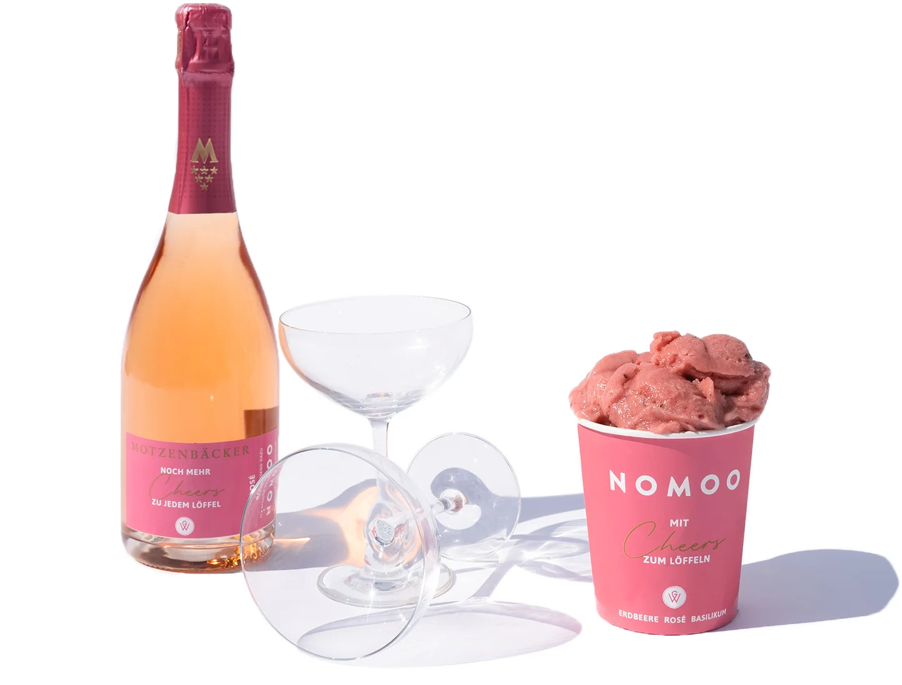
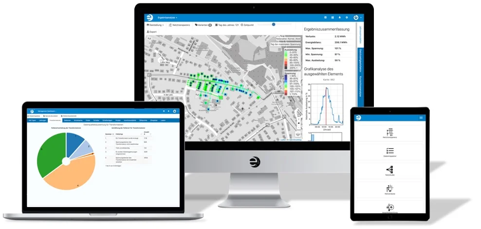
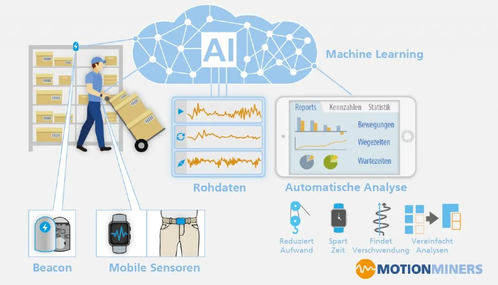

+++
title = "[유럽스타트업열전] 노르트라인베스트팔렌의 핫 스타트업"
date = "2022-04-01T08:57:21+09:00"
description = "아동용 오디오북에서 비건식품, 생명공학, 물류, 스마트그리드 플랫폼까지"
tags = ["독일", "스타트업", "토니박스", "누마펌", "노무", "엔벨리오", "모션마이너즈", "유럽"]
categories = ["Column"]
author = "이은서"
image = "cover.webp"
canonicalUrl = "https://brunch.co.kr/@123factory/22"
+++

## <b>‘토니박스’ 키운 노르트라인베스트팔렌의 핫 스타트업</b>

*커버 사진 출처=디지털 허브 홈페이지*

## 아동용 오디오북에서 비건식품, 생명공학, 물류, 스마트그리드 플랫폼까지

독일 서쪽에 위치한 노르트라인베스트팔렌주(NRW주)는 독일에서 인구 최대 밀집 지역에다 벨기에, 네덜란드 국경과 접해 유럽 타 지역으로 진출이 쉽다. 다양한 산업이 발달할 수 있는 최적의 입지 조건을 가지고 있는 셈이다. 70년대까지는 광업과 철강업의 호황에 힘입어 독일과 유럽 경제에서 중요한 위치를 차지했으며, 그 이후에는 첨단산업과 서비스업 등의 ‘히든챔피언’ 기업을 기반으로 탄탄한 경제력을 유지하고 있다. <b>오늘은 NRW주의 떠오르는 스타트업을 소개한다.</b>

## 어린이용 스마트 오디오북 플레이어 ‘토니박스’

토니박스는 독일에서 아이를 키우는 집에서 심심찮게 볼 수 있는 <b>오디오북 플레이어</b>다. 이야기를 담은 작은 피규어와 상자 모양의 스피커가 한 세트로 피규어를 스피커 위에 올리면 음악이나 이야기가 재생된다. 새로운 피규어를 구매해 이야기나 음악을 바꿀 수 있고, 앱을 통해 새로운 콘텐츠도 다운로드받을 수 있다. 충전하면 7시간가량 무선으로 사용할 수 있어 야외에서 쓸 수 있다.

*토니박스 창업자 파트릭과 마쿠스. 사진=tonies.com*

토니박스를 만든 스타트업은 2016년에 뒤셀도르프에서 문을 연 복신(Boxine GmbH)이다. 두 창업자 파트릭 파스벤다(Patric Faßbender)와 마쿠스 슈탈(Marcus Stahl)은 모두 자녀가 있는 아버지로 광고 대행사와 전자 회사의 평범한 회사원으로 일하다가 아이를 키우면서 스마트 오디오북의 필요성을 느끼고 회사를 창업했다.

토니박스는 출시하자마자 3만 개를 판매하는 등 선풍적인 인기를 끌었다. 2017년 독일 디자인 어워드 수상으로 더 널리 알려지면서 2020년까지 매출 1억 유로를 넘어섰고 토니박스 200만 개, 토니 피규어 2000만 개를 판매했다. 처음에는 독일어 콘텐츠만을 확보해 독일, 오스트리아, 스위스에 다소 제한된 형태로 팔렸으나, 영어 콘텐츠 출시와 동시에 영국, 미국, 아일랜드 등 영어권에 진출해 크게 성장했다. 최근에는 영어 교육에 관심 있는 한국 학부모들에게도 토니박스가 인기를 끌기 시작했다.

## 생명공학 스타트업 ‘누마펌’

<b>누마펌(Numaferm)</b>은 뒤셀도르프에서 가장 성공적인 스타트업 중 하나다. 2017년 뒤셀도르프 하인리히하이네대학 생화학연구소의 스핀오프로 설립된 <u>생명공학 스타트업</u>이다.

*누마펌 연구진. 사진=numaferm.com*

누마펌은 아미노산에서 생성되는 펩타이드를 기존의 10분의 1 정도의 낮은 비용으로 생산할 수 있다. 펩타이드는 ‘단백질 기능을 가진 최소단위’ 물질로 다양한 분야에 활용할 수 있어 물질 자체가 플랫폼 기술에 가깝다. 특히 <b>누마펌은 펩타이드를 원료 의약품으로 사용 시 생산기간을 6~9개월 내로 단축하는 혁신적인 기술을 보유</b>했다. 회사 규모는 작지만 15명 이상의 박사급 연구진을 바탕으로 탄탄한 기술력으로 보유하고 있다. 누마펌의 기술은 백신 접종, 알레르기 치료, 진단, 종양학, 당뇨·비만·심혈관질환 등에서 사용할 수 있을 뿐만 아니라 농업, 양식업, 화장품, 식품 등에도 광범위하게 사용할 수 있어서 그 가능성이 무한하다.

## 비건 아이스크림 제조 ‘노무’

<b>노무(Nomoo)</b>는 비건 아이스크림을 만드는 스타트업이다. 대학생 레베카 괴켈(Rebecca Göckel)과 얀 그라보(Jan Grabow)는 넷플릭스 다큐멘터리 ‘소에 관한 음모(Cowspiracy)’를 보고 창업을 결심했다. 이 다큐멘터리는 축산업의 숨은 진실, 특히 공장식 사육과 육류 섭취뿐만 아니라 축산업 자체가 환경에 끼치는 악영향을 다뤘다. 두 창업자는 동물성 제품 소비를 돌아보고 맛있는<b> 비건 식재료를 만드는 것</b>으로 미래 사회에 기여하기로 뜻을 모았다.

*노무에서 생산한 한정판 로제 바질 스파클링 와인과 체리 아이스크림. 사진=nomoo.de*

2016년 쾰른에서 작은 주방을 임대해 과일, 허브, 코코넛 밀크를 기반으로 첨가물 없는 다양한 아이스크림 시제품을 생산한 것이 시작이었다. 맛에 확신이 생기자 먼저 카페를 열어 소비자를 직접 만나 피드백을 들었다. 이후 2018년 공장 생산을 시작하고 물류 체계를 갖춰 유통 구조를 만들었다. 2019년에 독일 유기농 슈퍼마켓 체인 알나투라(Alnatura), 도매슈퍼마켓 메트로(Metro)에 납품을 시작했고, 현재는 독일 전역 1500여 개 슈퍼마켓에서 ‘노무’의 아이스크림을 구매할 수 있다. 올해는 오스트리아와 스위스로 진출하면서 점점 성장해 나가고 있다.

## 지능형 스마트 그리드 플랫폼 ‘엔벨리오’

<b>엔벨리오(Envelio)</b>는 독일의 명문 아헨공대 고전압기술연구소(Institute for High Voltage Technology)의 스핀오프로 2017년 문을 열었다. 지능형 스마트 그리드 플랫폼을 통해 전기의 생산, 운반, 소비 과정에서 정보통신기술을 접목한 <b>지능형 전력망시스템을 구축하여 에너지와 전기 사업자들에게 소프트웨어 플랫폼을 제공하며 에너지 전환에 앞장서고 있다.</b>

*지능형 스마트 그리드 플랫폼 엔벨리오의 소프트웨어. 사진=envelio.com*

설립자 5명은 ‘지능형 스마트 전력 유통 네트워크’를 주제로 함께 논문을 작성하면서 뜻을 모았다. 논문에서 연구된 알고리즘을 기반으로 실생활에 필요한 소프트웨어를 개발하는 방향으로 가닥을 잡은 후 아헨에서 쾰른으로 옮겨 본격적으로 회사를 운영하기 시작했다. 지금은 19개국 출신 70여 명의 직원이 함께하는 글로벌한 스타트업이 됐다. 바텐팔(Vattenfall) 등 에너지 대기업을 포함해 현재 유럽과 남미 지역 고객사가 35개에 이른다.

## 노동자의 신체 작업 분석 툴 ‘모션마이너즈’

<b>모션마이너즈</b>의 시작도 논문이었다. 2017년 도르트문트 프라운호퍼 자재 흐름 및 물류 연구소(Fraunhofer-Institut für Materialfluss und Logistik)에 다니던 자샤 펠드호어스트(Sascha Feldhorst)는 ‘피킹 프로세스 분석을 위한 자동활동 및 콘텍스트 인식’이라는 논문을 발표한다. 조깅할 때 피트니스 트래킹을 해주던 앱에서 영감을 받아 작성한 논문이었다. 이후 이를 실생활에서 쓸 수 있는 분석 도구 툴을 만들게 되는데, 이것이 모션마이너즈의 시작이다. 2019년 프라운호퍼 연구소에서 완전히 독립해 회사를 설립했다.

*노동자의 신체 움직임을 효율적으로 측정하고 분석해주는 모션마이너즈. 사진=motionminers.com*

모션마이너즈는 자사의 모션마이닝 툴을 통해 <b>물류 기업이 프로세스를 최적화하고 노동자의 움직임을 인체 공학적으로 분석해 효율적인 시스템을 만들도록 돕는다</b>. 헬스케어 분야에서도 활용된다. 간호사, 간병인 등이 병실에서 수술실, 치료실까지 침대를 이동하는 최적의 경로와 움직임을 제안하고, 수술실의 재료 공급과 준비, 청소 등의 과정을 최적화하는 데에도 모션마이너즈의 툴이 쓰인다. 독일철도공사를 비롯해 대형 물류회사 DHL과의 작업을 성공리에 마쳤으며 2020년에는 NRW주 최고의 디지털 스타트업에 선정됐다.

---

이은서 eunseo.yi@123factory.de

*본 글은 <비즈한국>의 [유럽스타트업열전]을 편집 및 각색하였습니다.*
