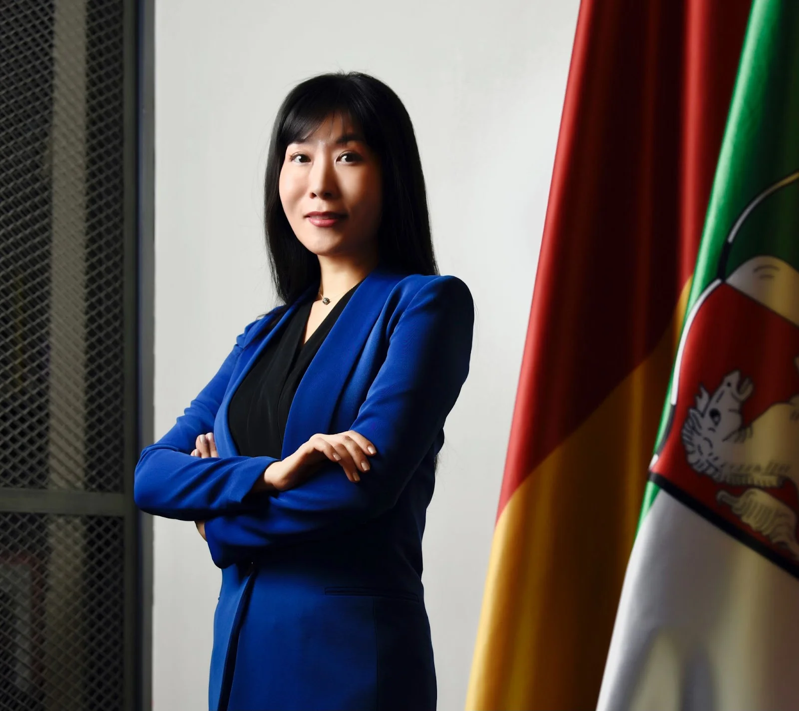
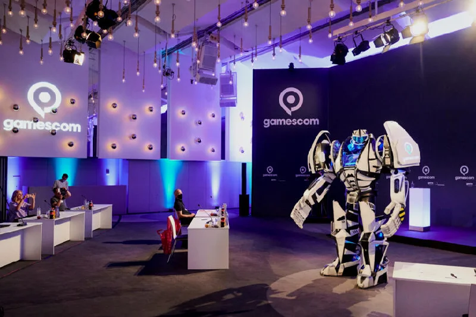
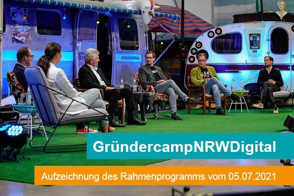

+++
title = "[유럽스타트업열전] 한국 스타트업의 독일 진출 지원자"
date = "2022-04-01T09:20:00+09:00"
description = "NRW무역투자진흥공사 한국대표부 김소연 대표 인터뷰"
tags = ["독일", "스타트업", "NRW", "김소연", "인터뷰", "유럽"]
categories = ["Column"]
author = "이은서"
image = "cover.webp"
canonicalUrl = "https://brunch.co.kr/@123factory/24"
+++

## <b>한국 스타트업의 독일 진출 돕는 든든한 지원자</b>

*커버 사진 출처=nrw.invest.com*

## NRW무역투자진흥공사 한국대표부 김소연 대표 인터뷰

인구 1800만 명, 독일 GDP의 20%를 차지하는 노르트라인베스트팔렌주(NRW주)는 독일에서 경제 생산량이 가장 높아 스타트업에게도 흥미로운 곳이다. 이곳에 독일의 정부 기관이면서 한국 기업을 집중적으로 지원하는 NRW무역투자진흥공사가 있다.

NRW무역투자진흥공사는 전 세계 기업을 NRW주에 유치하고 동시에 NRW주 출신 기업의 세계 진출을 돕는 역할을 한다. 일본, 미국, 중국을 비롯한 10여 개국에 대표부를 두었고, 한국 대표부도 1988년에 설립되어 지금까지 수많은 기업의 독일 진출을 도왔다. 2011년부터 NRW무역투자진흥공사(NRW.GLOBAL BUSINESS Trade&Investment Agency) 한국대표부의 수장으로 10여 년간 한국과 독일의 비즈니스를 이어온 김소연 대표를 만나 스타트업을 위한 NRW주의 지원 정책에 대해 들었다.

*NRW무역투자진흥공사 한국대표부 김소연 대표. 한국 기업의 독일 진출을 돕는다. 사진=정치호 제공*

## 스타트업 유치·지원·성장이 NRW주 경제 정책 핵심

독일의 16개 연방 주에는 각기 경제부 산하 투자·무역 진흥 기관이 있다. <b>그 중 NRW무역투자진흥공사는 한국대표부가 있는 유일한 기관</b>이다. 그만큼 독일 연방주에서 국제적인 활동이 가장 활발한 주이자 한국과의 인연이 매우 깊은 곳이다.

<b>NRW무역투자진흥공사는 주 경제부(Ministerium für Wirtschaft, Innovation, Digitalisierung und Energie des Landes Nordrhein-Westfalen)의 자본이 100% 투입된 주 정부 자회사</b>이다. NRW주 경제부의 공식 명칭은 ‘NRW주 경제, 혁신, 디지털화 및 에너지 부’다. 이름에서도 알 수 있듯 NRW주의 경제 정책은 철강, 석탄, 화학, 기계 위주의 전통 산업에서 디지털을 기반으로 하는 새로움과 혁신의 방향으로 변모 중이다. 경제부 홈페이지 메인 화면이 스타트업과 창업에 관한 뉴스와 지원정책으로 채워져 있는 것도 그러한 방향성을 명확히 보여준다.

김소연 대표는 “NRW주 경제부는 스타트업 육성에 사활을 걸었다고 해도 과언이 아닐 정도로 신생 기업을 위한 다양한 지원정책을 펼치고 있다. 이에 따라 NRW무역투자진흥공사의 한국대표부는 한국 스타트업들이 <u>NRW주에서 비즈니스를 시작할 때, 지원금뿐만 아니라 상공회의소와 지역 기반 기업들과의 네트워킹, 각종 산업 클러스터와의 연계를 통한 튼튼한 R&D의 발판을 마련할 수 있도록 원스톱 서비스를 제공</u>한다”고 설명했다. 한국대표부는 한국 기업의 창업 첫발을 지원해준다는 측면에서 해외 진출 스타트업에게는 꼭 필요한 조력자인 셈이다.

“전체 독일 산업 전력의 40%가 NRW주에서 소비될 정도로 이 지역은 전통산업이 매우 강했다. 그렇기 때문에 4차 산업 혁명의 시대가 도래하면서 산업 구조 변경에서 가장 적극적일 수 밖에 없는 곳이기도 하다”는 것이 김 대표의 설명이다. 그 변화의 흐름에서 ‘혁신’을 지향하는 스타트업들이 매우 큰 역할을 하고 있다. 그리고 변화를 꾀하는 전통 기업과 혁신을 선도하는 스타트업들에게 NRW주는 만남의 용광로와 같은 역할을 한다.

즉, 제조업 중심의 <u>전통 기업들이 혁신을 꾀하고 싶어도 방법을 모를 때, 스타트업의 솔루션이 좋은 해결책</u>이 된다는 것이다. 김 대표는 “독일 게임스타트업과 제조업 기반 전통 기업의 협력 사례가 기억에 남는다. 제조업 기업의 생산성 향상을 위한 솔루션으로 게임 스타트업에서 일종의 ‘보너스 포인트 모으기 게임’을 개발해 서로가 윈-윈 하는 협력이 되었다”고 사례를 소개했다.

## 독보적인 자금 지원 규모, 스타트업에 ‘진심’인 곳

NRW주는 독일에서 인구가 가장 많은 주로, 독일 전체 구매력의 20%를 차지한다. 이웃 나라 네덜란드의 국가 구매력과 큰 차이가 없는 규모다. 이는 B2C 비즈니스를 하는 스타트업의 도전 욕구를 자극한다. B2B 스타트업에도 기회의 땅이다. NRW주 경제부 자료에 따르면, 2020년에만 약 6970억 유로의 가치를 지닌 상품과 서비스가 NRW주에서 생산되었다. 독일에서 가장 큰 규모다. 튼실한 대기업과 중소·중견기업이 자리하고 있기에 B2B 스타트업에도 NRW주는 거대한 수요처다.

매년 쾰른에서 열리는 세계 3대 게임박람회 중 하나인 게임스컴(Gamescom), 세계 최대의 식음료 박람회 아누가(Anuga), 뒤셀도르프에서 열리는 세계 최대 의료기기 박람회 메디카(Medica)가 모두 NRW주에서 열린다. 이곳은 분야를 막론하고 다양한 산업이 살아 움직이는 곳이다. “많은 산업이 집중되어 있다는 것 자체가 스타트업에는 많은 기회를 준다”고 김 대표는 강조한다.

*NRW에서 열리는 세계 3대 게임박람회 게임스컴. 사진=gamescom.com*

<b>교육기관과 연구소가 많다는 것도 장점</b>이다. NRW주는 독일에서 대학이 가장 많고, 대학 졸업자 수도 가장 많다. 프라운호퍼, 막스플랑크 연구소 등 세계 유수의 연구소들도 모여 있다. 스타트업들은 대학 및 연구기관과 연계한 R&D 사업에 참여할 기회가 많다. 김 대표는 “R&D가 강력하기 때문에 스타트업 연구 결과물의 상업화와 시장화를 정부가 도와주면 산업 구조의 혁신을 가져올 수 있다. 그렇기에 NRW주가 스타트업의 육성에 진심인 것”이라고 말한다.

실제로<b> NRW주의 스타트업 육성 정책 </b>중 하나를 살펴보면, 그 ‘진심’의 깊이를 알 수 있다. 비즈니스 아이디어가 있는 스타트업 창업자에게 최대 1년 동안 1인당 매월 1000유로의 장학금을 주는 창업보조금(Gründerstipendium.NRW) 사업은 설립 1년 이하 또는 예비 설립자를 위한 지원 사업으로 한 팀당 3명까지 지원을 해준다. 지원기간에는 재정뿐만 아니라 설립을 위한 각종 법률, 행정 조언과 비즈니스 코칭도 함께한다. 그리고 실제 창업 과정을 원스톱으로 지원해주는 스타터 센터(Startercenter.NRW) 75개가 창업을 위한 실무과정을 돕는다. 연방 주 하나에 75개의 창업 지원 센터가 있다는 것은 일단 양적으로 놀랄 만한 수준이다.

우수스타트업 대회(Exzellenz Start-up Center)는 NRW주 대학에 창업을 독려하기 위해 만든 프로그램이다. 혁신적인 아이디어를 가진 대학 기반 창업 그룹에 총 1억 5000만 유로의 자금을 지원하는 이 프로그램은 지원 규모에서 타의 추종을 불허한다. 이 프로그램에는 아헨공대, 보훔의 루르대학교, 도르트문트기술대학교, 파데보른대학교, 뮌스터대학교, 쾰른대학교가 우수대학으로 선정되어 5년간 단계별로 자금을 지원 받아 혁신 아이디어를 비즈니스로 만들 기회를 얻게 되었다.

*창업보조금 사업의 일환으로 열린 네트워킹 행사 창업캠프. 사진=gruenderstipendium.com*

김소연 대표는 최근 NRW주 정부의 스타트업 지원 프로젝트를 특별히 소개했다. 220만 유로 규모로 진행되는 <b>인에이블어스(EnableUS) </b>프로그램이다. 사회 문제와 미디어 관련 창업을 준비하는 대학 및 연구기관의 창업을 지원하는 프로그램으로 올해에 지겐대학(Universität Siegen)이 지원을 받으면서 스타트를 끊었다. 기존에 자연과학과 경제학 분야에만 초점을 맞추어 진행되었던 창업 관련 지원을 <u>인문 사회 분야로 넓히면서</u> 동시에 대학 기반 창업 생태계를 견고하게 만드는 것이 목표라고 한다.

“지겐은 한국인에게는 잘 알려지지 않은 작은 도시지만 1870년대부터 기술 분야의 전통을 가진 대학과 히든챔피언을 배출한 도시로, 산업에서 ‘작은 거인’과 같은 역할을 하는 곳이다. NRW주에는 이렇게 작고 강한 도시들이 많다. 파더보른(Paderborn), 귀터슬로(Gütersloh) 등이 그렇다. 다시 말해 아직 한국 기업들이 모르는 다양한 기회들이 펼쳐져 있는 곳이다.”

<b>산업 파트너가 있고 함께할 수 있는 인력이 모여 있으며 기본 인프라가 탄탄히 갖춰진 NRW주는 스타트업에게는 매력이 큰 곳이다. </b>NRW주도 스타트업의 도시라 불리는 베를린 등과 차별화하여 성장하기 위해 다양한 전략을 펼치고 있다. 김 대표는 “스타트업은 좋은 아이디어로 시작하지만, 이 아이디어를 성장시켜 어떻게 비즈니스를 만들어내는가가 관건이라고 볼 수 있다. 즉, <u>경제 프로젝트로 수익을 낼 토양을 찾아야 하는 것이 당연</u>하다”며 “그것이 한국 스타트업들에게 NRW주를 권하는 이유 중 하나”라고 자신감을 드러냈다.

오랜 기간 산업계에서 활동한 김소연 대표는 한국과 독일 모두에서 상당한 커리어와 네트워킹을 자랑하는 인물이다. 양국의 산업과 문화, 커뮤니케이션 방식을 완벽히 이해하며 가교 역할을 한다는 데에서 많은 기업과 관계자의 든든한 버팀목이 된다.

“스타트업이 NRW주에 관심이 있다고 하면 전폭적으로 지원한다. <u>큰 틀에서 경제정책을 이해하도록 도울 뿐만 아니라 각종 지원 사업, 네트워킹에 이르기까지 모든 것을 돕는다</u>. 진정성 있게 한국 기업들을 대하고 독일 파트너들을 대하기 때문인지 그 부분이 가 닿는다는 것을 느낄 때가 있다. 뮐하임의 게임스 팩토리에 입주하게 된 한국 기업을 도울 때, 게임스 팩토리 매니저가 지원 프로그램의 신청서 리뷰도 상세히 해주는 등 실질적인 도움을 주어 한국 기업들이 재정 프로그램의 지원을 받게 된 경우도 있다. 두 팔 걷고 나서면 해야 할 일이 참 많다.” 김 대표는 인터뷰 막바지까지 열정적인 목소리로 대답했다.

NRW주의 풍부한 스타트업 지원 정책도 매력적이지만, <b>이를 세세하게 안내하고 조언을 주며 한국 스타트업에 도움을 주는 NRW무역투자진흥공사 한국대표부가 있다는 사실은 매우 유용한 정보다. 유럽에 진출하고픈 한국 스타트업에 이 소식이 널리 알려지길 기원한다. </b>

---

이은서 eunseo.yi@123factory.de

*본 글은 <비즈한국>의 [유럽스타트업열전]을 편집 및 각색하였습니다.*
