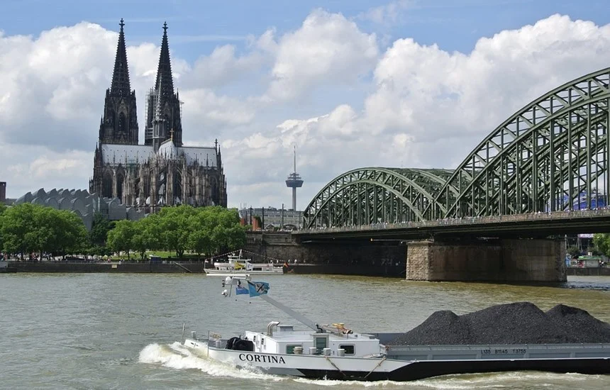
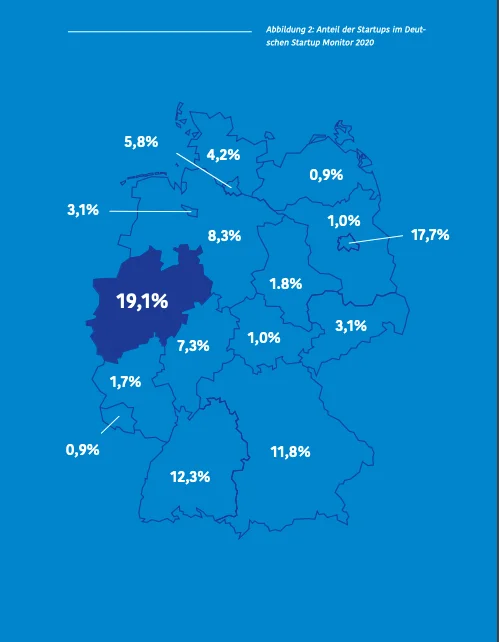
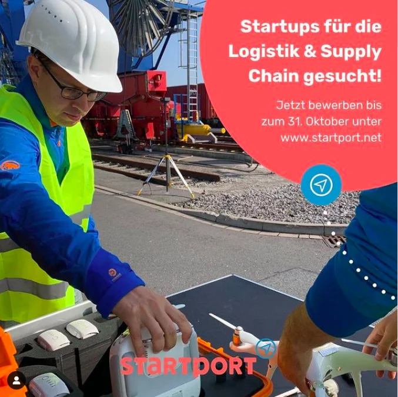
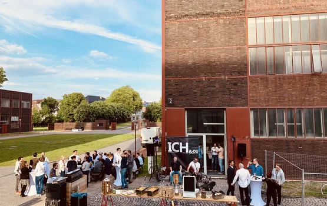

+++
title = "[European Startup Chronicles] Startup-Ökosystem im deutschen Bundesland NRW"
date = "2022-04-01T08:12:19+09:00"
description = "Wandel von einer traditionellen Industriestadt zu einer Informationstechnologie-Metropole"
tags = ["NRW", "Nordrhein-Westfalen", "Startup", "Deutschland", "Europa"]
categories = ["Column"]
author = "Eunseo Yi"
image = "cover.webp"
+++

## <b>Innovationen in stillgelegten Zechen: Das Startup-Ökosystem von Nordrhein-Westfalen</b>

*Titelbildquelle=Digital Hub Website*

## Wandel von einer traditionellen Industriestadt zum IT-Zentrum... Aktive Gewinnung ausländischer Investitionen durch staatliche Entwicklungsgesellschaften

Zuvor haben wir die deutschen Startup-Ökosysteme von Berlin und Bayern, einschließlich München, unter die Lupe genommen. Ab dieser Kolumne stellen wir das Startup-Ökosystem des Bundeslandes Nordrhein-Westfalen (NRW) vor, konzentriert um Köln, das gemessen an einzelnen Städten die drittgrößte Startup-Szene in Deutschland darstellt.

*Köln, die größte Stadt in Nordrhein-Westfalen. Rund 1.700 Startups sind in NRW ansässig und zeigen eine herausragende Stärke im Bereich Informations- und Kommunikationstechnologie. Foto=koelner-dom.de*

NRW liegt im Nordwesten Deutschlands und grenzt an die Niederlande und Belgien. <u>Dank seiner geografischen Lage, die den Zugang nach Westeuropa erleichtert, hat sich die Industrie dort traditionell stark entwickelt.</u> Die Landeshauptstadt ist Düsseldorf, die größte Stadt ist Köln. Auch Bonn, wo während der deutschen Teilung die westdeutsche Regierung saß, ist eine bedeutende Stadt in NRW. Darüber hinaus gibt es weitere bekannte Städte wie Dortmund, Essen und Münster.

NRW hat rund 18 Millionen Einwohner, was die Gesamtbevölkerung des Nachbarlandes Niederlande übersteigt. NRW ist das bevölkerungsreichste Bundesland in Deutschland und weist eine hohe Bevölkerungsdichte auf. Das BIP beträgt rund 705,1 Milliarden Euro, was etwa 21 Prozent des gesamten deutschen BIP entspricht. Die Wirtschaftskraft von NRW liegt vor Schweden, Polen und Belgien. Gleichzeitig ist es eine internationale Region, in der rund 2,7 Millionen Ausländer leben. <b>Das bedeutet, dass es nicht nur ein von Großindustrien geprägter Standort ist, sondern auch ein wichtiger Markt, auf dem die Marktfähigkeit neuer Industrien erprobt werden kann.</b>

Daher ist NRW für Unternehmen aus aller Welt äußerst attraktiv. Allein rund 20.000 ausländische Unternehmen sind in NRW ansässig, darunter auch über 60 koreanische Firmen. Dies ist auf die besondere Ansiedlungspolitik für internationale Unternehmen in NRW zurückzuführen. <b>Unabhängig von der Bundesregierung betreibt die landeseigene Entwicklungsgesellschaft (NRW.Global Business) eigene Büros weltweit, um internationale Unternehmen anzuwerben. Dank dieser Bemühungen zieht NRW die meisten ausländischen Direktinvestitionen (FDI) in Deutschland an.</b>

## Ausgewogenes Wachstum von Startups, KMU und Großkonzernen

Traditionell war das Ruhrgebiet reich an Kohle und Eisen. Aus diesem Grund spielte es seit den 1950er Jahren eine wichtige Rolle in der deutschen, europäischen und weltweiten Wirtschaft. NRW teilt auch eine tiefe historische Verbindung mit Korea, da sich viele der damals nach Deutschland entsandten koreanischen Bergarbeiter hier niederließen. Aufgewachsen auf der Basis der alten Eisen- und Metallindustrie, etabliert sich NRW heute als neues Zentrum für die IT- und Gesundheitsbranche.

In NRW gibt es <u>710.000 kleine und mittlere Unternehmen (KMU)</u>. Dies sind die soliden mittelständischen Unternehmen, die "Hidden Champions", die das Rückgrat der deutschen Wirtschaft bilden. Neben den KMU ist auch der Anteil von Großkonzernen hoch: <u>20 der 50 umsatzstärksten deutschen Unternehmen</u> haben ihren Sitz in NRW. Bekannte Namen wie Bayer, Deutsche Telekom, DHL, Henkel und Miele sind hier zu Hause.

*Rund 19 Prozent der deutschen Startups haben ihren Sitz in NRW. Quelle=Deutscher Startup Monitor 2020*

Etwa 19 Prozent der deutschen Startups sind in NRW angesiedelt. <b>Charakteristisch für diese Region ist die hohe Zahl von Spin-off-Startups aus Hochschulen und Forschungseinrichtungen.</b> NRW zählt 68 Hochschulen mit rund 770.000 Studierenden. Die RWTH Aachen und die Universität Bonn sind als weltweite Elite-Universitäten bekannt. Hinzu kommen renommierte Forschungseinrichtungen wie das Deutsche Zentrum für Luft- und Raumfahrt (DLR), die Fraunhofer-Gesellschaft und die Max-Planck-Gesellschaft.

Insbesondere in der deutschen Industrie, in der die Digitalisierung des gesamten Landes und der Wirtschaft das zentrale Thema ist, gestalten die Startups in NRW die Industriestruktur neu, indem sie im IT-Bereich eine Vorreiterrolle einnehmen. Startups in Bereichen wie Big Data, Industrie 4.0, Smart Cities, IT-Sicherheit, IoT, Transport und Logistik, Energie, Robotik und KI wachsen in enger Verbindung mit der universitären Forschung. Derzeit sind rund 1.700 Startups in NRW ansässig.

## Ein starkes Unterstützungsnetzwerk für Startups in NRW

<b>In NRW hat sich ein vielseitiges Netzwerk etabliert, in dem Startups umfassend unterstützt werden.</b> Im Rahmen der 12 nationalen Digital Hubs der Bundesregierung wurde Köln als Zentrum für Insurtech und Dortmund für Logistik und Transport (<b>DE:HUB</b>) ausgewählt, um vielfältige Förderungen anzubieten. Auf Landesebene wurden in sechs Regionen – Aachen, Bonn, Düsseldorf/Rheinland, Köln, Münster und dem Ruhrgebiet – "Digital Hubs" eingerichtet, um <b>Startups mit dem Mittelstand und Großunternehmen zu vernetzen</b>. Dies ist eng mit staatlichen Fördergesellschaften wie NRW.Global Business und "Gründen NRW" verknüpft. Auf dieser Basis will NRW in den nächsten fünf Jahren die meisten Startup-Neugründungen in ganz Deutschland hervorbringen.

<b>Im privaten Sektor agiert die Founders Foundation</b> als aktiver Accelerator, der <u>B2B-orientierte Geschäfte fördert</u>, indem er Startups mit den etablierten KMU vernetzt, die die traditionelle Wirtschaft tragen.

Darüber hinaus gibt es regional ausgerichtete Gründerzentren. In Düsseldorf und Köln gibt es den "Startplatz", in der Region Aachen "Co: Forward". Paderborn verfügt über "TecUp", das Gründerzentrum der Universität Paderborn, und Duisburg beherbergt "Startport", ein auf Logistik fokussiertes Gründerzentrum. Diese Einrichtungen bieten nicht nur Direktinvestitionen an, sondern stellen auch Büroräume bereit und helfen bei der Suche nach Investoren, Partnern und Kunden.

*startport unterstützt Logistik-Startups. Foto=Startport Instagram*

In einigen Fällen betreiben etablierte Unternehmen eigene Acceleratoren. So unterhält die Franz Haniel Group das "Schacht One" (was 'Schacht 1' bedeutet) auf der Zeche Zollverein in Essen als Startup-Accelerator. <u>Die Zeche Zollverein, die eine stillgelegte Zeche in ein riesiges Kulturdenkmal verwandelte,</u> ist weltbekannt und zählt zum UNESCO-Welterbe. <b>Der "Paradigmenwechsel", die Funktion einer geschlossenen Zeche zu ändern und gleichzeitig die Struktur als riesiges Museum zu erhalten, bietet vielen Unternehmen und Startups eine wertvolle Lektion in Sachen "Innovation".</b>

*Schacht One verwandelte einen Teil einer Zeche in einen Startup-Accelerator-Raum. Foto=haniel.de*

Zudem haben der Energiekonzern E.ON und Innogy (eine RWE-Tochter) den E.ON Agile Accelerator in Düsseldorf bzw. die Future Energy Ventures in Essen ins Leben gerufen, um Startups im Energiebereich zu fördern und zu finanzieren.

---

Eunseo Yi eunseo.yi@123factory.de

*Dieser Artikel wurde aus der Reihe "European Startup Chronicles" von BizHankook redigiert und adaptiert.*
