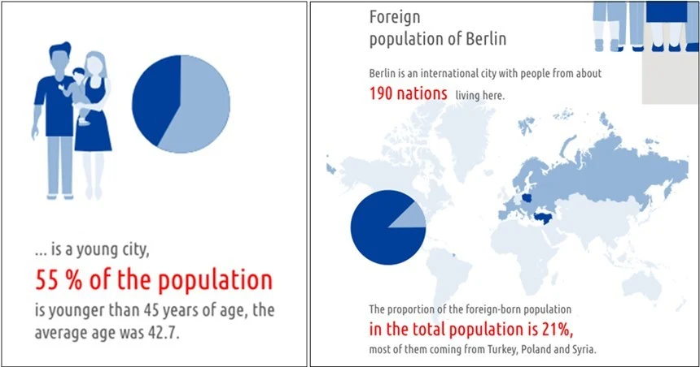
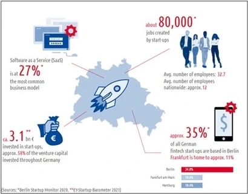

+++
title = "베를린이 '스타트업 성지'가 되기까지"
date = "2022-03-04T10:00:00+09:00"
description = "낮은 물가, 테크노음악 덕분에 젊은이들 대거 유입…시기 적절한 스타트업 우대 정책 '효과'"
tags = ["Startup", "Berlin", "History", "Economy", "Technology"]
categories = ["Column"]
author = "이은서"
image = "cover.webp"
canonicalUrl = "https://brunch.co.kr/@123factory/7"
+++

## 낮은 물가, 테크노음악 덕분에 젊은이들 대거 유입…시기 적절한 스타트업 우대 정책 '효과'

*베를린 시 분단으로 경제적 성장이 느렸던 베를린은 지금은 독일에서 스타트업이 가장 많은 도시, 세계에서 가장 젊은 도시가 되었다. 사진=베를린 시*
*커버사진 = 베를린시(berlin.de)*

‘가난한 예술가들의 도시’ 였던 베를린이 ‘스타트업의 성지’가 된 것은 언제부터였을까?

베를린은 1870년경 유럽에서 가장 크고 발전이 많은 도시 중 하나였다. 특히 1900년대에는 유명 은행들의 본사가 대부분 베를린에 자리 잡고 있어서, 유럽의 금융은 베를린이 주도한다고 해도 과언이 아니었다. 그러나 1945년 세계 제2차 대전이 끝난 이후 독일이 동독과 서독으로 분단되면서, 서베를린 지역은 동독에 둘러싸여 하나의 고립된 섬이 되어 버렸다. 주요 기업들은 모두 베를린을 떠나 서독으로 이전하였고, 1989년 장벽이 무너질 때까지 베를린은 경제적으로 어려움을 겪는 가난한 도시로 전락했다.

베를린이 통일 독일의 수도가 된 뒤 산업 재건을 위한 노력이 다시 시작됐다. 기반이 없어도 빠르게 성장할 수 있는 서비스, 기술, 창조 분야의 산업이 베를린에 자리 잡았고, 지멘스(Siemens), 도이치은행(Deutsche Bank), 루프트한자(Lufthansa), 알리안츠(Allianz)와 같은 다양한 분야의 대기업이 제2의 본사를 설립하면서 베를린은 서서히 경제적으로 활기를 띠었다. 물론 금융 중심지 프랑크푸르트, 명문 공과대학 등을 기반으로 연구·개발 중심의 기술산업이 이끄는 노르트라인베스트팔렌주, 하나의 국가로 독립해도 손색없을 경제력을 가진 바이에른주와는 아직 경쟁이 되지 않았지만, <b>통일 이후 정치의 중심지로 부상하면서 베를린은 점점 중요한 도시가 되어간다.</b>

## 저렴한 물가와 테크노 음악으로 몰려드는 젊은이들

한편 다른 독일의 도시에 비해 물가가 싸다는 이유로 예술가들이 모여들기 시작한다. 함부르크에서는 록음악이, 뒤셀도르프에서는 일렉트로 팝이 도시의 소리를 주름 잡았다면, 베를린에는 단연 테크노 음악이 으뜸이었다. 분단 시절에도 베를린에는 예술이 존재했다. 1960년대에 시작된 베를린 테크노 음악의 유행은 서독 지역에서 군 복무를 피하려던 청년들이 주도하였다. 컴컴한 클럽에 모여 실험적 음악을 하며, 즉흥 연주를 즐기던 뮤지션들은 베를린 크로이츠베르크 지역을 중심으로 저항적 문화 운동으로까지 이를 발전시킨다.

1990년대 독특한 베를린 만의 테크노 음악은 몇몇 클럽을 중심으로 한 베를린의 서브컬쳐를 주도 한다. 금요일 밤에 입장해서 월요일 아침까지 밤을 새워 즐기는 젊은이들이 베를린의 클럽으로 모여들었고, 곧이어 베를린은 전 세계 수백만 관광객들의 발길을 끌게 된다. ‘베를린=놀기 좋은 곳’으로 인식이 되면서 젊은 인구가 급격하게 늘어났다. 현재 베를린은 인구의 55%가 45세 이하이고, 평균 연령 42.7세인 젊은 도시이다. 동시에 전 세계의 젊은이들이 모이는 국제적인 도시로 발돋움을 한다. 베를린에는 현재 190개국 출신의 사람들이 살고 있고, 도시 전체 인구의 21%가 외국 출신이다.

*자료=베를린시(berlin.de)*

## 베를린의 이미지 변신

베를린은 다른 도시들이 중점을 두고 있는 자동차, 금융, 바이오/헬스 분야에서 그 주도권을 가져오는 것은 의미가 없다고 생각하고, <b>도시의 이런 젊고, 국제적인 분위기를 부각해 스타트업을 유치하고 적극적으로 지원하는 것으로 시의 정책 방향을 설정한다.</b> 마침 세계적으로 스타트업 붐이 일어나던 때와 시기가 잘 맞아떨어졌다. 구글이 협력하여 2014년에 설립된 팩토리 베를린은 베를린 시의 스타트업 유치에 많은 역할을 하게 된다. 돈은 없더라도 아이디어가 있는 많은 창업자가 베를린으로 모이게 되었고, 베를린시 산하 경제진흥기관 베를린 파트너(Berlin Partner für Wirtschaft und Technologie GmbH)도 ‘스타트업’에 중점을 둔 비즈니스 지원 프로그램 등을 개설하고, 스타트업을 적극적으로 유치하는 데 앞장 서게 된다. <b>이렇게 베를린은 독일 내에서 스타트업이 가장 많은 도시가 된다.</b>

베를린에는 연 평균 4만 개의 사업자 등록이 있으며, 이 중 500개가 스타트업이다. 이제는 ‘가난하지만 섹시한 도시’라는 타이틀보다도 <b>‘창업자, 예술가들의 도시, 국제적이고 젊은 도시’ 라는 타이틀</b>이 어울리게 되었다. 베를린 GDP의 80%는 창의/문화 산업, 관광, 미디어/정보통신 기술, 운송 시스템 등의 산업이다. 이후 2017년에 베를린은 독일 내 사물인터넷(IoT) 와 핀테크 허브로 선정되어, 독일 내에서 가장 많은 IoT 와 핀테크 스타트업이 있는 도시가 되었다. 즉, 독일 전체 핀테크 기업의 1/3에 해당하는 295개의 핀테크 스타트업이 베를린에 있다.

*자료=베를린 스타트업 모니터 2020*

## 국제적이고 젊은 아이디어의 도시로 성장한 베를린

브렉시트 이후에 글로벌 금융기관의 유럽 본사들이 대거 프랑크푸르트로 옮겨 오면서 프랑크푸르트는 여전히 전통적인 금융도시로서의 타이틀을 거머쥐고 있지만, <b>새로운 아이디어는 대부분 베를린에서 시작된다.</b> 현재 독일뿐만 아니라 미국에까지 진출하여 세계적인 금융시장을 놀라게 한 유니콘 N26도 베를린에서 시작했다. 러시아 금융계를 평정하고, 유럽에 진출한 Vivid, 기업 계좌를 손쉽게 만들고 세무, 회계 등의 프로그램과 연동하여 관리를 쉽게 할 수 있도록 만든 Penta, 쉬운 주식투자를 위한 앱 Trade Republic도 베를린 출신이다.

스타트업이 중요해지면서, 많은 독일의 대기업들도 혁신을 찾기 위해 베를린을 주목하고 있다. 대기업 자체적인 스타트업 엑셀러레이팅 기관을 베를린에 설립하는 것이 하나의 유행이 될 정도이다. 제약회사 바이엘의 그랜츠포앱스(Grants4Apps)는 바이오/헬스 분야의 스타트업을 찾아 나서고 있으며, 통신회사 도이체 텔레콤은 허브라움(Hubraum)이라는 코워킹 스페이스를 운영하며 미래의 성장 주역이 될 회사들과 교류를 하고 있다. 그 밖에 독일 최대의 미디어 기업 악셀 슈프링어 (Axel Springer)는 실리콘밸리와 협력하여 악셀슈프링어 플러그 앤 플래이 엑셀러레이팅 프로그램을 운영하고 있다.

독일에서 외국인으로서의 삶은 녹록하지 않다. 특히 한국에서 경험했던 행정 서비스, 배달 서비스 등의 빠른 ‘서비스’들을 경험했던 사람의 입장에서는 처음 정착하면서 "어떻게 이런 나라가 아직도 선진국일까" 싶은 점이 한 두 가지가 아니다. 독일도 스스로 ‘디지털화’에 뒤처져 있고, 혁신이 부족하다고 평가 한다. <b>그런 의미에서 특히 한국 창업자들에게 독일은 그야말로 개선과 혁신의 손길이 곳곳에 필요한 가능성의 땅이기도 하다.</b>

---

이은서 eunseo.yi@123factory.de

*본 글은 <비즈한국>의 [유럽스타트업열전]을 편집 및 각색하였습니다.*
