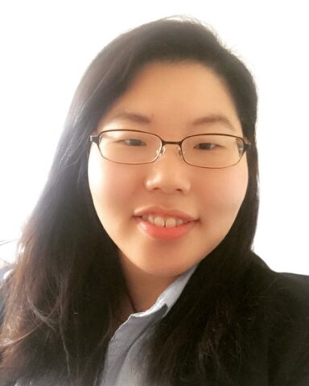

+++
title = "[Interview] Not being afraid of mistakes"
date = "2022-09-24T19:02:24+09:00"
description = "Researcher Seunghee Ko at the German Aerospace Research Center"
tags = ["interview", "aerospace", "germany", "researcher"]
categories = ["Interview"]
author = "Eunseo Yi"
image = "cover.jpg"
+++

“The thing that has changed the most since I came from Germany is that I have gotten rid of the idea that I should not make mistakes.” German Aerospace Center ‘at the ‘Institut for Complex Structures and Adaptive Systems’ (Institut für Faserverbundleichtbau und Adaptronik). These are the words of Seunghee Ko, a researcher at work.

The German Aerospace Center (Deutsches Zentrum für Luft- und Raumfahrt e.V., DLR) is an aerospace, energy, transportation, security, and digitalization research institute under the German government. It is headquartered in Cologne, and as of February 2021, approximately 10,000 researchers and staff work in 54 institutions in areas such as Berlin, Braunschweig, and Bonn. Basically, it started with space development and aviation technology research, but as climate change and mobility have emerged as important topics, it is encompassing all areas of technology development for a sustainable future.

The Composite Structures and Adaptive Systems Research Institute, where researcher Seunghee Ko works, is located in the city of Braunschweig, about 2 hours west of Berlin, and is a leading research institute in the field of lightweight construction, conducting research on high-performance materials, efficient manufacturing processes and digitalization of fiber composite structures.

*Composite Structure and Adaptive Systems Research Institute with the motto ‘Research on intelligent lightweight systems for an emission-free future’ ©️DLR*

Here, researcher Seunghee Ko is researching technology to produce lighter structures for small aircraft. In particular, the field that Researcher Koh focuses on is technology that applies morphing technology, a technique that changes one shape into a completely different form.

Just before working at DLR, I was participating in a project to develop a civil aircraft using morphing technology at the ‘Institut für Flugzeugbau und Leichtbau’ (Institut für Flugzeugbau und Leichtbau) at the TU Braunschweig. At that time, the TU Braunschweig focused on developing a structure to reduce gust loads on airplane wings by applying morphing technology, and this experience naturally led to my employment at the current DLR Institute. It continued.

Morphing technology has developed greatly in the United States and Germany, and after completing my master's degree in Korea, I worked as a researcher at the same research institute for a year and participated in projects related to morphing technology, which became a great asset.

In Germany, before development and testing is carried out only at university research institutes, quite innovative production and development is also being carried out in amateur groups such as student groups within universities. It may seem like a reckless attempt, but because it is an atmosphere where one can freely create and experiment without any pressure for performance, many interesting results are produced.

Additionally, the industrial structure of Europe, including Germany, is more favorable to the development of the aviation sector. In other words, although there are many large aircraft companies, there are many unmanned aerial vehicles (UAVs) and drone-related venture companies, so R&D industry-academia cooperation is well established.

## <b>Sustainable research and development begins with the sustainable life of researchers.</b>

Researcher Seunghee Ko's decision to come to Germany was not only related to her research direction but also to her concerns about the life she wanted to live in the future. When I first wanted to continue my research abroad, the country I considered other than Germany was the United States.

At the time, my Korean advisor had been exposed to morphing technology while working as a postdoc in the U.S., and he had worked with a renowned leader in the morphing field in the U.S., so I had the opportunity to make good networking connections. But in the end, I decided to go to Germany.

She thought that the United States was not safe for her to live alone as an Asian woman, and when she imagined a long-term future as a female researcher, Germany seemed closer to the life she envisioned. “Personally, the balance between life and research is very important to me. So I thought a lot about where would be a better place to live a happy life.”

*Researcher Seunghee Ko at the German Aerospace Center (DLR) ©️ Seunghee Ko*

Korea and the United States were very similar in terms of performance-centeredness. In Korea, when Researcher Go had a flight experiment, he would come to work at 5 am and sometimes stay in the lab until late at night, and even on weekends, he would spend more time in the lab than spending time with family and friends. Compared to then, I am quite satisfied with the Germany I chose for my sustainable life.

In particular, one of the main reasons for my choice was that, as a female researcher, I would not be excluded from the process of marriage and childbirth and could enjoy the welfare system. In fact, in DLR, female researchers are never required to quit their jobs during pregnancy and childbirth. Researchers can return to work after maternity leave, and researchers who work full-time for 40 hours a week can reduce their working hours to 20 to 30 hours if their children are young and require care, and work as much as possible.

This applies equally to male researchers as well as female researchers. “One thing that was surprising was that male researchers who had children came to the lab with their children. If their wives were unable to take care of their children and they were unable to go to kindergarten, they would just conveniently come to the lab with their children. It seemed natural, as if this happened often to other employees as well.”

It is also said that it was impressive that he kept working hours exactly from 9 to 6. In Germany, even under unavoidable circumstances, you cannot legally work for more than 10 hours a day, and working long hours is not recommended. It is a natural culture that after 6 o'clock it is time to spend with family. “I think that’s why we have a high level of concentration. Everyone does their best on time and studies hard.” This was something I considered because I am a female researcher, but I felt that this was the foundation for a sustainable life for all researchers.

## <b>A research culture that grows through exchange</b>

“This is what I wanted when I first started working in a lab in Germany, but I was surprised by the culture, which was quite different from Korea, and it took time to adapt.” Researcher Ko said that the most difficult thing was not to make mistakes in Korea. In order to avoid making mistakes, I became more meticulous, and when I did that, time ran out and I fell into the swamp of mistakes again, repeating the vicious cycle.

This habit did not disappear even when I first started researching in Germany. I still cannot forget what the professor who was with me said to Researcher Ko, who was repeatedly worrying about making sure there were no mistakes in the experiment. "I asked what I was worried about, and I said that I felt like I was going to fail, so I was thinking about how to avoid failing. So what the professor was saying was, 'There is nothing that can't be done without making a mistake. Even if you make a mistake and fail, just do it. So, record why you made a mistake and why it didn't work, then make up for it and try the experiment again. It's better than not trying at all.' If you think about it, it's a really obvious statement, but I tried because I thought, 'You can't make mistakes.' “I think there were a lot of things I couldn’t do.”

From then on, Researcher Goh plans to try as many things as possible. If you don't know something while researching your own, ask your research team members. If I don't have anything to ask my team, I ask other teams as well. Questions are free here. Provide more detailed information to those who ask. They share in detail the trials and errors they have experienced, and if there is anyone who wants to apply them in the future, they suggest doing so. It was a very different culture from Korea, where you had to work hard in your field without making mistakes.

There is a culture that structurally encourages this. Once a year, researchers at the institute gather to present their topics. Since they usually only know what is being researched in their own department, they look into other departments' research during presentations on this topic to see if they can help each other. "Thanks to this culture, I felt that research in Germany did not need to be done alone from the beginning. I was able to gain more direction on my topic by observing the research process of others, and I also had many opportunities to receive direct help from researchers in the past. From the beginning, there was no senior/junior relationship or superior/subordinate relationship, but as someone who had only done a lot of research for a few more years, I thought it was really good to have an atmosphere that allowed new researchers who joined after that to gain as much synergy as possible from existing research."

Because it is a Western culture, I expected it to be a personal atmosphere, but instead, collaboration took place better here, and the teamwork of ‘everyone going together’ was important. As a new researcher, I had the advantage of being able to clearly know what I could and could not do and lead my research with as much help as possible from those around me, without the burden of having to know everything on my own. When I first came to the lab, the question other researchers asked kindly, “Seunghee, what do you need?” was a refreshing shock.

## <b>Between research and life balance</b>

“The downside is that as working from home has become longer due to the coronavirus, it has become difficult to get opportunities to help each other like this.” Researcher Ko has been working from home since March 2020, right after the coronavirus broke out in Germany. Except for work that requires going out to the lab to produce, most other researchers are also working from home. I've become accustomed to video conferencing, and it's nice to be able to save commuting time, but it's unfortunate that I can learn less by working face-to-face with my colleagues than before.

“Before, there were a lot of things I could learn from a side glance, and there were many opportunities to chat for a moment about what was going on in other teams, but it’s a shame that there are no such things due to the prolonged work from home.”

Researcher Ko, who devotes this time to his research, is currently focusing on research to create a lightweight aircraft structure. It covers areas from related materials to technology development. I didn't start off knowing everything from the beginning. Even if you don't know 100% about the field, there are fields that can be supplemented through teamwork, and the beauty of research is that your research field changes and expands as you learn.

Seunghee Ko, a researcher seeking balance between research and life at the German Aerospace Research Center, said, “Do not be afraid to knock on new doors for the research you want and for the life that will support it.” added.

 “I wondered if actively contacting and asking other people might be bothering them, but my German professors advised me, ‘If you want to get something, just knock.’” In the future, we look forward to the growth of Researcher Ko, who will actively pioneer his own path by positively utilizing both his research experiences in Korea and Germany.

* This article was contributed to ‘Korean Scientists in Germany’ of <Science Times>.

---

<b>Eunseo Lee</b>

eunseo.yi@123factory.de
