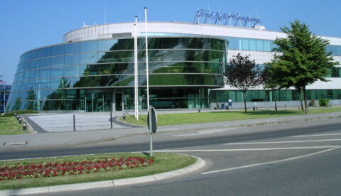
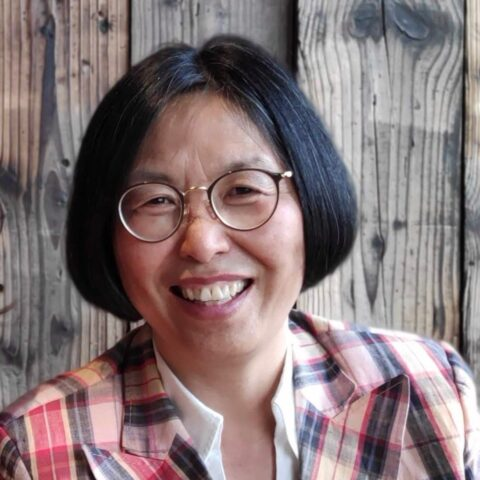

+++
title = "[인터뷰] 내 전통과 아이덴티티를 중심으로 두고 일하기"
date = "2022-09-23T19:59:10+09:00"
description = "독일 아헨 포드 연구소, 노선희 박사"
tags = ["인터뷰", "포드", "연구소", "과학자", "아헨", "독일"]
categories = ["Interview"]
author = "이은서"
image = "cover.jpg"
canonicalUrl = "https://brunch.co.kr/@123factory/34"
+++

포드(Ford Motor Company) 하면 가장 먼저 떠오르는 것은 하루에 1,000대의 자동차를 생산하는 대량생산 방식을 처음 고안한 회사라는 점이다. 현재 세계 다섯 번째 규모의 자동차 기업으로 포드주의(Fordism)라는 말을 만들어 냈을 정도로 자동차 산업에서 포드의 위치는 전통의 상징이다.

포드는 미국 회사이지만, 자동차 산업의 메카인 독일에도 1925년에 진출하여 거의 100여 년 가까운 역사를 유럽 시장과 함께하였다. 특히 설립과 동시에 영국 시장에 진출하였고, 독일에서도 현지 독일 자동차 회사들의 기술력을 어느 정도 흡수할 수 있었기 때문에 가능한 일이었다.

포드는 유럽을 단순한 시장으로만 여기지 않고, 유럽의 환경 보호 철학과 새로운 기술에 대한 수요 등을 수용하고 기술개발을 선도하기 위해서 1994년 독일 서쪽 지역 아헨에 포드 연구소를 설립한다. 포드는 본사가 위치한 미국 디어본을 비롯해 전 세계에 총 5개의 연구소가 있는데, 아헨은 유럽에서의 연구를 주도하고 있다.

아헨에는 독일 정통 명문 아헨 공과대학교가 있으며, 벨기에, 네덜란드, 룩셈부르크, 프랑스와 가까운 입지 탓에 유럽의 국제적인 인재를 유치하기 유리한 조건이다. 이곳에는 현재 28개국 이상에서 온 약 350여 명의 과학자와 엔지니어가 근무하고 있다. 분야별로는 차세대 디젤 및 가솔린 엔진 개발부터 연료 전지 및 하이브리드 기술, 텔레매틱스 및 신소재 개발을 포함한 자율주행, 커넥티비티 IoT 등 미래 모빌리티 분야의 연구를 선도하고 있다.

이곳에서 20여 년 동안 포드 자동차의 다양한 연구 개발 영역을 주도하는 한인 과학자 노선희 박사를 만났다.

*독일 아헨의 포드 연구소©️Ford Motor Company Ford Motor Company*

## <b>내연기관 연구에서 인더스트리 4.0까지</b>

노선희 박사는 성균관대 기계공학과에서 석사를 마치고, 독일 브라운슈바이크 공과대학으로 건너와 기계공학과 에너지기술(Energy Technology) 디플롬을 과정을 마친 후, 같은 대학에서 ‘석탄 연소에서 질소산화물 축적 수치 계산(Numerical Calculation of NOx Building in Coal combustion)’이라는 주제로 논문을 써 박사학위를 취득하였다.

많은 독일 유학생들이 그러했던 것처럼 노 박사는 독일이라는 나라가 학비를 낼 필요가 없었던 것이 큰 매력이었다고 생각했다. 1986년에 처음 독일에 도착하여, 처음에는 연구실에서 진행되는 다양한 프로젝트에도 참여하면서 생활비를 벌었지만, 이렇게 해서는 박사 공부를 도저히 끝낼 수 없겠다는 생각에 과감하게 연구비를 받는 프로젝트를 그만두고, 박사 논문에만 집중하기로 하였다. 다행히도 그런 학생들을 위한 생활지원 장학금을 받을 수 있게 되어, 다른 사람들보다 좀 빠르게 4년 만에 박사과정을 마칠 수 있었다.

공부에만 매진했던 것에 비해 삶이 단조로웠던 것은 아니다. 당시 연소과정에서 나오는 배출물 등을 직접 측정해 수학적으로 모델링을 하고 시뮬레이션을 해야 했는데, 직접 높은 굴뚝이 있는 발전소(Kesselhaus)에 방문해 높은 굴뚝에 올라가 하나하나 실험하고 직접 측정해야 하는 역동적인 실험의 과정이 반복되었다. 실험하면서 너무 더웠고 자칫 위험할 수도 있었지만, 노 박사는 책상에 앉아서 하는 연구가 아닌 실용 위주의 독일 교육이 무척 만족스러웠다.

그렇게 박사 과정을 마치고 바로 세계 최초로 보일러를 개발한 기업인 독일의 바일란트 사에 입사했다. 당시 진로 선택에는 별다른 고민을 하지 않았는데, 그도 그럴 것이 독일에서는 박사 취득 이후 교수가 되고자 할 때에도 산업계에서 최소 6년의 실무경험은 있는 것이 보통이었기 때문이다.

바일란트는 1874년에 설립된 난방 및 환기 기술 분야의 전통이 있는 기업이다. 초기 보일러에서 시작하여 최근에는 신재생 에너지를 포함한 친환경 난방 시스템을 발전시켰고, 한국에도 진출하였다.

전통 독일 기업이었던 것만큼 회사 내에 아시아 여성은 노 박사가 처음이었다. 보통 서양인보다 체구가 작고, 동안인 탓에 박사를 마친 매니저급이 아닌 갓 일을 시작하는 인턴으로 대하는 경우도 종종 있었지만, 오히려 그런 첫인상 탓에 노 박사가 성과를 보이면 동료들이 더 큰 놀라움으로 화답하였다.

바일란트에서는 연료전지와 관련한 프로젝트를 맡았다. 연료 전지는 보일러를 통해 연료를 소모하면서 전기를 생산하고, 난방을 하는 열을 생산하기도 하는데 이 방식에 관한 연구를 진행하였고, 이 프로젝트가 국제적으로 진행되면서 미국 등 다양한 국가의 기업들과 협력하여 일을 할 수 있었다.

8년여를 바일란트에서 일하는 동안 이러한 국제적 협력 프로젝트를 통해 포드의 입사 제의를 받고, 2000년에 포드에서 일을 시작하게 된다. 아헨이라는 경계지역, 전 세계의 인재들이 모여 모두 각자만의 영어로 소통하는 국제적인 분위기, 다양한 문화에서 발견하게 되는 열린 자세 이것들이 노선희 박사에게는 모두 긍정적인 요소로 다가왔다.

아시아인에서부터 같은 영어를 쓰더라도 스코틀랜드, 웨일스, 마국 등 다양한 나라의 억양에 익숙해지고, 노선희 박사 자신도 ‘내가 하고 싶은 대로, 나의 색깔대로 말하는’ 요령을 습득했다고 한다.

이렇게 포드에서 시작한 연구 생활은 자동차 생산 모델 주기 계획(Cycle Planning)에서 시작하여 파워트레인 통합 슈퍼바이저(Powertrain integration supervisor), 자동차 전 제작 과정을 아우르는 비즈니스 오퍼레이팅 매니저(Business operating manager), 를 거쳐 최첨단을 다루는 인더스트리 4.0 스페셜리스트(Manufacturing Industry 4.0 Specialist)에 이르기까지 다양한 분야를 경험하였다.

박사과정에서 석탄 연소 연구에서 시작하여, 30여 년 후에는 전기차, 자율 주행차 등의 미래 모빌리티까지를 아우르고 있는 노 박사의 경험이 사뭇 엄청난 대하드라마 같다.

*독일 아헨 포드 연구소 노선희 박사©️Seonhi Ro*

## <b>내가 무엇을 하고 싶은지 알고, 그것을 믿는 힘</b>

요약하자면 꽤 드라마틱하지만, 이 이야기는 한 과학자가 독일 땅을 밟고 약 35여 년 동안의 긴 이야기이다. 이 기간에 노선희 박사는 끊임없이 새로운 것을 배워야 했다. 컴퓨터에 정기적으로 업데이트가 필요하듯, 이 시간은 자기 자신을 하나의 소중한 도구로서 아끼고 배워나가는 과정으로 큰 즐거움을 선사하였다.

특히 회사 연구실에서 동료들과 함께 의견을 주고받고, 다양한 관점에서 자신의 의견을 재점검하고 긴 안목으로 사안을 바라보며 팀워크를 가지고 일한 경험은 그녀의 인생에도 많은 깨달음을 주었다.

연구를 중심으로 하지만, 기업 연구소이기 때문에 가질 수밖에 없는 효율성은 그런 면에서 프로젝트를 이끌어가는 사람들에게 하나의 기준점이 되어 주었다.

포드 연구소에서 팀과 함께 3개의 실린더 엔진을 개발해서 상용화했을 때, ‘그 해의 엔진상(The engine of the year)’를 받았다. 그리고 그 상을 6년 연속 수상하게 되었을 때, 그녀는 이 팀워크의 힘에 경외심이 들었다.

팀의 일원으로 일하고 있지만, 팀 전체가 하나의 목표를 향해 나아갈 때는 일원으로서 어떠한 결과물이 나올지 아무도 모른다. 마치 작품을 탄생시키는 작가와 비슷하지만, 개인 작업이 아닌 팀 작업, 여기에는 눈에 보이는 협력자도 있지만 자기도 모르는 어떤 힘도 느낄 수 있어서 거기에서 오는 신명도 있었다. 이런 과정이 포드 연구소 팀원들과 했던 역사 속에서 늘 추진력이 되어 주었다.

현재 60세에 접어든 노선희 박사는 후배들에게 ‘그렇기 때문에 항상 다른 사람들의 의견에 귀 기울이기 바란다.’라고 조언하였다. 나 혼자보다 팀은 더 큰 일을 해낼 수 있기 때문이다.

하지만 그것보다 더 중요한 것은 ‘자기 자신이 무엇을 하고 싶은지를 발견해 내는 것, 그것을 기초로 하여 자기가 하고 싶은 일을 찾는 것, 그것을 찾았다면 믿고 계속해서 나아가는 것, 나아갈 때 타인의 의견을 귀 기울여 듣되, 자기 스스로 결정하는 것.’ 이것이 후배들에게 꼭 전하고 싶은 말이라 했다.

1800년대에 처음으로 보일러를 개발한 바일란트사, 1900년대에 처음으로 자동차 대량생산을 시작한 포드사에서 연구원으로 근무하면서, 노 박사는 항상 ‘전통’이라는 환경에서 일했다. 하지만 <b>이제는 자기 스스로를 전통이라 여기며, 자신의 아이덴티티를 지키는 것, 그것을 과제로 삼고 인생을 즐기는 것</b>이 노 박사의 꿈이다.

그러기 위해서 더욱더 자기 자신에게 충실하고, <b>나에게 충실할수록 타인을 존중하게 된다.</b> 이렇게 자신의 삶에 충실했던 노선희 박사는 이제야 조금 짬이 나서 독일에 있는 여성 후배 과학자들을 앞에서 이끌어 줄 수 있는 입장이 되어 작은 모임도 하고 있다고 한다.

동시에 함께 하는 인생의 반려자와 함께 워라밸이 있는 삶을 위해 라틴댄스를 비롯한 여러 가지 춤을 배우고 있다고. <b>함께 하는 이들과 춤추고 호흡하는 데서 오는 힘이 크다고 믿기 때문이다.</b>

* 이 글은 <사이언스타임즈>의 ['독'일의 '한'국 과학자들]에 기고하였습니다.

---

<b>이은서</b>

eunseo.yi@123factory.de
