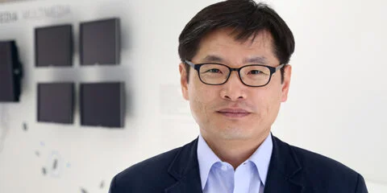
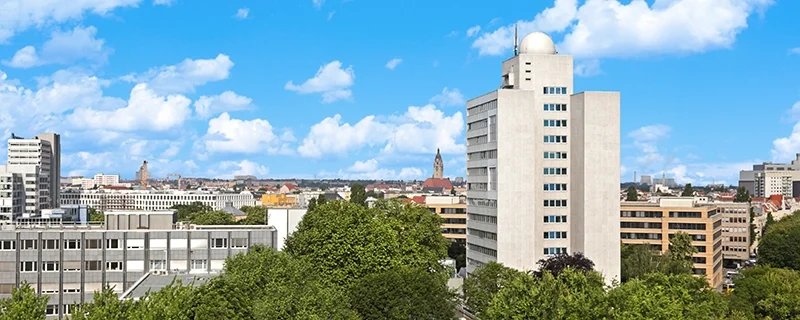

+++
title = "[Interview] Arbeiten heißt, Neues zu lernen"
date = "2022-09-21T04:08:04+09:00"
description = "Dr. Jeonghwan Choi vom Fraunhofer HHI in Berlin"
tags = ["Interview", "Fraunhofer", "Forschungsinstitut", "Wissenschaftler", "Berlin", "Deutschland"]
categories = ["Interview"]
author = "Eunseo Yi"
image = "cover.webp"
+++

In Deutschland gibt es vielfältige Institute für Grundlagen- und angewandte Forschung. Unter ihnen umfasst die Fraunhofer-Gesellschaft 74 Institute in ganz Deutschland und ist mit rund 28.000 Mitarbeitenden Europas größte Organisation für angewandte Forschung und Entwicklung.

Sie wurde 1949 in München gegründet, benannt nach dem deutschen Physiker Joseph von Fraunhofer, der ein neues Kapitel der wissenschaftlichen Präzisionsinstrumente aufgeschlagen hatte.

Bei der Gründung begann sie durch die Zusammenarbeit der Länder Bayern, Hessen und Württemberg mit 103 Mitarbeitenden, und 1952 wurde die Fraunhofer-Gesellschaft vom Bundeswirtschaftsministerium zusammen mit der Deutschen Forschungsgemeinschaft (DFG) und der Max-Planck-Gesellschaft als eine der drei großen außeruniversitären Einrichtungen für die deutsche Forschung bestimmt — und damit zu einem der wichtigsten Institute der angewandten Wissenschaft in Deutschland.

Das gesamte jährliche Forschungsbudget beläuft sich auf 2,8 Milliarden Euro (umgerechnet etwa 3,9 Billionen Won). Zwar ist sie ein staatlich gefördertes Institut, dessen Grundfinanzierung von Bund und Ländern getragen wird, doch mehr als 70 % der Forschungsmittel werden durch Auftragsforschung für private Unternehmen und öffentliche Projekte erwirtschaftet.

Das heißt: Verglichen mit anderen öffentlichen Forschungsinstituten ist der Anteil der staatlichen Grundfinanzierung gering, sodass der Großteil der Forschungskosten aus eigenen Einnahmen wie Auftragsforschungsgeldern und Dienstleistungsentgelten von Industrie- oder öffentlichen Auftraggebern gedeckt werden muss — ein wesentliches Merkmal.

Dass sie ein so eigenständiges Finanzierungsmodell besitzt, dass man es das Fraunhofer-Modell nennt, lässt den Charakter der Fraunhofer-Institute erahnen.

Mit anderen Worten: Fraunhofer hat zum Ziel, Technologien zu entwickeln, die in allen Arten von Industriefeldern praktisch eingesetzt werden können, und sie zu kommerzialisieren — und kann daher als das Institut gelten, das in Sachen Innovation am weitesten vorne liegt.

Insbesondere übernimmt es Auftragsforschung für kleine und mittlere Unternehmen ohne eigene F&E-Abteilung, entwickelt und optimiert bestimmte Technologien und Verfahren und bietet bei der Produktentwicklung Dienstleistungen vom Prototypenbau bis zur Kleinserienfertigung an — womit es auch ein wichtiger Partner der Unternehmen ist.

Die Fraunhofer-Gesellschaft hält derzeit mehr als 6.800 Patente; allein 2019 wurden 733 Erfindungen registriert, davon 623 zum Patent angemeldet. Das bedeutet, dass im Schnitt täglich zwei Patente angemeldet werden. Das ist nicht nur in Deutschland, sondern auch in Europa ein unerreichtes Niveau.

Die erfolgreichsten bei Fraunhofer entwickelten Patentprodukte liegen im Bereich der Audio- und Videocodierungstechnologie. Die 1992 vom Fraunhofer-Institut für Integrierte Schaltungen (IIS) entwickelte Audiokompressionstechnologie „MP3" brachte bis zum Auslaufen der Lizenzrechte im April 2017 jährlich durchschnittlich 100 Millionen Euro (umgerechnet etwa 125 Milliarden Won) an Lizenzeinnahmen ein.

Zudem wurden Kerntechnologien wie die Echtzeit-Videowiedergabe (Streaming-Video) und die Videokompression (AAC-Videocodierung) am Fraunhofer Heinrich-Hertz-Institut (HHI) in Berlin entwickelt.

Ich traf Dr. Jeonghwan Choi, Leiter der Gruppe IC Design am Fraunhofer HHI, hörte eine Vorstellung des Fraunhofer HHI und erfuhr von seinem Leben als Wissenschaftler, der als unbefristeter Forscher an Deutschlands bestem Forschungsinstitut arbeitet.

## Wertvolle Erfahrungen bei Samsung

*Dr. Jeonghwan Choi vom Fraunhofer HHI in Berlin ©️Fraunhofer HHI*

Dr. Jeonghwan Choi begann 2011 seine Arbeit am Fraunhofer HHI. In Korea nahm er während seines Masterstudiums zugleich an einem Projekt des Samsung Advanced Institute of Technology teil und hatte so die wertvolle Gelegenheit, Wissenschaft und Praxis im Halbleiterbereich zu verbinden. Dadurch lernte er viel in den besten Halbleiter-Entwicklungseinrichtungen der Welt und erhielt nach dem Masterabschluss auch die Möglichkeit, weiter bei Samsung zu arbeiten.

Doch mit dem Gedanken, dass er, wenn er sofort zu arbeiten begänne, höchstens etwa zehn Jahre durchhalten würde, dachte er langfristig über seine Zukunft nach.

Gerade da erfuhr er über einen jüngeren Kommilitonen, der von einem Praktikum bei Infineon in München zurückgekehrt war, dass „Deutschland keine Studiengebühren erhebt". Für ein Studium in Deutschland schrieb er 28 Professoren einschlägiger Fachgebiete E-Mails, stellte sein Forschungsfeld vor und bekundete seine Absicht zu promovieren. Da die Vorbereitungszeit kurz war, erwartete er nicht viel, doch gerade weil seine Lage so drängend war, kontaktierte er viele Professoren — und erhielt überraschenderweise Angebote von drei Universitäten.

Er entschied sich für den Lehrstuhl für Hochfrequenztechnik an der Fakultät für Elektrotechnik und Informationstechnik der Technischen Universität München (TUM HFT) und begann seine Promotion.

Er begann die Promotion, ohne ein Wort Deutsch zu können, doch sein Doktorvater, der ihn aufnahm, soll seine Zulassung sehr begrüßt haben. Das Samsung Advanced Institute of Technology forschte damals mit Blick auf die kommenden fünf bis zehn Jahre und war im Halbleiterbereich beträchtlich voraus. Als der Doktorvater den Inhalt von Dr. Chois Masterprojekt sah, soll er gestaunt haben: „Sie sind der Erste, der im Masterstudium so viel gelernt und erfahren hat."

Danach schloss Dr. Choi seine Promotion mit einer Arbeit zum Thema „elektronische Schaltungen für die optische Kommunikation" reibungslos ab, kehrte zu Samsung zurück und arbeitete bis 2011 im Forschungslabor von Samsung Electronics.

Bei Samsung musste er weltweit Technologien beobachten, auch außerhalb seines eigenen Fachgebiets. Da er neben der Forschung auch die Planung im Technologiebereich übernehmen musste, war das Studium neuer Wissenschaft und Technik unerlässlich. Jede Woche bestand die Arbeit darin, die Inhalte auf einer A4-Seite zusammenzufassen, zu präsentieren, Meinungen auszutauschen und zu diskutieren — wer sich nicht mit neuen Technologien beschäftigte, fiel zwangsläufig zurück. Diese Methode von damals ist bis heute Dr. Chois Art zu lernen, um sich selbst zu erneuern.

## Das Leben am Fraunhofer HHI, wo man seine R&B&D-Fähigkeiten gleichermaßen entfalten muss

Während Dr. Choi sich in neue Gebiete einarbeitete, richtete er den Blick auf die internationale Bühne. Damals interessierte er sich sehr für Nanotechnologie und sondierte dafür verschiedene Regionen, darunter die amerikanische Ostküste. Am Ende passte das letzte Projekt, das er bei Samsung durchgeführt hatte, genau zum Fraunhofer HHI in Berlin — und nur sieben Stunden nach dem Absenden seines Lebenslaufs erhielt er vom Fraunhofer HHI die endgültige Zusage. Alles ging Schlag auf Schlag.

Das Fraunhofer HHI ist ein Institut, das in den Bereichen mobile Breitbandkommunikation, optische Netztechnologie und Multimedia Weltspitzentechnologie vorweist; insbesondere in der Videocodierung führt es die internationale Standardisierung bei MPEG, ITU-T VCEG, DVB und IETF an. Man kann also davon ausgehen, dass die meisten Unternehmen, die heute Videocodecs in Mobilgeräten einsetzen, Lizenzgebühren an das Fraunhofer HHI zahlen. Unternehmen wie Samsung, LG und Xiaomi gehören zu den größten Kunden.

*Das Fraunhofer HHI in Berlin — vom Dach mit seiner runden Kuppel überblickt man das Panorama Berlins. ©️Fraunhofer HHI*

Dr. Choi sagt, seine Erfahrung im Unternehmensforschungslabor sei ihm auch bei der Arbeit am Fraunhofer HHI eine große Hilfe gewesen. Denn obwohl Fraunhofer ein staatlich gefördertes Institut ist, mussten die Fähigkeiten der Forschenden nicht nur in Forschung und Entwicklung, sondern auch im Geschäftsfeld der Einwerbung von Auftragsforschung zur Geltung kommen.

Das heißt: Viele Aufgaben, die außerhalb der Forschung gewöhnlich als nebensächlich gelten, waren bei Fraunhofer Pflichtaufgaben. Neben dem Verfassen von Anträgen und der Teilnahme an Konferenzen musste er durch die Teilnahme an Technologiemessen Treffen mit Vertretern globaler Unternehmen wie Intel, Qualcomm und Samsung abhalten und auch geschäftliche Gespräche auf Fachtagungen führen.

Und intern bei Fraunhofer musste er auch durch die Analyse von Website-Zugriffsstatistiken die Bedürfnisse von Unternehmen, Universitäten und Forschungsinstituten ermitteln und auf Grundlage der Technologienachfrage Vertrieb betreiben.

Hinzu kommt, dass als öffentliches Forschungsinstitut auch die Ausbildung von Master- und Promotionsstudierenden zu den wichtigen Aufgaben gehört. So hat das Leben bei Fraunhofer eine Intensität, die der eines Unternehmens in nichts nachsteht. Deshalb komme es nicht selten vor, dass Forschende, die mit diesem Fraunhofer-Stil nicht gut zurechtkommen, mittendrin die Stelle wechseln.

Doch Dr. Choi sagte: „In diesem geschäftig laufenden Fraunhofer-Leben gibt es mehr zu lernen." Manche stellen sich vage vor, dass Forschende an deutschen öffentlichen Instituten wohl bequem arbeiten und ihre „Work-Life-Balance" wahren — doch wenn man sich die Forschenden ansieht, die hier bei Fraunhofer hervorragend sind, treffe man viele Menschen, die völlig in „Arbeit = Leben" aufgehen.

Dr. Choi erklärte: „Das unterscheidet sich im Wesen von Nachtschichten und Überstunden in Korea. Es geschieht nicht auf Anweisung und nicht unter Druck, sondern aus einer Art beruflicher ‚Berufung' als Forscher." Er fügte hinzu: „Sie lernen unablässig, vertiefen sich mit Freude in ihr Fachgebiet und sind mit ganzem Herzen bei den Aktivitäten für die Forschung." Während seiner zehn Jahre bei Fraunhofer habe auch er ganz natürlich diese Berufung entwickeln müssen, sagte er und zeigte mir seine dicken Stapel von Lernmaterialien.

## Lernen durch Begegnungen

Dr. Choi ist seit Langem in der Vereinigung der Koreanischen Naturwissenschaftler und Ingenieure in Deutschland (VeKNI) aktiv. Die 1973 gegründete VeKNI ist die älteste Vereinigung koreanischer Wissenschaftler und Ingenieure in Europa; ihre Fachbereiche sind fein untergliedert, und das Networking der Wissenschaftler in den einzelnen Fachgebieten ist lebendig.

Dr. Choi betonte insbesondere die Bedeutung des Networkings unter koreanischen Wissenschaftlern und erklärte, dass die VeKNI diese Rolle vorbildlich erfülle. Er sagte außerdem: „In allen Technologien liegt Asien, einschließlich Korea, vorn", und: „Durch das VeKNI-Networking lerne ich auch die Trends kennen."

Da Dr. Choi bei Fraunhofer Forschungs- und Entwicklungsprojekte leitet, sei zudem ein Networking, durch das man weiß, wer in welchem Bereich was macht und gut kann, außerordentlich wichtig — und dabei erhalte er viel Hilfe von der VeKNI.

Während des gesamten Interviews war Dr. Choi voller Energie und Lebendigkeit. Vielleicht liegt das an seiner beruflichen Berufung — jeden Tag neue Gebiete zu studieren, sich über neue Begegnungen zu freuen und die Arbeit genießen zu können.

*Dieser Artikel wurde für [Koreanische Wissenschaftler in Deutschland] von <The Science Times> verfasst.*

---

**Eunseo Yi**
eunseo.yi@123factory.de
