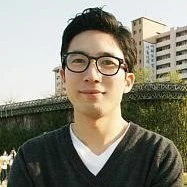

+++
title = "[인터뷰] '개방, 참여, 공유'가 내 일의 핵심"
date = "2022-09-24T00:00:00+09:00"
description = "베를린 메르세데스 벤츠 이노베이션 랩의 배창혁 엔지니어"
tags = ["인터뷰", "메르세데스-벤츠", "MBition", "오픈소스", "자동차", "베를린", "독일"]
categories = ["Interview"]
author = "이은서"
image = "cover.jpg"
canonicalUrl = "https://brunch.co.kr/@123factory/32"
+++

‘과학자’는 누구를 일컫는 말일까? 어릴 적 많은 사람의 꿈이 ‘과학자’라고 했을 때 상상했던 그림은 이러하다. 실험실에서 비커를 들고 실험하거나 현미경을 살피는 모습, 물리·화학 이론과 싸우며 새로운 발견을 해내는 사람들의 모습이다.

실제는 어떨까. ‘과학’은 무엇보다 우리가 사는 삶에 가장 큰 영향력을 미치며, 현장에서 끊임없는 혁신을 통해 새로운 한 걸음으로 나아가는 분야이고, 이 현장에 종사하는 과학자·과학기술자는 이학·공학분야 및 그와 관련된 학제 간 융합 분야의 연구개발과 기술혁신 활동에 매진한다.

따라서 학문적 성과로 과학자를 정의할 수도 있지만, 과학기술의 최전선인 실생활과 직접적으로 연결되는 혁신 영역에서 활동하고 있는 많은 혁신가들도 우리는 새로운 의미에서 과학자라 부를 수 있을 것이다. 독일의 한국 과학자를 찾아다니면서 만난 혁신가 중 한 사람인 배창혁 엔지니어도 그런 의미에서 혁신을 고민하는 과학자에 가깝다. 배창혁 님은 베를린의 독일 메르세데스-벤츠 이노베이션 랩(Mercedes-Benz Innovation Lab) MBition GmbH에서 소프트웨어/시스템 엔지니어(Software/System Engineer)로 일하고 있다.

MBtion은 메르세데스-벤츠의 자회사로 ‘메르세데세스-벤츠의 소프트웨어 팩토리’를 모토로 2017년에 설립되었다. 베를린에 있으며, 현재 42개국에서 온 엔지니어들 250여 명이 일하고 있다. 주로 메르세데스-벤츠의 차량에 들어갈 인포테인먼트(infotainment) 시스템을 설계하고 구현하는 일을 한다.

MBition은 독일 남부 진델핑엔(Sindelfingen)에 있는 메르세데스-벤츠 생산 공장과 긴밀하게 협력하며 미래 소프트웨어를 개발하는 것이 임무이다. 크게 차량 인포테인먼트에 들어갈 소프트웨어를 개발하고 통합하는 임베디드 시스템(embedded system), 인포테인먼트에 들어갈 정보를 주고받을 수 있는 클라우드 서비스(cloud service), 개인 맞춤형 경험을 선사할 모바일 앱(mobile app) 개발 등 세 가지 영역에 초점을 맞추고 있다.

*mercedes me 2020 app ©️ Mercedes Benz*

예를 들어, 지난해 개발된 Mercedes Me 2020 앱은 스마트폰에서 자신의 자동차를 제어할 수 있는 기능을 가지고 있다. 현재 차량의 상태, 다음 정기 점검 기간, 탑승 전 에어컨 작동, 전기차를 위한 충전소에 가장 적합한 경로 제안 등이 앱으로 가능하다.

MBition은 자체 운영체제인 MBiENT를 개발하였는데, MBiENT를 통해 자동차 생산 사이클과 관계없이 차량에 맞는 인포테인먼트용 시스템을 개발할 수 있다. 즉, MBiENT를 사용하면 자동차에 탑재된 하드웨어로 구현되기 전에 새로운 애플리케이션을 실행해보고 테스트해 볼 수 있다. 이 플랫폼을 통해 인포테인먼트 시스템을 지속적으로 재사용할 수 있게끔 개발할 수 있다는 장점이 있다.

또한 자율주행을 위한 ADAS(Advanced driver assistance systems) 시스템을 개발하고 있으며, 알고리즘에서 플랫폼까지, 시뮬레이션에서 검증에 이르기까지 전 과정을 작업한다는 것이 특징이다.

혁신을 위한 자체 플랫폼 개발을 위한 소프트웨어 및 AI 관련 회사를 설립하는 것은 메르세데스-벤츠뿐만이 아니라 전 세계 자동차 회사들의 트렌드이다. 전기차와 자율주행차 등 미래차를 위한 당연한 수순이다.

## 오픈소스가 이끌어 온 길

MBition에서 일하기 전 배 엔지니어는 9년여 동안 LG전자에서 소프트웨어 개발자로 일했다. 일상생활에서 많이 사용하는 가전인 TV와 핸드폰을 비롯한 특정 기기를 위한 소프트웨어 개발을 했으며, 2013년 LG전자가 HP로부터 웹 OS를 인수하고 나서부터는 소프트웨어 인테그레이션(integration)을 주로 담당했다.

즉, 다른 사람들이 만들어 놓은 것을 통합하는 것이 주요한 임무였다. 그렇다 보니 자기의 영역 이외에도 알아야 하고, 공부해야 할 것들이 많았다. 다행이었던 것은 LG전자에서 관련 분야 연구와 배움에 대한 자율성을 많이 보장받았다는 것이다. 보통의 대기업 문화와는 다르게 업무에 관해서 상당히 융통성이 있었고, 직원들이 해외 콘퍼런스 등을 참여하여 배우고 혁신할 기회를 많이 주었다.

배 엔지니어는 이런 기회를 통해서 당시 관련 분야 최신 정보를 획득하고, 세계의 전문가들과 네트워킹도 용이하게 할 수 있었다고 한다. 또한 이러한 경험을 통해 해외에서 일하고자 하는 꿈이 조금씩 커졌다고.

한국에서는 보통 개발자로 일을 하다가도 어느 정도의 경력과 나이가 되면 관리자가 된다. 그렇기 때문에 대부분 관리자를 목표로 일을 하게 되고, 나이가 들면 직접 연구하고 개발하는 일선에서는 물러나야만 하는 분위기가 있다.

하지만 배 엔지니어는 콘퍼런스를 통해 만난 다양한 국가의 엔지니어 중 60대에도 개발자로 일하며, 끊임없이 혁신에 일조하고 있는 사람을 목격하였다. 이를 통해 기존에 알아 왔던 미래에 대한 다른 그림을 마주치게 되었다.

또 오픈소스 소프트웨어를 통해 지속해서 자신을 성장시켜 나가면서 앞으로 자신이 나아갈 길에 대한 방향을 설정했다. 이러한 방향키 덕분에 LG에서 직장 생활을 하면서도 지속적으로 사이드 프로젝트를 진행할 수 있었다.

그는 오픈소스 프런티어(KOSSLAB), 오픈 임베디드 TSC(Technical Steering Committee) 멤버 및 Yocto 프로젝트 이사회 멤버로도 참여하면서 끊임없이 다른 개발자들과의 소통과 피드백을 통해서 공부를 지속해 왔다.

오픈소스 소프트웨어는 동료 평가(peer review)와 커뮤니티 기반의 프로덕션이기 때문에 회사에서와는 다른 차원의 동기부여가 됐다고 배 엔지니어는 설명했다.

특히 Yocto 프로젝트를 하면서 계속 관련 책들도 번역을 하여, ‘Yocto 프로젝트를 활용한 임베디드 리눅스 개발(2014)’, ‘BeagleBone Black을 사용한 Yocto 프로젝트(2015)’, ‘Embedded Linux Projects Using Yocto Project Cookbook(2016)’을 출간하는 등 별도의 성과도 쌓아갈 수 있었다고. 하지만 무엇보다도 다른 사람과 지식 공유를 하면서 함께 성장해 나간다는 느낌이 큰 의미를 주었다고 한다.

현재도 배 엔지니어는 ‘Automotive Software Architect’를 번역하고 있다. 이 책이 끝나면 다음에 번역할 책도 이미 정해뒀다. 공부와 동시에 지식을 공유하고자 하는 그의 계획이 끝없이 이어지고 있는 셈이다.

*배창혁 메르세데스 벤츠 이노베이션 랩의 엔지니어 ⓒ 배창혁*

## 자동차 분야에서의 도전, 긴 안목을 갖기

가전 분야에서 일을 해오던 배 엔지니어가 자동차 분야로 뛰어들 수 있었던 것도 이러한 프로젝트 덕분이다.

배 엔지니어가 경험한 GENIVI, AGL(Automotive Grade Linux) 프로젝트는 차량용 소프트웨어 개발을 위한 프로젝트였고, Yocto 기반의 개발 환경을 두고 있었으며, OS로 리눅스를 사용했다. 이 프로젝트를 통해 한국에서 오픈소스 개발자 양성에 참여하면서, 동시에 자동차 분야에 큰 관심을 두게 되었다. 이것이 그를 MBition까지 이끌고 온 동력이 되어 주었다.

그는 “당시 참여했던 프로젝트가 ‘개발자 양성’이라는 목표를 가지고 있었지만, 이를 통해 지식을 공유하고 남들에게 쉽게 설명하기 위해 더 많은 공부를 해야 했던 과정을 통해 오히려 자신이 성장할 수 있는 좋은 기회였다.” 고 표현했다. 동시에 자동차 분야라는 새로운 도전으로 자연스럽게 옮겨올 수 있는 경험이 되기도 했다고.

가전 분야와는 다르게 자동차 분야는 그 호흡이 상당히 길다. 안전 및 생명과 직결되는 분야이기 때문에 새로운 것을 도입하는 것을 조심스러워하는 분위기이다. 최근 전기차, 자율 주행차 등의 미래차에 관한 이슈가 주목받고 있지만, 산업 구조상 모든 것을 한꺼번에 바꾸기는 힘들다.

따라서 천천히 바꿔나가기 위해서는 그만큼의 시간이 확보돼야 하고, 최대한 안정적인 결과를 내기 위해서는 긴 안목을 가지고 연구해야 한다. 이를 위해 세계 최고의 인재들을 영입하는 데에도 지원을 아끼지 않아야 한다.

MBition의 개발자들은 IT 전문가들로 구성이 되어 있지만, 개발자 모두가 자동차 분야의 전문가는 아니기 때문에 이에 관하여 직원 교육에 상당히 많은 투자를 한다.

즉, 자동차 개발 프로세스 등을 익힐 수 있도록 전문 교육을 제공하고 있고, 배 엔지니어도 이러한 프로그램의 도움을 많이 받았다고 한다. 최근에는 자율주행 쪽에 관심이 생겨 그 분야의 온라인 코스를 신청해두었다고 한다. 장기적으로 자동차 분야의 큰 그림을 보면서 개발할 수 있도록 토대를 만드는 것이다.

그는 “기존에 한국에 있을 때는 해외 콘퍼런스 참여 등을 통해서 관심 있는 분야에 관해 공부하고 사람들을 알아나갔지만, 현재 자신이 관심 있는 분야의 핵심에 들어와 일하니 하루하루가 콘퍼런스 같다”라고 배 엔지니어는 설명했다. 또한 배 엔지니어는 “밖에서는 보지 못했던 정보들을 얻을 기회가 많고, 동료들과 토론과 협업을 통해서 기술을 발전시켜 나갈 수 있어 즐겁다”라고 덧붙였다.

이러한 협업의 문화가 낯선 것은 아니지만, 직장에서 동료들이 발휘하는 남다른(?) 자율성에 대해서는 아직 결론을 내리지 못했다고 한다. 배 엔지니어는 “팀 단위로 엄청난 자율성이 보장되어 있기 때문에 ‘과연 제품이 잘 나올 수 있을까?’ 의문이 드는 순간들이 간혹 있었기 때문”이라고 설명했다.

배 엔지니어는 “워낙 워라밸이 좋은 나라로 유명한 독일이니 어느 정도 예상을 했지만, ‘당장 제품을 내야 하는데 문제가 좀 있어서 늦게까지 일해주면 좋겠다.’는 상사의 부탁을 받아도, ‘독일법에는 하루 10시간 이상 일하는 것은 불법’이라며 그렇게 일하지 않을 것이라는 의견을 차분히 피력하는 동료들을 보고, 또 그 지적을 아무렇지 않게 담담하게 받아들이는 매니저를 보고, ‘이곳에서는 한국과는 다른 처세술이 필요하다.’는 생각을 했다”고 한다.

독일에서는 매니저급을 제외하고는 야근이며 초과 근무가 거의 없는 것은 당연하고, 여름휴가를 한 달가량 신청하기도 한다. 이것이 계약상 정해진 휴가 일수를 넘기는 것은 아니니 그 누구도 눈치를 주거나 문제를 제기하지 않는데, 처음에는 그런 점이 낯설었다고 배 엔지니어는 말했다. 한편으로는 ‘그럼 그 한 달간의 공백이 어떻게 메꿔지는 걸까.’ 질문이 생기기도 했다고.

## 개방, 참여, 공유의 과정에서 펼쳐지는 새로운 길

이제 배 엔지니어는 새로운 배움과 도전의 길 앞에 서 있다. MBition에서 처음 도입되는 전 세계 다임러(Daimler) 계열사와의 교류 프로그램에 신청해서 한국 다임러에서 일할 기회를 얻게 되었기 때문이다. 전 세계 다임러 계열사의 연구개발 프로젝트를 골라 한 달 동안 함께 일하면서 새로운 것을 배우게 된다.

배 엔지니어는 한국의 다임러 연구개발을 담당하는 팀으로 파견되어 한 달을 공부와 공유의 기회로 삼으려 한다고 전했다. MBition에 있는 동안은 본사 다임러로부터 운영되는 다양한 프로그램을 최대한 많이 활용하고 체험해 보는 것이 목표이다.

한 직장에서 오래 일했지만, 지금까지 새로운 분야에 대한 지속적인 연마와 경험을 통해 다른 이들보다 더 많은 레퍼런스를 쌓을 수 있었던 배 엔지니어는 인터뷰를 통해서 앞으로 10년 안에 이룰 포부를 밝혔다.

그는 “많은 사람의 꿈이 실리콘밸리다. 저 또한 그랬다. 하지만 메르세데스-벤츠에서 일하게 되는 경험을 통해 ‘어디인가, 어느 회사인가?’ 보다 내가 무엇을 하는지가 더 중요하다는 사실을 알았다. 내 분야에서 잘하고 있으면 꿈꿔왔던 회사가 나에게 먼저 문을 두드려 줄거라 믿는다”고 말했다.

그래서 그는 엔지니어 중에서도 전체 시스템을 설계하는 아키텍트(Architect)가 되기 위한 구체적인 목표를 갖고 나아가고자 한다는 말로 인터뷰를 마무리했다.

*이 글은 <사이언스타임즈>의 ['독'일의 '한'국 과학자들]에 기고하였습니다.*

---

**이은서**
eunseo.yi@123factory.de
