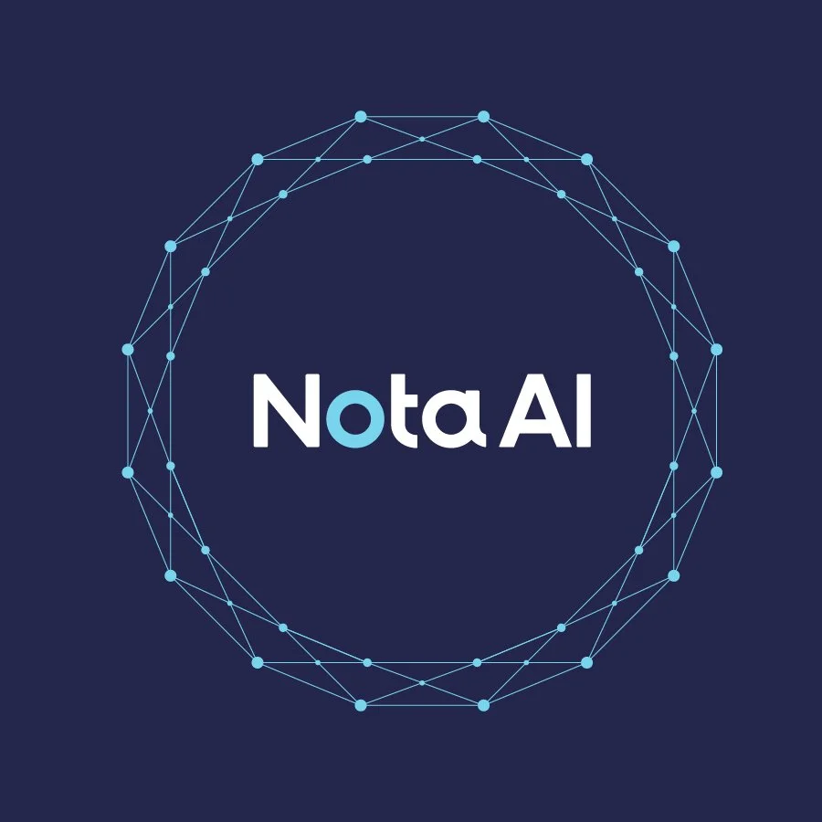
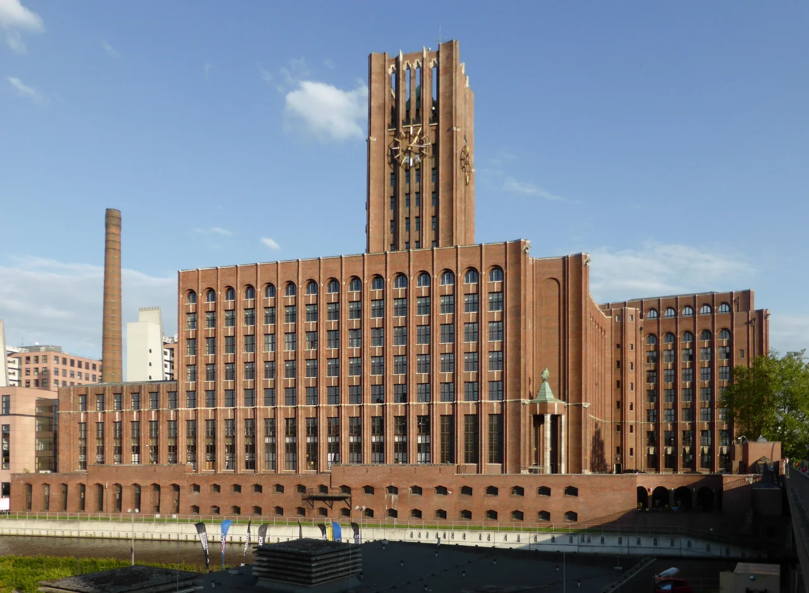
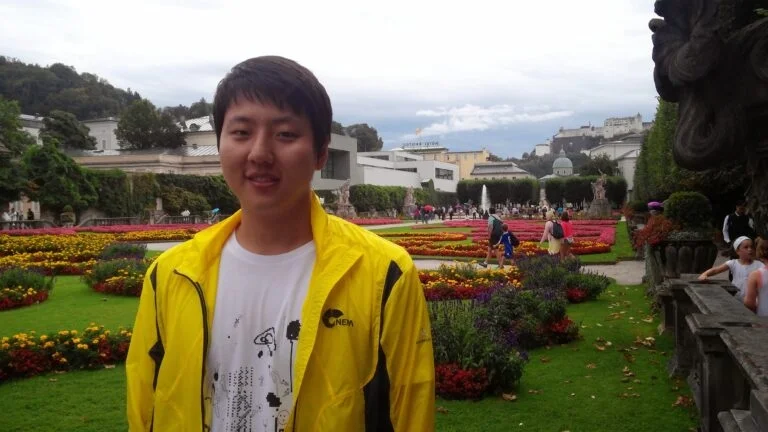
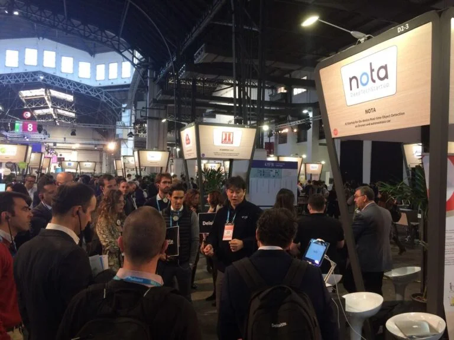

+++
title = "[Interview] Ich möchte mit Menschen arbeiten, die in dieselbe Richtung blicken."
date = "2022-09-21T03:48:26+09:00"
description = "Dr. Seulki Yeom vom On-Device-KI-Startup Nota in Berlin"
tags = ["Interview", "Nota", "KI", "Startup", "Berlin", "Deutschland"]
categories = ["Interview"]
author = "Eunseo Yi"
image = "cover.webp"
+++

Am 2. Dezember 2020 verkündete die deutsche Bundesregierung ihre „Fortschreibung der nationalen KI-Strategie" und zeigte damit ihren Willen, die Führungsrolle bei KI-Technologien zurückzuerobern, bei denen man gegenüber China und den USA ins Hintertreffen geraten war. In Deutschland und ganz Europa gilt KI als eine der wichtigsten Technologien der Zukunft, und die politische Unterstützung dafür ist großzügig.

Innerhalb Deutschlands ist Berlin die Stadt mit den meisten KI-Startups und steigt zum Hub für neue Technologien in Europa auf. Hier in Berlin sitzt Nota (Nota AI GmbH), ein On-Device-KI-Startup mit der Philosophie, „das Leben durch künstliche Intelligenz bequemer und reicher zu machen".

Nota verfügt über Technologie zur Komprimierung von Deep-Learning-Modellen, eine Kerntechnologie der On-Device-KI. Mit dieser Technologie arbeitet das Unternehmen vor allem an KI für Mobilität, Sicherheitsüberwachung und Einzelhandel; in Korea war es das erste Startup, in das Naver D2SF investierte.

Später gelang im August 2020 eine Series-A-Finanzierung mit Beteiligung von Samsung Venture Investment (Samsung SDS Fund), LG CNS, Stonebridge Ventures und LB Investment, womit eine kumulierte Investitionssumme von rund 10 Milliarden Won erreicht wurde; das Unternehmen hat die ungewöhnliche Geschichte, als erstes in Korea gleichzeitig strategische Investitionen der Samsung-Gruppe und der LG-Gruppe eingeworben zu haben. Nach einer Series-B-Finanzierung über 17,5 Milliarden Won im Dezember 2021 sicherte es sich 2022 eine Beteiligung von Kakao Investment und befindet sich auf Wachstumskurs.

Nota, das in Korea mit erstaunlichem Tempo wuchs, gründete im November 2019 eine Niederlassung in Kalifornien, USA, und errichtete im April 2020 eine neue Gesellschaft in Berlin, wobei Dr. Seulki Yeom als Senior Researcher gewonnen wurde.

Bis Anfang 2022 war Nota im Berliner Hubraum tätig, einem Coworking-Space und Startup-Inkubator der Deutschen Telekom, Deutschlands größtem Telekommunikationsunternehmen. Der Hubraum öffnete 2012 und fördert Startups in den Bereichen 5G, KI und IoT; nur vielversprechende Startups können nach einem strengen Auswahlverfahren einziehen.

Seit Mai 2022 hat es sich in The Drivery eingenistet, Europas größtem Mobilitätshub, und verstärkt die Zusammenarbeit mit der Mobilitätsbranche.

*Nota ist in The Drivery eingezogen, Europas größtem Mobilitätshub. ©️ Dirk Ingo Franke, CC BY-S*

Ich traf Dr. Seulki Yeom — der als Forscher an der Universität arbeitete und gerade erst den Schritt in ein Startup gewagt hat, um Technologie zu entwickeln, die im realen Leben gebraucht wird — und hörte von Forschung und Leben in Deutschland als koreanischer Wissenschaftler.

## Ein Love Call drei Tage nach dem Doktorabschluss

Dr. Seulki Yeom absolvierte seine Promotion im Pattern Recognition and Machine Learning Lab der Fakultät für Hirn- und Kognitionstechnik der Korea University. Forschungsziel dort ist es, mit Mustererkennungsalgorithmen hochentwickelte Verfahren der Bildverarbeitung (Kamerabilder) und Signalverarbeitung (Hirnsignale) zu entwickeln und darauf aufbauend KI-Technologie zu erarbeiten.

Die Hauptfelder sind beispielsweise die Brain-Computer-Interface-Technologie, die es durch die Analyse von Hirnsignalen ermöglicht, externe Geräte allein durch Gedanken zu steuern; die Cognitive-Computer-Vision-Technologie, die durch Kamerabildanalyse menschliches Verhalten analysieren und vorhersagen kann; die Deep-Machine-Learning-Technologie, die das menschliche Gehirn nachahmt; und die intelligente Neuro-Rehabilitationstechnologie, die Patienten eine selbstständige neuronale Rehabilitation ermöglicht.

Dr. Yeom erhielt seinen Doktortitel im Ingenieurwesen für Brain-Computer-Interfaces. Und 2018 erhielt er einen Love Call von Professor Klaus-Robert Müller von der TU Berlin, der damals im Rahmen des Programms „World Class University (WCU)" als Gastprofessor an der Korea University war. So wurde er nur drei Tage nach seiner Promotion als Postdoc an der TU Berlin eingestellt.

An der TU Berlin trat Dr. Yeom der Machine Learning Group bei. Sie zählt in Deutschland zur Spitze der Machine-Learning-Forschung, mit hervorragenden Forschungsergebnissen und einem hervorragenden Forschungsumfeld.

Dr. Yeom hielt Vorlesungen über maschinelles Lernen für Bachelor- und Masterstudierende und nahm an großen EU-Projekten teil, verband also Lehre und Forschung. Das Labor der TU Berlin befasste sich hauptsächlich mit der Verbindung des Gehirns mit Computerschnittstellen sowie mit Themen rund um Kompressions- und Verschlankungstechnologien; damals lief insbesondere ein Projekt, das Krankheiten des Menschen per EKG misst, auf Hochtouren. Dr. Yeom nahm an diesem Projekt teil und erforschte zugleich als individuelles Forschungsfeld das Pruning, eine der Kompressionstechniken.

*Dr. Seulki Yeom erforschte an der TU Berlin, wo er drei Tage nach seiner Promotion eingestellt wurde, die Pruning-Technologie. ©️ Seulki Yeom*

Zuvor hatte er sich vor allem mit Interpretationsmethoden beschäftigt — dem Hineinschauen in und Interpretieren des Entscheidungsprozesses von Deep-Learning-Modellen, um herauszufinden, was wichtig ist und was nicht —, doch bei der Suche nach einem Forschungsthema für seinen Postdoc begann er, sich für das Pruning unter den Kompressionstechniken zu interessieren.

Pruning ist, wie das Wort „Beschneiden" sagt, eine Technik, die Bedeutsames stehen lässt und Bedeutungsloses wegschneidet. Im weiteren Sinne ist es eine Art Interpretation, doch gerade als er das Gefühl hatte, dass Deep Learning eher schwerfällig voranschritt, übte das Pruning — eine Technik, die herausfindet, welche Stränge des komplex verflochtenen Nervenbündels man durchtrennen kann — eine große Anziehungskraft auf ihn aus.

Dr. Yeom vertiefte sich in die Erforschung von Methoden, die die Verschlankung durch Pruning im Blick behalten und zugleich die Leistung kontinuierlich aufrechterhalten.

## Die Begegnung mit Nota, das in dieselbe Richtung blickte

Während er an der TU Berlin individuelle Forschung und Teamprojekte betrieb, war die Freude an der Forschung groß, doch ein unerklärlicher Durst wurde ebenfalls immer größer. An einem Teamprojekt nehmen üblicherweise fünf bis sechs Personen teil. Doch bei der Arbeitsweise spürte Dr. Yeom oft, dass sich die Grundeinstellung der Teammitglieder von seiner unterschied.

„Wenn ich etwas mache, konzentriere ich mich auf diese eine Sache, tauche ganz darin ein und bewege mich auf das Ziel zu. Aber ich hatte das Gefühl, dass die anderen Mitglieder an mehreren Dingen gleichzeitig teilnahmen und sich auf kein einziges konzentrieren konnten. Vor allem konnte ich die Haltung nicht verstehen, trotz eines Paper-Abgabetermins in zwei Wochen in einen langen Urlaub zu fahren."

Natürlich war das auf persönlicher Ebene völlig normal, aber auf Teamebene betrachtet blieb viel zu wünschen übrig. Es fühlte sich an, als liefen die Kollegen nicht gemeinsam auf ein Ziel zu, sondern als liefe Dr. Yeom allein mit vollem Einsatz. Doch fand er es befremdlich, dass am Ende sowohl diejenigen, die beim Paper nachlässig gewesen waren, als auch diejenigen, die wegen ihres Urlaubs nicht hatten teilnehmen können, alle gemeinsam mit ihrem Namen auf dem Paper standen.

Bei der Teamforschung ist vor allem die Freude groß, die aus dem gemeinsamen Wachsen entsteht. Doch während seiner zweieinhalb Jahre an der TU Berlin war das Schwierigste, dass das Gefühl der Entbehrung im Team umso größer wurde, je härter er arbeitete und sich auf die Forschung konzentrierte. Mitten in diesen Überlegungen traf er Myungsu Chae, den CEO von Nota.

CEO Chae dachte damals über die Gründung einer europäischen Gesellschaft nach und pendelte zwischen Berlin und Amsterdam auf der Suche nach dem passenden Standort. Während er dabei Wissenschaftler vor Ort traf und die Entwicklungen beobachtete, entdeckte er Dr. Yeom an der TU Berlin und schlug eine kurze Kaffeepause vor.

Dr. Yeom hatte auch zuvor hin und wieder Anrufe von Headhuntern erhalten. Aber es war ihm wichtig, seine aktuelle Forschung bestmöglich zu betreiben, und da er kein Interesse an einem Jobwechsel hatte, war er auf die Angebote der Headhunter kein einziges Mal eingegangen.
Doch als Notas CEO Chae sagte: „Nota verschlankt Modelle durch Modellkompression", da hätten sich seine Augen schlagartig geöffnet, erzählt er.

Dr. Yeom erinnerte sich an die Begegnung mit Nota: „Es begann mit dem simplen Interesse ‚Das ähnelt ja meiner Forschung?', aber als wir unsere Meinungen über die Technologien austauschten, an denen wir jeweils forschten, war ich auf einmal überzeugt, dass wir auf denselben Punkt blicken."

Von da an ging alles Schlag auf Schlag. In Amsterdam waren mehr koreanische Unternehmen ansässig als in Berlin, was die Firmengründung in vielerlei Hinsicht erleichterte. Es hatte auch den Vorteil, eine internationalere Stadt als Berlin zu sein, in der Englisch fast als Verkehrssprache dient. Innerhalb Deutschlands aber ist Berlin die Stadt mit den meisten KI-Startups und steigt zum Hub für neue Technologien in Europa auf.

Darüber hinaus wirkten die Tatsache, dass Berlin auf der Stärke des Staates Deutschland aufbauend wachsen kann, und die Tatsache, dass Dr. Seulki Yeom in Berlin war, als Gründe dafür, dass Nota seine Gesellschaft in Berlin gründete.

## Die gemeinsam mit Nota entworfene Zukunft

Nota nahm 2019 am MWC in Spanien teil, der weltweiten Mobilfunk- und ICT-Messe. Das war noch vor der Gesellschaftsgründung, und man nahm teil, um die Reaktionen vor Ort in Europa zu erkunden — doch das Interesse der Besucher war größer als erwartet. Während die überwiegende Mehrheit der Unternehmen cloudbasierte Technologien präsentierte, zeigte allein Nota Edge-Geräte.

*Nota nahm am MWC in Spanien teil, der weltweiten Mobilfunk- und ICT-Messe, und bestätigte das Potenzial seiner eigenen Edge-Geräte. In der Mitte Notas CEO Myungsu Chae. ©️ nota.ai*

Nota entwickelte NetsPresso, eine Plattform zur automatischen Kompression von KI-Modellen. Auch Dr. Yeom ist bei Nota auf Grundlage von NetsPresso für Forschung und Entwicklung zuständig. Kompressionstechnologie ist in Europa im Vergleich zu den USA und China noch wenig vertraut.

Selbst in der Machine Learning Group der TU Berlin, Europas führendem Machine-Learning-Labor, dem Dr. Yeom angehörte, betreiben viele ähnliche Forschung, aber kein Forscher widmet sich ernsthaft der Kompression. Auch wenn Europa bei der Technologieentwicklung langsamer sein mag als Korea, hat es seine Stärken.

Grundsätzlich herrscht eine offene Haltung gegenüber jeder Forschung, und weil Grundlagentechnologie geschätzt wird, werden Investitionen und die Weiterentwicklung von Technologie zügig erreicht. In Korea ist der Weg bis zur Investition selbst bei großem Interesse an einer Technologie weitaus schwieriger als in Europa. Deshalb ist Europa auch aus Unternehmenssicht ein Land der Möglichkeiten.

Für Menschen, die im Ausland einen Postdoc machen, ist es üblich, nach Korea zurückzukehren und Professor zu werden. Das ist der stabilste Weg, und es gibt viele Möglichkeiten, mit staatlichen Forschungsmitteln gut ausgestattete Forschung zu betreiben. Doch Dr. Yeom hat einen anderen Weg gewählt, und so fragte ich ihn nach den guten und den schweren Seiten der Arbeit in einem Startup.

„Der große Vorteil ist, dass man alles ausprobieren kann, ohne das Scheitern zu fürchten. Statt in einem Großunternehmen nur zugewiesene Arbeit in einem bereits festgelegten Rahmen zu erledigen, kann man in einem Startup Forschung und Entwicklung, mit der das Unternehmen stark wachsen kann, federführend vorantreiben — das macht die Zufriedenheit hoch", antwortete er.

Und: „Etwas Schweres habe ich noch nicht entdeckt. Wenn ich etwas nennen müsste: Da ich nicht forsche, weil es mir jemand aufträgt, kann man ohne Selbstdisziplin endlos nachlässig werden. Das behalte ich im Hinterkopf, schicke fleißig Fortschrittsberichte an die koreanische Zentrale und versuche, noch dynamischer zu arbeiten." Denn letztlich sieht er genau darin seine Rolle in dem ‚Team, das in dieselbe Richtung blickt und leidenschaftlich arbeiten kann', das er sich ausgemalt hatte. Auf die Zukunft von Nota und Dr. Seulki Yeom — die auf Basis von Computer Vision in Fertigung, Bau, Handel, Mobilität und vielen anderen Bereichen aktiv sein werden — darf man gespannt sein.

*Dieser Artikel wurde für [Koreanische Wissenschaftler in Deutschland] von <The Science Times> verfasst.*

---

**Eunseo Yi**
eunseo.yi@123factory.de
