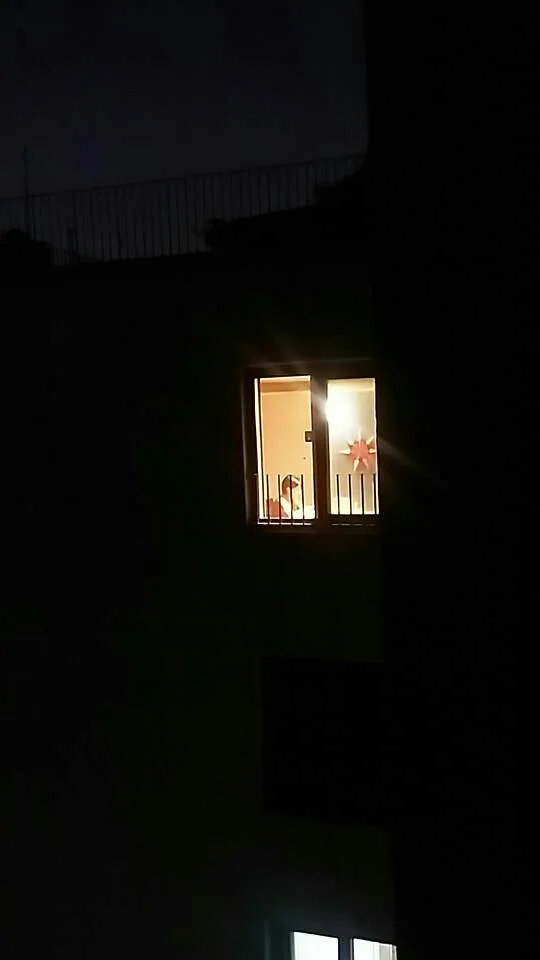
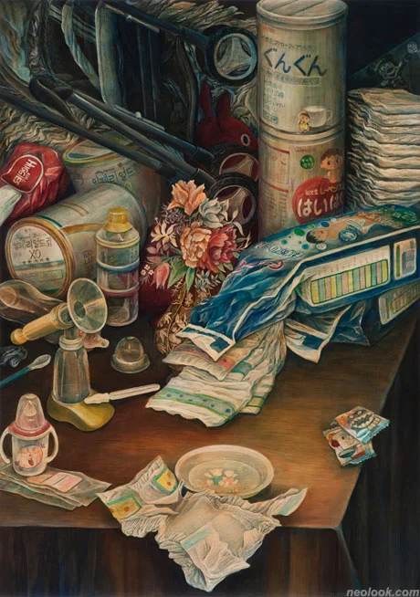
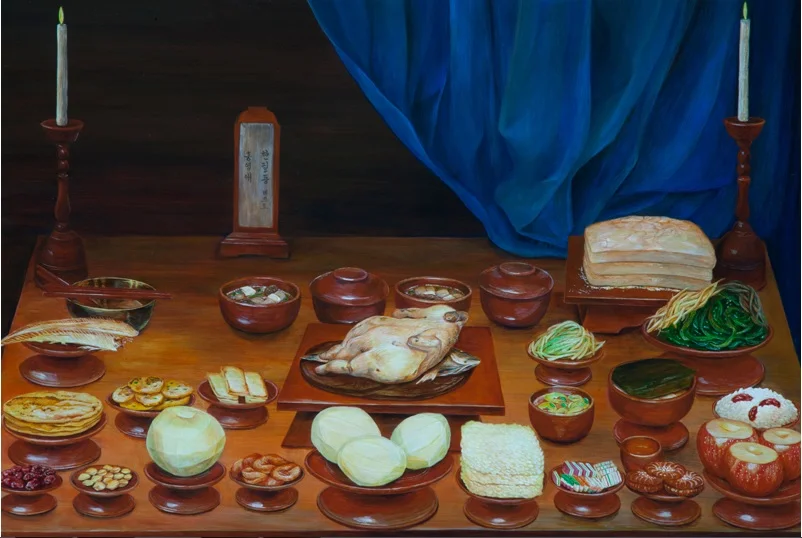
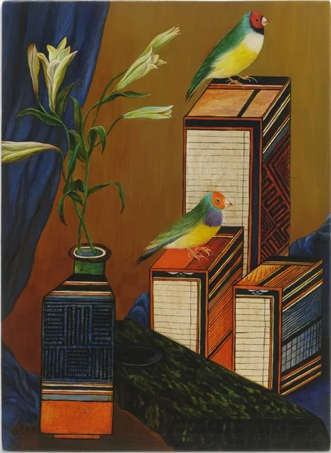
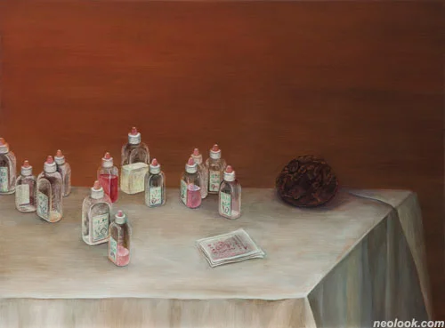

+++
title = "[인터뷰] 새벽에 일합니다."
date = "2022-09-01T10:24:46+09:00"
description = "그림 그리는 아랫 집 여자, 곤도 유카코 인터뷰"
tags = ["인터뷰", "화가", "예술", "엄마", "새벽"]
categories = ["Interview"]
author = "이은서"
image = "cover.webp"
canonicalUrl = "https://brunch.co.kr/@123factory/29"
+++

## 생존에 꼭 필요한 새벽

밤 10시가 되어서야, 아이들을 재우면서, 나는 늘 함께 골아떨어진다. 새벽 2시, 밀린 일들을 생각하다 눈이 번쩍 떠진다.

사방이 적막하다. 나의 하루가 시작 된다. 식탁 위 작은 전등 하나만을 켜놓고 노트북 화면에 집중하고 있는 것은 하루 중 오롯한 나만의 시간이다. 쓸데 있는 일을 하든, 쓸데 없는 일을 하든, 하고 싶은 일을 하든, 해야만 하는 일을 하든, 고요하게 내 할 일을 하는 그 시간은 내 다른 일상을 지탱해내기 위한 힘의 원천이다. 가끔 피곤해서 그 시간을 건너뛰기라도 하면, 하루 종일 이유 모를 짜증이 머리 속 한켠에 한움큼 뭉쳐있다. 그래서 나에겐 새벽 2시와 4시 사이의 시간은 소중하다. 아이들을 재우고 난 후, 식탁 위에 노트북을 폈다. 아랫집 불도 켜져 있다.

*새벽이 나의 공식 업무 시간이다.*

## 아랫 집 여자

같은 시간 아랫 집 여자도 깨어서 무언가를 하고 있다는 사실을 알게 되었다. 같은 자리에서 여자는 노트북 키보드 위에서 바삐 손을 움직이는 대신, 붓을 들고 부지런히 화폭을 채우고 있었다. 아랫 집 여자는 화가이다. 아랫 집 여자에게는 아이가 하나 있다. 우리는 새벽 2시에서 4시 사이의 서로의 존재를 알게 된 이후, 급속도로 가까워졌다. 그 여자는 나에게 태양처럼 밝은 사람이라고 했고, 나는 그 여자의 유머가 달빛 처럼 시원하고 은은한 것이 참 마음에 들었다.

*곤도 유카코, 필수품. 코튼, 패널에 아크릴 채색_72.5 X 51.5 cm_2010*

여자도 나와 비슷한 시간에 일어나 그림을 그린다는 것을 알게 된 것은, 그 여자의 그림을 통해서이다. 여자의 그림을 지배하는 어둠의 색은, ‘한밤, 혼자, 잠겨있음, 살기 위해’ 라고 말하는 것 같다. 그림에서는 혼자만의 어둠이 뚝뚝 흘러 내린다.

여자와 나는 예술인들이 모여사는 마을의 이웃으로 만났다. 다양한 예술분야의 사람들이 모여 살기 때문에 서로의 작업에 관심을 갖고 이야기를 많이 나눈다. 서로 요즘 어떤 작업을 하고 있는지 안부차 묻는 일이 많다. 하지만, 우리가 처음 만나서 했던 이야기는 거의 육아와 아이들 학교 문제에 관해서 였다. 우리는 이렇게 이야기를 나누면서 서로의 대화 내용에 흐릿하게 웃음을 지었던 것 같다.

그래, 너나 나나 하나의 독립된 창작자, 작가이기 이전에 엄마이지. 아마 우리 남편들은 만나서 이런 얘기 하지 않을거야. 그들은 작업 이야기를 꺼내겠지. 이 세상의 거대한 화두에 골몰해 있는 것 같은 남자들. 하지만 우리는 아이가 아파서 학교에 가지 못한 이야기. 그래서 엄마도 일주일 간 거의 아무것도 하지 못하고 아이 병간호를 해야만 했던 이야기, 그리고 다시 일상이 돌아오면, 작업에 돌아오기 까지 얼마나 시간이 많이 걸리는지에 관하여 이야기 나누었다. 홀로 마음 놓고 작업할 수 있는 시간은 아이를 재워 놓고 난 그 후 뿐이라고. 엄마들은 결코 시간을 허투루 쓰지 않는다고 했던 누군가의 말이 생각났다.

## 대화

아랫 집 여자 곤도 유카코는 1973년 오사카에서 태어났다. 오사카 사람들은 유머러스하기로 유명하다. 유카코도 그런 기질이 있어서인지, 그녀와의 대화는 항상 즐겁다. 유카코는 가끔 본인이 ‘웃겨야만 하는 사명’을 가진 것처럼 느껴진다고 하지만, 그 사명 덕택에 내 일상은 구원받는 느낌이 든다. 무엇보다 작가답게 세상을 보는 시각도 독특할 때가 있다. 아이들과 놀이를 할 때에도 그 유머와 창의성은 십분 발휘 된다. 유카코가 아들 지무와 함께 그린 그림, 함께 만든 그림 책들은 화가 엄마만이 해 줄 수 있는 가장 큰 예술 수업이다.

유카코의 뮌헨 개인전에 사용할 팜플렛의 내용 준비를 도우면서, 나는 처음으로 유카코의 그림과 작업에 대해 진지하게 긴 시간 이야기를 나눌 수 있었다.

*곤도 유카코, 한가의 제사상, 코튼, 패널에 아크릴 채색, 51.5 X 72.5 Cm, 2012*

---

## 작품에 곤도 유카코만의 특별한 기법이 있는 것 같다.

2005년부터 생활에서 일상적으로 사용하는 용품이나 음식을 17세기 네덜란드 정물화의 주제인 바니타스*(무상함)의 개념과 그 이미지를 인용하면서 그려왔다. 17세기 정물화에서 보이는 정물과 현대 생활 속에서 보이는 정물을 21세기에 살고 있는 나의 위치에서 바라보면서 현대사회에서 가벼워지는 생과 죽음에 관한 존재감에 대해서 고찰해왔다.

*바니타스 정물화: 17세기 네덜란드와 플랑드르 지방에서 그려지던 정물화로 세속과 물질의 덧없음을 나타낸다.

## 그림의 소재들이 여성으로서 공감되는 부분이 많다. 어떻게 소재와 방법을 선택하는가?

2007년에 한국남성과 결혼하고 그 후 시댁과 제사, 시부모의 존재로 자연스럽게 전통적인 한국문화와 접하는 계기가 많아졌다.

첫 번째 민화시리즈 작업은 아주버님 결혼 선물로 드릴 그림을 생각하다가 가볍게 시작했다.
바니타스 정물화의 이미지와 민화에서 가져온 복숭아(불로장생을 상징)나 수박(다산을 상징)을 그려서, 기저에는 무상함을 담고 있으면서도 축하의 마음과 소원의 마음을 전달했다.

이후 민화가 가지고 있는 유머러스함과 민화에 사용되는 대상물 하나하나의 의미가 다양해서 그 재미에 흠뻑 빠지게 되었다.

바니타스 정물화와 민화를 동시에 고려하면서 또 하나 흥미로운 점을 발견하였는데, 그것은 바니타스 정물화가 죽음에 대해서 이야기하고, 민화의 문방도는 삶(生)에 대해서 이야기 한다는것이다. 나는 서양과 동양 사이에서 이 대조적인 시점이 존재한다는 것이 너무 재미있다고 생각해서 바니타스 정물화와 민화의 문방도 이미지를 혼합시켰다.

*곤도 유카코, 테오와 테아 테아, 코튼, 패널에 아크릴 채색, 33.5 X 24.5 Cm, 2011*

화법도 다르고 뜻도 다른 정물들이 하나의 상(이 '상'은 작가의 식탁, 책상이기도 하고 바로 삶의 무대이다.) 위에서 어떻게 어우러지는지 궁금했다.

죽음을 향하는 바니타스 정물화는 더 나은 삶을 위해 도덕적이고 교훈적인 메시지를 담은 것이고 생(生)을 향하는 문방도도 장래에 대한 소망을 담고 있기 때문에, 결국은 둘 다 삶을 바라보고 있다.
그렇게 해서 처음에는 무상함을 바라보고 시작한 나의 작업이 한국생활과 최근 독일생활 통해서 다른 층위의 작업으로 발전해 나가고 있다. 즉 현실적인 무상함을 바닥에 깔고 있으면서도, 덧없이 반복되는 일상의 정물들이 우리에게 그 존재자체의 무게와 아름다움을 알려주고 삶의 위로를 주게 되는 것이다.

## 그림의 색감이 굉장히 매력적이다. 그 어둠은 어떻게 만들어지는 것인지.

대학교에서 유화기법을 배우고 직접 유화를 안료부터 만들어보기도 했고 나무합판을 직접 자르고 면천을 덮어 고정시키고 나서 탄산칼슘가루와 아교를 섞어서 젯소를 만들어 캔버스에 바르고 작업을 했다. 그것이 다만 재료기법을 배운다기 보다 중세의 작업 속도와 환경을 체험하는 느낌이었다. 오랜 시간을 쌓아가며 완성된다는 점과 물성의 정수만을 응축하여 소중하게 다룬다는 점, 그리고 무엇보다 그 색감의 깊이가 나를 사로잡았다.

간단하게 설명한다면 묘사할 대상의 밝은 부분을 흰색으로 묘사하고 투명한 색을 층으로 계속 올린다. 그 사이에 명도가 필요하면 흰색으로 묘사하고 또 투명색을 올려서 작업을 하는 기법이다. 원래 유화와 템페라를 사용하는 기법이지만 지금은 아크릴을 응용하며 발전시켜 작업하고 있다.
나는 층으로 올리고 또 올리는 그 작업 기법이 하루하루를 쌓여가는 일상을 표현하는 내 작품과 내 삶이 닮았다고 생각한다.

*곤도 유카코, Still Life with Pet Bottles코튼, 패널에 아크릴 채색, 39 X 54.5 Cm, 2010*

---

## 밤, 엄마는 역사를 만든다.

많은 엄마들이 아이를 재우고 나서야 비로소 자기만의 시간을 갖는다. 나의 경우는 아이를 재우면서 같이 잠드는 경우가 일상다반사이기 때문에, 그 시간을 확보하기 위해 늘 잠과의 전쟁이다. 왜 이렇게 매일을 전쟁처럼 치러내야하는지……

유카코의 집에 놀러가면 그 치열했던 전쟁의 흔적을 더욱 확연히 목격할 수 있다. 부엌의 한 켠에 오브제로 사용했던 빵과 컵, 밤새 부지런히 움직였을 붓과 물감이 놓여 있다. 부엌에 공존하는 살림의 도구와 그림의 도구가 왠지 씩씩한 무기와 같다. 우리는 이렇게 서로의 밤을 확인하고 눈을 찡긋하며 우리만이 이해할 전우애를 나눈다.

내 동료, 아랫 집 유카코.

---

**이은서**
eunseo.yi@123factory.de
