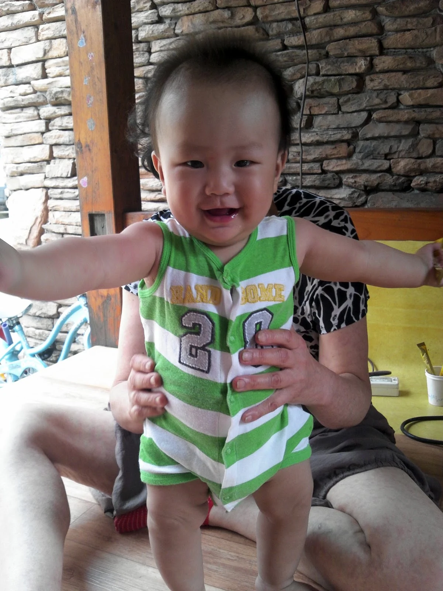
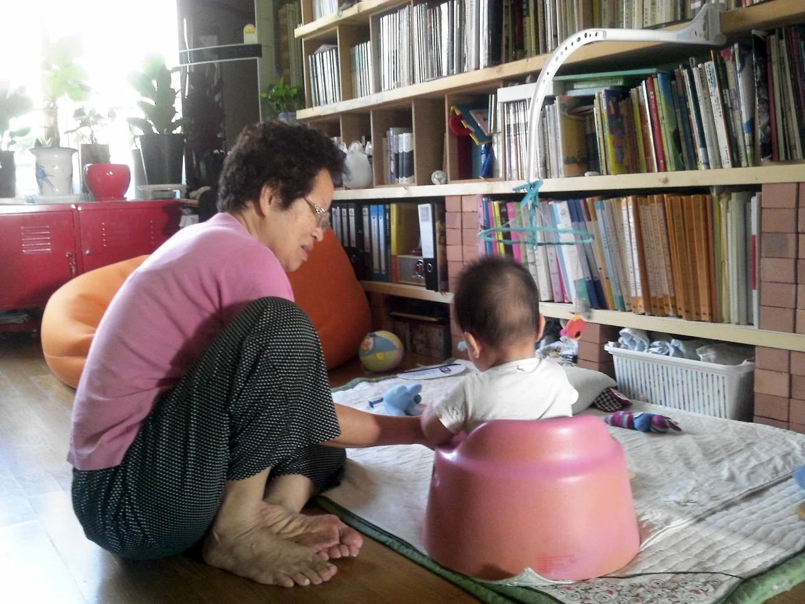
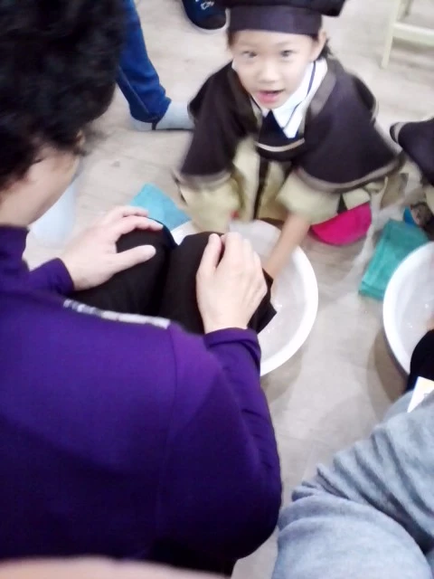
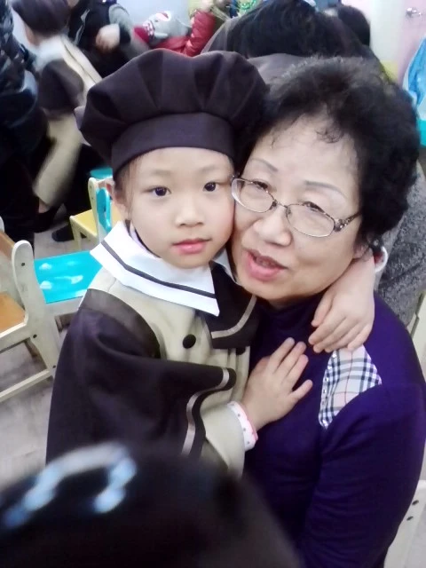
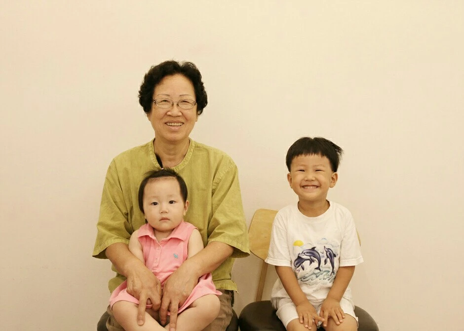

+++
title = "[Interview] I Am Working."
date = "2022-09-01T10:00:00+09:00"
description = "Ms. Song Munja, who carries a child on her back and raises a city"
tags = ["Interview", "Mother", "City", "Care"]
categories = ["Interview"]
author = "Eunseo Yi"
image = "cover.webp"
+++

## Though Unseen, There Are Hands All Around Us That Care for Us.

## The Unseen Hand

Here, in the broad daylight of the city. Behind a child standing as if by their own strength, there is a hand thought to be invisible.

A hand that was born in 1942, before the liberation, as the eldest of ten siblings; that lived through the Korean War in elementary school; that in the 1970s owned a house in Seoul with a wide yard — a hand that, had she simply held on to it, could have gone on to the dream occupation of being a landlord, left the grandchildren to a helper's care, and enjoyed her old age traveling around. It is the hand of Ms. Song Munja.

"Mun," the eldest of ten siblings, named with the wish that she would open the door (mun) well and come out first, has memories of carrying her younger siblings on her back from the age of five. The memory of fussing because she didn't want to wash her sibling's diapers at the stream. The memory of, when she turned twenty-five and gave birth to her own first child, also nursing and raising her youngest sibling, born just a year earlier.

And then, starting with helping take her eldest daughter's two children — her maternal grandchildren — to and from school (1998), she practically raised her youngest son's one daughter from the age of six months to seven (2006–2012), and even cared for the two children of her eldest son, who married late (2012–2017). The many memories of Munja's hands have a brilliant career.

*<Child, I'll Reach Out My Hand>*

## How did you come to care for your grandchildren?

My younger son and his wife are a dual-income couple, so his mother-in-law took charge of the first child, but when the second was born, the mother-in-law's health wasn't good, so I took the second child on in earnest. When the child was four months old and the mother returned to work, I cared for the child from then until just before elementary school.

And then my eldest son married late and came to live with us, so I cared for his baby right away. That makes three grandchildren who have passed through my hands.

## What memory stands out from caring for your grandchildren?

When my younger son's daughter graduated from kindergarten, at the graduation ceremony they held a foot-washing ceremony to thank the parents for raising them, and the kindergarten principal said, "Yewon (my granddaughter) was raised with Grandmother's hard work, so Grandmother, please come out." When my granddaughter washed my feet so devotedly then, it felt as though all the hardship of those years simply melted away.

*<Foot-washing ceremony photo>*

*<My younger son's daughter, whom I raised from four months to seven years old>*

## What was the hardest part of caring for your grandchildren?

The hardest times are, of course, when the children are sick. When a child is ill, I wonder whether I cared for them poorly… and more than that, seeing the child suffer hurts my heart the most. When they're sick, I carry them on my back even more and they cling to me more, so physically I run short too……

A while ago I was so exhausted that I went to the hospital for a nutritional IV, and the doctor said to me, at my age as a grandmother (76), I'm still looking after children and doing housework, so no wonder I'm tired. He said I work far too much. But I think of it as my calling. So when my body doesn't follow my will and my strength runs short — that upsets me the most.

## When were you most proud while caring for your grandchildren?

It's when they eat well what I've made, when they're healthy, sleep well, and act adorably. And that happens often. So I look after them. They're lovely. So very lovely.

## Who is more lovely, your children or your grandchildren?

(Firmly) The grandchildren, of course.

I raised my children so frantically I didn't even know whether they were lovely. Still, when my eldest son was born, people said he was far more developed than his father. They all said our son was lovely. My youngest son was also so lovely. I sent only the youngest to kindergarten, and when I washed his face and dressed him neatly in his kindergarten uniform, he couldn't have been more adorable. They said my daughter looked a bit boyish, but her behavior was lovely. She took good care of her younger siblings, too.

## Apart from caring for your grandchildren, if you were to work, what kind of work would you like to do?

I'd like to try becoming a psychological counselor. As a pastor's wife, I listened to many of the church members' troubles. And people tell me I'm quite good at counseling. My whole life had been raising children and supporting my husband's work, so hearing such praise, the thought suddenly struck me. If I had done this professionally, I would have done really well… If I ever get the chance later, I'd really love to do that kind of work.

## Have you never felt hurt by your working daughters-in-law?

(When the daughter-in-law asks to her face, she hesitates… Let me reveal at this point that the interviewer is Ms. Song Munja's eldest daughter-in-law.) That's a hard question. I'll think about it and send it to you over KakaoTalk later.

What follows is Mother's reply, sent over KakaoTalk.

> Not enough attention to family
> Not enough tidying of the house
> It feels like I'm being tested... this is hard….

## The Power of Care: We Are Always Indebted to Someone for Their Care.

> To my daughter-in-law,
> Without any preparation, I take up the notebook and write a few words.
> Happy birthday, and thank you for coming to our home as our daughter-in-law, and thank you for giving us a grandchild — yet every year your birthday just passes by like this.
>
> The way you don't turn away from your blunt mother-in-law and always speak kindly and in detail — in my heart I am grateful for it.
> Your body is heavy now, so don't be too greedy about work; please rest while you go about things.
> Lastly, I pray our whole family stays healthy. And that you have a safe delivery.
> I've prepared seaweed soup, fresh cabbage kimchi, and deodeok, so grill them and eat.
>
> May 2015

*A letter Ms. Song Munja gave her daughter-in-law on her birthday*

At some point we learn that the world is something we face alone. And at the same time, we think as though we grew up entirely on our own. But how great a debt have we owed to those unseen hands of care? It is a far more concrete power of labor than can be generalized under the mere name of "mother."

That caring hand fed me, put me to sleep, dressed me, and washed me. Above all, it stayed with me through many hours I do not even remember. And as my head grew bigger, I, too, came to believe I had grown up alone. But the hand that cared for me, becoming the hand that prays for my success and well-being, naturally came to care even for my child.

## The Caring Hand, the Praying Hand, Raises the City.

> Dear OO,
> I just want to call you that, like a daughter. Thank you for everything. Living with a mother-in-law who isn't affectionate by nature, you must have suffered much in your heart. I don't know whether we'll meet and live together again, but I'm sorry I couldn't help make our time together more comfortable, and if I make an excuse, shall I blame it on my age?
>
> Your character, the way you push forward without hesitation, without fear — I envy it, too…
>
> With that character and that clever head of yours, I believe you will succeed.
>
> And I believe you will raise your children, who take after you, well too.
>
> Even if everything goes well, if you lose your health it all seems to come to nothing. I hope you all take care of your health, and when I think of the life you must pioneer, going off with two children to that place like a barren wilderness with no foundation at all, my heart aches and I feel for you endlessly — but it is the path you chose, so I can only pray for your success. Just contact me often, and let me see the children growing up. That's all I ask......
>
> Above all, I pray you stay healthy and do your best toward your goal.
>
> I pray that the little money you have is received as much.
>
> February 2017

*A letter Ms. Song Munja wrote when sending her daughter-in-law off to live on her own*

How do we endure this war-like daily life? Mental strength? Diligence and industriousness? No. It is by the concrete touch I had taken for granted. Perhaps revealing that this touch exists is the way to make daily life in the city a little more livable.

It declines to let mothers be treated as if they all had to play the role of mother as a matter of course, and as if that were to be regarded as sublime only under the name of "mother." For several years, the number-one wished-for gift on Parents' Day was always "cash." Does that simply mean money? Let us come to our senses while they are still alive and recognize that they have been the number-one contributors who moved the city. Then spring will come a little closer.

*Together with the two grandchildren added by my eldest son's late marriage*
