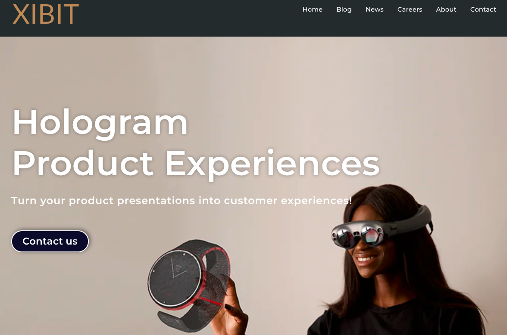
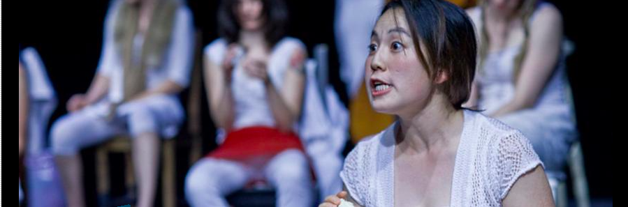
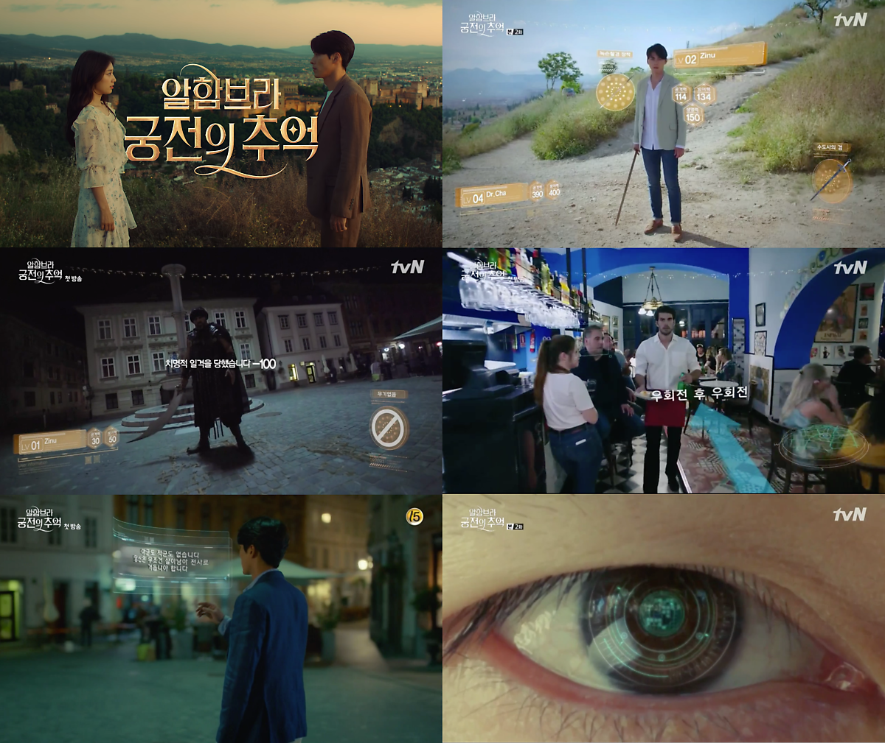
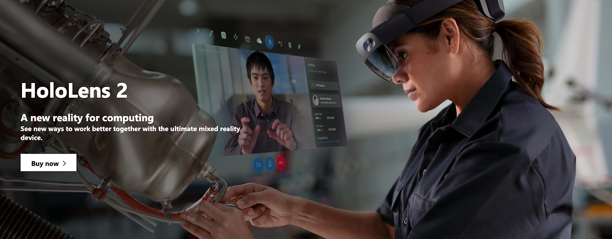
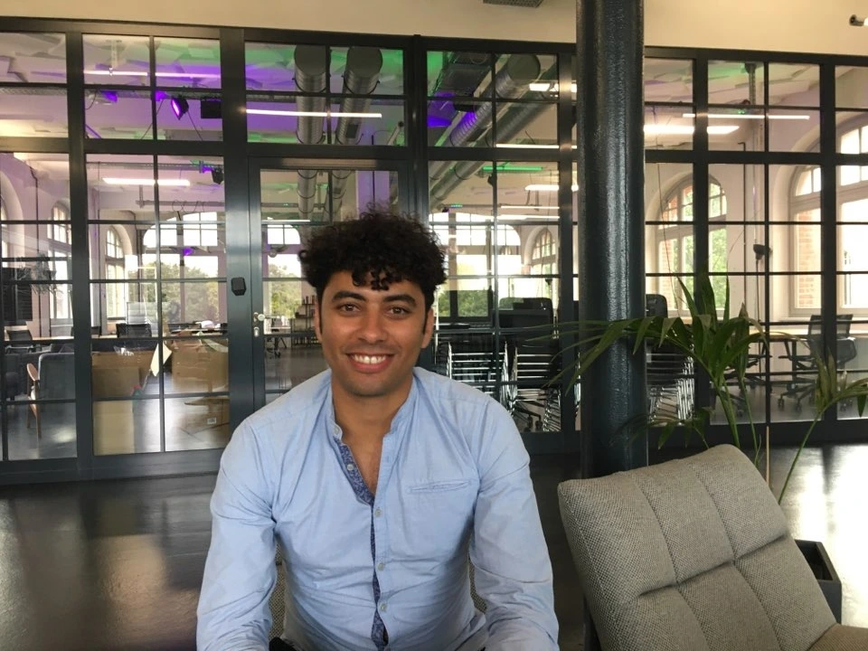
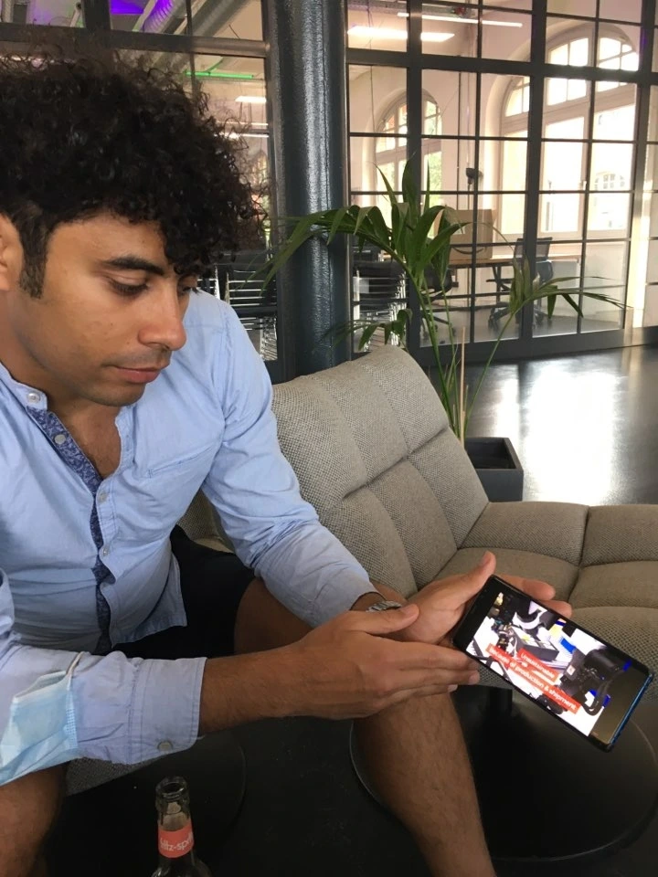

+++
title = "[Interview] Zak Jaiathe of Xibit"
date = "2020-10-05T14:38:29+02:00"
description = "People I Met at Factory Berlin"
tags = ["Augmented Reality", "Virtual Reality", "VR", "Interview", "Startup", "Germany", "Berlin"]
categories = ["Interview"]
author = "Eunseo Yi"
image = "cover.png"
+++

## People I Met at Factory Berlin

*Zak Jaiathe of Xibit*

## If Only I Could Catch a Glimpse from Afar

My interest in virtual reality (VR) began with the thought: "If only I could watch someone I can't meet in person, even from a distance." When I first studied theater in Berlin, I learned about the acting theory of Michael Chekhov, a Russian actor. My teacher, describing Chekhov's performance, spoke of it with such vividness.

However, my question was always: <b>"How do you know so well if you've never seen it yourself?"</b> Chekhov had many students who diligently recorded his performances and lessons. His acting theory was passed down from mouth to mouth, from notebook to notebook. But I always felt a lingering regret: "If only I could see his acting just once, I could feel and learn it so much better..."

Of course, recordings of him exist. In Alfred Hitchcock's 1945 film *Spellbound*, Michael Chekhov was even nominated for an Academy Award for Best Supporting Actor. But that's not the poor-quality video I wanted. I wanted Chekhov himself to come and demonstrate his acting.

*Ten years have passed, but this photo still remains on our school's homepage. One of the best things I did in Berlin was learning Chekhov's acting theory at this school. ©mtsb.de*



## Virtual Reality (VR) + Augmented Reality (AR) = Mixed Reality (MR)?!

The reason I brought up these old stories is that I realized something impossible 10 years ago might now be possible with current technology. Earlier this year, the VR human documentary *Meeting You*, produced by MBC, garnered an explosive response with about 22 million views and 49,000 comments on YouTube. A mother who lost her 7-year-old daughter to leukemia was briefly reunited with her daughter, recreated through VR technology.



After watching this video, I saw infinite possibilities. Could we meet separated families in the North, or family members in distant places we cannot meet due to COVID-19? Of course, the key factors are time and cost.

In Berlin, a tourist attraction called [TimeRide](https://timeride.de/en/berlin/) was developed, where you can wear VR glasses and travel through pre-unification East Berlin. I had seen many books and photos of East Germany, but I was so curious about what it would feel like to experience it in VR that I visited the site near Checkpoint Charlie as soon as it opened.

The verdict? I expected a seamless, realistic experience, but it was below expectations. First, you see some brief materials about the division of Germany. Then you hear the life stories of three people from East Germany and choose one whose voice guides you through the VR experience. You sit in a small model bus, wear VR glasses, and watch graphics that are so obviously fake that every pixel is visible. I felt it would have been better to just watch an old documentary from the East German era; the 14-euro entrance fee felt like a waste.

Beyond VR, which provides a fully immersive experience by blocking out the real world, there is AR, which overlays virtual information onto the real world. Pointing your smartphone's Google Translate camera at a menu to instantly see it in Korean is thanks to AR technology we use frequently. Games like *Pokémon GO* also drew explosive interest from their launch, and the tvN drama *Memories of the Alhambra*, inspired by *Pokémon GO*, became a hot topic among VR enthusiasts, sparking debates on how realistic the technology was and whether it was accurately portrayed.

*Drama 'Memories of the Alhambra', the ending was so disappointing. © tvN*

However, experts say it's more accurate to call the technology in *Memories of the Alhambra* MR (Mixed Reality) rather than AR. MR takes the best of both VR and AR while prioritizing interaction with the user. Although it seems similar to AR, the technology differs in terms of object and spatial recognition because it must interact with the user.

Currently, the leader in MR technology is Microsoft's HoloLens. First revealed in 2015, HoloLens has consistently generated explosive reactions. It has demonstrated capabilities like playing games like Minecraft or using holograms for FPS games. *TIME* magazine even named HoloLens the best electronic device of 2015. Currently, only the developer edition is available, and Microsoft plans to release it to the public once sufficient content is secured.

*HoloLens 2 has been released. ©microsoft*

## Xibit: An MR Software Startup at Factory Berlin

As soon as I moved into Factory, COVID-19 hit, and I could hardly use the space. Through occasional online networking, I met several startup founders, consultants, and staff. Zakaria Jaiathe, the founder of Xibit, and I happened to connect through both Factory and LinkedIn networking, leading us to exchange messages and meet for a casual cup of coffee. I was interested in Xibit's MR technology, and Zakaria was interested in entering the Korean market.

*Zak Jaiathe, CEO of Xibit © Eunseo Yi*

Zak, originally from Morocco, came to Germany in 2014 to join the software company SAP. Starting as a software engineer, five years later he became the Office of the CTO (Team Lead for AR/VR) and served as a mentor and judge for Google Developer Groups, boasting a brilliant career. He then decided to start his own business in the VR field, founding Xibit with co-founder and CPO Abdeljalil Karam, becoming a resident startup at Factory Berlin.

As the name suggests, Xibit develops MR software specialized for exhibitions and trade fairs. It creates a "Brand Experience" where consumers can directly experience products through MR at various types of exhibitions.



Although it's only been about a year and a half since its founding, there are several indicators of Zak and Xibit's activity and potential. Xibit won the *Beautiful Software Awards* in 2019 and took first place at the *Luxury Innovation Award* in 2020, even being featured in *Forbes*. Additionally, Zak was named one of the *Top 100 Founders* by *Business Punk* and was listed in the *2020 Q2 VR/AR MARKET REPORT: GERMANY* published by the German VR/AR Association. However, seeing as it is still registered as a UG*, it can be considered a startup in its very early stages.

*\*UG: Unternehmergesellschaft (haftungsbeschränkt), a limited liability company that can be established with a contribution of as little as 1 euro. It can be converted into a GmbH (limited liability company) once profits exceed 100,000 euros.*

Currently, they have seven employees, many of whom are not full-time but freelancers collaborating flexibly. Since they haven't received significant investment yet, they strive to participate in various startup contests and award opportunities, and they hold many webinars and presentation opportunities to create investment leads. Especially as a startup supported by Factory Berlin, Zak mentioned that one of the biggest advantages of Factory is the many opportunities to meet investors, including various large corporations.

Currently, they are investing heavily in perfectly implementing 3D sound technology within the MR space. Additionally, as the demand for non-face-to-face exhibitions due to COVID-19 increases, they are putting a lot of effort into the marketing field. Here is a Q&A with Zak.

<b>Q. Xibit's technology seems likely to be used extensively in the field of artistic experiences. For example, during this pandemic, theaters and exhibition halls have all closed, haven't they?</b>

<b>A. That's exactly where Xibit started.</b> A project regarding an art exhibition was what led to the start of Xibit. Our goal was to implement technology so that artworks and audiences can communicate and experience each other, making the technology work intuitively rather than as a simple experience. But, as you know from theater, the arts don't make much money, do they? Despite our initial heavy investment, we didn't receive much financial help. So, we completely shifted our focus to trade fairs and commercial technology exhibitions. We put the most emphasis on developing intuitively so that it can be implemented with just a simple gesture from the person using MR.

*Zak explaining Xibit's technology in detail © Eunseo Yi*

<b>Q. The demand must have increased due to the COVID-19 pandemic. What's the situation like?</b>

A. The response hasn't been as large as expected yet. However, we're trying to make good use of it. IFA, the Berlin consumer electronics fair, was held both online and offline this time, and we saw various technical attempts like LG doing presentations via holograms. But because people were so disappointed about not being able to hold the fair offline, they couldn't imagine new technologies. Our software can truly be a good solution for the COVID era. To let customers experience products, it can be made possible through MR glasses and software even if the fair isn't held. I see it as an opportunity.

<b>Q. What hardware are you currently using?</b>

A. We prioritize Magic Leap because we have a partnership with them. However, we also have the technology to utilize HoloLens and Nreal.

<b>Q. Do I need to learn anything specific to use Xibit's software?</b>

A. We provide a separate tutorial service for customers. But it's designed to be very intuitive and user-friendly, so it takes less than a minute to get the hang of it.

<b>Q. What is life like as a founder?</b>

A. 90% of my life is related to Xibit. I spend 5% on sleeping, and the remaining 5% on watching Korean dramas.

<b>Q. Korean dramas?</b>

A. They are the most interesting content in the world. Actually, my ex-girlfriend was Korean. It's a long story from here... (laughs)

## Shall We Do Something Fun with Xibit?

Thanks to Zak, who knows Korea well, stories about Korean culture and technology flowed naturally without me having to explain much. We ended our brief coffee meeting with excitement about each other's potential.

The future of MR looks particularly promising. As people spend more time at home, interest is shifting toward technologies that offer better experiences. It's clear that it will be used as digital content not only in games, video, and film, which are already under development, but also in education, healthcare, and tourism.

Also, what will happen when recently developed IoT technology meets MR? I'm curious to see how Xibit will position itself within the various ripple effects to be discovered in the future. Shall I go do something fun with my Factory friend?

**Eunseo Yi**  
eunseo.yi@123factory.de

*This article was edited and adapted from the "European Startup Chronicles" series in BizHankook.*
