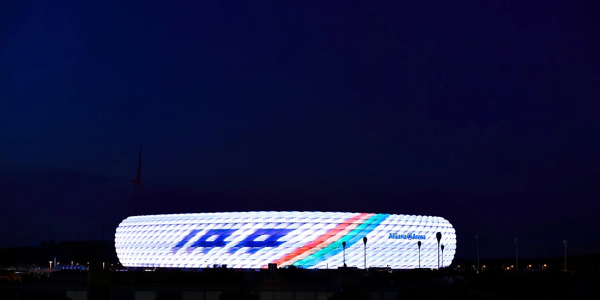
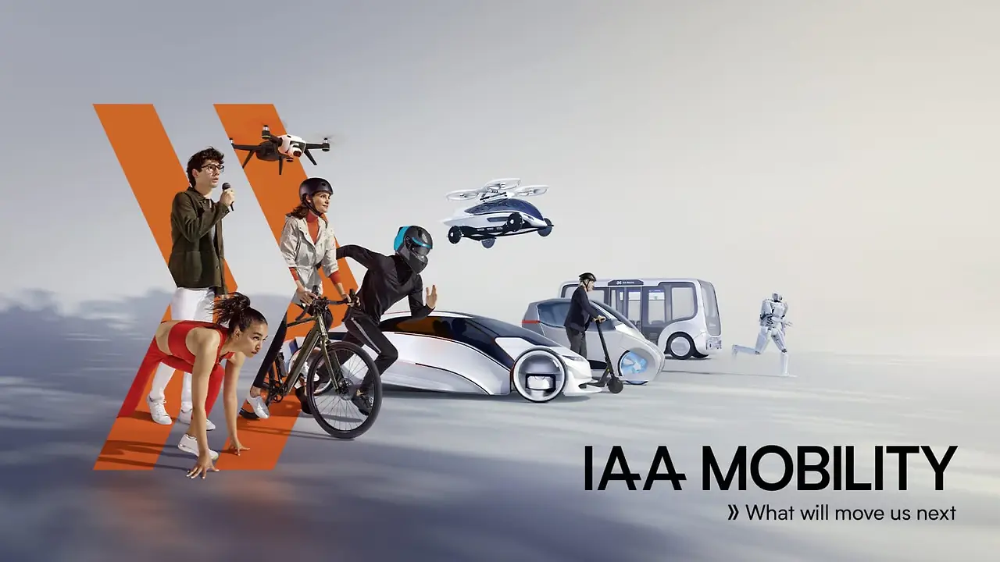
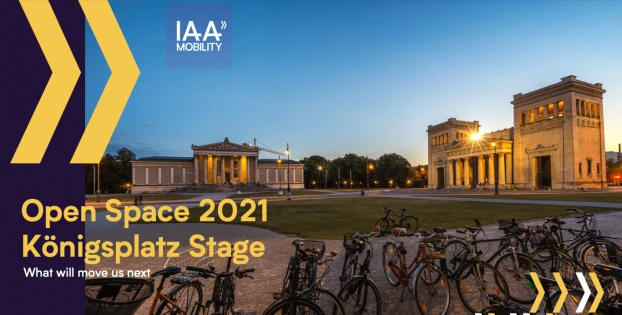
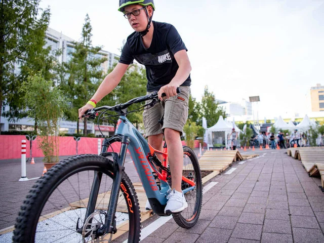
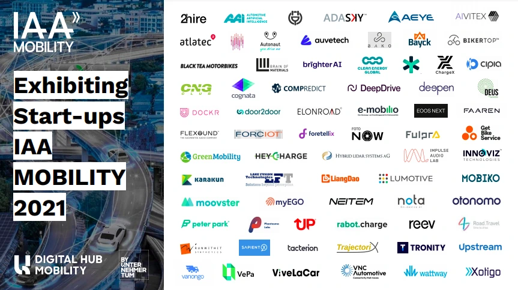
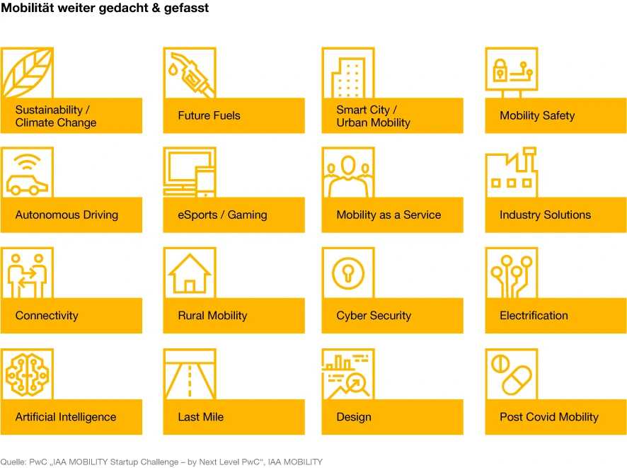

+++
title = "[유럽스타트업열전] 뮌헨 IAA 2021: ‘자동차’에서 ‘모빌리티’로…"
date = "2022-04-13T10:00:00+09:00"
description = "프랑크푸르트 모터쇼의 ‘변신’…그 중심엔 스타트업이"
tags = ["전기차", "스타트업", "모빌리티", "IAA", "뮌헨", "노타", "서울로보틱스", "독일"]
categories = ["Column"]
author = "이은서"
image = "cover.webp"
canonicalUrl = "https://brunch.co.kr/@123factory/26"
+++

## <b>‘자동차’에서 ‘모빌리티’로…뮌헨 IAA 모빌리티 2021 현장</b>

*커버사진 출처=iaa.de*

<b>프랑크푸르트 모터쇼의 ‘변신’…전기차와 자전거 등 미래 이동수단 집결, 그 중심엔 스타트업이</b>

## “유럽 모빌리티의 미래는 우리에게 있다.”

매년 가을, 독일 뮌헨을 상징하는 행사는 단연 최대 맥주 축제인 옥토버페스트다. 그러나 코로나19로 인해 지난 2년간 옥토버페스트가 열리지 못했고, 오랜 록다운 기간 동안 축제의 도시 뮌헨은 다소 침체된 분위기였다. 이번 주, 간만에 온 도시에 활기를 주고 관련 산업계의 이목이 집중되는 ‘사건’이 시작됐다. 9월 7일부터 12일까지 뮌헨 IAA Mobility 2021이 열리는 것이다.

*뮌헨 FC 바이에른 구장인 알리안츠 아레나에 ‘IAA 모빌리티’ 개최를 환영하는 조명이 환히 밝혀져 있다. 사진=iaa.de*

<b>IAA(Internationale Automobil Ausstellung)</b>는 우리에게 오랫동안 ‘프랑크푸르트 모터쇼’로 잘 알려진 행사다. 세계 최대 자동차 박람회로 1897년 시작되어 역사와 전통을 자랑한다. 지금까지 짝수 해에는 하노버에서 화물차 등 상용차 부문 박람회가, 홀수 해에는 승용차 부문 박람회가 프랑크푸르트에서 열렸다.

2015년에는 약 93만 명의 관람객이 IAA를 방문했다. 바로 그 기간에 폭스바겐 디젤 스캔들이 세간을 뒤흔들었다. 자동차 업계에 대한 신뢰가 무너짐과 동시에 기후 위기 관련 여론이 확산되면서 자동차 산업에 대한 근본적인 의문, 비판적인 시선이 노골적으로 생겨나기 시작했다. 2017년 IAA에는 81만 명이, 2019년에는 56만 명의 방문객이 프랑크푸르트 모터쇼를 찾았다. 방문객은 급격히 줄어드는 반면 환경보호 관련 시위대는 급격히 늘어나면서 프랑크푸르트 모터쇼에도 변화가 필요했다.

## 자동차에서 모빌리티로, IAA의 변화

아무리 오래된 전통이라도 혁신이 없다면 결국은 역사의 뒤안길로 사라지기 마련이다. IAA를 주최하는 독일 자동차산업협회(VDA)는 프랑크푸르트 모터쇼에 혁신이 필요하다고 판단해 행사를 진짜 ‘사건’으로 만들 수 있는 다른 도시를 물색했다. 베를린, 함부르크와의 경합 끝에 뮌헨이 IAA의 개최지로 최종 선정됐다.

*‘이제 우리를 움직이는 것은 무엇일까.’ IAA 모빌리티에서는 자동차뿐만 아니라 미래 이동을 위한 모든 수단을 볼 수 있다. 사진=iaa.de*

2021년 뮌헨에서의 첫 행사를 앞두고 정부와 산업계는 행사를 어떻게 성공적으로 개최할지 긴 논의를 벌였다. 코로나로 개최 여부가 불투명했지만, 자동차 산업이 독일에서 차지하는 위상이 그만큼 중요했기 때문이다.

코로나 상황이 점점 나아지던 지난 5월, 위생수칙 준수하에 온오프라인에서 동시에 즐길 수 있는 하이브리드 방식으로 전시회 개최가 결정됐다. IAA Mobility라는 새로운 이름과 함께. 그동안 ‘내연기관 자동차’ 위주의 전시회로 유명 자동차 회사의 신차 발표회라는 이미지를 탈피하고, <b>미래 모빌리티 전시회로서의 방향성을 확실하게 가져가기 위해 행사 이름부터 변화</b>를 꾀한 것이다. 전시회는 ‘<u>이제 우리를 움직이는 것은 무엇일까(What will move us next)</u>’라는 모토로 뮌헨 도시 곳곳에 <b>첨단 교통 시스템</b>을 체험할 수 있는 구간을 설치해 일반 시민들이 각종 미래 모빌리티를 경험하도록 구성했다.

*IAA 모빌리티가 열리는 동안은 전기차, 셰어링카, 전기 자전거, 무인 자동차 등을 이용해 뮌헨 주요 관광지를 돌아볼 수 있다. 사진=iaa.de*

‘모빌리티’라는 단어가 의미하듯 자동차 이외의 부스가 많은 것이 특징이다. <u>특히 자전거 공유플랫폼, 카셰어링, 자동차 구독 같은 모빌리티 서비스와 관련한 부</u>스가 눈에 띄었다. 무려 75개의 자전거 관련 업체가 전시회에 참가했고 자전거 관련 별도의 작은 홀도 두 개나 있었다. 기존 모터쇼에서 볼 수 없던 이색적인 풍경이다. 몇몇 부품사에서 이해를 돕기 위해 설치한 자동차 이외에는 내연기관 자동차를 찾아보기 힘들어 전기차 전시회라고 봐도 무방할 정도였다.

그도 그럴 것이 지난 7월 유럽연합은 2035년까지는 휘발유, 디젤 등으로 운행되는 내연기관 자동차의 신차 판매를 사실상 금지하는 정책을 발표했다. <b>경영 컨설팅 회사인 맥킨지(McKinsey)는 2030년 유럽 시장에서 전기 자동차의 점유율이 약 75%를 차지할 것이라고 발표했다.</b> 약 7000만 대 수준이다. 유럽에서 전기 자동차는 가장 대중적인 자동차가 되어가는 중이다. 내연기관 자동차의 퇴장으로 각종 대안 이동 수단이 각광 받으며 <u>‘자동차’의 시대에서 ‘모빌리티’의 시대</u>로 전환하고 있다.

*IAA 모빌리티 전시장 외부 공간에 마련된 자전거 신모델 체험장. 사진=iaa.de*

이렇다보니 자전거 관련 기업이 독일 주요 언론의 스포트라이트를 한몸에 받았다. 특히 대세는 화물용 전기 자전거다. 베를린 스타트업 에스블록스(Sblocs)는 IAA 모빌리티에서 화물용 전기 자전거를 선보였다. 화물을 싣고 이동하는 데에서 소형차 수준의 퀄리티를 보이면서도 가격은 훨씬 저렴하다. 네덜란드의 공유 화물자전거 플랫폼 도커(Dockr)도 IAA 모빌리티에 참가해 독일 시장 진출을 발표했다.

## 미래 모빌리티를 이끌어가는 스타트업 집결

<b>IAA 모빌리티의 핫 플레이어로 떠오른 것이 스타트업이다.</b> IAA 모빌리티에서는 스타트업들이 미래 모빌리티 산업의 중요한 역할을 할 것이라고 내다보았다. <u>기존 산업에서 나오기 어려운 혁신적인 아이디어를 던지고, 실행하고, 구현하는 스타트업이 모빌리티 산업의 핵심이라는 관점은 박람회 구성과정에서부터 반영됐다.</u>

유명 대기업과 글로벌 자동차 기업 위주의 전시장에서 구색을 맞추는 느낌이 아니라 각 전시장에서 가장 중요한 지점에 스타트업 구역(Startup Area)를 잡았다. 미래를 이끌어가는 스타트업의 비즈니스를 관람객이 자연스럽게 접할 수 있도록 구성한 것이다. 총 3개의 홀, 1500m²에 이르는 공간에 전 세계 76개 스타트업이 참가하는 큰 규모다.

*IAA에 참여한 모빌리티 관련 다양한 스타트업. 한국 스타트업 노타(nota)도 눈에 띈다. 사진=Digital Hub Mobility*

이곳에는 자율주행, 주행보조시스템, 라이더, 카메라 시스템, AI, 자동차 이외의 대안 모빌리티, 사운드/오디오 시스템, 전기 자전거 및 화물 자전거, 전기차 충전 인프라, 배터리 기술 및 자동차 재료 관련, 스마트 시티 관련 솔루션을 가진 스타트업이 참가했다. 한국 스타트업 중에는 서울로보틱스가 미국의 라이다 선도기업 벨로다인(Velodyne)과 함께 참여했고, 온디바이스 AI 솔루션을 제공하는 노타(Nota)가 단독 부스로 존재감을 과시했다.

스타트업을 위한 행사도 다채롭다. 9월 7일 저녁에는 <b>글로벌 컨설팅 기업 PwC</b>에서 주최하는 스타트업 피칭 프로그램 ‘넥스트 레벨 스타트업 챌린지(#NextLevel IAA MOBILITY Startup Challenge 2021)’가 개최된다. 스타트업들은 지난 8월부터 이 행사에 지원했다. 이들은 PwC의 전문 코칭을 받아 각자의 아이디어와 비즈니스 모델 확장을 위한 인큐베이팅에 참여한다. 자연스럽게 모빌리티 산업의 주요한 산업 관계자들과 네트워킹 하며, 자신들의 솔루션을 시장에 내놓을 기회를 갖게 되는 것이다.

PwC가 제시한 미래 모빌리티에서 각광받을 만한 스타트업 분야의 주제는 <b>지속가능성/기후변화, 미래연료, 스마트시티/도시이동성, 모빌리티 안전, 자율주행, e스포츠/게임, 서비스로서의 모빌리티(MaaS, Mobility as a Service), 산업솔루션, 연결성(connectivity), 교외이동성(rural mobility), 사이버 보안, 전력화(electrification), AI, 라스트마일, 디자인, 포스트 코로나</b> 모빌리티다. 미래 모빌리티 산업에서 가장 중요한 주제일 뿐만 아니라 기존 산업에도 가장 수요가 많은 주제라고 볼 수 있다. 이러한 주제에 중점 솔루션을 제공하는 스타트업이라면 글로벌 무대에 도전해볼 만하다는 뜻이기도 하다.

*PwC의 ‘넥스트 레벨 스타트업 챌린지’ 공모 주제. 미래 모빌리티에서 중요한 주제가 무엇인지를 확인할 수 있다. 사진=PwC.de*

9월 말 뮌헨 옥토버 페스트에서 열리던 스타트업 컨퍼런스 비츠 앤 프레첼(Bits & Pretzels)도 옥토버 페스트가 취소되면서 자연스레 IAA 모빌리티로 들어왔다. 9월 9일에는 비츠 앤 프레첼이 주최하는 ‘창업자의 날(Founders Day)’ 행사가 열리는데, 비츠 앤 프레첼 내의 스타트업 네트워킹 형성뿐만 아니라 투자자, VC(벤처캐피털) 및 엔젤 투자자와 테이블 미팅을 할 수 있는 독점 이벤트다. 또 포춘 50대 기업으로 선정된 프랑스의 3D 관련 소프트웨어 기업 다쏘 시스템(Dassault Systèmes)은 스타트업만을 위한 미팅 라운지를 마련하는 방식으로 스타트업을 지원한다. 다음 주에는 IAA 모빌리티 전시회의 참가한 유럽의 스타트업을 직접 만나보고, 이들의 혁신적인 아이디어를 소개하면서 모빌리티 분야의 미래를 점쳐볼 예정이다.

---

**이은서**
eunseo.yi@123factory.de

*본 글은 <비즈한국>의 [유럽스타트업열전]을 편집 및 각색하였습니다.*
