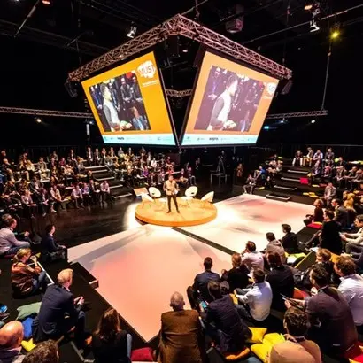
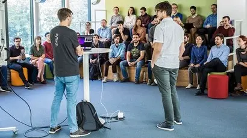
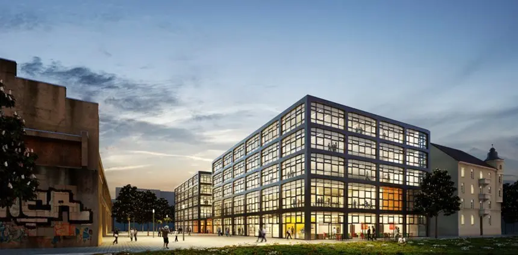

+++
title = "[European Startup Chronicles] 'Startup Over Beer': Munich's Startup Scene"
date = "2022-03-28T11:47:11+09:00"
description = "Led by Bavaria, Munich has ample capital and strong collaboration with major companies and universities..."
tags = ["Munich University", "Bavaria", "Startup", "Germany", "Europe"]
categories = ["Column"]
author = "Eunseo Yi"
image = "cover.webp"
+++

## The Startup Ecosystem in Munich, Where Startups Come Before Beer

*Cover photo source=must-munich.com*

## Rich in capital under Bavaria's leadership, with deep ties to major companies and universities, Munich is Germany's second startup region after Berlin

After looking at startups in Germany's capital, Berlin, this time we turn to the startup ecosystem of Munich, the central city of Bavaria.

Before Germany came to be known under the single name "Deutschland," it was a collection of region-centered city-states. Even after unification, Germany remains a federal republic made up of 16 states, each with its own constitution, government, and courts. The federal government and the 16 states exercise independent authority, while public safety, schools, universities, culture, and local administration fall under state jurisdiction. As a result, political, educational, and administrative systems differ by region, and regional identities have developed in very distinct and independent ways.

Bavaria is Germany's largest state. Its area is 70,550 square kilometers, accounting for about 20% of the country's total land area. Its economy is also exceptional. If Bavaria were treated as a country, it would rank around 17th in the world by economic size, far exceeding neighboring Czechia, Austria, and Switzerland. The headquarters of BMW, Audi, Siemens, Allianz, and Adidas are all in Bavaria, giving the state a remarkable presence.

Bavaria's capital is Munich. <b>Munich is dynamic, international, and economically affluent, giving it strong advantages in financing.</b> With startup accelerators, incubating programs, solid venture capital, and active investor groups, it is considered the most attractive German city for founding a startup after Berlin. The Technical University of Munich (TUM), widely regarded as a leading university, encourages students to launch startups, provides various programs, and supports networks with global corporations based in Bavaria.

*Munich Summit, hosted by the Munich Innovation Ecosystem, introduces Munich startups to the world. Photo=must-munich.com*

In 2020, Bavaria had 546 startups, and 63% of them were satisfied with their location. <b>A defining feature of Munich-area startups is their active collaboration with educational institutions and research institutes.</b> Munich is home to globally renowned research organizations such as the Fraunhofer Institutes in applied science and the Max Planck Society, which has produced many Nobel laureates. Twenty percent of startups collaborate with these local research institutes. This is why the region has many technology-based startups in aerospace, artificial intelligence, biotechnology, healthcare, and mobility. <u>Another feature is the relatively high share of green startups, around 20%, providing environment-related products and services.</u>

## Munich's Startup Community

Munich has several major communities leading its startup ecosystem. A representative example is <b>the Munich Innovation Ecosystem</b> run by MUC Summit GmbH.

The Munich Innovation Ecosystem was created in 2015 as an alliance among <u>Unternehmen TUM GmbH</u>, <u>Strascheg Center for Entrepreneurship gGmbH</u>, and <u>German Entrepreneurship</u>, which operates the entrepreneurship center of Ludwig Maximilian University of Munich. As the composition of the alliance suggests, university-led entrepreneurship is notably active. Although "university startup center" is a simple translation, each organization has a very different character.

<b>Unternehmen TUM</b> was founded in 2002 by entrepreneur and BMW heiress Susanne Klatten to support founders from the Technical University of Munich. It is a private accelerator and venture capital organization. Rather than a public center created by a university institution, it is more accurate to view it as <u>a private startup accelerating organization founded by an entrepreneur in connection with a university.</u> It heavily supports new technologies that address social problems such as climate change, energy transition, and resource scarcity, and it can be considered a large company in its own right, with more than 300 employees. Startups founded by Unternehmen TUM alumni include Blickfeld, which develops scanning LiDAR systems and sensing software; FlixMobility, which provides smart and sustainable mobility services; and Isar Aerospace in rockets and space travel.

*Blickfeld, which develops scanning LiDAR systems. Photo=blickfeld*

<u>Unternehmen TUM</u> also operates a program that separately supports women founders through a women startup initiative, taking into account the low proportion of women in technology-based startups.

The startup center of Munich University of Applied Sciences is known as the Strascheg Center for Entrepreneurship. It was established with funding from the foundation of Dr. Falk F. Strascheg, who built one of Europe's leading laser system manufacturing companies, but it is an institution affiliated with the university. Closely connected to the university's educational programs, it provides workspaces, physical infrastructure, and educational programs through networks with research institutes and companies. Startups from this center include SUB Capitals, an AI-based investment fintech startup; Electric Flytrain, an electric aircraft startup; and Cents & Homes, a machine-learning-based real estate investment platform.

<u>German Entrepreneurship</u> developed the program for the Munich university entrepreneurship center. It is also an accelerator program builder that helps operate corporate programs such as the German Accelerator of the German Federal Ministry for Economic Affairs and Energy, Volkswagen's VW Data: Lab startup accelerator, and Siemens AI Lab.

*Volkswagen Data Lab supports startups developing AI-based applications. Photo=volkswagen*

Founded in 2008, German Entrepreneurship has supported more than 730 startups and completed more than 500 projects with over 80 partners and clients. Based on this work, it was able to establish a total of six accelerators, incubators, and startup centers across Germany. It collaborates not only with major companies such as Daimler, Munich Re, Siemens, Allianz, and BMW, but also with key public institutions such as the EU, the German Federal Ministry for Economic Affairs and Energy, and the Federal Ministry for Economic Cooperation and Development, as well as universities including TU Berlin, TU Darmstadt, and RWTH Aachen. Well-known startups such as N26, Foodora, and Flixbus have gone through German Entrepreneurship.

<b>The Munich Innovation Ecosystem plays the role of connecting these individual acceleration organizations</b>. Once a year, it hosts the Munich Summit, where more than 120 startups from over 20 countries participate, introducing Munich startups to the world. It also helps German startups enter global markets by arranging regular meetings to foster close cooperation with Silicon Valley.

## Munich's Public Support for Startups

The City of Munich has a dedicated office for founders, the MEB (Das Münchner Existenzgründungs-Büro), which provides one-stop information on business registration, business plans, and tax advice, as well as financial support and free workspaces. In cooperation with the Chamber of Industry and Commerce (IHK), it also supports founding businesses within Bavaria. For startups in culture and creative industries, the city has formed a dedicated team to provide advisory support and workspaces such as ateliers, rehearsal rooms, and studios.

*Munich Urban Colab, a co-working space for smart city solution startups. Photo=Munich Urban Colab*

Last April, the City of Munich and Unternehmen TUM jointly <u>opened Munich Urban Colab, a startup center for smart city solutions.</u> Located in northern Munich, the institute has 11,000 square meters of space, including offices, co-working spaces, seminar rooms, a cafe, and a sports center. Designed as a test bed for smart city solutions, it allows people to experience various future solutions inside the facility in advance.

Eunseo Yi  
eunseo.yi@123factory.de

*This article was edited and adapted from the "European Startup Chronicles" series in BizHankook.*
