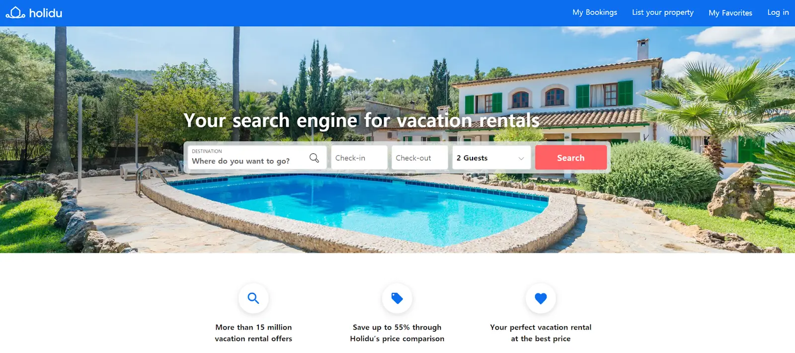
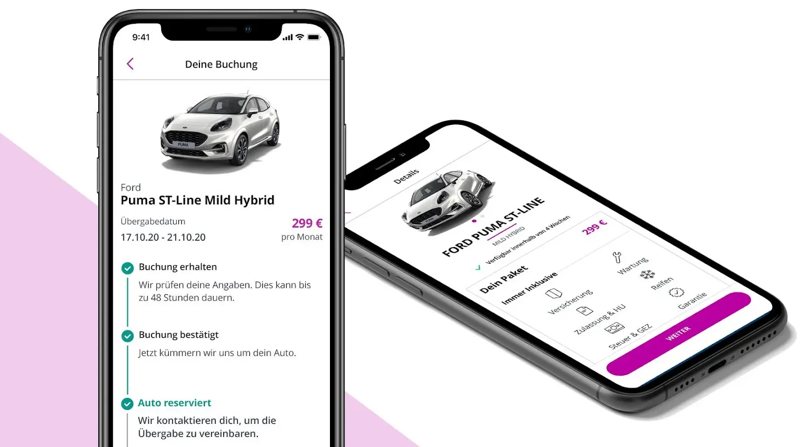
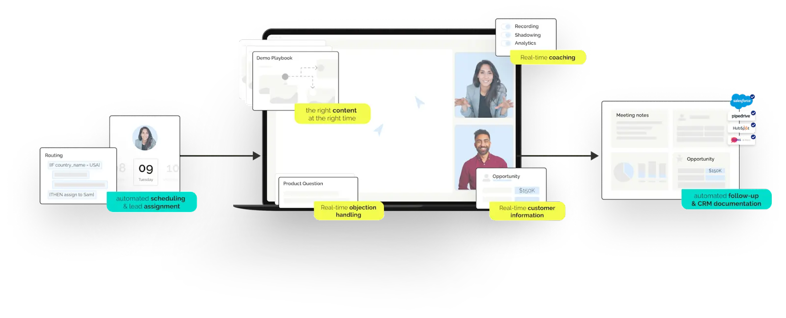
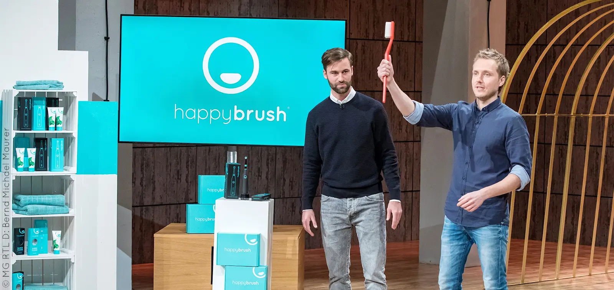
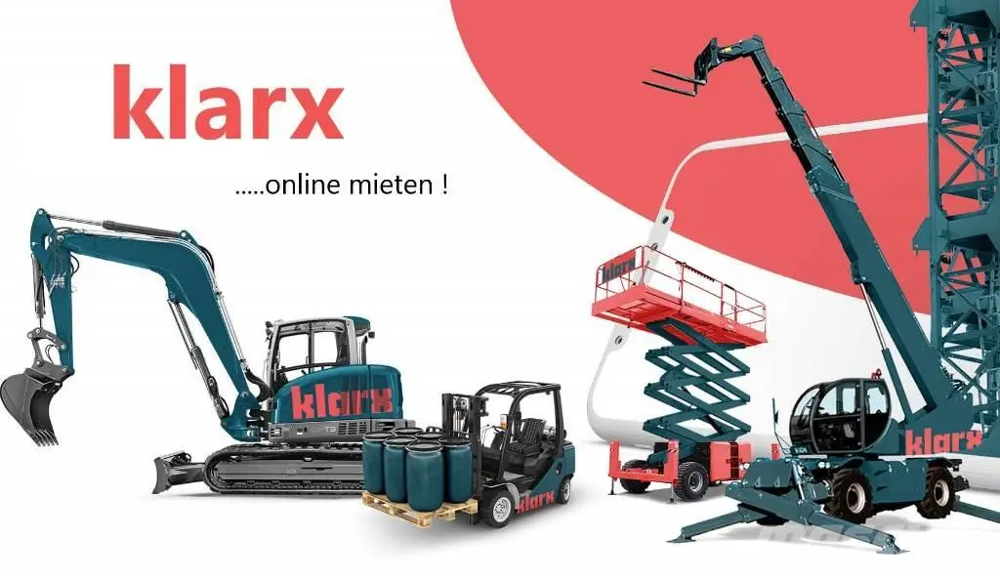

+++
title = "[European Startup Chronicles] Munich's Rising Startups: Top 5"
date = "2022-03-28T11:47:36+09:00"
description = "From accommodation search sites to electric toothbrushes, cars, and heavy equipment rental platforms"
tags = ["Platform", "Heavy Equipment", "Accommodation", "Startup", "Germany"]
categories = ["Column"]
author = "Eunseo Yi"
image = "cover.webp"
+++

*Cover photo source= must-munich.com*

<u>Munich has abundant capital and an excellent talent pool, making it a good city for starting a company.</u> Thanks to its global atmosphere, it is also a test bed where startups can build products and immediately test their potential for global expansion. <b>Through some of Munich's most successful startups in recent years, we can glimpse broader European startup trends.</b>

## Holidu, a search and comparison site for holiday accommodation

<b>Holidu is a platform for comparing and booking holiday accommodation.</b> Founded in 2014 by brothers Johannes and Michael Siebers, it has expanded to 21 countries worldwide. What distinguishes Holidu from existing accommodation search engines is <b>its proprietary image recognition technology.</b> Through this, it compares prices for more than 15 million accommodations across more than 600 accommodation-related websites, including Airbnb and Booking.com, and shows the best results.

*Holidu, a price search and comparison site for holiday accommodation. Photo=holidu.com*

When searching for accommodation, users often discover that the same property has different prices on different sites. Holidu began by solving this inconvenience. Through <b>its technology-powered price search and comparison function</b>, customers can save an average of 55%. Since Holidu connects users directly to the cheaper booking site, it does not overlap with the services of existing accommodation booking platforms.

Based on this idea, Holidu now attracts 10 million monthly visitors and raised 40 million euros in a Series C round. Despite the downturn in travel caused by COVID-19, Holidu continued to grow, including an additional 5 million euros in investment in 2020. It also <b>developed Bookiply for accommodation hosts</b>, helping owners advertise their properties on the web more easily. Bookiply supports calendar synchronization, automatic multilingual descriptions, and professional accommodation photo editing, while also enabling hosts to manage listings on Airbnb, Booking.com, and other platforms in one place. It also operates a first-level customer communication team for individual operators who cannot run a separate customer center.

## Cluno, a car subscription service

<b>Cluno is a startup that provides car subscription services</b>. Founded in 2017, it has raised 140 million euros and became one of Germany's startups with the largest amount of external capital. It is also known as a company backed by PayPal co-founder Peter Thiel.

*German consumers like subscription models because they can test various models before buying a car and experience future mobility such as electric vehicles. Photo=cluno.com*

<b>Through its website and app, Cluno lets customers choose a desired car model and subscribe to it for at least six months and up to eighteen months</b>. The subscription fee includes all costs except fuel, such as taxes, insurance, inspections, and registration fees. Once the subscription begins, the car is delivered to the customer's chosen location, reducing the stress of car management and additional costs. It suits users who want a period longer than ordinary rental but shorter than leasing. <u>By simplifying a complex process, it has been called the "Netflix of car subscriptions"</u>.

German consumers respond positively to subscriptions because they can test various models before buying a car and experience future mobility such as electric vehicles. In February, Cluno was acquired by the British car sales company Cazoo, opening the possibility of growth beyond Germany and across Europe.

## Demodesk, a customer meeting tool optimized for sales

Founded in 2017, <b>Demodesk is a web-based customer meeting tool for sales</b>. <u>Customers can meet through web-based screen sharing without installing software, while salespeople receive help from an AI-based conversation assistant designed to guide conversations optimized for selling.</u> Because it works not only for online meetings but specifically for customer meetings in sales, it differs from existing video call tools. As COVID-19 changed the environment, the number of customers nearly doubled, leading to a 6.7 million euro Series A investment.

*Salespeople receive help from an AI-based conversation assistant designed to guide sales-optimized conversations. Photo=demodesk.com*

Compared with existing meeting platforms, Demodesk removed unnecessary downloads, delays, compatibility problems, and limited screen sharing functions, focusing instead on features optimized for sales. It also includes additional functions such as meeting scheduling, document organization, and CRM records. It has 150 corporate customers in Europe and the United States. The founders are alumni of Y Combinator, the U.S. startup accelerator.

## Happy Brush, an electric toothbrush manufacturing and subscription startup

Happy Brush became well known through the German startup audition program "Die Höhle der Löwen." Happy Brush founders Carsten Maschmeyer and Ralf Dümmel appeared on the show and drew attention, securing a promised investment of 500,000 euros during the program. That promise was not fulfilled after several negotiations, but the exposure helped them receive 2 million euros from various investors.

*Happy Brush founders appeared on the startup audition program "Die Höhle der Löwen" and sold more than 5 million units. Photo=happybrush.de*

<b>Happy Brush began with a business model for selling and subscribing to electric toothbrushes</b>. It maximized functionality with sonic, triple-bristle electric toothbrushes, and 40% of the brush heads are made from renewable raw materials. Its toothpaste, oral care products, and packaging are also made in environmentally friendly ways. The two founders, both from P&G, started by challenging Oral-B and Philips, the dominant players in electric toothbrushes. They have sold more than 5 million products, and in 2020 revenue grew 70% year over year.

Because Happy Brush's most important value is <u>"sustainability"</u>, its related metrics are also interesting. It has saved more than 40 tons of plastic, and its toothpaste won a "Tube of the Year" award as an environmentally friendly product. It also received B Corp certification, which evaluates social and environmental performance, and through the #BrushForWater initiative donated more than 150 million liters of water to regions in need.

## Klarx, a heavy equipment rental platform

<b>Klarx was founded in 2015 as an online rental platform for construction heavy equipment</b>. It <u>rents heavy equipment</u> such as excavators, compressed air equipment, and cranes used on construction sites. It operates both B2B and B2C services, connecting users with 4,500 partner locations across Germany and Austria so they can easily rent 350,000 pieces of heavy equipment. It also <u>operates a platform for buying and selling used heavy equipment</u>, connecting users with renters and buyers.

*Klarx, an online heavy equipment rental platform, connects 4,500 partner locations across Germany and Austria and makes 350,000 machines easy to rent. Photo=klarx.de*

In September 2020, Klarx opened a logistics center in Munich. Linked with its existing heavy equipment management platform KlarxManager, it can track required equipment and calculate rental availability. The company later announced that it would open a second logistics center in Frankfurt in June 2021. It raised a total of 12.5 million euros from Target Global, B&C Innovation Investments, and others.

Eunseo Yi  
eunseo.yi@123factory.de

*This article was edited and adapted from the "European Startup Chronicles" series in BizHankook.*
