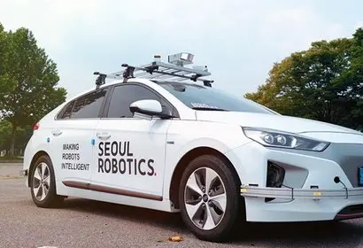
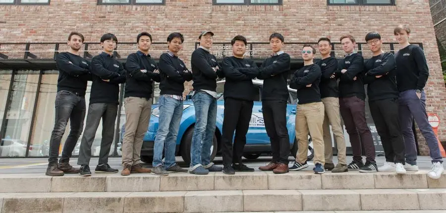
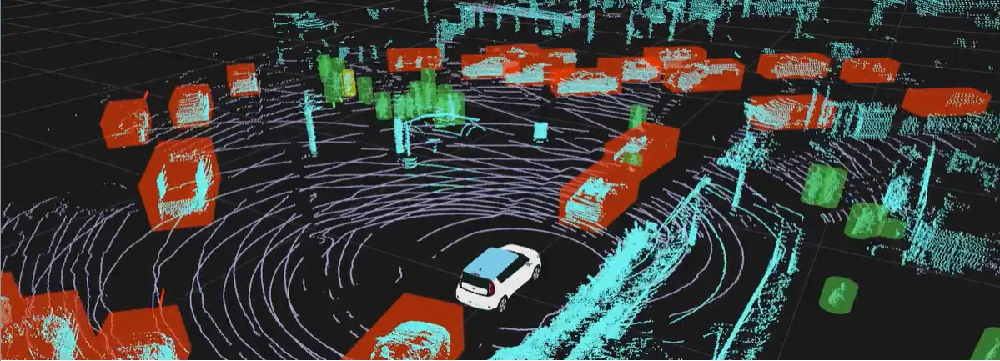

+++
title = "Seoul Robotics, the Korean Autonomous Driving Startup That Captivated BMW"
date = "2022-03-28T11:47:54+09:00"
description = "Supplying software to BMW: \"From the beginning, our goal was overseas expansion..."
tags = ["Software", "Artificial Intelligence", "Startup", "Autonomous Driving", "Germany"]
categories = ["Column"]
author = "Eunseo Yi"
image = "cover.webp"
+++

## Seoul Robotics, the Korean autonomous driving startup that captivated BMW

*Cover photo source=Seoul Robotics website*

## Supplying software to BMW: "From the beginning, our goal was overseas expansion... we plan to grow into smart cities"

Munich, Germany, is an attractive city thanks to its rich startup ecosystem and the presence of major German corporations such as BMW, Siemens, and Allianz. It also offers advantages for companies considering expansion not only into German-speaking countries such as Austria and Switzerland, but also into Eastern Europe, including Czechia, Hungary, and Slovenia. Among the companies that entered Munich for these reasons, one Korean startup stands out: <b>Seoul Robotics, which develops 3D computer vision software</b>. We met Seoul Robotics CEO Hanbin Lee to hear about the company's move into Munich.

*Founded in 2017, Seoul Robotics develops 3D computer vision software that analyzes 3D sensors such as LiDAR with machine learning. Photo=seoulrobotics.org*

## Seoul in name, global in practice

Seoul Robotics is a startup founded in Korea in the summer of 2017. It develops 3D computer vision software that analyzes 3D sensors such as LiDAR through machine learning. Although the company name includes "Seoul," a closer look shows that it is closer to a global startup.

Twenty percent of its employees are foreign nationals, and the company's common language is English. Job applicants must submit resumes in English; Korean resumes are automatically excluded from review. CEO Lee explained, "Because not all four co-founders are Korean, the management team's common language is English. We decided that communicating with employees in English would be more efficient and ensure transparency." He added, "Korean has a particular hierarchy created through honorific language. I think even small things like that hinder efficient communication. <u>The dream of operating not only in Korea but on the global stage from the moment of founding was also an important reason we chose English as the common language</u>."

*Seoul Robotics employees. Twenty percent are foreign nationals, and the company language is English. Photo=seoulrobotics.org*

Seoul Robotics job postings also emphasize <b>a "global work environment" and an "efficient, horizontal culture"</b>. The premise is that a horizontal culture brings the highest efficiency from a technical perspective.

Seoul Robotics began as an online study group of four co-founders living in different countries, united by their interest in deep learning and autonomous driving. In July 2017, the group placed tenth among 2,000 teams from around the world in a Silicon Valley autonomous driving competition. Their history of meeting online, communicating in English, and founding a company around one shared technical goal proves by example that a Korean startup does not have to be founded in Korea and only in Korean.

## Seoul Robotics in Munich

Seoul Robotics, bearing the name Seoul while aiming globally, entered Europe in 2019 by establishing a branch in Munich, Germany. <u>The trigger for coming to Munich was having BMW as a customer.</u> The reason for establishing a European local entity was to communicate and collaborate closely from a location near the customer. The company did not have a separate plan focused specifically on the German market or on using Munich's startup ecosystem. But after arriving in Munich, opportunities naturally followed.

Lee says, "Simply having BMW as a customer and already having a local entity in Europe led many companies to contact us." The company naturally secured additional customers in Germany and Austria. The Munich branch currently has three employees of various nationalities and plans to hire two more. According to Lee, "The branch may look small, but actual projects are carried out in cooperation with the development team in Korea, so there is no problem."

<b>The company operates with a clear division of roles: basic development is handled in Korea, while Munich optimizes the technology for Germany and each customer's situation.</b> What other advantages come from being in Munich? "First, it is easier to hire local people who understand the local situation and already have networks. And because the legal entity is in Germany, customers trust the business continuity more." Seoul Robotics is currently developing LiDAR software for autonomous vehicles together with BMW.

## Why a company that started in Seoul turned overseas

I was curious why a startup developing 3D computer vision software used the word "Robotics" in its name. Robotics is a broad concept, but it often refers to hardware robots. Lee said, <b>"Autonomous driving is also part of robotics. Robotics is 90% perception. 3D vision technology provides the foundation for robots to see and understand like humans. Even if we do not build the robot itself, we build the core software that makes robots move, so we named the company Robotics."</b>

*SENSR, the 3D perception software developed by Seoul Robotics. Photo=seoulrobotics.org*

For the general public, the name requires explanation, but for people in autonomous driving it is intuitive and easy to remember. The company's direction and expertise are as clear as its name. If the company ranked tenth globally in LiDAR at a Silicon Valley competition, it may not be long before it becomes number one in LiDAR software. But it did not achieve such results from the beginning.

"After the competition, we received various offers from the United States. But we did not receive very good feedback from Korean conglomerates. More often, they looked at us with suspicion and asked, 'Can a small startup like you really do that?' They told us to bring other companies that could serve as references first. So from the beginning, we did not build the business with only the Korean market in mind," Lee explained.

Today Seoul Robotics has BMW, Mercedes-Benz, Volvo, and other leading global automakers as customers. Its only Korean partner, Mando, was also first encountered overseas rather than in Korea. "From the beginning, we attended many exhibitions around the world. Since our sales are B2B-centered, exhibitions were a good channel."

After COVID-19, however, business methods changed significantly, from trade fairs to Zoom meetings. "Because we are software-centered, we were fortunate not to be hit hard by COVID. We can explain software through online meetings, and once we send the program, the other side can sufficiently test it." Lee cannot visit Munich often because of COVID, but while staying at the Seoul headquarters, he continues to meet closely with European customers based in Munich. In a sense, the company has benefited from the online meetings that became familiar to everyone during the pandemic.

Seoul Robotics plans to grow not only in autonomous vehicles but also in fields such as smart cities and smart factories. Smart cities are already an important area, second only to autonomous driving in revenue share. The company works with global companies as well as government and public institutions in Korea and the United States. It plans to be active not only in B2B but also in B2G, business to government.

Just as it no longer feels unfamiliar for two BTS songs to enter the Billboard chart, <b>it has also become a familiar sight for a startup named "Seoul" in Munich to be selected as a Tier 1 software company by BMW, one of the world's top automakers</b>.

Eunseo Yi  
eunseo.yi@123factory.de

*This article was edited and adapted from the "European Startup Chronicles" series in BizHankook.*
