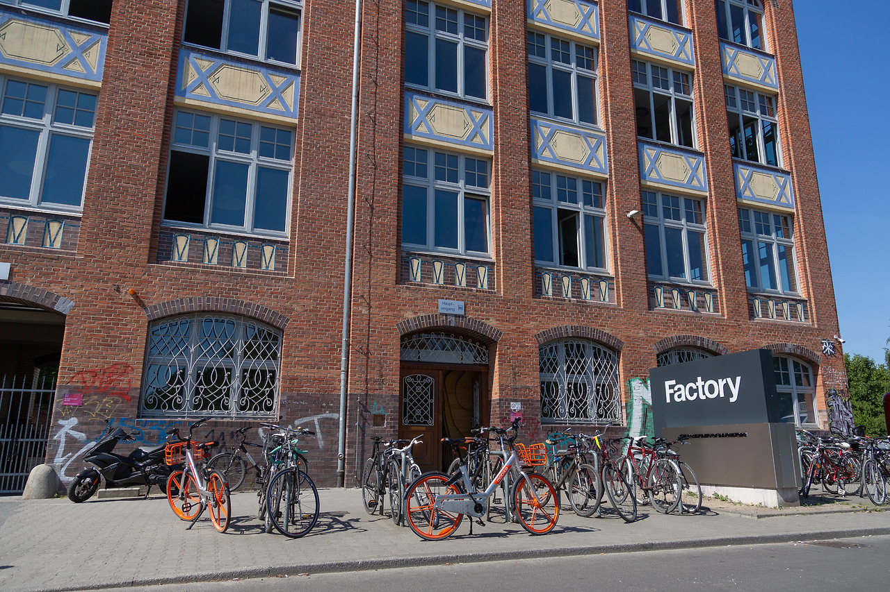

+++
title = "Wo Kunst auf Technologie trifft: Factory Berlin"
date = "2020-09-25T00:00:00+02:00"
description = "Ich werde in Deutschland Dinge in Bewegung setzen."
tags = ["Berlin", "Startup", "Deutschland", "Factory Berlin"]
categories = ["Kolumne"]
author = "Eunseo Yi"
image = "cover.jpg"
+++

## Ich werde in Deutschland Dinge in Bewegung setzen.

Es gibt eine Frage im derzeit so beliebten MBTI-Test:

**„Es fällt Ihnen schwer, sich anderen Menschen vorzustellen.“**

Ich gehöre zu denjenigen, die dieser Frage voll und ganz zustimmen. Wenn ich jemanden zum ersten Mal treffe, gehen mir in der etwa dreisekündigen Stille nach dem „Hallo“ heftige Konflikte, Qualen und Fragen wie „Wer bin ich und wohin gehe ich?“ in rasantem Tempo durch den Kopf.

Leider ist das jedes einzelne Mal so. Scharfäugige Menschen werden es bereits bemerkt haben. Das heftige Zittern, das in den Auslassungspunkten meiner Worte liegt: „Ich bin…“

Manchmal habe ich das Gefühl, eine Murmel geworden zu sein. Eine Pendelmurmel, die zwischen rechts und links hin und her schwingt, oder eine Murmel, die auf und ab hüpft.

Ende Februar zog ich in die Factory Berlin ein, das Mekka der Berliner Startups und ein Heiligtum für europäische Startups. Ich habe an der Universität Jura studiert, danach in der Alternativpädagogik gearbeitet, da ich der Meinung war, dass Bildung ein großes Problem in der koreanischen Gesellschaft ist, und geglaubt, dass das Theater, das ich als Amateur machte, eine wichtige Rolle in der Kunstpädagogik spielen könnte. Es ist 10 Jahre oder länger her, seit ich nach Berlin kam, um ernsthaft Theater zu studieren. Und jetzt bin ich in der Factory Berlin.

Vor zehn Jahren war Berlin noch sehr unterentwickelt. Der Uringeruch überall in der Stadt, junge Leute, die mit Bierflaschen herumliefen und auf der Straße tanzten, die etwas rustikale Kleidung der Menschen und die Einrichtung der Geschäfte fühlten sich frisch an. Dort studierte ich Theater und spürte Freiheit. In der kurzen Zeit von eineinhalb Jahren habe ich intensiv gelernt und aufregend gelebt. Dann ging ich zurück nach Korea, um Theaterregie zu führen, und kehrte vor drei Jahren nach Berlin zurück.

Ich kehrte also zurück. Doch kaum angekommen, erlebte ich, um mich hier niederzulassen, eher den Kummer, als Einwanderer um das Einleben zu kämpfen, und die hohen Hürden der behördlichen Abwicklung, als „Freiheit“.

Was werde ich hier tun? Theater? Performance? Kunst? Oder ein koreanisches Restaurant? Ich verbrachte unzählige Nächte mit (glücklicherweise leckerem und billigem) Bier und Wein. Ich traf viele Menschen und sah das Ende meines Kontostands. Aber die Situation war eigentlich einfach. Es war zu vergeblich zu glauben, ich könnte mein Selbst hier finden, das ich in Korea nicht finden konnte, und ich musste einfach legale Arbeit im Rahmen des Visums verrichten, das dieses Land mir gab.

Viele Menschen halfen mir, bis ich mein Visum erhielt. Glücklicherweise bekam ich die Chance, an einer Schule Koreanisch zu unterrichten, und dank dessen gab mir die Berliner Ausländerbehörde ein „Visum für Lehr- oder Forschungstätigkeit“. Mit diesem Visum darf ich legal nur Arbeiten im Bereich Bildung, Forschung und Verlagswesen ausführen.

Ich habe hauptsächlich Dokumentartheater gemacht, basierend auf einer kritischen Haltung gegenüber verschiedenen gesellschaftlichen Themen. Im weitesten Sinne ähnelte das Theater, das ich gemacht habe, dem Prozess der Forschung. So beschloss ich, Forschungen anzustellen, die in Buchform erscheinen, anstatt Forschungen, die in Deutschland auf der Bühne präsentiert werden.

So begann mein Interesse am Schreiben und Büchermachen. Doch für mich, deren Muttersprache nicht Deutsch oder Englisch ist, war es ziemlich schwierig, von jemandem für buchbezogene Arbeiten angestellt zu werden. Also beschloss ich, mein eigenes Unternehmen zu gründen.

Dies ist der Prozess des Nachdenkens über „Unternehmertum“, stark vereinfacht. Es unterscheidet sich stark von der Situation zu Beginn, aber ich wollte die Richtung des Weges, den ich gehe, ein wenig strukturieren. Und das mit dem bescheidenen Ziel, das Zögern beim Vorstellen um etwa eine Sekunde zu verkürzen.

In 10 Jahren hat sich Berlin von einer „armen Stadt für Künstler“ zum „Silicon Valley Europas, einem Mekka für Startups“ gewandelt. Es ist das Ergebnis der unvermeidlichen Gentrifizierung, die auf die von Künstlern geschaffene hippe Stadt folgt. Die Factory Berlin steht im Mittelpunkt dieses Prozesses.

*Der zweite Campus der Factory Berlin in Kreuzberg, Berlin*

In der Factory Berlin haben sich Unternehmen wie N26, Twitter, SoundCloud, Uber, Rocket Internet, Freeletics und Pinterest niedergelassen. Von einzelnen Gründern (60–70 %) über etablierte Startups (20–30 %) bis hin zu Großkonzernen (10 %) kommen hier Unternehmer verschiedenster Ebenen zusammen.

Wenn ich es anpacken wollte, dann an dem zentralsten Ort in dieser Gegend. So wurde ich Mitglied der Factory Berlin und begann, in Deutschland Dinge in Bewegung zu setzen.

Ich war schon immer zuversichtlich, Dinge in Bewegung zu setzen, seit ich denken kann. Ich habe mich an fast jedem Bereich versucht, den ich lernen wollte, habe jeden getroffen, den ich treffen wollte, und alles getan, was ich tun wollte. Nun gilt es, das Erreichte zu ordnen, aufzuzeichnen und zu archivieren und so diese losen Fäden im neuen Berlin, das ich kennengelernt habe, zusammenzuführen.

---

**Eunseo Yi**
eunseo.yi@123factory.de

*Dieser Artikel wurde aus der Serie „European Startup Chronicles“ in BizHankook editiert und angepasst.*
