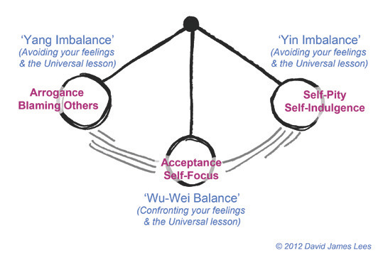

+++
title = "예술과 기술이 만나는 곳, 팩토리 베를린"
date = "2020-09-25T00:00:00+02:00"
description = "독일에서 일 벌일거야."
tags = ["베를린", "스타트업", "독일", "팩토리베를린"]
categories = ["Column"]
author = "이은서"
image = "cover.jpg"
canonicalUrl = "https://brunch.co.kr/@123factory/1"
+++

## 독일에서 일 벌일거야.

요즘 유행한다는 MBTI 테스트의 질문 중 이런 것이 있다.

**다른 사람들에게 자신을 소개하는 것을 어려워 합니다.**

나는 이 질문에 격한 동의를 표하는 사람 중 하나이다. 누군가를 처음 만날 때, "안녕하세요." 이후 약 3초의 정적이 흐르는 동안 내 머릿 속에는 심한 갈등과 번뇌, '나는 누구이고, 어디로 가는가.'와 같은 질문이 빠른 속도로 스쳐가기 때문이다.

안타깝지만, 단 한번도 빼놓지 않고 매번 그렇다. 눈썰미가 좋은 사람들은 이미 눈치 챘을 것이다. 내 말의 '저는...' 이라는 말줄임표 안에 존재하는 심한 흔들림을.

나는 가끔 내가 구슬이 된 느낌일 때가 있다. 오른쪽, 왼쪽을 왔다 갔다하는 진자구슬이거나, 위 아래로 통통 튀며 상하운동을 하는 구슬.

지난 2월 말, 유럽 스타트업의 성지 베를린, 그것도 베를린 스타트업의 메카라고 불리는 팩토리 베를린([factory berlin](https://factoryberlin.com/))에 입성했다. 대학에서는 법학을 공부했고, 이후 한국 사회에서 교육이 큰 문제라는 생각과 아마추어로 해왔던 연극이 예술 교육에서 중요한 역할을 할 수 있음을 믿고 대안 교육에 몸 담고 있다가, 본격적으로 연극을 공부하기 위해 베를린으로 온 것이 10년 전이었다. 그리고 지금, 나는 팩토리 베를린에 있다.

10년 전 베를린은 정말 후졌었다. 시내 곳곳에서 풍기는 찌린내와 길거리에 맥주병을 들고 다니며 곳곳에서 몸을 흔들어 대는 젊은이들, 왠지 모르게 촌스러웠던 사람들의 옷차림이나 가게의 인테리어에서는 풋풋함이 느껴질 정도였다. 그곳에서 나는 연극을 공부했고, 자유를 느꼈다. 1년 반이라는 짧은 시간동안 진하게 배웠고, 신나게 놀았다. 그리고 다시 한국으로 돌아가 연극연출을 하다가, 3년 전에 다시 베를린으로 돌아왔다.

그래서 돌아왔다. 하지만 오자마자 이곳에 정착하기 위해 겪었던 것은 '자유'보다는 정착을 애쓰는 이민자로서 겪는 설움과 높은 행정처리의 문턱이었다.

여기서 무엇을 할 것인가? 연극? 공연? 예술? 아니면 한식당? 무수히 많은 밤을 (다행히 맛있고 값싼) 맥주와 와인으로 지새웠다. 많은 사람을 만났고, 은행잔고의 끝도 보았다. 그러나 상황은 오히려 단순했다. 한국에서도 못 찾은 자아를 여기서 찾자는 건 너무 허무맹랑했고, 나는 그저 이 나라가 내게 준 비자의 범위 안에서 합법적인 일을 하면 되는 것이었다.

비자를 받게 되기까지 많은 사람들의 도움이 있었다. 운좋게 학교에서 한국어를 가르칠 기회를 얻게 되었고, 그 덕분에 베를린의 이민청은 나에게 '가르치거나 연구하는 일에 종사할 수 있는 비자'를 주었다. 이 비자로는 교육, 연구, 출판과 관련한 일'만'을 합법적으로 할 수 있다.

나는 주로 사회의 다양한 이슈에 대한 문제의식을 바탕으로 리서치를 하여 만드는 다큐멘터리 연극을 해왔었다. 큰 맥락에서 보면, 내가 해왔던 연극이 연구/리서치의 과정과 닮아 있었다. 그래서 난 독일에서 무대에 올리는 연구가 아닌 책이라는 결과물로 나오는 연구를 하기로 마음 먹었다.

그렇게 해서 책을 쓰는 일, 책을 만드는 일에 대한 관심을 갖게 되었다. 그러나 독일어나 영어가 모국어가 아닌 나에게는 책과 관련된 일로 누군가에게 고용된다는 것은 상당히 어려운 일이었다. 그래서 나는 내가 창업을 하는 쪽으로 결심을 하게 되었다.

여기까지가 심하게 단순화 시킨 '창업'을 생각하게 된 과정이다. 지금은 시작의 그 상황과는 많이 달라졌지만, 스스로 내가 가고 있는 길의 방향을 조금은 정리하고 싶은 마음이 있었다. 그리고 나를 소개하는 과정에서의 망설임을 1초정도는 단축시켜보자는 소박한 목표와 함께.

10년 사이 베를린은 '예술가들의 가난한 도시'에서 '유럽의 실리콘밸리, 스타트업의 성지'가 되어 있었다. 예술가들이 만들어 놓은 힙한 도시 뒤에 따르는 당연한 젠트리피케이션의 결과이다. 그 한 가운데에 팩토리 베를린이 있다.

*베를린 크로이츠베르크(Kreuzberg)에 위치한 팩토리 베를린의 두 번째 캠퍼스*

팩토리 베를린은 N26, 트위터(twitter), 온라인 음악 유통 플랫폼인 사운드 클라우드(Sound Cloud), 음성인식 모바일뱅크 N26, 우버(Uber), 스타트업 인큐베이팅 업체인 로켓 인터넷(Rocket Internet), AI를 이용한 개인 피트니스 코치 프리레틱스(Freeletics), 이미지 공유 플랫폼 핀터레스트(Pinterest) 등이 입주해 있는 곳이다. 개인 창업자(60-70%)부터 큰 규모의 스타트업(20-30%), 대기업(10%) 등 다양한 층위의 창업가들이 모여있다.

이왕할 것이라면 이 동네의 가장 핵심적인 곳에서 시작하고 싶었다. 그렇게 팩토리 베를린의 멤버가 되었고, 나는 독일에서 일을 벌이기 시작했다.

벌이는 것은 태어날 때부터 자신이 있는 편이었다. 배우고 싶은 영역은 거의 다 도전했으며, 만나고 싶은 사람, 하고 싶은 일은 다 해본 편이었기 때문이다. 이제는 벌여가며 동시에 정리하고, 기록하며 아카이빙하는 것, 그리하여 이 구슬을 꿰어 맞추는 것이 내가 만난 새로운 베를린에서 해야할 일이다.

**이은서**
eunseo.yi@123factory.de

*본 글은 <비즈한국>의 [유럽스타트업열전]을 편집 및 각색하였습니다.*
